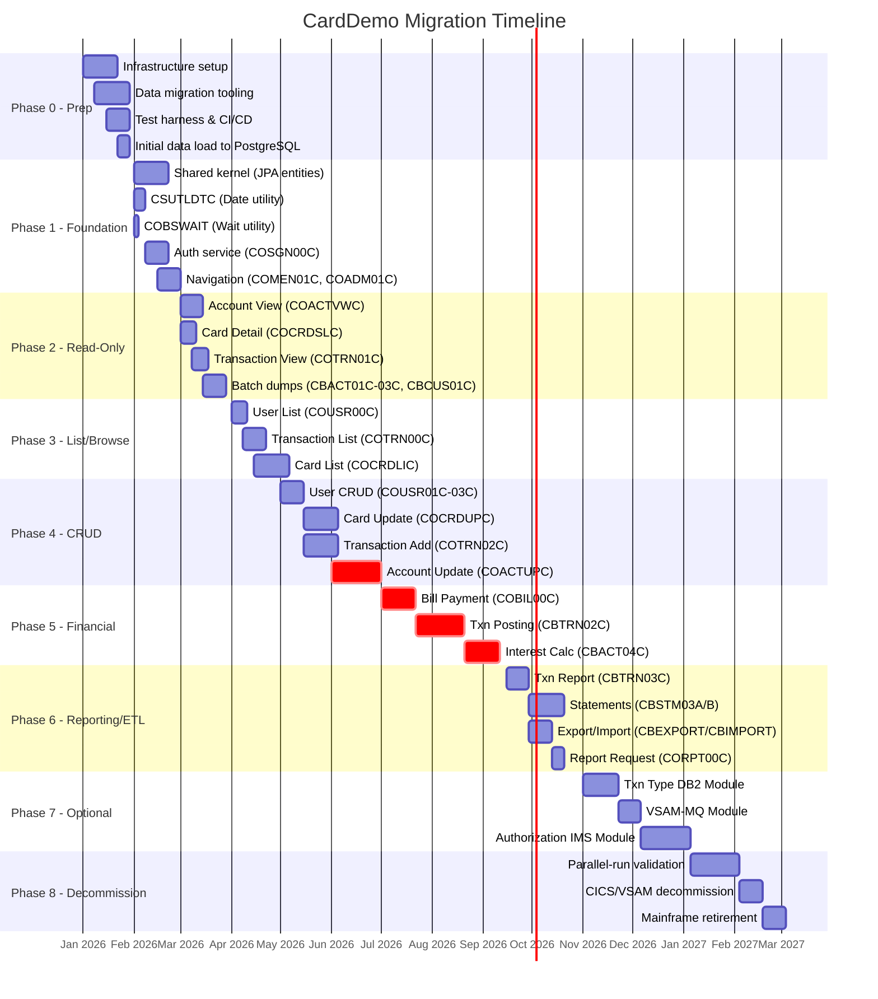
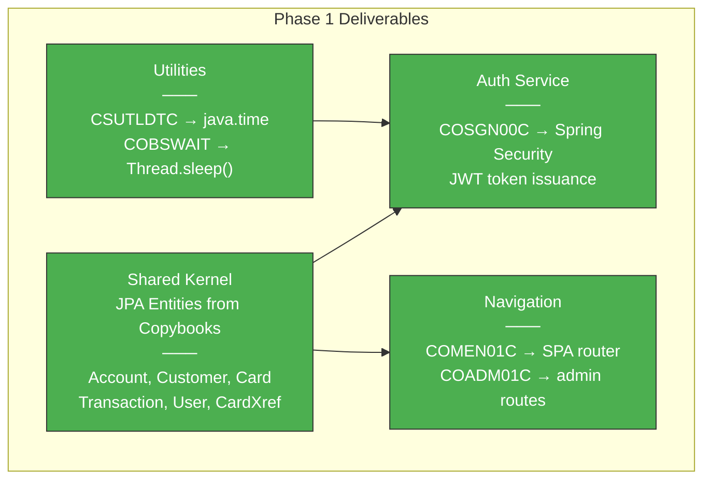
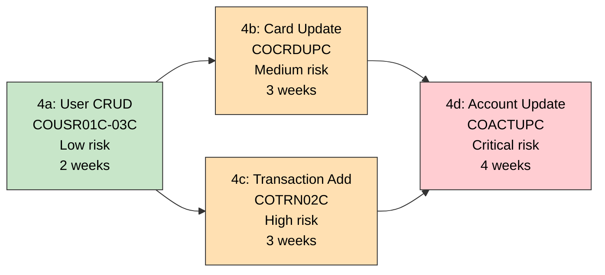
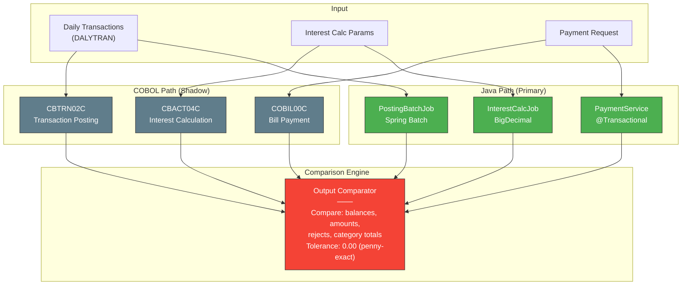
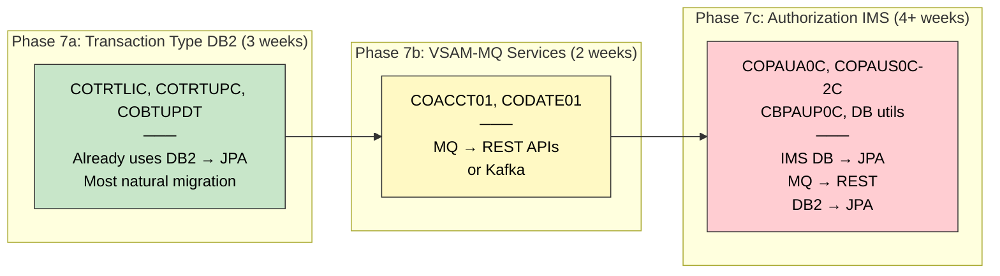
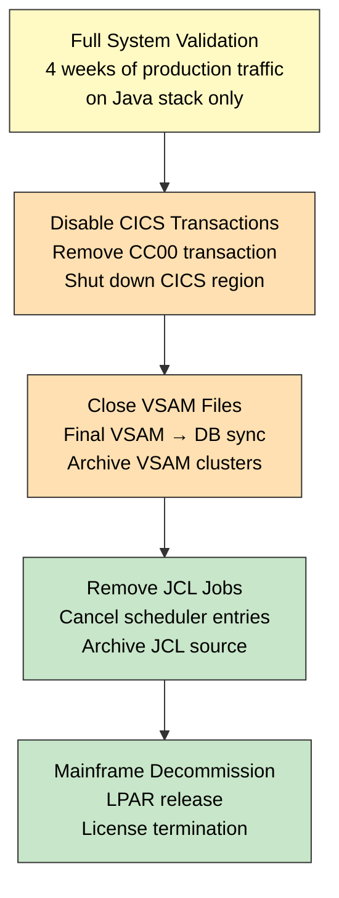
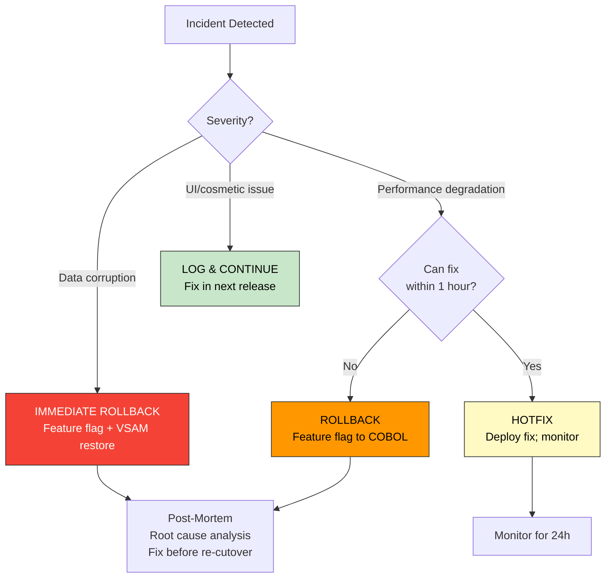

# Cutover Plan

> **CardDemo COBOL-to-Java Phased Migration Sequence**
>
> This document defines the phased cutover plan for migrating the CardDemo application from COBOL/CICS/VSAM to Java/Spring Boot/PostgreSQL. Phases are ordered from lowest risk to highest risk, with explicit entry/exit criteria, rollback procedures, and parallel-run requirements.

---

## Table of Contents

1. [Migration Timeline Overview](#migration-timeline-overview)
2. [Phase Definitions](#phase-definitions)
3. [Phase 0: Pre-Migration Preparation](#phase-0-pre-migration-preparation)
4. [Phase 1: Foundation](#phase-1-foundation)
5. [Phase 2: Read-Only Operations](#phase-2-read-only-operations)
6. [Phase 3: List and Browse Operations](#phase-3-list-and-browse-operations)
7. [Phase 4: CRUD Operations](#phase-4-crud-operations)
8. [Phase 5: Financial Operations](#phase-5-financial-operations)
9. [Phase 6: Reporting and ETL](#phase-6-reporting-and-etl)
10. [Phase 7: Optional Modules](#phase-7-optional-modules)
11. [Phase 8: Decommission](#phase-8-decommission)
12. [Rollback Strategy](#rollback-strategy)
13. [Go/No-Go Checklist](#gono-go-checklist)

---

## Migration Timeline Overview

### Mermaid: Full Migration Timeline



### Phase Summary

| Phase | Duration | Risk | Programs | Strategy |
|-------|----------|------|----------|----------|
| **0 — Prep** | 4 weeks | None | 0 | Infrastructure |
| **1 — Foundation** | 4 weeks | Low | 5 + shared kernel | Refactor / Replatform |
| **2 — Read-Only** | 4 weeks | Low | 7 | Refactor / Replatform |
| **3 — List/Browse** | 5 weeks | Low-Medium | 3 | Strangler Fig |
| **4 — CRUD** | 8 weeks | Medium-High | 7 | Strangler Fig / Refactor |
| **5 — Financial** | 10 weeks | Critical | 3 | Strangler Fig (parallel-run) |
| **6 — Reporting/ETL** | 5 weeks | Medium | 7 | Refactor / Rewrite |
| **7 — Optional** | 9 weeks | Medium-High | 13 | Rewrite |
| **8 — Decommission** | 6 weeks | Medium | 0 | Retire |
| **Total** | **~55 weeks** | — | **44 programs** | — |

---

## Phase Definitions

### Risk Escalation Model

```mermaid
graph LR
    P0["Phase 0<br/>PREP<br/>Risk: None"] --> P1["Phase 1<br/>FOUNDATION<br/>Risk: Low"]
    P1 --> P2["Phase 2<br/>READ-ONLY<br/>Risk: Low"]
    P2 --> P3["Phase 3<br/>LIST/BROWSE<br/>Risk: Low-Medium"]
    P3 --> P4["Phase 4<br/>CRUD<br/>Risk: Medium-High"]
    P4 --> P5["Phase 5<br/>FINANCIAL<br/>Risk: Critical"]
    P5 --> P6["Phase 6<br/>REPORTING<br/>Risk: Medium"]
    P6 --> P7["Phase 7<br/>OPTIONAL<br/>Risk: Medium-High"]
    P7 --> P8["Phase 8<br/>DECOMMISSION<br/>Risk: Medium"]

    style P0 fill:#E8F5E9,stroke:#333,color:#000
    style P1 fill:#C8E6C9,stroke:#333,color:#000
    style P2 fill:#C8E6C9,stroke:#333,color:#000
    style P3 fill:#FFF9C4,stroke:#333,color:#000
    style P4 fill:#FFE0B2,stroke:#333,color:#000
    style P5 fill:#FFCDD2,stroke:#333,color:#000
    style P6 fill:#FFE0B2,stroke:#333,color:#000
    style P7 fill:#FFE0B2,stroke:#333,color:#000
    style P8 fill:#FFF9C4,stroke:#333,color:#000
```



### Common Cutover Pattern

Each phase follows this pattern:

1. **Develop** — Build Java equivalent alongside running COBOL
2. **Test** — Automated regression + manual UAT
3. **Parallel Run** — Both old and new process simultaneously (financial phases only)
4. **Cutover** — Route traffic to Java; COBOL becomes fallback
5. **Stabilize** — Monitor for 1-2 weeks with instant rollback capability
6. **Retire** — Decommission COBOL program after stability period

---

## Phase 0: Pre-Migration Preparation

**Duration:** 4 weeks | **Risk:** None

### Objectives
- Establish target infrastructure (Java runtime, PostgreSQL, CI/CD)
- Build data migration tooling (VSAM → PostgreSQL ETL)
- Set up test harness with COBOL-equivalent test data
- Perform initial data load and validate schema

### Tasks

| # | Task | Owner | Duration | Dependencies |
|---|------|-------|----------|-------------|
| 0.1 | Provision PostgreSQL instance with schemas: `iam`, `account`, `card`, `txn`, `fin`, `ref` | DevOps | 3 days | — |
| 0.2 | Create Flyway migrations from copybook record layouts | Dev | 2 weeks | 0.1 |
| 0.3 | Build VSAM-to-PostgreSQL ETL pipeline (one-time + incremental sync) | Dev | 2 weeks | 0.1 |
| 0.4 | Load sample data from `app/data/ASCII/` into PostgreSQL | Dev | 3 days | 0.2, 0.3 |
| 0.5 | Set up Spring Boot project skeleton with module structure | Dev | 1 week | — |
| 0.6 | Configure CI/CD pipeline (build, test, deploy) | DevOps | 1 week | 0.5 |
| 0.7 | Build comparison test harness (COBOL output vs Java output) | QA | 2 weeks | 0.5 |
| 0.8 | Document CICS transaction codes → REST endpoint mapping | Dev | 3 days | — |

### Entry Criteria
- Team has access to COBOL source code and mainframe environment
- Target infrastructure budget approved
- Team trained on both COBOL reading and Spring Boot

### Exit Criteria
- [ ] PostgreSQL schema matches all copybook record layouts
- [ ] Sample data loaded and queryable
- [ ] CI/CD pipeline deploys Spring Boot app to staging
- [ ] Test harness can compare COBOL and Java outputs for at least one program
- [ ] VSAM incremental sync running on schedule

---

## Phase 1: Foundation

**Duration:** 4 weeks | **Risk:** Low

### Mermaid: Phase 1 Components



### Programs Migrated

| # | Program | LOC | Strategy | Java Target | Risk |
|---|---------|-----|----------|-------------|------|
| 1.1 | CSUTLDTC | 157 | Replatform | `DateUtilService` using `java.time` | Trivial |
| 1.2 | COBSWAIT | 41 | Replatform | `Thread.sleep()` wrapper | Trivial |
| 1.3 | COSGN00C | 260 | Refactor | `AuthController` + Spring Security + JWT | Low |
| 1.4 | COMEN01C | 308 | Refactor | SPA router / `MenuController` | Low |
| 1.5 | COADM01C | 288 | Refactor | Admin route guard / `AdminMenuController` | Low |
| 1.6 | Copybooks | — | Refactor | JPA `@Entity` classes (30 entities) | Low |

### Cutover Steps

1. Deploy Java auth service to staging
2. Configure API gateway to route `/api/auth/*` to Java
3. Validate login with both Admin (ADMIN001) and User (USER0001) credentials
4. Enable JWT issuance; CICS continues operating with COMMAREA
5. After 1-week stability period, route all new sessions through Java auth

### Entry Criteria
- Phase 0 complete: PostgreSQL running, schema migrated, CI/CD operational

### Exit Criteria
- [ ] All 30 copybook record layouts have corresponding JPA entities with unit tests
- [ ] CSUTLDTC and COBSWAIT have Java replacements with identical behavior
- [ ] Authentication works: login, JWT issuance, role-based access
- [ ] Menu navigation routes to correct endpoints
- [ ] COBOL CICS still operational as fallback

---

## Phase 2: Read-Only Operations

**Duration:** 4 weeks | **Risk:** Low

### Programs Migrated

| # | Program | LOC | Strategy | Java Target | Risk |
|---|---------|-----|----------|-------------|------|
| 2.1 | COACTVWC | 942 | Refactor | `AccountViewController` — 4-table JOIN | Low |
| 2.2 | COCRDSLC | 887 | Refactor | `CardDetailController` — card + xref lookup | Low |
| 2.3 | COTRN01C | 330 | Refactor | `TransactionViewController` | Low |
| 2.4 | CBACT01C | 430 | Replatform | Spring Batch `AccountDumpJob` | Trivial |
| 2.5 | CBACT02C | 178 | Replatform | Spring Batch `CardDumpJob` | Trivial |
| 2.6 | CBACT03C | 178 | Replatform | Spring Batch `XrefDumpJob` | Trivial |
| 2.7 | CBCUS01C | 178 | Replatform | Spring Batch `CustomerDumpJob` | Trivial |

### Validation Strategy
- **A/B testing**: Route 10% of read traffic to Java, compare responses with COBOL
- **Data validation**: Automated comparison of Java REST response vs CICS screen scrape
- **Performance baseline**: Establish response time benchmarks

### Cutover Steps

1. Deploy read-only Java endpoints alongside CICS
2. Enable feature flag to route read traffic to Java (start at 10%)
3. Compare response data field-by-field against CICS output
4. Ramp to 50% → 100% over 2 weeks
5. Batch dumps run both COBOL and Java; compare output files

### Exit Criteria
- [ ] Account view displays identical data to CICS screen (all fields validated)
- [ ] Card detail displays identical data
- [ ] Transaction view displays identical data
- [ ] Batch dump outputs are byte-identical to COBOL outputs
- [ ] 100% of read traffic routed to Java for 1+ week without issues
- [ ] Response times within 20% of CICS baseline

---

## Phase 3: List and Browse Operations

**Duration:** 5 weeks | **Risk:** Low-Medium

### Programs Migrated

| # | Program | LOC | Strategy | Java Target | Risk |
|---|---------|-----|----------|-------------|------|
| 3.1 | COUSR00C | 695 | Refactor | `UserListController` with pagination | Low |
| 3.2 | COTRN00C | 699 | Strangler Fig | `TransactionListController` with SQL pagination | Medium |
| 3.3 | COCRDLIC | 1,459 | Strangler Fig | `CardListController` with SQL pagination | Medium |

### Key Challenge: VSAM Browse → SQL Pagination

COBOL VSAM browse uses `START` + `READNEXT` with cursor positioning. SQL pagination uses `LIMIT/OFFSET` or keyset pagination.

```
COBOL:  EXEC CICS START BROWSE ... AT(key) → READNEXT → READNEXT → ...
Java:   SELECT * FROM cards WHERE card_num > :lastKey ORDER BY card_num LIMIT 20
```

**Risk Mitigation:** Use keyset pagination (not `OFFSET`) for consistent behavior with concurrent inserts.

### Cutover Steps

1. Deploy list endpoints with feature flag (off by default)
2. Enable for internal users first; validate pagination edge cases
3. Compare list results: verify same records in same order
4. Ramp to external users after 1 week internal validation
5. Verify page-forward and page-backward navigation

### Exit Criteria
- [ ] User list shows same users in same order as CICS
- [ ] Transaction list pagination matches CICS browse behavior
- [ ] Card list pagination matches CICS browse (including alternate index browse)
- [ ] Edge cases validated: empty results, single page, last page, concurrent modifications
- [ ] All list operations < 500ms response time

---

## Phase 4: CRUD Operations

**Duration:** 8 weeks | **Risk:** Medium-High

### Mermaid: Phase 4 Dependency Chain



### Programs Migrated

| # | Program | LOC | Strategy | Java Target | Risk |
|---|---------|-----|----------|-------------|------|
| 4.1 | COUSR01C | 299 | Refactor | `UserCreateController` | Low |
| 4.2 | COUSR02C | 414 | Refactor | `UserUpdateController` | Low |
| 4.3 | COUSR03C | 359 | Refactor | `UserDeleteController` | Low |
| 4.4 | COCRDUPC | 1,560 | Strangler Fig | `CardUpdateController` + `@Valid` | Medium |
| 4.5 | COTRN02C | 783 | Strangler Fig | `TransactionAddController` + multi-file validation | High |
| 4.6 | COACTUPC | 4,237 | Strangler Fig | `AccountUpdateController` + field validators | Critical |

### COACTUPC Migration Detail (Highest Complexity)

COACTUPC is the single largest program (4,237 LOC, 164 IF, 51 GO TO, 10 EVALUATE). It requires special handling:

**Decomposition:**
1. Extract each field validation into a separate `@Validator` class
2. Extract screen dispatch (EVALUATE) into controller routing
3. Extract VSAM REWRITE into `AccountRepository.save()`
4. Extract error handling into `@ControllerAdvice`

**Strangler Steps:**
1. Deploy Java validation endpoints (does not write yet — validation-only mode)
2. Compare validation results: submit same inputs to both COBOL and Java
3. Enable Java writes with feature flag; COBOL as shadow fallback
4. Compare written records: Java DB vs VSAM (via sync pipeline)
5. Cut over after 2 weeks of matching results

### Cutover Steps (CRUD Phase)

1. Start with User CRUD (lowest risk, single file)
2. Enable write operations with audit logging enabled
3. Move to Card Update — validate card field updates match
4. Move to Transaction Add — validate multi-file validation logic
5. Account Update last — extensive parallel validation required
6. Each program: 1 week internal → 1 week external → full cutover

### Entry Criteria
- Phase 3 complete: all list/browse operations running on Java
- Data sync pipeline confirmed reliable (< 1 minute lag)

### Exit Criteria
- [ ] User CRUD: create, update, delete all pass UAT
- [ ] Card update: all field validations produce same accept/reject as COBOL
- [ ] Transaction add: multi-file validation matches COBOL behavior
- [ ] Account update: ALL 164 validation branches produce identical results
- [ ] No data corruption incidents during parallel-run period
- [ ] Rollback tested: can revert to COBOL within 5 minutes

---

## Phase 5: Financial Operations

**Duration:** 10 weeks | **Risk:** Critical

### Mermaid: Phase 5 Parallel-Run Architecture



### Programs Migrated

| # | Program | LOC | Strategy | Java Target | Risk |
|---|---------|-----|----------|-------------|------|
| 5.1 | COBIL00C | 572 | Strangler Fig | `PaymentService` with `@Transactional` | Critical |
| 5.2 | CBTRN02C | 731 | Strangler Fig | `TransactionPostingJob` (Spring Batch) | Critical |
| 5.3 | CBACT04C | 652 | Strangler Fig | `InterestCalculationJob` (Spring Batch + BigDecimal) | Critical |

### Parallel-Run Requirements

| Requirement | Detail |
|-------------|--------|
| **Duration** | Minimum 3 billing cycles (typically 3 months) |
| **Comparison tolerance** | $0.00 — must be penny-exact |
| **Comparison scope** | Account balances, transaction amounts, reject counts, category totals, interest accruals |
| **Failure threshold** | Any single mismatch blocks cutover |
| **Rollback window** | Instant (feature flag) during parallel-run |

### Bill Payment (COBIL00C) — Atomicity Fix

**Current COBOL behavior (non-atomic):**
```
1. READ ACCTDAT (account balance)
2. WRITE TRANSACT (payment transaction record)
3. REWRITE ACCTDAT (updated balance)
   ← If step 3 fails, transaction is recorded but balance is not updated
```

**Java target (atomic):**
```java
@Transactional
public void processPayment(PaymentRequest request) {
    Account account = accountRepository.findById(request.getAccountId());
    Transaction txn = new Transaction(request.getAmount(), ...);
    account.setCurrentBalance(account.getCurrentBalance().subtract(request.getAmount()));
    transactionRepository.save(txn);
    accountRepository.save(account);
    // Both succeed or both rollback
}
```

### Interest Calculation (CBACT04C) — Precision Requirements

| COBOL Construct | Java Equivalent | Validation |
|----------------|-----------------|------------|
| `COMPUTE ... ROUNDED` | `BigDecimal.setScale(2, RoundingMode.HALF_UP)` | Compare to 2 decimal places |
| `ON SIZE ERROR` | `ArithmeticException` catch | Same error handling path |
| `COMP-3` packed decimal | `BigDecimal` | Verify intermediate precision |
| Discount group rate lookup | JPA query on `discount_groups` table | Same rate for same group |

### Cutover Steps (Financial Phase)

1. **Bill Payment** (3 weeks):
   - Week 1: Deploy Java payment with feature flag OFF
   - Week 2: Enable for test accounts only; compare results
   - Week 3: Enable for all accounts; COBOL shadow-runs

2. **Transaction Posting** (5 weeks):
   - Weeks 1-2: Build Spring Batch job; unit test with sample data
   - Week 3: Parallel-run: both COBOL and Java process same DALYTRAN
   - Weeks 4-5: Compare outputs for minimum 2 batch cycles; resolve any mismatches

3. **Interest Calculation** (3 weeks):
   - Week 1: Build calculation job; validate against known test scenarios
   - Week 2: Parallel-run with same accounts and date parameters
   - Week 3: Penny-exact comparison across all accounts

### Entry Criteria
- Phase 4 complete: all CRUD operations on Java
- VSAM-to-DB sync confirmed < 30 seconds lag
- Comparison engine built and tested

### Exit Criteria
- [ ] Bill payment: atomic transactions confirmed (no partial writes)
- [ ] Transaction posting: 3+ batch cycles with zero mismatches
- [ ] Interest calculation: penny-exact match on all accounts for 3+ runs
- [ ] Reject file (DALYREJS) identical between COBOL and Java
- [ ] Category balance file (TCATBALF) identical
- [ ] Performance: batch jobs complete within 120% of COBOL runtime
- [ ] Rollback tested: can revert to COBOL path within 5 minutes

---

## Phase 6: Reporting and ETL

**Duration:** 5 weeks | **Risk:** Medium

### Programs Migrated

| # | Program | LOC | Strategy | Java Target | Risk |
|---|---------|-----|----------|-------------|------|
| 6.1 | CBTRN03C | 649 | Refactor | `TransactionReportJob` — SQL + report library | Medium |
| 6.2 | CBSTM03A | 924 | Rewrite | `StatementGenerationJob` — template engine | Medium-High |
| 6.3 | CBSTM03B | 230 | Rewrite | `StatementFormatter` — helper service | Medium |
| 6.4 | CBEXPORT | 582 | Refactor | `DataExportJob` — SQL → CSV/JSON | Low |
| 6.5 | CBIMPORT | 487 | Refactor | `DataImportJob` — CSV/JSON → DB | Low |
| 6.6 | CORPT00C | 649 | Replatform | `ReportRequestController` — triggers batch job | Low |
| 6.7 | COBSWAIT | (already migrated in Phase 1) | — | — | — |

### Statement Generation Rewrite

CBSTM03A uses ALTER/GO TO (4 ALTER, 15 GO TO) making it unsuitable for line-by-line refactoring. The rewrite approach:

1. Capture sample statement outputs from `app/data/` as golden files
2. Build Thymeleaf HTML template matching the existing format
3. Build plain-text template for STMTFILE output
4. Validate output matches golden files character-by-character

### Cutover Steps

1. Deploy report generation jobs alongside COBOL
2. Generate reports from both systems; compare output files
3. Statement generation: compare HTML output against golden files
4. Export/Import: validate round-trip (export → import → compare)
5. Cut over after outputs match for 2 cycles

### Exit Criteria
- [ ] Transaction reports match COBOL output (format, totals, date filtering)
- [ ] Statements match existing HTML format (regulatory compliance)
- [ ] Export/Import round-trip produces identical data
- [ ] Report request from UI triggers correct batch job

---

## Phase 7: Optional Modules

**Duration:** 9 weeks | **Risk:** Medium-High

### Mermaid: Optional Module Migration



### Programs Migrated

| # | Program | LOC | Strategy | Java Target | Risk |
|---|---------|-----|----------|-------------|------|
| 7.1 | COTRTLIC | 2,098 | Refactor | `TransactionTypeListController` — extract DB2 SQL to JPA | Medium |
| 7.2 | COTRTUPC | 1,702 | Refactor | `TransactionTypeUpdateController` | Medium |
| 7.3 | COBTUPDT | 237 | Refactor | `TransactionTypeBatchUpdateJob` | Low |
| 7.4 | COACCT01 | 620 | Rewrite | `AccountInquiryService` — REST endpoint | Medium |
| 7.5 | CODATE01 | 524 | Rewrite | `SystemDateService` — REST endpoint | Low |
| 7.6 | COPAUA0C | 1,026 | Rewrite | `AuthorizationRequestHandler` | High |
| 7.7 | COPAUS0C | 1,032 | Rewrite | `AuthorizationSummaryController` | Medium |
| 7.8 | COPAUS1C | 604 | Rewrite | `AuthorizationDetailController` | Medium |
| 7.9 | COPAUS2C | 244 | Rewrite | `FraudMarkingService` | High |
| 7.10 | CBPAUP0C | 386 | Rewrite | `AuthorizationPurgeJob` | Medium |
| 7.11 | DBUNLDGS | 366 | Rewrite | DB migration script | Low |
| 7.12 | PAUDBLOD | 369 | Rewrite | DB migration script | Low |
| 7.13 | PAUDBUNL | 317 | Rewrite | DB migration script | Low |

### Exit Criteria
- [ ] Transaction type CRUD functional via JPA (no DB2 dependency)
- [ ] Account inquiry and system date available via REST (no MQ dependency)
- [ ] Authorization request/response functional via REST (no IMS/MQ dependency)
- [ ] Fraud marking writes to PostgreSQL (no DB2 dependency)
- [ ] All optional module tests passing

---

## Phase 8: Decommission

**Duration:** 6 weeks | **Risk:** Medium

### Decommission Sequence



### Tasks

| # | Task | Duration | Dependencies |
|---|------|----------|-------------|
| 8.1 | Full-system validation: 100% traffic on Java for 4 weeks | 4 weeks | All phases complete |
| 8.2 | Disable VSAM-to-DB sync pipeline | 1 day | 8.1 |
| 8.3 | Run CLOSEFIL JCL to close all CICS files | 1 day | 8.2 |
| 8.4 | Archive VSAM clusters to tape/S3 | 3 days | 8.3 |
| 8.5 | Disable CICS region | 1 day | 8.4 |
| 8.6 | Cancel batch job scheduler entries (CA7/Control-M) | 1 day | 8.5 |
| 8.7 | Archive all source (COBOL, JCL, BMS, copybooks) to repository | 1 week | 8.6 |
| 8.8 | Initiate mainframe LPAR decommission | 2 weeks | 8.7 |

### Exit Criteria
- [ ] No CICS transactions active for 30+ days
- [ ] No batch jobs submitted for 30+ days
- [ ] VSAM data archived with documented restore procedure
- [ ] All COBOL source archived in version control
- [ ] Mainframe LPAR released or reassigned

---

## Rollback Strategy

### Per-Phase Rollback

| Phase | Rollback Method | Time to Rollback | Data Impact |
|-------|----------------|-----------------|-------------|
| Phase 1 (Foundation) | Disable JWT; revert to COMMAREA auth | < 5 minutes | None |
| Phase 2 (Read-Only) | Feature flag: route reads back to CICS | < 1 minute | None |
| Phase 3 (List/Browse) | Feature flag: route lists back to CICS | < 1 minute | None |
| Phase 4 (CRUD) | Feature flag: route writes back to CICS; resync DB → VSAM | < 5 min + sync | Writes during Java period need reverse-sync |
| Phase 5 (Financial) | Feature flag: route to COBOL; revert batch schedule | < 5 minutes | Parallel-run means VSAM already has data |
| Phase 6 (Reporting) | Revert to COBOL batch jobs | < 10 minutes | Report outputs regenerated |
| Phase 7 (Optional) | Revert to COBOL + MQ/IMS | < 15 minutes | May need MQ queue replay |
| Phase 8 (Decommission) | Restore VSAM from archive; restart CICS | 4-8 hours | Data gap since archive point |

### Mermaid: Rollback Decision Tree



---

## Go/No-Go Checklist

### Per-Phase Go/No-Go

Before each phase cutover, the following must be confirmed:

| # | Criterion | Required By |
|---|-----------|-------------|
| 1 | All programs in phase have passing unit tests (> 90% coverage) | Dev |
| 2 | Integration tests pass against staging PostgreSQL | Dev |
| 3 | UAT sign-off from business stakeholders | Business |
| 4 | Performance within 120% of COBOL baseline | DevOps |
| 5 | Rollback procedure tested in staging | DevOps |
| 6 | Monitoring and alerting configured | DevOps |
| 7 | Data sync pipeline confirmed operational | Dev |
| 8 | No P1/P2 bugs open from previous phase | QA |

### Financial Phase (Phase 5) Additional Criteria

| # | Criterion | Required By |
|---|-----------|-------------|
| F1 | Minimum 3 parallel-run cycles with zero mismatches | QA |
| F2 | Penny-exact comparison on all accounts | QA |
| F3 | Regulatory/compliance review completed | Compliance |
| F4 | Audit trail logging verified | Security |
| F5 | Disaster recovery procedure documented and tested | DevOps |

### Final Decommission Go/No-Go

| # | Criterion | Required By |
|---|-----------|-------------|
| D1 | 100% traffic on Java for 30+ consecutive days | DevOps |
| D2 | Zero P1/P2 incidents during stabilization period | QA |
| D3 | VSAM archive verified restorable | DevOps |
| D4 | All COBOL source archived in version control | Dev |
| D5 | Mainframe license termination notice period met | Finance |
| D6 | Executive sign-off on decommission | CTO/CIO |

---

*Generated from static analysis of the CardDemo COBOL codebase. Timeline estimates assume a 4-6 person team with both COBOL and Java expertise. Actual timelines may vary based on team size, mainframe access constraints, and business approval cycles.*
