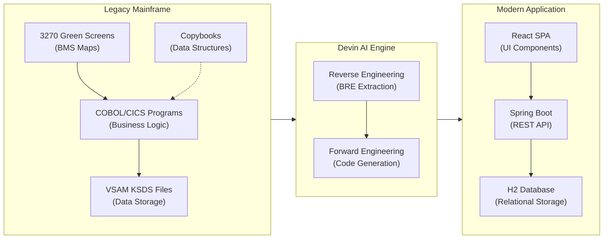

# CardDemo Modernization — US Bank CTO Presentation

## Overview

This demo showcases legacy COBOL/CICS mainframe modernization using **Devin** — an AI software engineer. We take the CardDemo credit card management system's green screen terminal interface and convert it into a modern **React + Spring Boot** web application, demonstrating a complete end-to-end modernization pipeline.

The original system runs on a mainframe with COBOL programs, CICS transaction processing, BMS screen definitions, and VSAM file storage. Devin reads these legacy artifacts, extracts the business rules, and generates a fully functional modern web application that preserves the original business logic.

## Phase 1 — Reverse Engineering (BRE Extraction)

Devin analyzes the legacy artifacts to extract business rules and data models.

### Green Screen Definitions (BMS Maps)

| File | Description |
|------|-------------|
| `app/bms/COCRDSL.bms` | **Card Detail View** — 3270 terminal screen layout for viewing credit card details. Fields: Account Number (POS 7,45 — 11 chars), Card Number (POS 8,45 — 16 chars), Name on Card (POS 11,25 — 50 chars), Active Status (POS 13,25 — 1 char Y/N), Expiry Date month/year (POS 15,25). |
| `app/bms/COCRDUP.bms` | **Card Update** — Editable version of the detail screen. Same field layout but with UNPROT (unprotected) attributes allowing user input on Name, Active Status, and Expiry fields. Account Number is PROT (read-only). |
| `app/bms/COCRDLI.bms` | **Card Listing** — Displays a scrollable list of credit cards in a 10-row table with columns: Select, Account Number, Card Number, Active status. Supports pagination and account/card number filtering. |

### Mapper/Copybooks (Data Structures)

| File | Description | Record Length |
|------|-------------|--------------|
| `app/cpy/CVACT02Y.cpy` | **Card Record** — `CARD-NUM` X(16), `CARD-ACCT-ID` 9(11), `CARD-CVV-CD` 9(03), `CARD-EMBOSSED-NAME` X(50), `CARD-EXPIRAION-DATE` X(10), `CARD-ACTIVE-STATUS` X(01) | 150 bytes |
| `app/cpy/CVACT01Y.cpy` | **Account Record** — `ACCT-ID` 9(11), `ACCT-ACTIVE-STATUS` X(01), `ACCT-CURR-BAL` S9(10)V99, `ACCT-CREDIT-LIMIT` S9(10)V99, `ACCT-CASH-CREDIT-LIMIT` S9(10)V99, `ACCT-OPEN-DATE` X(10), `ACCT-EXPIRAION-DATE` X(10), `ACCT-REISSUE-DATE` X(10) | 300 bytes |
| `app/cpy/COCOM01Y.cpy` | **COMMAREA** — Inter-program communication area carrying transaction ID, program name, user ID, customer/account/card context between CICS programs. |
| `app/cpy/CVACT03Y.cpy` | **Card Cross-Reference** — `XREF-CARD-NUM` X(16), `XREF-CUST-ID` 9(09), `XREF-ACCT-ID` 9(11). Links cards to customers and accounts. | 50 bytes |

### COBOL Programs (Business Logic)

| File | Description |
|------|-------------|
| `app/cbl/COCRDSLC.cbl` | **Card Detail View Logic** — Receives account/card number input, validates format (account must be numeric 11 digits, card must be 16 digits), reads VSAM card file (`9000-READ-DATA`, `9100-GETCARD-BYACCTCARD`), and populates the detail screen fields. |
| `app/cbl/COCRDUPC.cbl` | **Card Update Logic** — Full CRUD update flow with field-level validation: account edit (`1210-EDIT-ACCOUNT`), card number edit (`1220-EDIT-CARD`), name validation (`1230-EDIT-NAME`), active status must be Y/N (`1240-EDIT-CARDSTATUS`), expiry month 01-12 (`1250-EDIT-EXPIRY-MON`), expiry year 1950-2099 (`1260-EDIT-EXPIRY-YEAR`). Writes back to VSAM on successful validation (`9000-READ-DATA`, `9100-UPDATE-CARD`). |
| `app/cbl/COCRDLIC.cbl` | **Card List Logic** — Lists all cards for admin users or only cards associated with the account in COMMAREA for regular users. Supports forward browsing through VSAM with `9000-READ-FORWARD`. Populates a 10-row screen array with account number, card number, and active status. |

### How Devin Extracts Business Rules

Devin reads these artifacts and extracts:
- **Validation rules** — Numeric format checks, Y/N constraints, date range validation
- **Data flow** — COMMAREA → COBOL program → VSAM read/write → BMS screen mapping
- **Screen-to-data mappings** — BMS field positions → copybook field names → database columns
- **Access control** — Admin vs. regular user card listing behavior

## Phase 2 — Forward Engineering

Devin generates a complete modern application stack:

### React Frontend
- **CardListPage** → Replaces `COCRDLI.bms` / `COCRDLIC.cbl` — Data table with search, filtering, and pagination
- **CardDetailPage** → Replaces `COCRDSL.bms` / `COCRDSLC.cbl` — Card detail view with all fields
- **CardUpdatePage** → Replaces `COCRDUP.bms` / `COCRDUPC.cbl` — Editable form with validation
- **GreenScreenPreview** → Side-by-side comparison showing the original 3270 terminal layout

### Java Spring Boot Backend
- **CardController** → REST API replacing CICS transaction processing
- **CardService** → Business logic extracted from COBOL paragraphs with traceability comments
- **Card / Account / CardXref entities** → JPA entities mapped from COBOL copybooks
- **H2 Database** → Replaces VSAM KSDS file storage

### Database Schema
- `cards` table → from `CVACT02Y.cpy` (Card Record)
- `accounts` table → from `CVACT01Y.cpy` (Account Record)
- `card_xref` table → from `CVACT03Y.cpy` (Card Cross-Reference)
- Seed data converted from `app/data/ASCII/carddata.txt` and `app/data/ASCII/acctdata.txt`

## Architecture Flow

## Demo Script — Talking Points

### 1. Set the Scene (2 min)
- Show the CardDemo README — explain this is a realistic mainframe credit card management system
- Highlight the technology stack: COBOL, CICS, BMS, VSAM, JCL
- "This is representative of what banks run today on mainframes"

### 2. Walk Through Legacy Artifacts (3 min)
- Open `app/bms/COCRDSL.bms` — "This is how mainframe screens are defined — fixed positions, field attributes, green text on black"
- Open `app/cpy/CVACT02Y.cpy` — "This is the data structure — fixed-width fields, packed decimals"
- Open `app/cbl/COCRDUPC.cbl` — "This is 1,500+ lines of COBOL for updating a credit card — validation, error handling, screen I/O"

### 3. Show the GreenScreen Preview (1 min)
- Open the React app's GreenScreen component
- "This is what the terminal operator sees — green text, monospace, fixed positions"

### 4. Show the Modern Application (3 min)
- Navigate the Card List → Card Detail → Card Update flow
- "Same business logic, same validation rules, modern UI"
- Show the Spring Boot service with COBOL traceability comments

### 5. Architecture Comparison (2 min)
- Show the Mermaid diagram
- "Devin read the legacy code, extracted the business rules, and generated this entire stack"
- Highlight: copybook → JPA entity, BMS → React component, COBOL paragraph → Java method

### 6. Key Takeaways (1 min)
- Devin understands legacy code at the business rule level, not just syntax
- Generated code includes traceability back to the original COBOL
- The modernized app is immediately runnable — not just scaffolding
