# CardDemo Dependency Map

> **Generated**: 2026-03-25 | **Application**: AWS CardDemo | **Analysis**: Call graph, data lineage, and transaction routing

---

## 1. CICS Transaction Routing

The application uses CICS transaction IDs to route terminal input to programs. Each transaction ID is a 4-character code entered at the terminal or invoked via XCTL.

```
Terminal Input
      |
      v
  [CC00] ──> COSGN00C (Sign-on)
                |
        ┌───────┴───────┐
        v               v
  Admin (type='A')   Regular (type='U')
        |               |
        v               v
  [CA00] COADM01C   [CM00] COMEN01C
   (Admin Menu)      (Main Menu)
```

### Transaction ID Registry

| Tran ID | Program | Screen | Access |
|---------|---------|--------|--------|
| CC00 | COSGN00C | Sign-on | All |
| CM00 | COMEN01C | Main Menu | Regular + Admin |
| CA00 | COADM01C | Admin Menu | Admin only |
| CAVW | COACTVWC | Account View | Regular + Admin |
| CAUP | COACTUPC | Account Update | Regular + Admin |
| CCLI | COCRDLIC | Card List | Regular + Admin |
| CCDL | COCRDSLC | Card Detail | Regular + Admin |
| CCUP | COCRDUPC | Card Update | Regular + Admin |
| CT00 | COTRN00C | Transaction List | Regular + Admin |
| CT01 | COTRN01C | Transaction View | Regular + Admin |
| CT02 | COTRN02C | Transaction Add | Regular + Admin |
| CR00 | CORPT00C | Reports | Regular + Admin |
| CB00 | COBIL00C | Bill Payment | Regular + Admin |
| CU00 | COUSR00C | User List | Admin only |
| CU01 | COUSR01C | User Add | Admin only |
| CU02 | COUSR02C | User Update | Admin only |
| CU03 | COUSR03C | User Delete | Admin only |

---

## 2. Program Call Graph

### 2.1 Online CICS Program Calls (XCTL)

Programs transfer control via `EXEC CICS XCTL`. The COMMAREA is passed to maintain navigation state.

```
COSGN00C ──XCTL──> COADM01C  (if admin)
    |
    └──XCTL──> COMEN01C  (if regular user)

COMEN01C ──XCTL──> COACTVWC  (option 1: Account View)
    |──XCTL──> COACTUPC  (option 2: Account Update)
    |──XCTL──> COCRDLIC  (option 3: Card List)
    |──XCTL──> COCRDSLC  (option 4: Card View)
    |──XCTL──> COCRDUPC  (option 5: Card Update)
    |──XCTL──> COTRN00C  (option 6: Transaction List)
    |──XCTL──> COTRN01C  (option 7: Transaction View)
    |──XCTL──> COTRN02C  (option 8: Transaction Add)
    |──XCTL──> CORPT00C  (option 9: Reports)
    |──XCTL──> COBIL00C  (option 10: Bill Payment)
    └──XCTL──> COPAUS0C  (option 11: Pending Authorization*)

COADM01C ──XCTL──> COUSR00C  (option 1: User List)
    |──XCTL──> COUSR01C  (option 2: User Add)
    |──XCTL──> COUSR02C  (option 3: User Update)
    |──XCTL──> COUSR03C  (option 4: User Delete)
    |──XCTL──> COTRTLIC  (option 5: Tran Type List*)
    └──XCTL──> COTRTUPC  (option 6: Tran Type Maint*)

(* = optional module programs)

COACTVWC ──XCTL──> COMEN01C  (return to menu)
COACTUPC ──XCTL──> COMEN01C  (return to menu)
COCRDLIC ──XCTL──> COCRDSLC  (view card detail)
    |──XCTL──> COCRDUPC  (update card)
    └──XCTL──> COMEN01C  (return to menu)
COCRDSLC ──XCTL──> COMEN01C  (return to menu)
COCRDUPC ──XCTL──> COMEN01C  (return to menu)
```

### 2.2 Batch Program Calls (CALL)

Batch programs use COBOL `CALL` statements for subroutine linkage.

```
CBSTM03A ──CALL──> CBSTM03B  (file I/O subroutine, called 11+ times)

CBACT01C ──CALL──> COBDATFT  (assembler date formatter)

COBSWAIT ──CALL──> MVSWAIT   (assembler wait routine)

COTRN02C ──CALL──> CSUTLDTC  (date validation utility)
CORPT00C ──CALL──> CSUTLDTC  (date validation utility)

CSUTLDTC ──CALL──> CEEDAYS   (LE date intrinsic)

CBTRN01C ──CALL──> CEE3ABD   (LE abend routine, on fatal error)
CBTRN02C ──CALL──> CEE3ABD
CBTRN03C ──CALL──> CEE3ABD
CBACT01C ──CALL──> CEE3ABD
CBACT02C ──CALL──> CEE3ABD
CBACT03C ──CALL──> CEE3ABD
CBACT04C ──CALL──> CEE3ABD
CBCUS01C ──CALL──> CEE3ABD
CBSTM03A ──CALL──> CEE3ABD
CBEXPORT ──CALL──> CEE3ABD
CBIMPORT ──CALL──> CEE3ABD
```

### 2.3 Full Call Graph (Mermaid)

```mermaid
graph TD
    subgraph "Entry"
        CC00[CC00: COSGN00C<br/>Sign-on]
    end

    subgraph "Menus"
        CM00[CM00: COMEN01C<br/>Main Menu]
        CA00[CA00: COADM01C<br/>Admin Menu]
    end

    subgraph "Account Management"
        CAVW[CAVW: COACTVWC<br/>Account View]
        CAUP[CAUP: COACTUPC<br/>Account Update]
    end

    subgraph "Card Management"
        CCLI[CCLI: COCRDLIC<br/>Card List]
        CCDL[CCDL: COCRDSLC<br/>Card Detail]
        CCUP[CCUP: COCRDUPC<br/>Card Update]
    end

    subgraph "Transactions"
        CT00[CT00: COTRN00C<br/>Tran List]
        CT01[CT01: COTRN01C<br/>Tran View]
        CT02[CT02: COTRN02C<br/>Tran Add]
    end

    subgraph "Other"
        CR00[CR00: CORPT00C<br/>Reports]
        CB00[CB00: COBIL00C<br/>Bill Pay]
    end

    subgraph "Admin Functions"
        CU00[CU00: COUSR00C<br/>User List]
        CU01[CU01: COUSR01C<br/>User Add]
        CU02[CU02: COUSR02C<br/>User Update]
        CU03[CU03: COUSR03C<br/>User Delete]
    end

    subgraph "Batch Processing"
        CBTRN01[CBTRN01C<br/>Tran Validate]
        CBTRN02[CBTRN02C<br/>Tran Post]
        CBTRN03[CBTRN03C<br/>Tran Report]
        CBACT04[CBACT04C<br/>Interest Calc]
        CBSTM3A[CBSTM03A<br/>Statements]
        CBSTM3B[CBSTM03B<br/>Stmt I/O]
    end

    subgraph "Utilities"
        CSUTLDTC[CSUTLDTC<br/>Date Validation]
        COBDATFT[COBDATFT<br/>Date Format]
    end

    CC00 -->|admin| CA00
    CC00 -->|user| CM00

    CM00 --> CAVW
    CM00 --> CAUP
    CM00 --> CCLI
    CM00 --> CCDL
    CM00 --> CCUP
    CM00 --> CT00
    CM00 --> CT01
    CM00 --> CT02
    CM00 --> CR00
    CM00 --> CB00

    CA00 --> CU00
    CA00 --> CU01
    CA00 --> CU02
    CA00 --> CU03

    CCLI --> CCDL
    CCLI --> CCUP

    CT02 -.->|CALL| CSUTLDTC
    CR00 -.->|CALL| CSUTLDTC
    CBSTM3A -.->|CALL| CBSTM3B
    CBTRN01 -.->|CALL| CEE3ABD
    CBTRN02 -.->|CALL| CEE3ABD
```



---

## 3. Data Lineage -- VSAM File Access

### 3.1 File Access Matrix

Shows which programs read (R), write (W), rewrite/update (U), delete (D), or browse (B) each VSAM file.

| Program | USRSEC | ACCTDAT | CARDDAT | CUSTDAT | CARDXREF | TRANSACT | TCATBAL | DISCGRP | TRANTYPE | TRANCATG |
|---------|--------|---------|---------|---------|----------|----------|---------|---------|----------|----------|
| **COSGN00C** | R | | | | | | | | | |
| **COACTVWC** | | R | R | R | R/B | | | | | |
| **COACTUPC** | | R/U | | R/U | R/B | | | | | |
| **COCRDLIC** | | | B | | | | | | | |
| **COCRDSLC** | | | R | R | | | | | | |
| **COCRDUPC** | | | R/U | | | | | | | |
| **COTRN00C** | | | | | | B | | | | |
| **COTRN01C** | | | | | | R | | | | |
| **COTRN02C** | | R | | | R | W | | | | |
| **COBIL00C** | | R/U | | | R/B | R/B/W | | | | |
| **CORPT00C** | | | | | | | | | | |
| **COUSR00C** | B | | | | | | | | | |
| **COUSR01C** | R/W | | | | | | | | | |
| **COUSR02C** | R/U | | | | | | | | | |
| **COUSR03C** | R/D | | | | | | | | | |
| **CBACT01C** | | R | | | | | | | | |
| **CBACT02C** | | | R | | | | | | | |
| **CBACT03C** | | | | | R | | | | | |
| **CBACT04C** | | R/U | | | | | R | R | | |
| **CBCUS01C** | | | | R | | | | | | |
| **CBTRN01C** | | R | | | R | | | | | |
| **CBTRN02C** | | R/U | | | R | R/W | R/W/U | | | |
| **CBTRN03C** | | | | | | R | | | R | R |
| **CBSTM03A** | | R | | R | R | R | | | | |
| **CBEXPORT** | | R | R | R | R | R | | | | |
| **CBIMPORT** | | W | W | W | W | W | | | | |

Legend: **R** = Read, **W** = Write (new), **U** = Rewrite (update), **D** = Delete, **B** = Browse (STARTBR/READNEXT/READPREV)

### 3.2 File-Centric View

#### USRSEC (User Security)
```
Writers:  COUSR01C (add), COUSR02C (update), COUSR03C (delete), DUSRSECJ.jcl (bulk load)
Readers:  COSGN00C (login), COUSR00C (list), COUSR01C (dup check), COUSR02C, COUSR03C
```

#### ACCTDAT (Account Master)
```
Writers:  COACTUPC (online update), CBTRN02C (balance update after posting),
          CBACT04C (interest accrual), COBIL00C (bill payment),
          ACCTFILE.jcl (bulk refresh), CBIMPORT (import)
Readers:  COACTVWC (view), COTRN02C (validation), COBIL00C (balance check),
          CBACT01C (print), CBTRN01C (validation), CBTRN02C (posting),
          CBSTM03A (statement), CBEXPORT (export)
```

#### CARDDAT (Card Master)
```
Writers:  COCRDUPC (online update), CARDFILE.jcl (bulk refresh), CBIMPORT (import)
Readers:  COACTVWC (view), COCRDLIC (list/browse), COCRDSLC (detail view),
          CBACT02C (print), CBEXPORT (export)
```

#### CUSTDAT (Customer Master)
```
Writers:  COACTUPC (online update), CUSTFILE.jcl (bulk refresh), CBIMPORT (import)
Readers:  COACTVWC (view), COCRDSLC (card detail), CBCUS01C (print),
          CBSTM03A (statement), CBEXPORT (export)
```

#### CARDXREF (Cross-Reference)
```
Writers:  XREFFILE.jcl (bulk load), CBIMPORT (import)
Readers:  COACTVWC (account->cards lookup), COACTUPC (account->cards),
          COTRN02C (card->account), COBIL00C (account->cards),
          CBACT03C (print), CBTRN01C (validation), CBTRN02C (posting),
          CBSTM03A (statement), CBEXPORT (export)
```

#### TRANSACT (Transaction Master)
```
Writers:  COTRN02C (online add), CBTRN02C (batch posting), COBIL00C (payment),
          TRANFILE.jcl (bulk load), CBIMPORT (import)
Readers:  COTRN00C (list/browse), COTRN01C (view), COBIL00C (balance calc),
          CBTRN03C (reporting), CBSTM03A (statement), CBEXPORT (export)
```

#### TCATBAL (Transaction Category Balance)
```
Writers:  CBTRN02C (update during posting)
Readers:  CBTRN02C (read before update), CBACT04C (interest calculation)
```

#### DISCGRP (Disclosure Group)
```
Writers:  DISCGRP.jcl (bulk load)
Readers:  CBACT04C (interest rate lookup)
```

---

## 4. Batch Job Data Flow

### 4.1 Nightly Batch Cycle

```
                    ┌─────────────────────────────────────────┐
                    │          CLOSEFIL.jcl                    │
                    │  (Close CICS files for batch access)     │
                    └──────────────┬──────────────────────────┘
                                   │
          ┌────────────────────────┼────────────────────────┐
          v                        v                        v
   ACCTFILE.jcl              CARDFILE.jcl             CUSTFILE.jcl
   (ASCII->ACCTDAT)          (ASCII->CARDDAT)         (ASCII->CUSTDAT)
          │                        │                        │
          v                        v                        v
   XREFFILE.jcl              TRANFILE.jcl             DUSRSECJ.jcl
   (ASCII->CARDXREF)         (ASCII->TRANSACT)        (ASCII->USRSEC)
          │                        │
          └────────┬───────────────┘
                   v
          ┌────────────────────────────────────────────────────┐
          │  POSTTRAN.jcl                                       │
          │    Step 1: CBTRN01C  (Validate daily transactions)  │
          │      Reads: DALYTRAN, CARDXREF, ACCTDAT             │
          │    Step 2: CBTRN02C  (Post validated transactions)  │
          │      Reads: DALYTRAN, CARDXREF, ACCTDAT             │
          │      Writes: TRANSACT, TCATBAL                      │
          │      Updates: ACCTDAT (balance)                     │
          └────────────────────┬───────────────────────────────┘
                               │
                   ┌───────────┴───────────┐
                   v                       v
          INTCALC.jcl               TRANBKP.jcl
          CBACT04C                  (Backup TRANSACT)
          Reads: ACCTDAT,              │
                 TCATBAL, DISCGRP      │
          Updates: ACCTDAT             │
                   │                   │
                   └─────────┬─────────┘
                             v
                    COMBTRAN.jcl
                    (Combine daily -> master)
                             │
                   ┌─────────┴─────────┐
                   v                   v
          CREASTMT.JCL          TRANREPT.jcl
          CBSTM03A/B            CBTRN03C
          Reads: ACCTDAT,       Reads: TRANSACT,
                 CUSTDAT,              TRANTYPE,
                 CARDXREF,             TRANCATG
                 TRANSACT       Output: Report file
          Output: Statements
                   │                   │
                   └─────────┬─────────┘
                             v
                    TRANIDX.jcl
                    (Rebuild alternate indexes)
                             │
                             v
                    OPENFIL.jcl
                    (Reopen CICS files)
```

### 4.2 Data Export/Import Flow

```
CBEXPORT.jcl (Export for Branch Migration)
  ┌──────────────────────────────────────┐
  │  Program: CBEXPORT                    │
  │  Reads:                               │
  │    CUSTDAT  -> Customer records       │
  │    ACCTDAT  -> Account records        │
  │    CARDXREF -> Cross-reference recs   │
  │    TRANSACT -> Transaction records    │
  │    CARDDAT  -> Card records           │
  │  Writes:                              │
  │    Sequential export file (500-byte)  │
  │    Record types: C, A, X, T, D        │
  └──────────────┬───────────────────────┘
                 │
                 v  (file transfer)
                 │
  ┌──────────────┴───────────────────────┐
  │  CBIMPORT.jcl (Import at new branch) │
  │  Program: CBIMPORT                    │
  │  Reads:                               │
  │    Sequential export file             │
  │  Writes:                              │
  │    CUSTDAT  <- Customer records       │
  │    ACCTDAT  <- Account records        │
  │    CARDXREF <- Cross-reference recs   │
  │    TRANSACT <- Transaction records    │
  │    CARDDAT  <- Card records           │
  │    Error output file (rejects)        │
  └──────────────────────────────────────┘
```

---

## 5. Copybook Dependency Graph

Shows which programs include which copybooks via `COPY` statements.

### 5.1 Core Copybook Usage Matrix

| Copybook | COSGN00C | COMEN01C | COADM01C | COACTVWC | COACTUPC | COCRDLIC | COCRDSLC | COCRDUPC | COTRN00C | COTRN01C | COTRN02C | CORPT00C | COBIL00C | COUSR00-03C |
|----------|----------|----------|----------|----------|----------|----------|----------|----------|----------|----------|----------|----------|----------|-------------|
| COCOM01Y | X | X | X | X | X | X | X | X | X | X | X | X | X | X |
| COTTL01Y | X | X | X | X | X | X | X | X | X | X | X | X | X | X |
| CSDAT01Y | X | X | X | X | X | X | X | X | X | X | X | X | X | X |
| CSMSG01Y | X | X | X | X | X | X | X | X | X | X | X | X | X | X |
| DFHAID | X | X | X | X | X | X | X | X | X | X | X | X | X | X |
| DFHBMSCA | X | X | X | X | X | X | X | X | X | X | X | X | X | X |
| CSUSR01Y | X | X | X | X | | | | | | | | | | X |
| COMEN02Y | | X | | | | | | | | | | | | |
| COADM02Y | | | X | | | | | | | | | | | |
| CVACT01Y | | | | X | X | | | | | | X | | X | |
| CVACT02Y | | | | X | X | X | X | X | | | | | | |
| CVACT03Y | | | | X | X | | | | | | X | | X | |
| CVCUS01Y | | | | X | X | | X | | | | | | | |
| CVCRD01Y | | | | X | X | X | X | X | | | | | | |
| CVTRA05Y | | | | | | | | | X | X | X | | X | |

### 5.2 Batch Program Copybook Usage

| Copybook | CBACT01C | CBACT02C | CBACT03C | CBACT04C | CBCUS01C | CBTRN01C | CBTRN02C | CBTRN03C | CBSTM03A | CBEXPORT | CBIMPORT |
|----------|----------|----------|----------|----------|----------|----------|----------|----------|----------|----------|----------|
| CVACT01Y | | | | X | | X | X | | X | X | X |
| CVACT02Y | | | | | | X | | | | X | X |
| CVACT03Y | | | X | | | X | X | | X | X | X |
| CVCUS01Y | | | | | | X | | | | X | X |
| CVTRA05Y | | | | | | X | X | | | X | X |
| CVTRA06Y | | | | | | X | X | | | | |
| CVTRA01Y | | | | | | | X | | | | |
| CVTRA07Y | | | | | | | | X | | | |
| COSTM01 | | | | | | | | | X | | |
| CUSTREC | | | | | | | | | X | | |
| CVEXPORT | | | | | | | | | | X | X |

---

## 6. Alternate Index Paths

VSAM alternate indexes provide secondary access paths to KSDS files:

```
CARDDAT (primary key: CARD-NUM)
    |
    └── CARDAIX (alternate index by CARD-ACCT-ID)
            Used by: COCRDLIC (list cards for an account)
                     COACTVWC (find cards for an account)

CARDXREF (primary key: XREF-CARD-NUM)
    |
    └── CXACAIX (alternate index by XREF-ACCT-ID)
            Used by: COACTVWC (find xrefs for an account)
                     COACTUPC (find xrefs for an account)
                     COBIL00C (find xrefs for bill payment)
```

---

## 7. External Dependencies

| Dependency | Type | Called By | Purpose |
|------------|------|-----------|---------|
| `CEEDAYS` | LE Service | CSUTLDTC | Convert date to Lilian format for validation |
| `CEE3ABD` | LE Service | All batch programs | Abnormal termination (abend) handler |
| `COBDATFT` | Assembler | CBACT01C | Date formatting for report output |
| `MVSWAIT` | Assembler | COBSWAIT | Introduce a timed wait (delay) |
| `DFHAID` | CICS System | All CICS programs | AID (Attention ID) key definitions |
| `DFHBMSCA` | CICS System | All CICS programs | BMS attribute constants |

---

## 8. Optional Module Dependencies

### Authorization Module (IMS/DB2/MQ)
```
COPAUA0C ──MQ Trigger──> Processes authorization requests from MQ queue
COPAUS0C ──IMS DL/I──> Reads PASFL/PAUTB IMS databases (summary view)
COPAUS1C ──IMS DL/I──> Reads PADFL IMS database (detail view)
COPAUS2C ──DB2 SQL──> Writes fraud flags to DB2 tables
CBPAUP0C ──DB2 SQL──> Purges old authorization records from DB2
```

### Transaction Type DB2 Module
```
COTRTUPC ──DB2 SQL──> CRUD operations on transaction type DB2 table
COTRTLIC ──DB2 SQL──> List/delete from transaction type DB2 table (uses cursors)
COBTUPDT ──DB2 SQL──> Batch update of transaction type DB2 table
```

### VSAM-MQ Module
```
COACCT01 ──MQ Request/Response──> Account inquiry via MQ (tran CDRA)
CODATE01 ──MQ Request/Response──> System date retrieval via MQ (tran CDRD)
```
