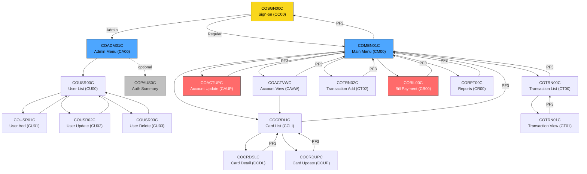
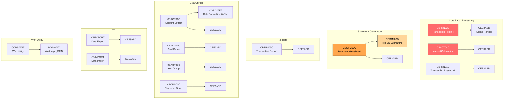
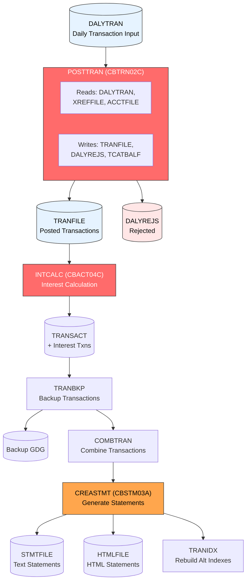
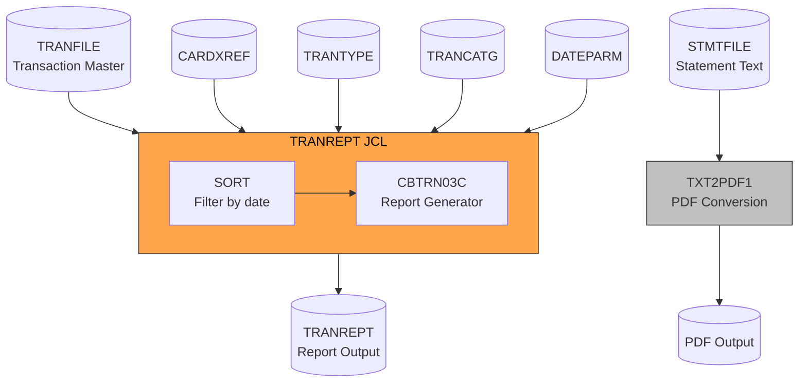
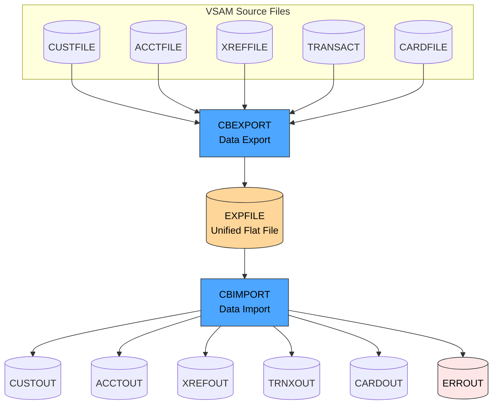
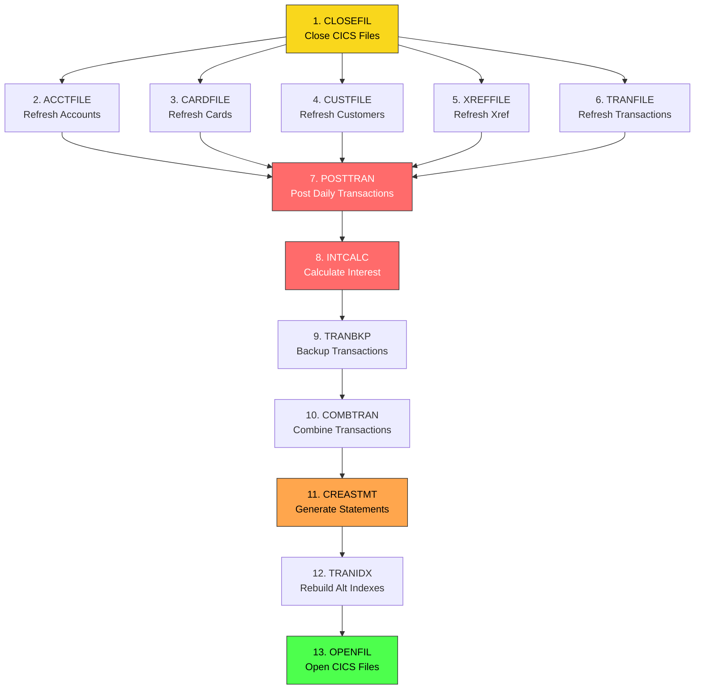

# CardDemo Dependency Map

> **Generated**: 2026-03-25 | **Application**: CardDemo (Credit Card Management System)
> **Source**: Static analysis of COBOL CALL/XCTL statements, COPY directives, and JCL DD statements

---

## Table of Contents

1. [Online Program Call Graph (CICS XCTL)](#online-program-call-graph-cics-xctl)
2. [Batch Program Call Graph](#batch-program-call-graph)
3. [Copybook Dependency Matrix](#copybook-dependency-matrix)
4. [VSAM File Access Matrix](#vsam-file-access-matrix)
5. [JCL Job Data Lineage](#jcl-job-data-lineage)
6. [Batch Cycle Execution Order](#batch-cycle-execution-order)
7. [Optional Module Dependencies](#optional-module-dependencies)
8. [Cross-Cutting Concerns](#cross-cutting-concerns)

---

## Online Program Call Graph (CICS XCTL)

CICS online programs transfer control via `EXEC CICS XCTL`. The COMMAREA (COCOM01Y) is passed between all programs.

### Mermaid: Online CICS Call Graph



### ASCII: Online CICS Call Graph

```
COSGN00C (Sign-on, CC00)
├──► COADM01C (Admin Menu, CA00)         [if user type = Admin]
│    ├──► COUSR00C (User List, CU00)
│    │    ├──► COUSR01C (User Add, CU01)
│    │    │    └──► COUSR00C              [return to list]
│    │    ├──► COUSR02C (User Update, CU02)
│    │    │    └──► COUSR00C              [return to list]
│    │    └──► COUSR03C (User Delete, CU03)
│    │         └──► COUSR00C              [return to list]
│    ├──► COPAUS0C (Auth Summary)*        [optional module]
│    └──► COADM01C                        [PF3 = return to menu]
│
└──► COMEN01C (Main Menu, CM00)           [if user type = Regular]
     ├──► COACTVWC (Account View, CAVW)
     │    ├──► COCRDLIC (Card List)       [drill-down]
     │    └──► COMEN01C                   [PF3 = return]
     ├──► COACTUPC (Account Update, CAUP)
     │    └──► COMEN01C                   [PF3 = return]
     ├──► COCRDLIC (Card List, CCLI)
     │    ├──► COCRDSLC (Card Detail, CCDL)
     │    │    └──► COCRDLIC              [PF3 = return to list]
     │    ├──► COCRDUPC (Card Update, CCUP)
     │    │    └──► COCRDLIC              [PF3 = return to list]
     │    └──► COMEN01C                   [PF3 = return]
     ├──► COTRN00C (Transaction List, CT00)
     │    ├──► COTRN01C (Transaction View, CT01)
     │    │    └──► COTRN00C              [PF3 = return]
     │    └──► COMEN01C                   [PF3 = return]
     ├──► COTRN02C (Transaction Add, CT02)
     │    └──► COMEN01C                   [PF3 = return]
     ├──► COBIL00C (Bill Payment, CB00)
     │    └──► COMEN01C                   [PF3 = return]
     ├──► CORPT00C (Reports, CR00)
     │    └──► COMEN01C                   [PF3 = return]
     └──► COSGN00C                        [PF3 = sign off]
```

*Items marked with `*` are optional modules that may not be installed.

### CALL Relationships (Subroutine Calls)

These are `CALL` statements (not XCTL), meaning the calling program retains control.

| Caller | Callee | Purpose |
|--------|--------|---------|
| CORPT00C | CSUTLDTC | Date validation for report date range |
| COTRN02C | CSUTLDTC | Date validation for new transaction |
| CSUTLDTC | CEEDAYS (LE runtime) | Convert date to Lilian format |
| CBACT01C | COBDATFT (Assembler) | Date formatting for account extract |
| CBSTM03A | CBSTM03B | Statement file I/O subroutine |
| CBSTM03A | CEE3ABD (LE runtime) | Abend handling |
| COBSWAIT | MVSWAIT (Assembler) | Platform wait implementation |
| All batch CB* | CEE3ABD (LE runtime) | Abend handling |

---

## Batch Program Call Graph

### Mermaid: Batch Program Call Graph



### ASCII: Batch Program Call Graph

```
CBTRN02C (Transaction Posting)
└── CEE3ABD (Abend handler)

CBACT04C (Interest Calculation)
└── CEE3ABD (Abend handler)

CBSTM03A (Statement Generation - Main)
├── CBSTM03B (File I/O Subroutine)     [CALL, multiple times]
└── CEE3ABD (Abend handler)

CBTRN03C (Transaction Report)
└── CEE3ABD (Abend handler)

CBTRN01C (Transaction Posting - Variant 1)
└── CEE3ABD (Abend handler)

CBACT01C (Account Extract)
├── COBDATFT (Date Formatting - ASM)     [CALL]
└── CEE3ABD (Abend handler)

CBACT02C (Card Data Dump)
└── CEE3ABD (Abend handler)

CBACT03C (Xref Data Dump)
└── CEE3ABD (Abend handler)

CBCUS01C (Customer Data Dump)
└── CEE3ABD (Abend handler)

CBEXPORT (Data Export)
└── CEE3ABD (Abend handler)

CBIMPORT (Data Import)
└── CEE3ABD (Abend handler)

COBSWAIT (Wait Utility)
└── MVSWAIT (Wait Implementation - ASM)  [CALL]
```

---

## Copybook Dependency Matrix

Each row is a program; each column is a copybook. **X** = program includes this copybook.

### Core Online Programs

| Program | COCOM01Y | COTTL01Y | CSDAT01Y | CSMSG01Y | CSUSR01Y | CSMSG02Y | CVACT01Y | CVACT02Y | CVACT03Y | CVCUS01Y | CVTRA05Y | CVCRD01Y |
|---------|:--------:|:--------:|:--------:|:--------:|:--------:|:--------:|:--------:|:--------:|:--------:|:--------:|:--------:|:--------:|
| COSGN00C | X | X | X | X | X | | | | | | | |
| COMEN01C | X | X | X | X | X | | | | | | | |
| COADM01C | X | X | X | X | X | | | | | | | |
| COACTVWC | X | X | X | X | X | X | X | X | X | X | | X |
| COACTUPC | X | X | X | X | X | X | X | X | X | X | | X |
| COCRDLIC | X | X | X | X | X | | | X | | | | X |
| COCRDSLC | X | X | X | X | X | X | | X | | X | | X |
| COCRDUPC | X | X | X | X | X | X | | X | | X | | X |
| COTRN00C | X | X | X | X | | | | | | | X | |
| COTRN01C | X | X | X | X | | | | | | | X | |
| COTRN02C | X | X | X | X | | | X | | X | | X | |
| CORPT00C | X | X | X | X | | | | | | | X | |
| COBIL00C | X | X | X | X | | | X | | X | | X | |
| COUSR00C | X | X | X | X | X | | | | | | | |
| COUSR01C | X | X | X | X | X | | | | | | | |
| COUSR02C | X | X | X | X | X | | | | | | | |
| COUSR03C | X | X | X | X | X | | | | | | | |

### Core Batch Programs

| Program | CVACT01Y | CVACT02Y | CVACT03Y | CVCUS01Y | CVTRA05Y | CVTRA06Y | CVTRA01Y | CVTRA02Y | CVTRA03Y | CVTRA04Y | CVTRA07Y | CVEXPORT | COSTM01 | CUSTREC |
|---------|:--------:|:--------:|:--------:|:--------:|:--------:|:--------:|:--------:|:--------:|:--------:|:--------:|:--------:|:--------:|:-------:|:-------:|
| CBACT01C | X | | | | | | | | | | | | | |
| CBACT02C | | X | | | | | | | | | | | | |
| CBACT03C | | | X | | | | | | | | | | | |
| CBACT04C | X | | X | | X | | X | X | | | | | | |
| CBCUS01C | | | | X | | | | | | | | | | |
| CBTRN01C | X | X | X | X | X | X | | | | | | | | |
| CBTRN02C | X | | X | | X | X | X | | | | | | | |
| CBTRN03C | | | X | | X | | | | X | X | X | | | |
| CBSTM03A | X | | X | | | | | | | | | | X | X |
| CBSTM03B | (file I/O subroutine - uses data passed from CBSTM03A via CALL parameters) |
| CBEXPORT | X | X | X | X | X | | | | | | | X | | |
| CBIMPORT | X | X | X | X | X | | | | | | | X | | |

---

## VSAM File Access Matrix

Shows which programs read (R), write (W), update (U), browse (B), or delete (D) each VSAM file.

### Online Programs (CICS)

| Program | USRSEC | ACCTDAT | CARDDAT | CARDAIX | CUSTDAT | CARDXREF | CXACAIX | TRANSACT |
|---------|:------:|:-------:|:-------:|:-------:|:-------:|:--------:|:-------:|:--------:|
| COSGN00C | R | | | | | | | |
| COACTVWC | | R | | R | R | | R | |
| COACTUPC | | R,U | | R | R,U | | R | |
| COCRDLIC | | | R,B | R,B | | | | |
| COCRDSLC | | | R | R | R | | | |
| COCRDUPC | | | R,U | | R | | | |
| COTRN00C | | | | | | | | R,B |
| COTRN01C | | | | | | | | R |
| COTRN02C | | | | | | R | R | R,W |
| COBIL00C | | R,U | | | | | R | R,W |
| COUSR00C | R,B | | | | | | | |
| COUSR01C | W | | | | | | | |
| COUSR02C | R,U | | | | | | | |
| COUSR03C | R,D | | | | | | | |

### Batch Programs

| Program | ACCTFILE | CARDFILE | CUSTFILE | XREFFILE | TRANFILE | DALYTRAN | TCATBALF | DISCGRP | DALYREJS | Others |
|---------|:--------:|:--------:|:--------:|:--------:|:--------:|:--------:|:--------:|:-------:|:--------:|--------|
| CBACT01C | R | | | | | | | | | OUTFILE(W), ARRYFILE(W), VBRCFILE(W) |
| CBACT02C | | R | | | | | | | | |
| CBACT03C | | | | R | | | | | | |
| CBACT04C | R | | | R | | | R,W | R | | TRANSACT(W) |
| CBCUS01C | | | R | | | | | | | |
| CBTRN01C | R | R | R | R | W | R | | | | |
| CBTRN02C | R | | | R | W | R | W | | W | |
| CBTRN03C | | | | R(CARDXREF) | R | | | | | TRANTYPE(R), TRANCATG(R), TRANREPT(W), DATEPARM(R) |
| CBSTM03A | R | | R | R(XREFFILE) | | | | | | TRNXFILE(R), STMTFILE(W), HTMLFILE(W) |
| CBSTM03B | R | | R | R | R(TRNXFILE) | | | | | |
| CBEXPORT | R | R | R | R | R(TRANSACT) | | | | | EXPFILE(W) |
| CBIMPORT | | | | | | | | | | EXPFILE(R), CUSTOUT(W), ACCTOUT(W), XREFOUT(W), TRNXOUT(W), CARDOUT(W), ERROUT(W) |

---

## JCL Job Data Lineage

### Mermaid: Transaction Processing Cycle



### ASCII: Transaction Processing Cycle

```
                    ┌─────────────┐
                    │  DALYTRAN   │  (Daily Transaction Input - external feed)
                    └──────┬──────┘
                           │
                    ┌──────▼──────┐
                    │  POSTTRAN   │  JCL: Executes CBTRN02C
                    │  (Post)     │  Reads: DALYTRAN, XREFFILE, ACCTFILE
                    └──┬────┬─────┘  Writes: TRANFILE, DALYREJS, TCATBALF
                       │    │
              ┌────────┘    └────────┐
              ▼                      ▼
    ┌─────────────────┐    ┌────────────────┐
    │   TRANFILE      │    │   DALYREJS     │
    │ (Posted Trans)  │    │ (Rejected)     │
    └────────┬────────┘    └────────────────┘
             │
    ┌────────▼────────┐
    │    INTCALC      │  JCL: Executes CBACT04C
    │  (Interest)     │  Reads: TCATBALF, XREFFILE, ACCTFILE, DISCGRP
    └────────┬────────┘  Writes: TRANSACT (interest transactions)
             │
    ┌────────▼────────┐
    │    TRANBKP      │  JCL: REPROC + IDCAMS
    │   (Backup)      │  Reads: TRANSACT
    └────────┬────────┘  Writes: Backup GDG
             │
    ┌────────▼────────┐
    │   COMBTRAN      │  JCL: IDCAMS
    │  (Combine)      │  Reads: TRANSACT
    └────────┬────────┘  Writes: Combined dataset
             │
    ┌────────▼────────┐
    │   CREASTMT      │  JCL: SORT + CBSTM03A
    │ (Statements)    │  Reads: TRANSACT, XREFFILE, ACCTFILE, CUSTFILE
    └────────┬────────┘  Writes: STMTFILE (text), HTMLFILE (HTML)
             │
    ┌────────▼────────┐
    │    TRANIDX      │  JCL: IDCAMS
    │  (Reindex)      │  Rebuilds alternate indexes on TRANSACT
    └─────────────────┘
```

### Mermaid: Report Generation



### ASCII: Report Generation

```
    ┌─────────────────┐
    │   TRANFILE      │  (Transaction master)
    └────────┬────────┘
             │
    ┌────────▼────────┐
    │   TRANREPT      │  JCL: SORT + REPROC + CBTRN03C
    │ (Tran Report)   │  Reads: TRANFILE, CARDXREF, TRANTYPE, TRANCATG, DATEPARM
    └────────┬────────┘  Writes: TRANREPT (report file)
             │
    ┌────────▼────────┐
    │    TXT2PDF1     │  JCL: IKJEFT1B (TXT2PDF REXX)
    │  (PDF Convert)  │  Reads: STMTFILE
    └─────────────────┘  Writes: PDF output
```

### Mermaid: Data Refresh (File Loading)

```mermaid
graph LR
    ASCII["ASCII Flat Files<br/>(app/data/ASCII/)"] -->|IDCAMS REPRO| VSAM

    subgraph VSAM["VSAM KSDS Files"]
        ACCTDATA["ACCTDATA.VSAM.KSDS<br/>(ACCTFILE.jcl)"]
        CARDDATA["CARDDATA.VSAM.KSDS<br/>(CARDFILE.jcl)"]
        CUSTDATA["CUSTDATA.VSAM.KSDS<br/>(CUSTFILE.jcl)"]
        CARDXREF["CARDXREF.VSAM.KSDS<br/>(XREFFILE.jcl)"]
        TRANSACT["TRANSACT.VSAM.KSDS<br/>(TRANFILE.jcl)"]
        USRSEC["USRSEC.VSAM.KSDS<br/>(DUSRSECJ.jcl)"]
        TRANTYPE["TRANTYPE.VSAM.KSDS<br/>(TRANTYPE.jcl)"]
        TRANCATG["TRANCATG.VSAM.KSDS<br/>(TRANCATG.jcl)"]
        TCATBAL["TCATBAL.VSAM.KSDS<br/>(TCATBALF.jcl)"]
        DISCGRP["DISCGRP.VSAM.KSDS<br/>(DISCGRP.jcl)"]
    end

    style ASCII fill:#e6f3ff,stroke:#333,color:#000
```



### ASCII: Data Refresh (File Loading)

```
    ┌──────────────────┐
    │  ASCII Data      │  (app/data/ASCII/)
    │  (Flat Files)    │
    └────────┬─────────┘
             │ (IDCAMS REPRO)
             ▼
    ┌──────────────────────────────────────────────────┐
    │  VSAM KSDS Files (via individual JCL jobs)       │
    │                                                  │
    │  ACCTFILE.jcl  ──► ACCTDATA.VSAM.KSDS           │
    │  CARDFILE.jcl  ──► CARDDATA.VSAM.KSDS           │
    │  CUSTFILE.jcl  ──► CUSTDATA.VSAM.KSDS           │
    │  XREFFILE.jcl  ──► CARDXREF.VSAM.KSDS           │
    │  TRANFILE.jcl  ──► TRANSACT.VSAM.KSDS           │
    │  DUSRSECJ.jcl  ──► USRSEC.VSAM.KSDS             │
    │  TRANTYPE.jcl  ──► TRANTYPE.VSAM.KSDS            │
    │  TRANCATG.jcl  ──► TRANCATG.VSAM.KSDS            │
    │  TCATBALF.jcl  ──► TCATBAL.VSAM.KSDS             │
    │  DISCGRP.jcl   ──► DISCGRP.VSAM.KSDS             │
    └──────────────────────────────────────────────────┘
```

### Mermaid: Export / Import



### ASCII: Export / Import

```
    ┌────────────────────────────────────────┐
    │  All VSAM Files                        │
    │  (CUSTFILE, ACCTFILE, XREFFILE,        │
    │   TRANSACT, CARDFILE)                  │
    └────────────────┬───────────────────────┘
                     │
              ┌──────▼──────┐
              │  CBEXPORT   │  JCL: CBEXPORT.jcl
              │  (Export)   │  Reads all 5 VSAM files
              └──────┬──────┘  Writes: EXPFILE (unified flat file)
                     │
              ┌──────▼──────┐
              │  EXPFILE    │  (Portable flat file)
              └──────┬──────┘
                     │
              ┌──────▼──────┐
              │  CBIMPORT   │  JCL: CBIMPORT.jcl
              │  (Import)   │  Reads: EXPFILE
              └──────┬──────┘  Writes: CUSTOUT, ACCTOUT, XREFOUT,
                     │                  TRNXOUT, CARDOUT, ERROUT
                     ▼
    ┌────────────────────────────────────────┐
    │  Output Files (can reload into VSAM)   │
    └────────────────────────────────────────┘
```

---

## Batch Cycle Execution Order

The nightly batch cycle must execute in this sequence (defined in scheduler configs):

### Mermaid: Batch Cycle Execution Order



### ASCII: Batch Cycle Execution Order

```
Step  JCL Job      Purpose                            Dependencies
────  ───────      ───────                            ────────────
 1    CLOSEFIL     Close CICS files for batch          None (start of batch window)
 2    ACCTFILE     Refresh account master               CLOSEFIL
 3    CARDFILE     Refresh card master                  CLOSEFIL
 4    CUSTFILE     Refresh customer master              CLOSEFIL
 5    XREFFILE     Refresh cross-reference              CLOSEFIL
 6    TRANFILE     Refresh transaction master           CLOSEFIL
 7    POSTTRAN     Post daily transactions              Steps 2-6 complete
 8    INTCALC      Calculate interest                   POSTTRAN
 9    TRANBKP      Backup transactions                  INTCALC
10    COMBTRAN     Combine transactions                 TRANBKP
11    CREASTMT     Generate statements                  COMBTRAN
12    TRANIDX      Rebuild alternate indexes            CREASTMT
13    OPENFIL      Open CICS files                      TRANIDX (end of batch window)
```

**Critical Path**: CLOSEFIL → POSTTRAN → INTCALC → TRANBKP → COMBTRAN → CREASTMT → TRANIDX → OPENFIL

---

## Optional Module Dependencies

### Authorization Module (IMS / DB2 / MQ)

```
COMEN01C (Main Menu)
└──► COPAUS0C (Auth Summary View)
     ├── Reads: IMS Auth DB (summary segments)
     ├── VSAM: ACCTDAT, CARDDAT, CARDXREF, CUSTDAT
     └──► COPAUS1C (Auth Detail View)
          ├── Reads: IMS Auth DB (detail segments)
          ├──► COPAUS2C (Mark Fraud)
          │    └── Writes: DB2 fraud table
          └──► COPAUS0C (return)

COPAUA0C (MQ Trigger Program - runs independently)
├── Reads: MQ Request Queue
├── Reads: IMS Auth DB
└── Writes: MQ Reply Queue

CBPAUP0C (Batch Purge)        JCL: CBPAUP0J
└── Deletes: Expired IMS Auth records

PAUDBLOD (DB Load)             JCL: LOADPADB
└── Loads: Sequential file → IMS Auth DB

PAUDBUNL / DBUNLDGS (DB Unload)  JCL: UNLDPADB / UNLDGSAM
└── Unloads: IMS Auth DB → Sequential file / GSAM
```

### Transaction Type Module (DB2)

```
COADM01C (Admin Menu)
├──► COTRTLIC (Transaction Type List)
│    ├── Reads: DB2 TRANTYPE table (cursor)
│    ├──► COTRTUPC (Transaction Type Update/Add)
│    │    ├── Reads/Writes: DB2 TRANTYPE table
│    │    └──► COTRTLIC (return)
│    └──► COADM01C (PF3 = return)

COBTUPDT (Batch Update)        JCL: MNTTRDB2
└── Updates: DB2 TRANTYPE table from input
```

### VSAM-MQ Module

```
COACCT01 (Account Inquiry Service)
├── Reads: MQ Request Queue (CDRA)
├── Reads: ACCTDAT (via CVACT01Y)
└── Writes: MQ Reply Queue

CODATE01 (System Date Service)
├── Reads: MQ Request Queue (CDRD)
└── Writes: MQ Reply Queue (current date)
```

---

## Cross-Cutting Concerns

### Shared Resources Across All Online Programs

| Resource | Copybook | Purpose | Impact of Change |
|----------|----------|---------|------------------|
| COMMAREA | COCOM01Y | Inter-program state | All 21+ online programs affected |
| Screen Headers | COTTL01Y | Titles, app name | All 17 BMS screens affected |
| Date Formatting | CSDAT01Y | Current date/time | All online programs affected |
| Messages | CSMSG01Y | Error/info messages | All online programs affected |
| User Context | CSUSR01Y | Signed-on user data | 14 programs affected |
| PF Key Mapping | DFHAID | AID byte constants | All CICS programs |
| BMS Attributes | DFHBMSCA | Screen field attributes | All CICS programs |

### Data Integrity Dependencies

| If You Change... | These Programs Must Also Change... |
|------------------|------------------------------------|
| Account record layout (CVACT01Y) | COACTVWC, COACTUPC, COBIL00C, COTRN02C, CBACT01C, CBACT04C, CBTRN01C, CBTRN02C, CBSTM03A, CBEXPORT, CBIMPORT, COPAUS0C, COACCT01 (16 programs) |
| Card record layout (CVACT02Y) | COACTVWC, COACTUPC, COCRDLIC, COCRDSLC, COCRDUPC, CBACT02C, CBTRN01C, CBEXPORT, CBIMPORT, COPAUS0C (10 programs) |
| Cross-reference layout (CVACT03Y) | COACTVWC, COACTUPC, COTRN02C, COBIL00C, CBACT03C, CBACT04C, CBTRN01C, CBTRN02C, CBTRN03C, CBSTM03A, CBEXPORT, CBIMPORT, COPAUS0C (16 programs using CARDXREF/CXACAIX) |
| Transaction layout (CVTRA05Y) | COTRN00C, COTRN01C, COTRN02C, CORPT00C, COBIL00C, CBACT04C, CBTRN01C, CBTRN02C, CBTRN03C, CBEXPORT, CBIMPORT (11 programs) |
| Customer layout (CVCUS01Y) | COACTVWC, COACTUPC, COCRDSLC, COCRDUPC, CBCUS01C, CBTRN01C, CBSTM03A, CBEXPORT, CBIMPORT, COPAUS0C (10 programs) |
| COMMAREA (COCOM01Y) | ALL 21+ online programs |
