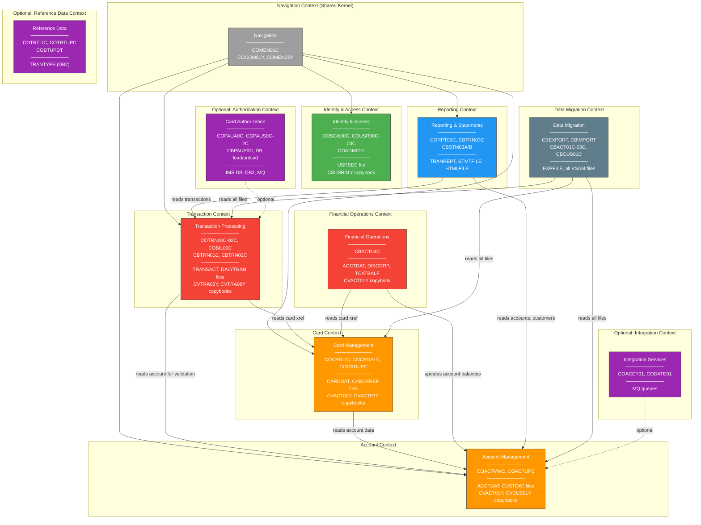
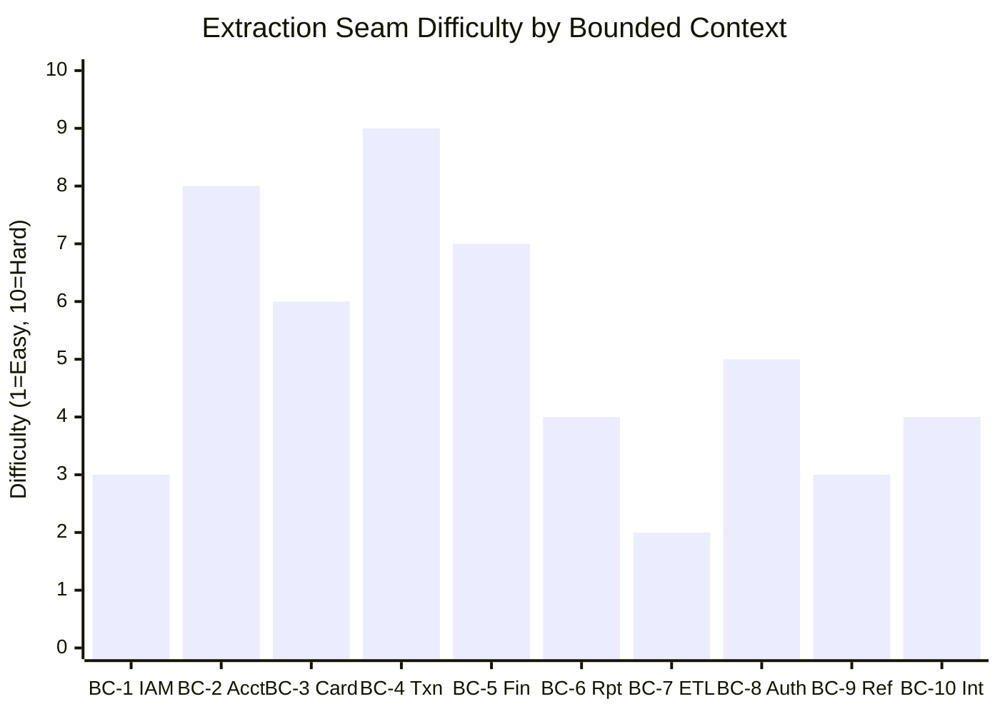
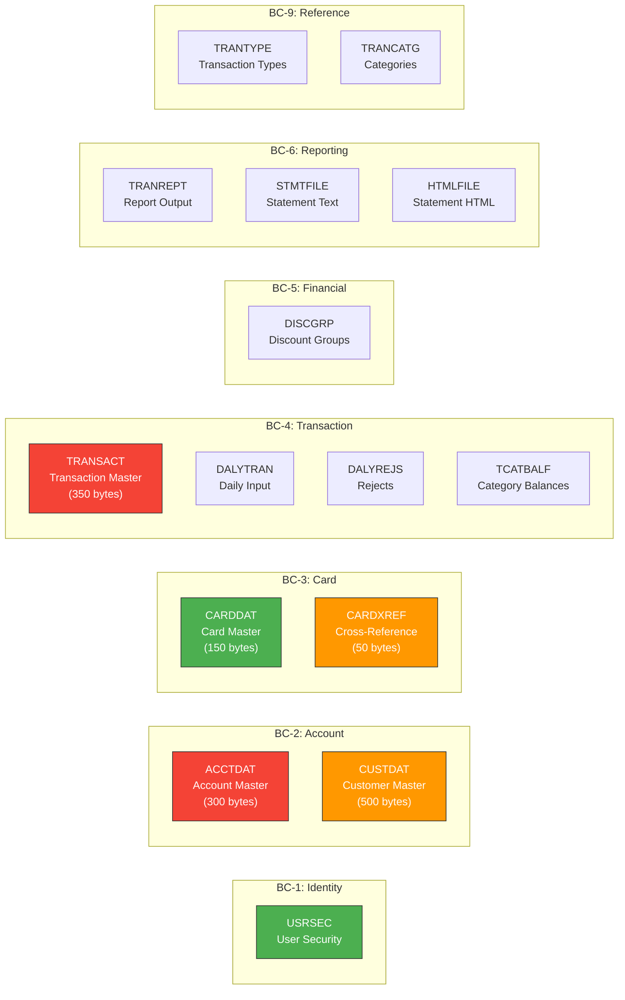
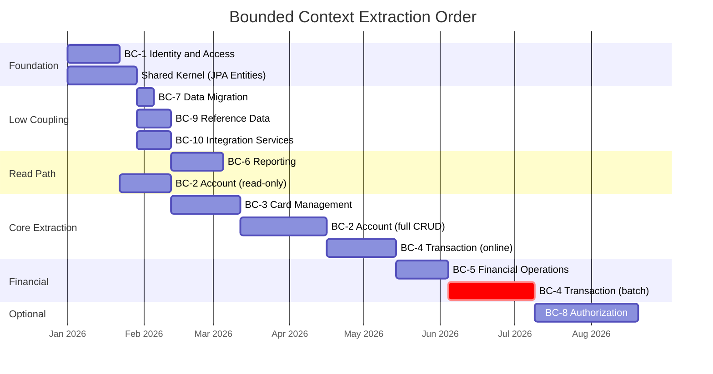
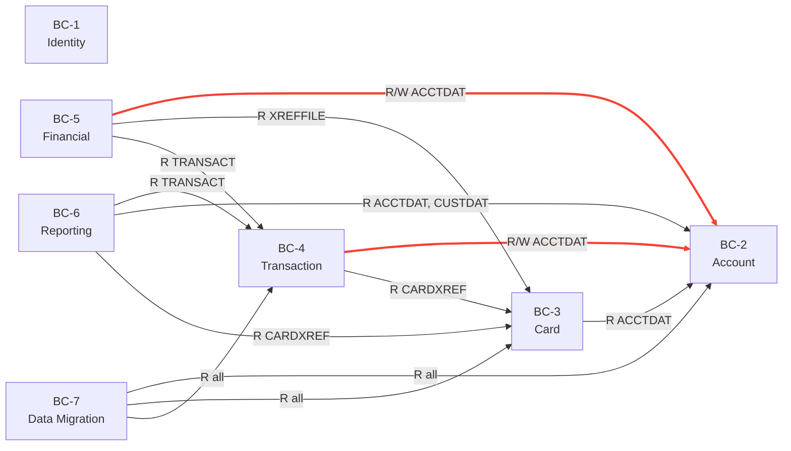

# Domain Decomposition

> **CardDemo Bounded Context Identification & Extraction Seam Analysis**
>
> This document decomposes the CardDemo monolithic COBOL application into bounded contexts suitable for microservice or modular-monolith extraction. Each context is analyzed for internal cohesion, external coupling, and extraction seam feasibility.

---

## Table of Contents

1. [Context Map Overview](#context-map-overview)
2. [Bounded Context Definitions](#bounded-context-definitions)
3. [Shared Kernel Analysis](#shared-kernel-analysis)
4. [Extraction Seam Analysis](#extraction-seam-analysis)
5. [Data Ownership Map](#data-ownership-map)
6. [Anti-Corruption Layer Design](#anti-corruption-layer-design)
7. [Extraction Order](#extraction-order)
8. [Appendix: Coupling Matrix](#appendix-coupling-matrix)

---

## Context Map Overview

### Mermaid: Bounded Context Map



---

## Bounded Context Definitions

### BC-1: Identity & Access Management

| Attribute | Value |
|-----------|-------|
| **Programs** | COSGN00C, COUSR00C, COUSR01C, COUSR02C, COUSR03C, COADM01C |
| **Copybooks** | CSUSR01Y (user record), COCOM01Y (session context) |
| **VSAM Files** | USRSEC |
| **Total LOC** | 2,055 |
| **Cohesion** | High — all programs operate on a single entity (User) with a single file |
| **External Coupling** | Low — only provides authentication context to other contexts via COMMAREA |

**Domain Entities:**
- `User` (CSUSR01Y): user ID, password, first/last name, user type (Admin/Regular)
- `Session` (subset of COCOM01Y): from-program, to-program, user ID, user type

**Ubiquitous Language:**
| COBOL Term | Domain Term | Java Term |
|------------|-------------|-----------|
| USRSEC | User Security File | `users` table |
| SEC-USR-ID | User Identifier | `User.username` |
| SEC-USR-PWD | Password | `User.passwordHash` |
| SEC-USR-TYPE | User Role | `User.role` (enum: ADMIN, USER) |
| CDEMO-USER-TYPE | Session User Type | `SecurityContext.role` |

---

### BC-2: Account Management

| Attribute | Value |
|-----------|-------|
| **Programs** | COACTVWC, COACTUPC |
| **Copybooks** | CVACT01Y (account, 300 bytes), CVCUS01Y (customer, 500 bytes) |
| **VSAM Files** | ACCTDAT (account master), CUSTDAT (customer master) |
| **Total LOC** | 5,178 |
| **Cohesion** | High — both programs manage account/customer lifecycle |
| **External Coupling** | High — Account is the most referenced entity across the system |

**Domain Entities:**
- `Account` (CVACT01Y): account ID, status, current balance, credit limit, cash advance limit, open date, expiration date, reissue date, address fields, group ID
- `Customer` (CVCUS01Y): customer ID, first/middle/last name, address, SSN, DOB, FICO score, phone numbers

**Aggregate Root:** `Account` (with `Customer` as a related entity)

**Ubiquitous Language:**
| COBOL Term | Domain Term | Java Term |
|------------|-------------|-----------|
| ACCTDAT | Account Master File | `accounts` table |
| CUSTDAT | Customer Master File | `customers` table |
| ACCT-CURR-BAL | Current Balance | `Account.currentBalance` (BigDecimal) |
| ACCT-CREDIT-LIMIT | Credit Limit | `Account.creditLimit` (BigDecimal) |
| ACCT-STATUS | Account Status | `Account.status` (enum: ACTIVE, CLOSED, SUSPENDED) |

---

### BC-3: Card Management

| Attribute | Value |
|-----------|-------|
| **Programs** | COCRDLIC, COCRDSLC, COCRDUPC |
| **Copybooks** | CVACT02Y (card, 150 bytes), CVACT03Y (cross-reference, 50 bytes) |
| **VSAM Files** | CARDDAT (card master), CARDXREF (card-to-account cross-reference), CARDAIX (alternate index by account) |
| **Total LOC** | 3,906 |
| **Cohesion** | High — all programs manage card lifecycle |
| **External Coupling** | Medium — reads Account data for display; Card cross-reference is read by Transaction context |

**Domain Entities:**
- `Card` (CVACT02Y): card number, CVV code, active status, expiration date
- `CardAccountXref` (CVACT03Y): card number → customer ID + account ID mapping

**Aggregate Root:** `Card` (with `CardAccountXref` as a value object)

**Ubiquitous Language:**
| COBOL Term | Domain Term | Java Term |
|------------|-------------|-----------|
| CARDDAT | Card Master File | `cards` table |
| CARDXREF / CXACAIX | Card Cross-Reference | `card_account_xref` table |
| CARD-ACCT-ID | Associated Account | `Card.accountId` (FK) |
| CARD-ACTIVE-STATUS | Card Active Flag | `Card.isActive` (boolean) |

---

### BC-4: Transaction Processing

| Attribute | Value |
|-----------|-------|
| **Programs** | COTRN00C, COTRN01C, COTRN02C, COBIL00C (online); CBTRN01C, CBTRN02C (batch) |
| **Copybooks** | CVTRA05Y (transaction, 350 bytes), CVTRA06Y (daily transaction) |
| **VSAM Files** | TRANSACT (master), DALYTRAN (daily input), DALYREJS (rejects), TCATBALF (category balances) |
| **Total LOC** | 3,609 |
| **Cohesion** | High — all programs process transaction lifecycle (create, post, list, view, pay) |
| **External Coupling** | High — reads Account and Card data for validation; writes update Account balances |

**Domain Entities:**
- `Transaction` (CVTRA05Y): transaction ID, card number, type code, category, amount, date/time, merchant info, original amount
- `DailyTransaction` (CVTRA06Y): daily batch input record
- `TransactionReject`: failed validation record
- `CategoryBalance` (TCATBALF): running balance by transaction category

**Aggregate Root:** `Transaction`

**Ubiquitous Language:**
| COBOL Term | Domain Term | Java Term |
|------------|-------------|-----------|
| TRANSACT | Transaction Master | `transactions` table |
| DALYTRAN | Daily Transaction Input | `daily_transactions` staging table |
| DALYREJS | Rejected Transactions | `transaction_rejects` table |
| TRAN-AMT | Transaction Amount | `Transaction.amount` (BigDecimal) |
| TRAN-TYPE-CD | Transaction Type | `Transaction.typeCode` (FK) |

---

### BC-5: Financial Operations

| Attribute | Value |
|-----------|-------|
| **Programs** | CBACT04C |
| **Copybooks** | CVACT01Y (account), CVACT03Y (cross-reference) |
| **VSAM Files** | ACCTDAT, DISCGRP (discount groups), TCATBALF, XREFFILE, TRANSACT |
| **Total LOC** | 652 |
| **Cohesion** | High — single program, single responsibility (interest calculation) |
| **External Coupling** | High — reads/writes Account data owned by BC-2; reads Transactions owned by BC-4 |

**Domain Entities:**
- `InterestCalculation`: account ID, calculation date, rate, accrued amount
- `DiscountGroup` (DISCGRP): group ID, interest rate, terms

**Note:** This context is a strong candidate for merging into BC-2 (Account) or BC-4 (Transaction) depending on organizational alignment. It is separated here because interest calculation is a distinct financial process with its own batch cycle.

---

### BC-6: Reporting & Statements

| Attribute | Value |
|-----------|-------|
| **Programs** | CORPT00C, CBTRN03C, CBSTM03A, CBSTM03B |
| **VSAM Files** | TRANREPT (report output), STMTFILE (statement text), HTMLFILE (statement HTML), DATEPARM, TRANCATG, TRANTYPE |
| **Total LOC** | 2,452 |
| **Cohesion** | Medium — mixes report triggering (online) with report generation (batch) |
| **External Coupling** | Read-only — consumes data from Account, Card, Transaction, and Customer |

**Domain Entities:**
- `TransactionReport`: report parameters, date range, output format
- `Statement`: account ID, period, line items, totals

**Note:** This context is inherently read-only and can be extracted as a separate reporting service with a read replica of the main database.

---

### BC-7: Data Migration

| Attribute | Value |
|-----------|-------|
| **Programs** | CBEXPORT, CBIMPORT, CBACT01C, CBACT02C, CBACT03C, CBCUS01C |
| **VSAM Files** | All core files + EXPFILE (export container) |
| **Total LOC** | 2,033 |
| **Cohesion** | High — all programs handle data movement |
| **External Coupling** | High — touches every data file in the system |

**Note:** This context will likely be retired post-modernization. In the Java world, data migration is handled by database tools (pg_dump, Flyway, Liquibase) rather than custom programs.

---

### BC-8: Card Authorization (Optional)

| Attribute | Value |
|-----------|-------|
| **Programs** | COPAUA0C, COPAUS0C, COPAUS1C, COPAUS2C, CBPAUP0C, DBUNLDGS, PAUDBLOD, PAUDBUNL |
| **Technology** | IMS DB, DB2, MQ Series |
| **Total LOC** | 4,498 |
| **Cohesion** | High — complete authorization lifecycle |
| **External Coupling** | Medium — MQ interface to Transaction context; DB2 for fraud data |

---

### BC-9: Reference Data (Optional)

| Attribute | Value |
|-----------|-------|
| **Programs** | COTRTLIC, COTRTUPC, COBTUPDT |
| **Technology** | DB2, CICS |
| **Total LOC** | 4,037 |
| **Cohesion** | High — CRUD on transaction type reference data |
| **External Coupling** | Low — provides lookup data consumed by Transaction context |

---

### BC-10: Integration Services (Optional)

| Attribute | Value |
|-----------|-------|
| **Programs** | COACCT01, CODATE01 |
| **Technology** | MQ Series, VSAM |
| **Total LOC** | 1,144 |
| **Cohesion** | High — MQ request/response services |
| **External Coupling** | Medium — provides account inquiry and date services via MQ |

---

## Shared Kernel Analysis

The shared kernel consists of copybooks and data structures used across multiple bounded contexts. These must be migrated first and form the foundation of the Java data model.

### Mermaid: Shared Kernel Dependencies

```mermaid
graph TB
    subgraph "Shared Kernel"
        COCOM01Y["COCOM01Y<br/>COMMAREA<br/>21 programs"]
        COTTL01Y["COTTL01Y<br/>Screen Titles<br/>21 programs"]
        CSDAT01Y["CSDAT01Y<br/>Date Fields<br/>21 programs"]
        CSMSG01Y["CSMSG01Y<br/>Messages<br/>17 programs"]
        DFHAID["DFHAID<br/>CICS AID Keys<br/>17 programs"]
        DFHBMSCA["DFHBMSCA<br/>BMS Attributes<br/>17 programs"]
    end

    subgraph "Domain Copybooks"
        CVACT01Y["CVACT01Y<br/>Account Record<br/>13 programs"]
        CVACT03Y["CVACT03Y<br/>Card Xref<br/>14 programs"]
        CSUSR01Y["CSUSR01Y<br/>User Record<br/>12 programs"]
        CVTRA05Y["CVTRA05Y<br/>Transaction<br/>11 programs"]
        CVCUS01Y["CVCUS01Y<br/>Customer<br/>8 programs"]
        CVACT02Y["CVACT02Y<br/>Card Record<br/>8 programs"]
    end

    subgraph "Bounded Contexts"
        BC1["BC-1 Identity"]
        BC2["BC-2 Account"]
        BC3["BC-3 Card"]
        BC4["BC-4 Transaction"]
    end

    BC1 --> CSUSR01Y
    BC1 --> COCOM01Y
    BC2 --> CVACT01Y
    BC2 --> CVCUS01Y
    BC2 --> COCOM01Y
    BC3 --> CVACT02Y
    BC3 --> CVACT03Y
    BC3 --> COCOM01Y
    BC4 --> CVTRA05Y
    BC4 --> CVACT01Y
    BC4 --> CVACT03Y
    BC4 --> COCOM01Y

    style COCOM01Y fill:#f44336,stroke:#333,color:#fff
    style CVACT01Y fill:#FF9800,stroke:#333,color:#fff
    style CVACT03Y fill:#FF9800,stroke:#333,color:#fff
```



### Shared Kernel → Java Mapping

| Shared Copybook | Java Equivalent | Owned By | Consumed By |
|----------------|-----------------|----------|-------------|
| COCOM01Y | `SessionContext` / JWT claims | BC-1 (IAM) | All online contexts |
| COTTL01Y | UI header component | None (UI concern) | All online contexts |
| CSDAT01Y | `java.time.LocalDate` fields | None (JDK) | All contexts |
| CSMSG01Y | `MessageSource` / i18n bundle | None (Spring) | All online contexts |
| CVACT01Y | `Account` JPA entity | BC-2 (Account) | BC-3, BC-4, BC-5, BC-6 |
| CVACT03Y | `CardAccountXref` JPA entity | BC-3 (Card) | BC-4, BC-5 |
| CSUSR01Y | `User` JPA entity | BC-1 (IAM) | BC-1 only |
| CVTRA05Y | `Transaction` JPA entity | BC-4 (Transaction) | BC-5, BC-6 |
| CVCUS01Y | `Customer` JPA entity | BC-2 (Account) | BC-6 |
| CVACT02Y | `Card` JPA entity | BC-3 (Card) | BC-4 |

### Cross-Context Data Access (Current State)

In the current COBOL application, bounded contexts freely read each other's VSAM files. This creates tight coupling that must be resolved during extraction.

| Consumer Context | Reads From | Owner Context | Resolution Strategy |
|-----------------|------------|---------------|-------------------|
| BC-3 (Card) | ACCTDAT | BC-2 (Account) | API call: `AccountService.getById()` |
| BC-4 (Transaction) | ACCTDAT, CARDXREF | BC-2, BC-3 | API calls: `AccountService`, `CardService` |
| BC-4 (Transaction) | ACCTDAT (REWRITE balance) | BC-2 (Account) | Domain event: `TransactionPosted` → BC-2 updates balance |
| BC-5 (Financial) | ACCTDAT, XREFFILE, TRANSACT | BC-2, BC-3, BC-4 | API calls (read), domain event (write balance) |
| BC-6 (Reporting) | TRANSACT, ACCTDAT, CUSTDAT, CARDXREF | BC-2, BC-3, BC-4 | Read replica / materialized views |
| BC-7 (Data Migration) | All files | All contexts | Direct DB access (admin operation) |

---

## Extraction Seam Analysis

An **extraction seam** is a boundary in the code where a bounded context can be separated with minimal disruption. Each seam is evaluated for cleanliness and extraction difficulty.

### Mermaid: Extraction Seam Difficulty



### Seam Analysis Detail

#### Seam S-1: Identity & Access (BC-1) — CLEAN SEAM

| Attribute | Assessment |
|-----------|------------|
| **Difficulty** | 3/10 |
| **Seam Type** | File boundary (USRSEC is exclusive to this context) |
| **Inbound Dependencies** | None — no other context writes to USRSEC |
| **Outbound Dependencies** | Provides user type via COMMAREA (session context) |
| **Extraction Approach** | Extract first. Replace COMMAREA user context with JWT. All other contexts become JWT consumers. |

**Seam Points:**
1. `COSGN00C` → COMMAREA population (line ~200): Replace with JWT issuance
2. `COUSR00C-03C` → VSAM USRSEC operations: Replace with `UserRepository` CRUD
3. Every online program's COMMAREA read of `CDEMO-USER-ID` / `CDEMO-USER-TYPE`: Replace with `@AuthenticationPrincipal`

```
Current: COSGN00C → validates USRSEC → populates COMMAREA → XCTL to menu
Target:  AuthController → validates users table → issues JWT → redirect to SPA
```

---

#### Seam S-2: Account Management (BC-2) — DIFFICULT SEAM

| Attribute | Assessment |
|-----------|------------|
| **Difficulty** | 8/10 |
| **Seam Type** | Shared data (ACCTDAT read by 13+ programs across 5 contexts) |
| **Inbound Dependencies** | CBACT04C writes interest to ACCTDAT; COBIL00C writes payment to ACCTDAT |
| **Outbound Dependencies** | Reads CUSTDAT (co-owned), reads CARDAIX (owned by BC-3) |
| **Extraction Approach** | Strangler with API facade. Expose Account and Customer as REST resources. Other contexts call the API instead of reading VSAM directly. |

**Seam Points:**
1. ACCTDAT reads in other contexts → replace with `GET /api/accounts/{id}`
2. ACCTDAT writes from BC-4, BC-5 → replace with domain events (`TransactionPosted`, `InterestCalculated`)
3. CUSTDAT reads → replace with `GET /api/customers/{id}`
4. CARDAIX reads in COACTVWC → replace with `GET /api/cards?accountId={id}`

**Coupling Analysis:**
```
Programs reading ACCTDAT outside BC-2:
  BC-3: COCRDLIC, COCRDSLC (card display includes account info)
  BC-4: COTRN02C (validate account before transaction), COBIL00C (read balance)
  BC-4: CBTRN02C (batch posting reads account)
  BC-5: CBACT04C (interest reads/writes account)
  BC-6: CBSTM03B (statement reads account), CBTRN03C (report)
  BC-7: CBACT01C (dump), CBEXPORT (export)
```

This wide coupling is why Account is the hardest context to extract cleanly.

---

#### Seam S-3: Card Management (BC-3) — MODERATE SEAM

| Attribute | Assessment |
|-----------|------------|
| **Difficulty** | 6/10 |
| **Seam Type** | Shared data (CARDXREF read by 14 programs) |
| **Inbound Dependencies** | No external writes to CARDDAT/CARDXREF |
| **Outbound Dependencies** | Reads ACCTDAT for account display in card screens |
| **Extraction Approach** | Extract after BC-2 (Account). Expose card search, detail, and update as REST APIs. Replace CARDXREF reads with API calls. |

**Seam Points:**
1. CARDXREF reads in BC-4, BC-5 → replace with `GET /api/cards/xref?cardNumber={num}`
2. CARDAIX (alternate index) reads → replace with `GET /api/cards?accountId={id}`
3. ACCTDAT reads in card programs → replace with call to BC-2 Account API

---

#### Seam S-4: Transaction Processing (BC-4) — HARDEST SEAM

| Attribute | Assessment |
|-----------|------------|
| **Difficulty** | 9/10 |
| **Seam Type** | Cross-context writes (reads and writes files owned by BC-2 and BC-3) |
| **Inbound Dependencies** | BC-5 reads TRANSACT; BC-6 reads TRANSACT |
| **Outbound Dependencies** | Reads ACCTDAT (BC-2), CARDXREF (BC-3); writes ACCTDAT balance |
| **Extraction Approach** | Strangler Fig with event-driven architecture. Transaction writes become domain events that trigger Account balance updates asynchronously. |

**Seam Points:**
1. COTRN02C: CICS READ on ACCTDAT, CARDXREF → API calls to BC-2, BC-3
2. COBIL00C: CICS REWRITE on ACCTDAT → publish `PaymentProcessed` event → BC-2 handles balance update
3. CBTRN02C: Batch READ on DALYTRAN + WRITE to TRANSACT + REWRITE ACCTDAT → Spring Batch job publishes `TransactionPosted` events
4. DALYREJS: Reject file → `transaction_rejects` table local to BC-4

**Critical Challenge:** The current COBOL design performs **synchronous dual writes** (write transaction + update account balance in the same program). In the extracted architecture, this must become either:
- **Option A**: Distributed transaction (2PC) — complex, fragile
- **Option B**: Saga pattern with compensating transactions — recommended
- **Option C**: Merge BC-4 with BC-2 — simpler but larger context

---

#### Seam S-5: Financial Operations (BC-5) — MODERATE-HARD SEAM

| Attribute | Assessment |
|-----------|------------|
| **Difficulty** | 7/10 |
| **Seam Type** | Cross-context writes (CBACT04C reads/writes ACCTDAT owned by BC-2) |
| **Inbound Dependencies** | None (batch-only, triggered by JCL) |
| **Outbound Dependencies** | Reads ACCTDAT, XREFFILE, TRANSACT, DISCGRP |
| **Extraction Approach** | Implement as Spring Batch job. Read data via BC-2 and BC-4 APIs (or read replica). Publish `InterestCalculated` event for BC-2 to update balances. |

---

#### Seam S-6: Reporting & Statements (BC-6) — CLEAN SEAM

| Attribute | Assessment |
|-----------|------------|
| **Difficulty** | 4/10 |
| **Seam Type** | Read-only consumer (no writes to shared files) |
| **Inbound Dependencies** | CORPT00C accepts report parameters from user |
| **Outbound Dependencies** | Reads TRANSACT, ACCTDAT, CUSTDAT, CARDXREF, TRANCATG, TRANTYPE |
| **Extraction Approach** | Extract as independent reporting service with a read replica. No write coupling to resolve. |

---

#### Seam S-7: Data Migration (BC-7) — CLEANEST SEAM

| Attribute | Assessment |
|-----------|------------|
| **Difficulty** | 2/10 |
| **Seam Type** | Administrative utility (no runtime coupling) |
| **Extraction Approach** | Replace with database-native export/import tools. Likely retired post-modernization. |

---

#### Seam S-8, S-9, S-10: Optional Modules — NATURALLY SEPARATED

| Seam | Context | Difficulty | Notes |
|------|---------|-----------|-------|
| S-8 | Authorization (BC-8) | 5/10 | Already separate directory; MQ interface is a natural seam |
| S-9 | Reference Data (BC-9) | 3/10 | Already uses DB2; natural API boundary |
| S-10 | Integration (BC-10) | 4/10 | MQ queues are natural seam points; replace with REST |

---

## Data Ownership Map

### Mermaid: Data Ownership



### VSAM File → Database Table Mapping

| VSAM File | Owner Context | Byte Size | Primary Key | Target Table | Target Schema |
|-----------|--------------|-----------|-------------|--------------|---------------|
| USRSEC | BC-1 (IAM) | Variable | SEC-USR-ID | `iam.users` | `iam` |
| ACCTDAT | BC-2 (Account) | 300 | ACCT-ID | `account.accounts` | `account` |
| CUSTDAT | BC-2 (Account) | 500 | CUST-ID | `account.customers` | `account` |
| CARDDAT | BC-3 (Card) | 150 | CARD-NUM | `card.cards` | `card` |
| CARDXREF | BC-3 (Card) | 50 | XREF-CARD-NUM | `card.card_account_xref` | `card` |
| TRANSACT | BC-4 (Transaction) | 350 | TRAN-ID | `txn.transactions` | `txn` |
| DALYTRAN | BC-4 (Transaction) | Variable | N/A (sequential) | `txn.daily_transactions` | `txn` |
| DALYREJS | BC-4 (Transaction) | Variable | N/A (sequential) | `txn.transaction_rejects` | `txn` |
| TCATBALF | BC-4 (Transaction) | Variable | Category key | `txn.category_balances` | `txn` |
| DISCGRP | BC-5 (Financial) | Variable | Group ID | `fin.discount_groups` | `fin` |
| TRANTYPE | BC-9 (Reference) | Variable | Type code | `ref.transaction_types` | `ref` |
| TRANCATG | BC-9 (Reference) | Variable | Category code | `ref.transaction_categories` | `ref` |

---

## Anti-Corruption Layer Design

During the migration, old COBOL programs and new Java services must coexist. An Anti-Corruption Layer (ACL) translates between the two worlds.

### Mermaid: Anti-Corruption Layer Architecture

```mermaid
graph TB
    subgraph "New Java Services"
        J_ACCT["Account Service<br/>(REST)"]
        J_CARD["Card Service<br/>(REST)"]
        J_TXN["Transaction Service<br/>(REST)"]
    end

    subgraph "Anti-Corruption Layer"
        ACL_CICS["CICS-to-REST<br/>Adapter"]
        ACL_VSAM["VSAM-to-DB<br/>Sync"]
        ACL_EVENT["Event<br/>Bridge"]
    end

    subgraph "Legacy COBOL (CICS)"
        C_ACCT["COACTUPC<br/>(Account Update)"]
        C_CARD["COCRDLIC<br/>(Card List)"]
        C_TXN["CBTRN02C<br/>(Posting Batch)"]
    end

    subgraph "Data Stores"
        VSAM["VSAM Files<br/>(Legacy)"]
        DB[(PostgreSQL<br/>(New))]
    end

    C_ACCT --> ACL_CICS
    C_CARD --> ACL_CICS
    ACL_CICS --> J_ACCT
    ACL_CICS --> J_CARD

    C_TXN --> VSAM
    VSAM --> ACL_VSAM
    ACL_VSAM --> DB

    J_ACCT --> DB
    J_CARD --> DB
    J_TXN --> DB

    J_TXN --> ACL_EVENT
    ACL_EVENT --> VSAM

    style ACL_CICS fill:#FF9800,stroke:#333,color:#000
    style ACL_VSAM fill:#FF9800,stroke:#333,color:#000
    style ACL_EVENT fill:#FF9800,stroke:#333,color:#000
```

### ACL Strategies by Phase

| Migration Phase | ACL Strategy | How It Works |
|----------------|-------------|--------------|
| **Phase 1-2** (Foundation + Read-Only) | VSAM-to-DB sync | Batch job replicates VSAM data to PostgreSQL every N minutes. Java services read from DB. COBOL continues reading VSAM. |
| **Phase 3** (List/Browse) | CICS-to-REST adapter | CICS programs can optionally call REST endpoints for new functionality. BMS screens proxied through thin CICS wrapper. |
| **Phase 4** (CRUD) | Dual-write + event bridge | New Java services write to DB and publish events. Event bridge updates VSAM for remaining COBOL consumers. |
| **Phase 5** (Financial) | Parallel-run comparator | Both COBOL and Java process same batch inputs. Comparator validates outputs match before cutover. |
| **Phase 6-7** (Reporting + Optional) | Read replica | Reporting reads from DB read replica. No VSAM dependency. |

---

## Extraction Order

### Mermaid: Recommended Extraction Sequence



### Extraction Rationale

| Order | Context | Rationale |
|-------|---------|-----------|
| 1 | BC-1 (Identity) | Zero inbound coupling. Cleanest seam. Establishes auth foundation. |
| 2 | Shared Kernel | JPA entities from copybooks — foundation for all contexts. |
| 3 | BC-7 (Data Migration) | Utility context, likely retired. Validates DB schema. |
| 4 | BC-9 (Reference Data) | Low coupling. Already DB2. Provides lookup data for later contexts. |
| 5 | BC-10 (Integration) | Standalone MQ services. Replace with REST. |
| 6 | BC-6 (Reporting) | Read-only. No write coupling to resolve. |
| 7 | BC-2 (Account read-only) | Start strangler: expose read path first. |
| 8 | BC-3 (Card) | Depends on BC-2 API. Moderate coupling. |
| 9 | BC-2 (Account full CRUD) | Complete strangler: expose write path with validation. |
| 10 | BC-4 (Transaction online) | Depends on BC-2 and BC-3 APIs. High coupling. |
| 11 | BC-5 (Financial) | Depends on BC-2 and BC-4. Critical calculations. |
| 12 | BC-4 (Transaction batch) | Most critical batch. Parallel-run validation required. |
| 13 | BC-8 (Authorization) | Optional. Highest middleware complexity (IMS + DB2 + MQ). |

---

## Appendix: Coupling Matrix

### Mermaid: Inter-Context Coupling



### Numeric Coupling Matrix

| From \ To | BC-1 | BC-2 | BC-3 | BC-4 | BC-5 | BC-6 | BC-7 |
|-----------|:----:|:----:|:----:|:----:|:----:|:----:|:----:|
| **BC-1** | — | 0 | 0 | 0 | 0 | 0 | 0 |
| **BC-2** | 0 | — | 1 (reads CARDAIX) | 0 | 0 | 0 | 0 |
| **BC-3** | 0 | 2 (reads ACCTDAT) | — | 0 | 0 | 0 | 0 |
| **BC-4** | 0 | 4 (R/W ACCTDAT) | 3 (R CARDXREF) | — | 0 | 0 | 0 |
| **BC-5** | 0 | 3 (R/W ACCTDAT) | 1 (R XREFFILE) | 1 (R TRANSACT) | — | 0 | 0 |
| **BC-6** | 0 | 3 (R ACCTDAT, CUSTDAT) | 1 (R CARDXREF) | 2 (R TRANSACT) | 0 | — | 0 |
| **BC-7** | 0 | 2 (R ACCTDAT, CUSTDAT) | 2 (R CARDDAT, CARDXREF) | 1 (R TRANSACT) | 0 | 0 | — |

**Key Insight:** BC-2 (Account) has the highest **afferent coupling** (most inbound dependencies) — 7 contexts depend on it. This makes it the most critical context to stabilize its API contract early in migration.

---

*Generated by static analysis of the CardDemo COBOL codebase. Bounded context boundaries are recommendations based on data ownership and coupling analysis. Actual decomposition should be validated against organizational team structure (Conway's Law) and business domain expert input.*
