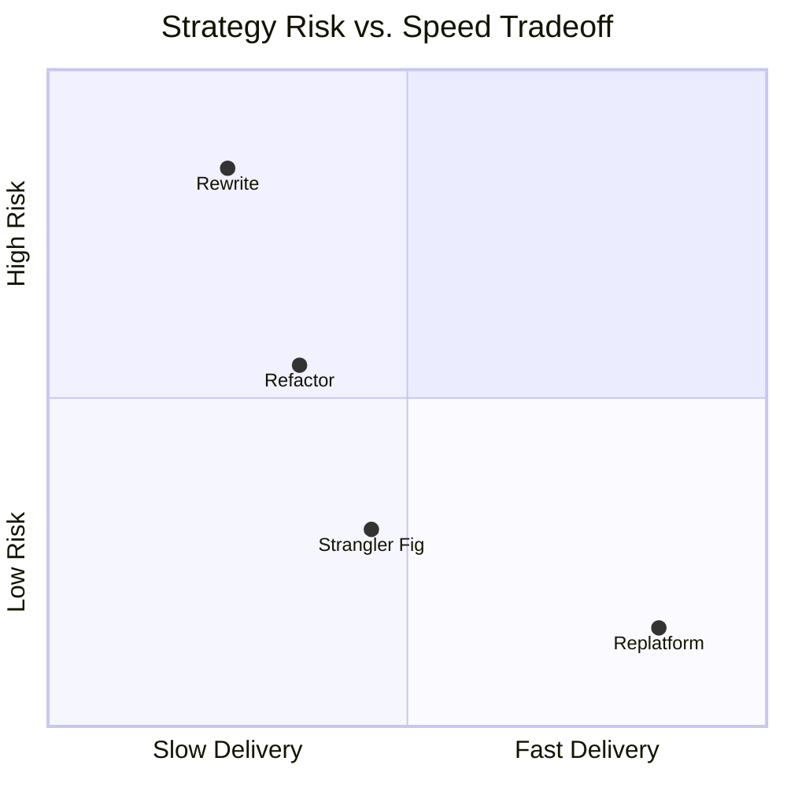
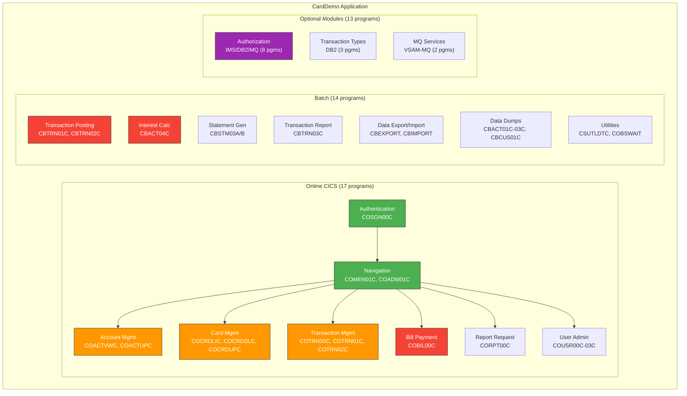
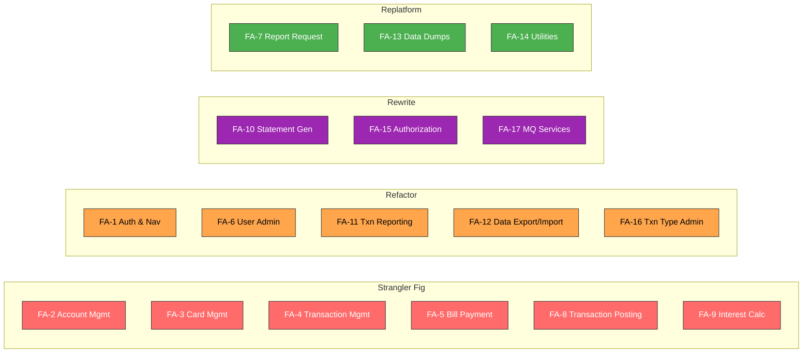
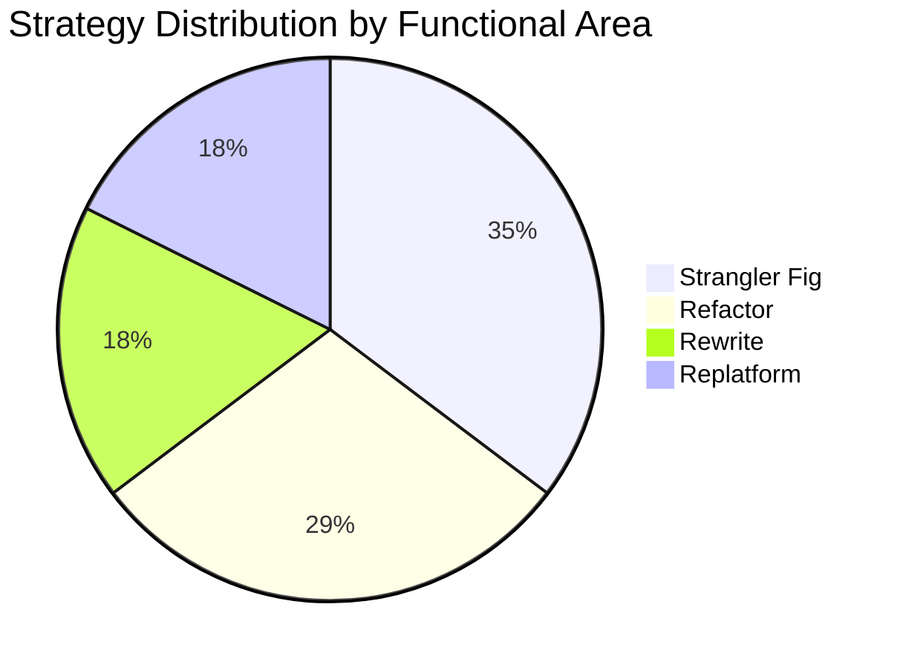
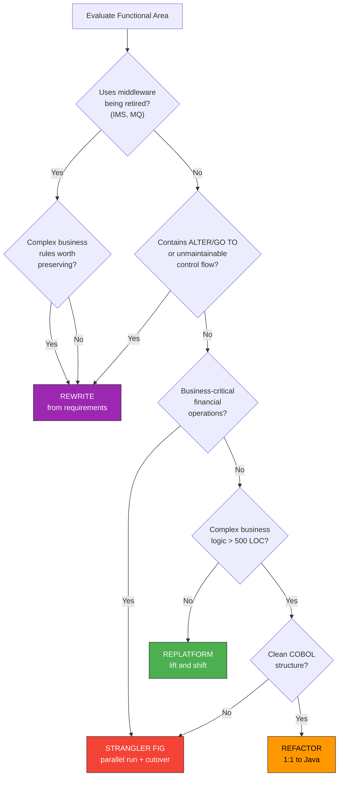
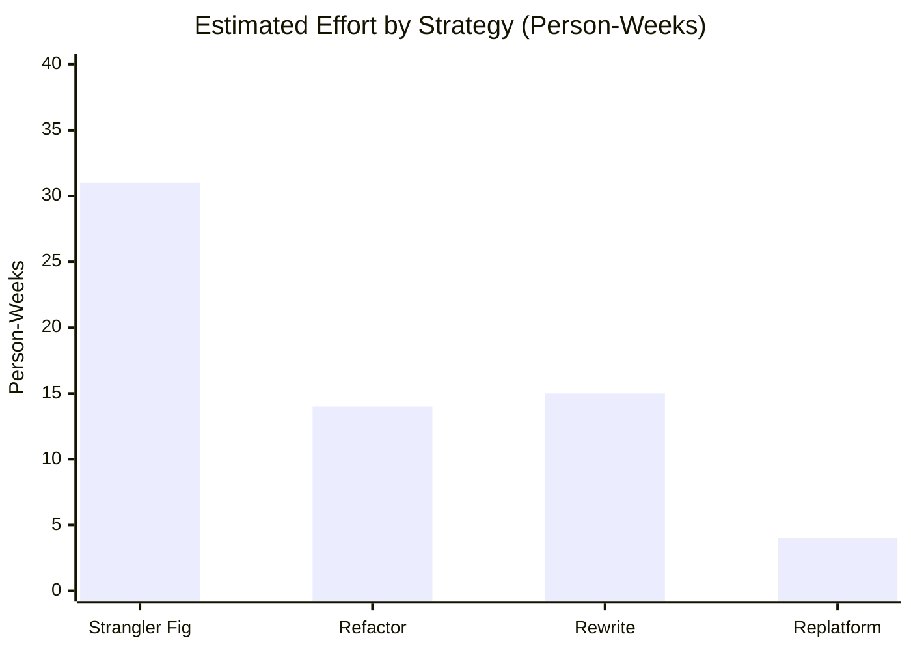
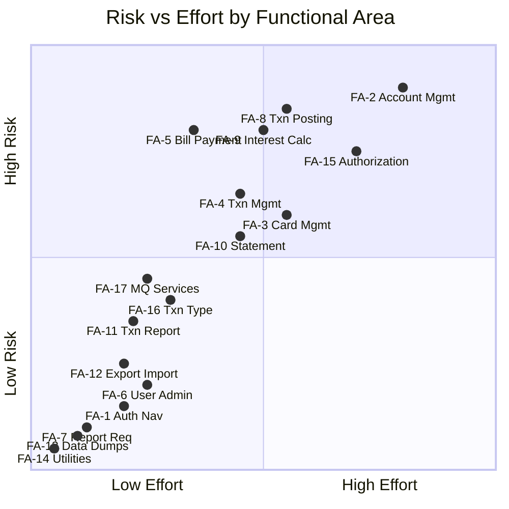
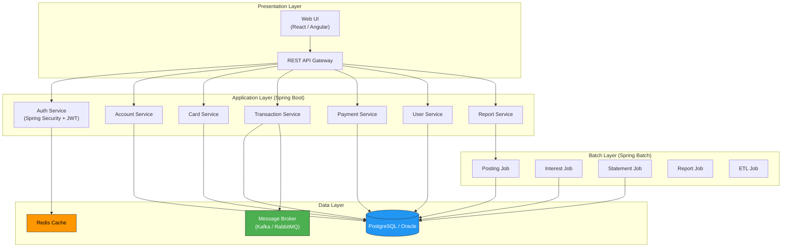

# Modernization Blueprint

> **CardDemo COBOL-to-Java Modernization Strategy Assessment**
>
> This document evaluates four modernization strategies (Strangler Fig, Replatform, Refactor, Rewrite) for each functional area of the CardDemo application. Recommendations are based on static analysis of 44 COBOL programs, 41 copybooks, 46 JCL jobs, and 21 BMS maps.

---

## Table of Contents

1. [Strategy Definitions](#strategy-definitions)
2. [Functional Area Inventory](#functional-area-inventory)
3. [Strategy Evaluation Matrix](#strategy-evaluation-matrix)
4. [Per-Area Strategy Recommendations](#per-area-strategy-recommendations)
5. [Strategy Decision Flowchart](#strategy-decision-flowchart)
6. [Effort and Risk Summary](#effort-and-risk-summary)
7. [Technology Stack Recommendations](#technology-stack-recommendations)
8. [Appendix: Strategy Comparison](#appendix-strategy-comparison)

---

## Strategy Definitions

| Strategy | Description | When to Use | Risk Level |
|----------|-------------|-------------|------------|
| **Strangler Fig** | Incrementally replace functionality behind an API facade; old and new coexist during transition | High-value areas where gradual cutover reduces risk; when business cannot tolerate downtime | Low-Medium |
| **Replatform** | Lift and shift with minimal code changes (e.g., COBOL on Linux, GnuCOBOL, or auto-converted Java) | When speed matters more than code quality; for low-complexity utilities or interim steps | Low |
| **Refactor** | Restructure COBOL logic into clean Java while preserving business rules 1:1 | When business rules are well-understood and must be preserved exactly; moderate complexity | Medium |
| **Rewrite** | Build new Java implementation from requirements, not from COBOL line-by-line | When COBOL is too tangled to refactor; when modernizing the business process itself | High |

### Mermaid: Strategy Risk-Speed Tradeoff

---

## Functional Area Inventory

### Mermaid: Functional Area Map

### Functional Areas

| # | Functional Area | Programs | LOC | Technology | Business Criticality |
|---|----------------|----------|-----|------------|---------------------|
| FA-1 | **Authentication & Navigation** | COSGN00C, COMEN01C, COADM01C | 856 | CICS, BMS, VSAM | Medium |
| FA-2 | **Account Management** | COACTVWC, COACTUPC | 5,178 | CICS, BMS, VSAM (4 files) | Critical |
| FA-3 | **Card Management** | COCRDLIC, COCRDSLC, COCRDUPC | 3,906 | CICS, BMS, VSAM, Alt Index | High |
| FA-4 | **Transaction Management** | COTRN00C, COTRN01C, COTRN02C | 1,812 | CICS, BMS, VSAM | Critical |
| FA-5 | **Bill Payment** | COBIL00C | 572 | CICS, BMS, VSAM | Critical |
| FA-6 | **User Administration** | COUSR00C, COUSR01C, COUSR02C, COUSR03C | 1,767 | CICS, BMS, VSAM | Medium |
| FA-7 | **Report Request** | CORPT00C | 649 | CICS, BMS | Low |
| FA-8 | **Transaction Posting** | CBTRN01C, CBTRN02C | 1,225 | Batch, VSAM (6 files) | Critical |
| FA-9 | **Interest Calculation** | CBACT04C | 652 | Batch, VSAM (5 files), Packed Decimal | Critical |
| FA-10 | **Statement Generation** | CBSTM03A, CBSTM03B | 1,154 | Batch, ALTER/GO TO, CALL | High |
| FA-11 | **Transaction Reporting** | CBTRN03C | 649 | Batch, VSAM, SORT, Report | Medium |
| FA-12 | **Data Export/Import** | CBEXPORT, CBIMPORT | 1,069 | Batch, VSAM (all files) | Medium |
| FA-13 | **Data Dump Utilities** | CBACT01C-03C, CBCUS01C | 964 | Batch, VSAM | Low |
| FA-14 | **System Utilities** | CSUTLDTC, COBSWAIT | 198 | Batch/Utility | Low |
| FA-15 | **Authorization Module** | COPAUA0C, COPAUS0C-2C, CBPAUP0C, + 3 | 4,498 | IMS DB, DB2, MQ, CICS | High |
| FA-16 | **Transaction Type Admin** | COTRTLIC, COTRTUPC, COBTUPDT | 4,037 | DB2, CICS, BMS | Medium |
| FA-17 | **MQ Services** | COACCT01, CODATE01 | 1,144 | MQ, VSAM | Medium |

---

## Strategy Evaluation Matrix

### Mermaid: Strategy Recommendation Overview

### Full Evaluation Matrix

| Functional Area | Strangler Fig | Replatform | Refactor | Rewrite | **Recommended** |
|----------------|:---:|:---:|:---:|:---:|:---:|
| FA-1 Auth & Navigation | Possible | Possible | **Best** | Overkill | **Refactor** |
| FA-2 Account Management | **Best** | Too risky | Possible | Too costly | **Strangler Fig** |
| FA-3 Card Management | **Best** | Too risky | Possible | Too costly | **Strangler Fig** |
| FA-4 Transaction Management | **Best** | Too risky | Possible | Too costly | **Strangler Fig** |
| FA-5 Bill Payment | **Best** | Too risky | Possible | Overkill | **Strangler Fig** |
| FA-6 User Administration | Possible | Possible | **Best** | Overkill | **Refactor** |
| FA-7 Report Request | Possible | **Best** | Overkill | Overkill | **Replatform** |
| FA-8 Transaction Posting | **Best** | Too risky | Possible | Too costly | **Strangler Fig** |
| FA-9 Interest Calculation | **Best** | Too risky | Possible | Too costly | **Strangler Fig** |
| FA-10 Statement Generation | Difficult | Difficult | Difficult | **Best** | **Rewrite** |
| FA-11 Transaction Reporting | Possible | Possible | **Best** | Overkill | **Refactor** |
| FA-12 Data Export/Import | Possible | Possible | **Best** | Overkill | **Refactor** |
| FA-13 Data Dump Utilities | Possible | **Best** | Overkill | Overkill | **Replatform** |
| FA-14 System Utilities | Possible | **Best** | Overkill | Overkill | **Replatform** |
| FA-15 Authorization Module | Difficult | Difficult | Difficult | **Best** | **Rewrite** |
| FA-16 Transaction Type Admin | Possible | Possible | **Best** | Overkill | **Refactor** |
| FA-17 MQ Services | Difficult | Difficult | Possible | **Best** | **Rewrite** |

### Strategy Distribution

---

## Per-Area Strategy Recommendations

### FA-1: Authentication & Navigation — REFACTOR

| Attribute | Value |
|-----------|-------|
| **Strategy** | Refactor |
| **Programs** | COSGN00C (260 LOC), COMEN01C (308 LOC), COADM01C (288 LOC) |
| **Effort** | 2-3 weeks |
| **Risk** | Low |
| **Rationale** | Clean CICS pseudo-conversational pattern maps directly to Spring Security + controller routing. COMMAREA-based navigation translates to session/JWT context. No complex business logic. |

**COBOL Pattern → Java Target:**
| COBOL | Java |
|-------|------|
| CICS HANDLE AID / DFHAID | Spring Security authentication filter |
| COMMAREA user context (COCOM01Y) | JWT token / Spring Security `SecurityContext` |
| XCTL to menu programs | Spring MVC `@RequestMapping` routing |
| BMS SEND MAP | Thymeleaf template / REST JSON response |
| VSAM READ on USRSEC | JPA `UserRepository.findByUsername()` |

**Key Risks:**
- Session state: COMMAREA is per-transaction; must design stateless JWT equivalent
- Menu routing: Dynamic XCTL target from COMEN02Y table must map to endpoint registry

---

### FA-2: Account Management — STRANGLER FIG

| Attribute | Value |
|-----------|-------|
| **Strategy** | Strangler Fig |
| **Programs** | COACTVWC (942 LOC), COACTUPC (4,237 LOC) |
| **Effort** | 6-8 weeks |
| **Risk** | High |
| **Rationale** | COACTUPC is the single most complex program (4,237 LOC, 164 IF statements, 10 EVALUATE, 51 GO TO). Strangler allows incremental replacement: view first, then update field-by-field behind an API facade. |

**Strangler Sequence:**
1. Deploy API facade that proxies to existing CICS transaction
2. Migrate COACTVWC (read-only view) behind the facade — validate data layer
3. Migrate COACTUPC validation logic field-by-field (SSN → phone → date → credit limit)
4. Cut over update operations once all fields validated
5. Retire CICS transaction

**COBOL Pattern → Java Target:**
| COBOL | Java |
|-------|------|
| VSAM READ on ACCTDAT, CUSTDAT, CARDAIX, CXACAIX | JPA `@Query` with JOIN across 4 tables |
| Field-level REWRITE | JPA `save()` with `@Valid` Bean Validation |
| EVALUATE TRUE (screen dispatch) | Controller method dispatch |
| Inline SSN/phone validation | `@Pattern` annotations + custom validators |

**Key Risks:**
- COACTUPC's 51 GO TO statements create non-linear control flow — requires careful flowcharting before refactoring
- Dual-write period during strangler: must ensure VSAM and relational DB stay consistent
- 164 IF branches require exhaustive test coverage before cutover

---

### FA-3: Card Management — STRANGLER FIG

| Attribute | Value |
|-----------|-------|
| **Strategy** | Strangler Fig |
| **Programs** | COCRDLIC (1,459 LOC), COCRDSLC (887 LOC), COCRDUPC (1,560 LOC) |
| **Effort** | 5-6 weeks |
| **Risk** | Medium-High |
| **Rationale** | COCRDLIC has complex VSAM BROWSE pagination with START/READNEXT that maps poorly to direct translation. Strangler allows building SQL pagination independently, then cutting over list/detail/update in sequence. |

**Strangler Sequence:**
1. Build REST API for card search/list with SQL pagination
2. Migrate COCRDSLC (read-only detail) — simplest
3. Migrate COCRDLIC browse → SQL `LIMIT/OFFSET`
4. Migrate COCRDUPC update with validation
5. Retire CICS transactions

**Key Risks:**
- VSAM alternate index (CARDAIX) pagination semantics differ from SQL — test edge cases
- COCRDLIC's 18 EVALUATE + 59 IF branches need comprehensive test matrix
- Card number masking rules must be preserved exactly

---

### FA-4: Transaction Management — STRANGLER FIG

| Attribute | Value |
|-----------|-------|
| **Strategy** | Strangler Fig |
| **Programs** | COTRN00C (699 LOC), COTRN01C (330 LOC), COTRN02C (783 LOC) |
| **Effort** | 4-5 weeks |
| **Risk** | High |
| **Rationale** | Transaction add (COTRN02C) performs multi-file validation and writes to TRANSACT — critical financial data. Strangler isolates the read path first, then wraps the write path in an API with equivalent validation. |

**Key Risks:**
- COTRN02C writes to TRANSACT file with cross-reference validation against ACCTDAT and CARDXREF
- Date validation calls CSUTLDTC — must ensure utility is migrated first (dependency)
- Transaction ID generation must be atomic

---

### FA-5: Bill Payment — STRANGLER FIG

| Attribute | Value |
|-----------|-------|
| **Strategy** | Strangler Fig |
| **Programs** | COBIL00C (572 LOC) |
| **Effort** | 3-4 weeks |
| **Risk** | Critical |
| **Rationale** | Financial transaction that reads account and writes both transaction record and updated account balance. Non-atomic dual writes in COBOL must become `@Transactional` in Java. Strangler allows validating the atomic version in parallel before cutover. |

**Key Risks:**
- COBOL performs VSAM READ + WRITE (transaction) + REWRITE (account balance) without a transaction manager — these can partially fail
- Java version must guarantee atomicity via `@Transactional`
- Balance calculation precision: COBOL packed decimal → Java `BigDecimal`

---

### FA-6: User Administration — REFACTOR

| Attribute | Value |
|-----------|-------|
| **Strategy** | Refactor |
| **Programs** | COUSR00C (695 LOC), COUSR01C (299 LOC), COUSR02C (414 LOC), COUSR03C (359 LOC) |
| **Effort** | 3-4 weeks |
| **Risk** | Low-Medium |
| **Rationale** | Standard CRUD pattern on a single VSAM file (USRSEC). Clean mapping to JPA repository + REST controller. No financial risk, no cross-file dependencies. |

**COBOL Pattern → Java Target:**
| COBOL | Java |
|-------|------|
| VSAM READ/WRITE/REWRITE/DELETE on USRSEC | JPA `CrudRepository<User, String>` |
| CICS BROWSE for user list | Spring Data pagination |
| BMS input validation | `@Valid` + Bean Validation |

---

### FA-7: Report Request — REPLATFORM

| Attribute | Value |
|-----------|-------|
| **Strategy** | Replatform |
| **Programs** | CORPT00C (649 LOC) |
| **Effort** | 1-2 weeks |
| **Risk** | Low |
| **Rationale** | CORPT00C is a thin UI wrapper that collects report parameters and submits a batch job. On the Java side, this becomes a simple REST endpoint that triggers a Spring Batch job. No complex business logic worth refactoring — direct replatform is fastest. |

---

### FA-8: Transaction Posting — STRANGLER FIG

| Attribute | Value |
|-----------|-------|
| **Strategy** | Strangler Fig |
| **Programs** | CBTRN01C (494 LOC), CBTRN02C (731 LOC) |
| **Effort** | 5-6 weeks |
| **Risk** | Critical |
| **Rationale** | Core batch processing that reads daily transactions, validates against cross-reference and account files, posts to the master transaction file, and writes rejects to a separate file. The most business-critical batch process — must run in parallel (old and new) to validate before cutover. |

**Strangler Sequence:**
1. Build Spring Batch job that reads same DALYTRAN input
2. Run both old and new in parallel; compare outputs
3. Once outputs match for N cycles, cut over to new
4. Retire COBOL batch job

**Key Risks:**
- CBTRN02C accesses 6 files simultaneously — atomicity across all must be preserved
- Category balance file (TCATBALF) updates must be idempotent
- CEE3ABD abend handler must map to Java exception handling with proper rollback

---

### FA-9: Interest Calculation — STRANGLER FIG

| Attribute | Value |
|-----------|-------|
| **Strategy** | Strangler Fig |
| **Programs** | CBACT04C (652 LOC) |
| **Effort** | 4-5 weeks |
| **Risk** | Critical |
| **Rationale** | Financial calculation using packed decimal arithmetic across 5 files. Rounding rules in COBOL (ROUNDED, ON SIZE ERROR) must produce identical results in Java `BigDecimal`. Strangler allows running both and comparing penny-for-penny. |

**Key Risks:**
- Packed decimal `COMP-3` arithmetic → `BigDecimal` with explicit `RoundingMode`
- Discount group (DISCGRP) rate lookups must match exactly
- Interest accrual date logic must handle leap years, month-end correctly

---

### FA-10: Statement Generation — REWRITE

| Attribute | Value |
|-----------|-------|
| **Strategy** | Rewrite |
| **Programs** | CBSTM03A (924 LOC), CBSTM03B (230 LOC) |
| **Effort** | 4-5 weeks |
| **Risk** | Medium-High |
| **Rationale** | CBSTM03A uses ALTER/GO TO (4 ALTER statements, 15 GO TO) to dynamically modify control flow — this is unmaintainable COBOL that cannot be mechanically translated. It also CALLs CBSTM03B 11 times for different formatting operations. The output format (HTML + text statements) should be rebuilt using a modern template engine. |

**Rewrite Approach:**
1. Reverse-engineer the statement format from output samples in `app/data/`
2. Build statement generation using Thymeleaf or JasperReports
3. Map CBSTM03B formatting calls to template helper methods
4. Validate output matches original format

**Key Risks:**
- ALTER statements make static analysis unreliable — must test with real data
- HTML output format must match exactly for regulatory compliance
- CBSTM03B is a stateful subroutine — calling sequence matters

---

### FA-11: Transaction Reporting — REFACTOR

| Attribute | Value |
|-----------|-------|
| **Strategy** | Refactor |
| **Programs** | CBTRN03C (649 LOC) |
| **Effort** | 2-3 weeks |
| **Risk** | Medium |
| **Rationale** | Reads transactions, cross-references, types, and categories; produces a formatted report. The SORT pre-step (in JCL) becomes SQL `ORDER BY`. Report formatting logic is procedural but straightforward — maps to a report library. |

---

### FA-12: Data Export/Import — REFACTOR

| Attribute | Value |
|-----------|-------|
| **Strategy** | Refactor |
| **Programs** | CBEXPORT (582 LOC), CBIMPORT (487 LOC) |
| **Effort** | 2-3 weeks |
| **Risk** | Low-Medium |
| **Rationale** | Sequential read of all VSAM files → single export file, and reverse. Logic is straightforward file I/O. Refactor to Spring Batch with CSV/JSON format instead of fixed-width. May be obsolete post-modernization if all data is in a relational DB. |

---

### FA-13: Data Dump Utilities — REPLATFORM

| Attribute | Value |
|-----------|-------|
| **Strategy** | Replatform |
| **Programs** | CBACT01C (430 LOC), CBACT02C (178 LOC), CBACT03C (178 LOC), CBCUS01C (178 LOC) |
| **Effort** | 1 week |
| **Risk** | Low |
| **Rationale** | Simple sequential reads that dump VSAM data to flat files. In the modernized system, these become SQL queries → CSV export. Minimal business logic. |

---

### FA-14: System Utilities — REPLATFORM

| Attribute | Value |
|-----------|-------|
| **Strategy** | Replatform |
| **Programs** | CSUTLDTC (157 LOC), COBSWAIT (41 LOC) |
| **Effort** | 1 week |
| **Risk** | Low |
| **Rationale** | CSUTLDTC maps directly to `java.time` APIs. COBSWAIT (calls MVSWAIT assembler) maps to `Thread.sleep()`. Trivial replatform. |

---

### FA-15: Authorization Module — REWRITE

| Attribute | Value |
|-----------|-------|
| **Strategy** | Rewrite |
| **Programs** | COPAUA0C (1,026 LOC), COPAUS0C (1,032 LOC), COPAUS1C (604 LOC), COPAUS2C (244 LOC), CBPAUP0C (386 LOC), DBUNLDGS (366 LOC), PAUDBLOD (369 LOC), PAUDBUNL (317 LOC) |
| **Effort** | 6-8 weeks |
| **Risk** | High |
| **Rationale** | Integrates three middleware technologies (IMS DB, DB2, MQ) that will all be replaced. MQ request/response pattern → REST APIs. IMS hierarchical DB → relational. DB2 queries → JPA. None of the middleware APIs survive migration, so refactoring the COBOL line-by-line is pointless. Rewrite from business requirements. |

**Key Risks:**
- IMS DB hierarchical data model must be denormalized to relational
- MQ message formats must be documented before retirement
- Fraud marking workflow (COPAUS2C) has compliance implications

---

### FA-16: Transaction Type Admin — REFACTOR

| Attribute | Value |
|-----------|-------|
| **Strategy** | Refactor |
| **Programs** | COTRTLIC (2,098 LOC), COTRTUPC (1,702 LOC), COBTUPDT (237 LOC) |
| **Effort** | 3-4 weeks |
| **Risk** | Medium |
| **Rationale** | Already uses DB2 with embedded SQL (28 EXEC SQL total). SQL statements can be extracted directly to JPA/JDBC. CICS UI layer refactors to REST. This is the easiest optional module to migrate because it's already relational. |

---

### FA-17: MQ Services — REWRITE

| Attribute | Value |
|-----------|-------|
| **Strategy** | Rewrite |
| **Programs** | COACCT01 (620 LOC), CODATE01 (524 LOC) |
| **Effort** | 2-3 weeks |
| **Risk** | Medium |
| **Rationale** | MQ request/response programs that provide account inquiry and system date services. The MQ infrastructure (MQOPEN, MQGET, MQPUT, MQCLOSE) will be replaced entirely by REST APIs or a modern message broker (Kafka, RabbitMQ). Rewrite as REST endpoints. |

---

## Strategy Decision Flowchart

### Mermaid: Decision Tree for Strategy Selection

---

## Effort and Risk Summary

### Mermaid: Effort by Strategy (Person-Weeks)

### Effort Summary Table

| Strategy | Areas | Total LOC | Effort (person-weeks) | Risk Profile |
|----------|-------|-----------|-----------------------|--------------|
| **Strangler Fig** | 6 areas | 12,568 | 27-34 | High (financial ops require parallel run) |
| **Refactor** | 5 areas | 8,752 | 12-17 | Medium (1:1 translation with testing) |
| **Rewrite** | 3 areas | 5,796 | 12-16 | High (new code, must reverse-engineer requirements) |
| **Replatform** | 3 areas | 1,811 | 3-4 | Low (minimal logic change) |
| **Total** | **17 areas** | **28,927** | **54-71** | — |

### Mermaid: Risk Heat Map by Functional Area

---

## Technology Stack Recommendations

### Mermaid: Target Architecture

### Technology Mapping

| COBOL Technology | Java Target | Notes |
|-----------------|-------------|-------|
| CICS online transactions | Spring Boot REST controllers | Pseudo-conversational → stateless REST |
| BMS 3270 screen maps | React/Angular SPA or Thymeleaf | 17 BMS maps → web forms |
| VSAM KSDS files | PostgreSQL/Oracle tables | 8 VSAM files → 8+ tables |
| VSAM alternate indexes | Database secondary indexes | CARDAIX, CXACAIX → DB indexes |
| Copybook record layouts | JPA `@Entity` classes | 30 copybooks → Java POJOs |
| JCL batch jobs | Spring Batch jobs | 38 JCL jobs → Spring Batch configurations |
| SORT utility | SQL `ORDER BY` | JCL SORT steps eliminated |
| IDCAMS (VSAM admin) | Flyway/Liquibase migrations | Schema management |
| COBOL packed decimal | `java.math.BigDecimal` | Explicit rounding mode required |
| COBOL PERFORM | Java method calls | Section/paragraph → method |
| COBOL EVALUATE | Java switch/if-else | Direct mapping |
| COBOL ALTER/GO TO | State machine or strategy pattern | Requires rewrite |
| COMMAREA | JWT / Spring Session | Per-transaction → per-session |
| CEE3ABD (abend handler) | Java exception handling | `try/catch` with rollback |
| MQ (MQOPEN/GET/PUT) | REST API or Kafka producer/consumer | Full replacement |
| IMS DB (DL/I) | JPA with relational schema | Hierarchical → relational |
| DB2 embedded SQL | Spring Data JPA / JDBC | Mostly direct extraction |

---

## Appendix: Strategy Comparison

### Pros and Cons for CardDemo

| Strategy | Pros | Cons | Best For |
|----------|------|------|----------|
| **Strangler Fig** | Lowest cutover risk; parallel validation; incremental delivery | Longest overall timeline; requires maintaining two systems; sync complexity | Financial operations (FA-2, -4, -5, -8, -9) |
| **Replatform** | Fastest; lowest effort; minimal testing | No modernization benefit; technical debt remains; mainframe dependencies may linger | Utilities and dumps (FA-7, -13, -14) |
| **Refactor** | Preserves proven business logic; moderate risk; clean Java output | Requires deep COBOL understanding; 1:1 bugs may be preserved | Well-structured CRUD (FA-1, -6, -11, -12, -16) |
| **Rewrite** | Clean modern architecture; eliminates all technical debt | Highest risk of missed requirements; most expensive to test | Middleware-dependent or ALTER/GO TO code (FA-10, -15, -17) |

---

*Generated by static analysis of the CardDemo COBOL codebase. Strategy recommendations are based on code complexity metrics, technology dependencies, and business criticality assessment. All effort estimates assume a team familiar with both COBOL and Java/Spring.*
