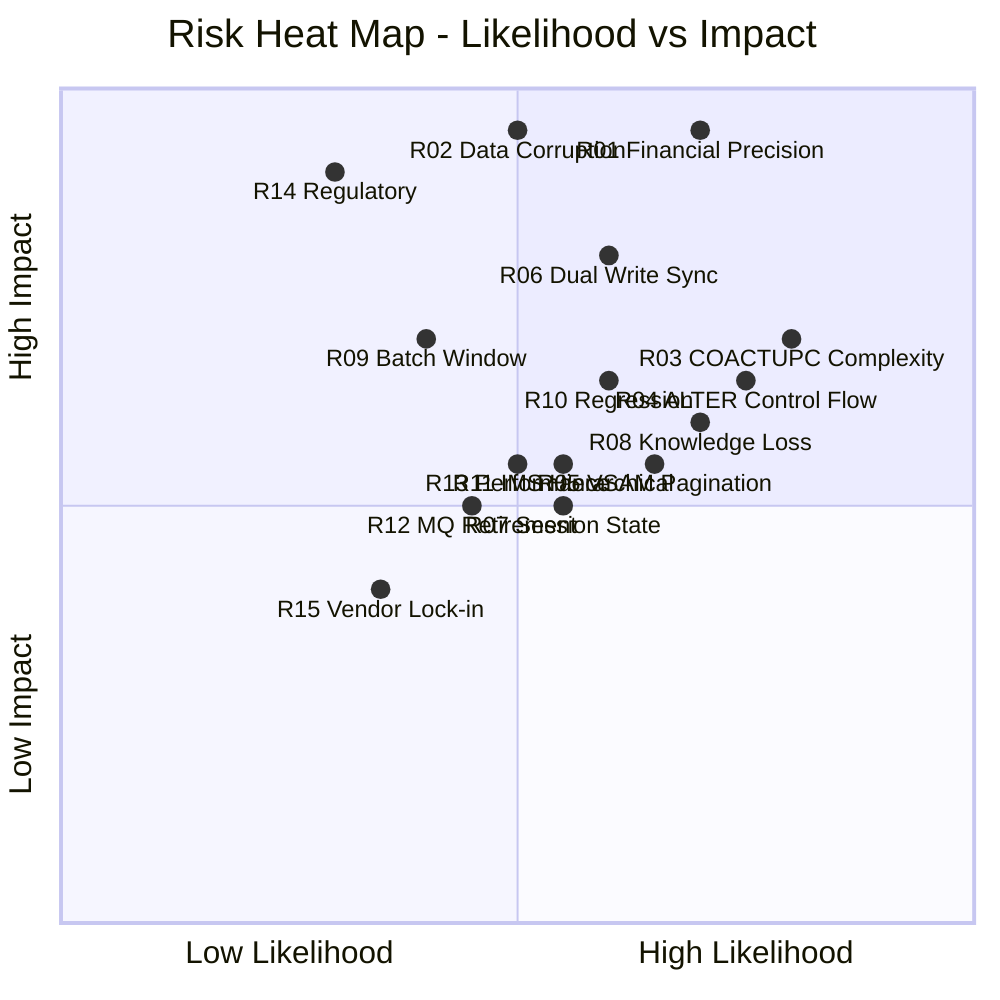
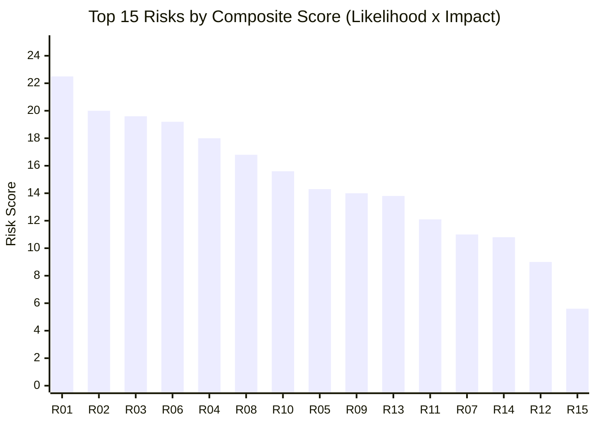
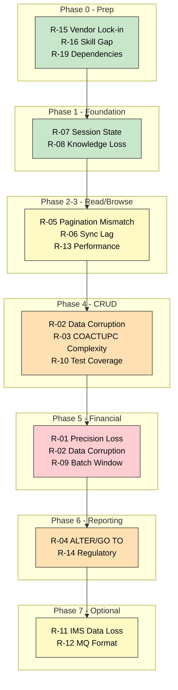
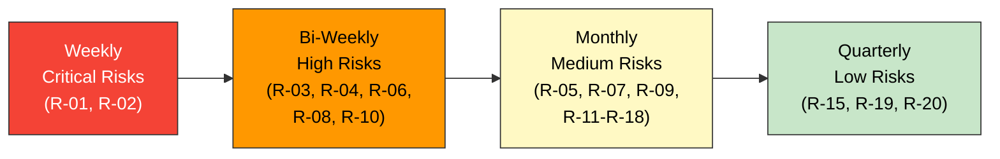

# Risk Register

> **CardDemo COBOL-to-Java Modernization Risk Assessment**
>
> This document catalogs the top risks for migrating the CardDemo application from COBOL/CICS/VSAM to Java/Spring Boot/PostgreSQL, with likelihood/impact scoring, mitigation strategies, and contingency plans. Risks are ordered by composite risk score (likelihood × impact).

---

## Table of Contents

1. [Risk Summary Dashboard](#risk-summary-dashboard)
2. [Risk Scoring Methodology](#risk-scoring-methodology)
3. [Top 20 Risks](#top-20-risks)
4. [Risk Detail](#risk-detail)
5. [Risk by Migration Phase](#risk-by-migration-phase)
6. [Risk Monitoring Plan](#risk-monitoring-plan)
7. [Appendix: Risk Category Definitions](#appendix-risk-category-definitions)

---

## Risk Summary Dashboard

### Mermaid: Risk Heat Map



### Risk Score Summary



### Summary Table

| ID | Risk | Category | Likelihood | Impact | Score | Phase | Status |
|----|------|----------|:----------:|:------:|:-----:|:-----:|:------:|
| R-01 | Financial calculation precision loss | Technical | 4.5/5 | 5.0/5 | **22.5** | 5 | Open |
| R-02 | Data corruption during dual-write transition | Technical | 4.0/5 | 5.0/5 | **20.0** | 4-5 | Open |
| R-03 | COACTUPC complexity exceeds team capacity | Technical | 4.5/5 | 4.5/5 | **19.6** | 4 | Open |
| R-06 | VSAM-to-DB sync lag causes inconsistencies | Technical | 4.0/5 | 4.5/5 | **19.2** | 2-5 | Open |
| R-04 | ALTER/GO TO control flow mistranslation | Technical | 4.0/5 | 4.5/5 | **18.0** | 6 | Open |
| R-08 | COBOL knowledge loss during migration | People | 4.5/5 | 3.5/5 | **16.8** | All | Open |
| R-10 | Insufficient regression test coverage | Process | 3.5/5 | 4.5/5 | **15.6** | All | Open |
| R-05 | VSAM browse pagination semantic mismatch | Technical | 3.5/5 | 4.0/5 | **14.3** | 3 | Open |
| R-09 | Batch processing window exceeded | Technical | 3.0/5 | 4.5/5 | **14.0** | 5-6 | Open |
| R-13 | Online transaction performance degradation | Technical | 3.5/5 | 4.0/5 | **13.8** | 2-4 | Open |
| R-11 | IMS hierarchical-to-relational data loss | Technical | 3.0/5 | 4.0/5 | **12.1** | 7 | Open |
| R-07 | CICS session state incompatibility | Technical | 3.5/5 | 3.0/5 | **11.0** | 1 | Open |
| R-14 | Regulatory non-compliance (statement format) | Business | 2.0/5 | 5.0/5 | **10.8** | 6 | Open |
| R-12 | MQ message format undocumented | Technical | 3.0/5 | 3.0/5 | **9.0** | 7 | Open |
| R-15 | Vendor/platform lock-in | Strategic | 2.0/5 | 2.5/5 | **5.6** | 0 | Open |
| R-16 | Team skill gap (COBOL reading) | People | 3.5/5 | 3.5/5 | **12.3** | All | Open |
| R-17 | Scope creep from business enhancements | Process | 3.5/5 | 3.0/5 | **10.5** | All | Open |
| R-18 | Mainframe access constraints | Process | 3.0/5 | 3.5/5 | **10.5** | All | Open |
| R-19 | Third-party dependency vulnerabilities | Technical | 2.5/5 | 3.0/5 | **7.5** | 0-1 | Open |
| R-20 | Organizational resistance to change | People | 2.5/5 | 3.0/5 | **7.5** | All | Open |

---

## Risk Scoring Methodology

| Dimension | 1 (Very Low) | 2 (Low) | 3 (Medium) | 4 (High) | 5 (Very High) |
|-----------|:---:|:---:|:---:|:---:|:---:|
| **Likelihood** | < 10% chance | 10-25% | 25-50% | 50-75% | > 75% |
| **Impact** | Cosmetic issue | Minor delay (< 1 week) | Moderate delay (1-3 weeks) | Major delay (> 3 weeks) or data issue | Project failure or data loss |

**Composite Score** = Likelihood × Impact (max 25)

| Score Range | Severity | Action Required |
|:-----------:|----------|-----------------|
| 20-25 | **Critical** | Immediate mitigation required; weekly review |
| 15-19.9 | **High** | Active mitigation; bi-weekly review |
| 10-14.9 | **Medium** | Planned mitigation; monthly review |
| 5-9.9 | **Low** | Monitor; quarterly review |
| 0-4.9 | **Minimal** | Accept; no active mitigation |

---

## Top 20 Risks

### Risk Detail

#### R-01: Financial Calculation Precision Loss

| Attribute | Value |
|-----------|-------|
| **Category** | Technical |
| **Phase** | Phase 5 (Financial Operations) |
| **Score** | **22.5** (Critical) — Likelihood: 4.5, Impact: 5.0 |
| **Affected Programs** | CBACT04C (interest calc), COBIL00C (bill payment), CBTRN02C (posting) |
| **Description** | COBOL packed decimal (COMP-3) arithmetic with ROUNDED and ON SIZE ERROR has specific rounding behavior that may differ from Java BigDecimal defaults. A single rounding difference can cascade across thousands of accounts, causing material financial discrepancies. |

**Root Cause Analysis:**
- COBOL `COMPUTE X ROUNDED = A * B / C` uses intermediate precision rules that differ from `BigDecimal` default behavior
- COBOL truncation vs Java rounding for division operations
- COMP-3 internal representation differences for edge cases (negative zero, maximum values)
- Interest calculation over 365 vs 360-day year conventions may be implicit in COBOL

**Mitigation Strategies:**
| # | Strategy | Owner | Timeline | Cost |
|---|----------|-------|----------|------|
| M1 | Build precision comparison test suite: run identical calculations in COBOL and Java, compare at each intermediate step | QA | Phase 0 | Medium |
| M2 | Configure BigDecimal with explicit `MathContext` matching COBOL precision (typically `DECIMAL64` or `DECIMAL128`) | Dev | Phase 5 | Low |
| M3 | Parallel-run minimum 3 billing cycles with penny-exact comparison across ALL accounts | QA | Phase 5 | High |
| M4 | Engage COBOL financial SME to document rounding rules in CBACT04C | Dev | Phase 0 | Medium |

**Contingency Plan:**
If precision mismatches are discovered after cutover:
1. Immediate rollback to COBOL batch (feature flag)
2. Reconciliation job to identify and correct affected accounts
3. Root cause: analyze specific BigDecimal operation causing mismatch
4. Fix and re-run parallel comparison

**Indicators (Early Warning):**
- Any mismatch > $0.00 in parallel-run comparison
- Different reject counts between COBOL and Java batch runs
- Interest accrual totals differ at account level

---

#### R-02: Data Corruption During Dual-Write Transition

| Attribute | Value |
|-----------|-------|
| **Category** | Technical |
| **Phase** | Phase 4-5 (CRUD + Financial) |
| **Score** | **20.0** (Critical) — Likelihood: 4.0, Impact: 5.0 |
| **Affected Programs** | COACTUPC, COCRDUPC, COTRN02C, COBIL00C |
| **Description** | During the strangler fig transition, both COBOL (writing to VSAM) and Java (writing to PostgreSQL) may process concurrent updates. If the sync pipeline lags or fails, data diverges between the two systems, causing phantom transactions, lost updates, or balance inconsistencies. |

**Root Cause Analysis:**
- VSAM-to-DB sync pipeline has inherent latency (even at < 30 seconds)
- Concurrent writes to the same account from COBOL and Java can conflict
- No distributed transaction manager spanning VSAM and PostgreSQL
- COBOL does not publish events — sync is poll-based

**Mitigation Strategies:**
| # | Strategy | Owner | Timeline | Cost |
|---|----------|-------|----------|------|
| M1 | Implement write-through API facade: ALL writes go through Java service, which writes to DB and pushes to VSAM via sync | Dev | Phase 4 | High |
| M2 | Add optimistic locking with version fields to all entities | Dev | Phase 1 | Low |
| M3 | Build reconciliation job: nightly compare VSAM vs DB for all accounts | Dev | Phase 2 | Medium |
| M4 | Route writes to single system (not both) per entity; use feature flags per entity type | Dev | Phase 4 | Medium |

**Contingency Plan:**
If data corruption is detected:
1. Halt all writes (emergency read-only mode)
2. Run reconciliation job to identify divergent records
3. Determine source of truth (VSAM or DB based on timestamp)
4. Replay corrected data to the lagging system
5. Resume writes after root cause fixed

---

#### R-03: COACTUPC Complexity Exceeds Team Capacity

| Attribute | Value |
|-----------|-------|
| **Category** | Technical |
| **Phase** | Phase 4 (CRUD Operations) |
| **Score** | **19.6** (High) — Likelihood: 4.5, Impact: 4.5 |
| **Affected Programs** | COACTUPC (4,237 LOC, 164 IF, 51 GO TO, 10 EVALUATE, 5 CICS READ, 64 PERFORM) |
| **Description** | COACTUPC is 2.7x larger than the next largest core program. Its non-linear control flow (51 GO TO), deep nested validation, and multi-file operations make it the single hardest program to migrate correctly. The team may underestimate the effort, leading to schedule overruns or incomplete migration. |

**Mitigation Strategies:**
| # | Strategy | Owner | Timeline | Cost |
|---|----------|-------|----------|------|
| M1 | Decompose COACTUPC into sub-functions BEFORE migration: map each validation block, each screen section, each file operation as a separate work item | Dev | Phase 3 | Medium |
| M2 | Allocate 2x the normal effort estimate for COACTUPC (4 weeks instead of 2) | PM | Phase 4 | Medium |
| M3 | Assign senior developer with COBOL experience to COACTUPC specifically | PM | Phase 4 | Low |
| M4 | Build comprehensive test suite from COACTUPC's 164 IF branches BEFORE starting migration | QA | Phase 3 | High |

**Contingency Plan:**
If COACTUPC migration falls behind schedule:
1. Split into "Account Update Lite" (basic fields only) and "Account Update Full" (all fields)
2. Deploy Lite version first to unblock Phase 5
3. Continue Full version as Phase 4b running parallel to Phase 5

---

#### R-04: ALTER/GO TO Control Flow Mistranslation

| Attribute | Value |
|-----------|-------|
| **Category** | Technical |
| **Phase** | Phase 6 (Reporting — Statement Generation) |
| **Score** | **18.0** (High) — Likelihood: 4.0, Impact: 4.5 |
| **Affected Programs** | CBSTM03A (4 ALTER, 15 GO TO), CBSTM03B (13 GO TO) |
| **Description** | CBSTM03A uses ALTER statements to dynamically change GO TO targets at runtime. This creates control flow that cannot be determined by static analysis alone — the actual execution path depends on runtime state. Any automated or manual translation risks missing dynamic branch targets. |

**Root Cause Analysis:**
```cobol
*  Example of ALTER pattern in CBSTM03A:
   ALTER PARAGRAPH-A TO PROCEED TO PARAGRAPH-B.
   ...
   PARAGRAPH-A.
       GO TO PARAGRAPH-C.   ← This target changes at runtime
```
- Static analysis sees `GO TO PARAGRAPH-C` but at runtime it goes to `PARAGRAPH-B`
- Multiple ALTER statements can chain, creating state-dependent control flow
- No equivalent construct in Java — must be reverse-engineered to state machine

**Mitigation Strategies:**
| # | Strategy | Owner | Timeline | Cost |
|---|----------|-------|----------|------|
| M1 | Trace CBSTM03A execution with instrumented COBOL on mainframe to capture actual control flow paths | Dev | Phase 0 | Medium |
| M2 | Rewrite (not refactor) CBSTM03A using template engine approach (Thymeleaf / JasperReports) | Dev | Phase 6 | Medium |
| M3 | Use golden file comparison: generate statements with COBOL, compare against Java output character-by-character | QA | Phase 6 | Medium |
| M4 | Document all ALTER targets and their triggering conditions in a state transition table | Dev | Phase 3 | Low |

**Contingency Plan:**
If statement output doesn't match after rewrite:
1. Keep COBOL statement generation running as batch job
2. Gradually replace sections (header, detail lines, totals) independently
3. Each section validated before moving to the next

---

#### R-05: VSAM Browse Pagination Semantic Mismatch

| Attribute | Value |
|-----------|-------|
| **Category** | Technical |
| **Phase** | Phase 3 (List/Browse) |
| **Score** | **14.3** (Medium) — Likelihood: 3.5, Impact: 4.0 |
| **Affected Programs** | COCRDLIC (card list), COTRN00C (transaction list), COUSR00C (user list) |
| **Description** | VSAM BROWSE (START/READNEXT) maintains a cursor position that advances sequentially through the KSDS. SQL pagination (LIMIT/OFFSET or keyset) has different semantics for concurrent modifications: a VSAM browse sees records inserted/deleted during browse, while SQL snapshot isolation does not. This can cause records to appear or disappear between pages differently. |

**Mitigation Strategies:**
| # | Strategy | Owner | Timeline | Cost |
|---|----------|-------|----------|------|
| M1 | Use keyset pagination (WHERE key > :lastKey) instead of OFFSET to minimize insertion sensitivity | Dev | Phase 3 | Low |
| M2 | Build pagination comparison test: browse VSAM and query SQL simultaneously, compare page contents | QA | Phase 3 | Medium |
| M3 | Document acceptable differences: if a record is added between page loads, it's acceptable for it to appear on the next page request | Dev/Business | Phase 3 | Low |

---

#### R-06: VSAM-to-DB Sync Lag Causes Inconsistencies

| Attribute | Value |
|-----------|-------|
| **Category** | Technical |
| **Phase** | Phase 2-5 |
| **Score** | **19.2** (High) — Likelihood: 4.0, Impact: 4.5 |
| **Description** | The data sync pipeline between VSAM and PostgreSQL introduces latency. During this window, Java reads stale data. For read-only operations (Phase 2-3) this is cosmetic, but for financial operations (Phase 5) it can cause incorrect calculations. |

**Mitigation Strategies:**
| # | Strategy | Owner | Timeline | Cost |
|---|----------|-------|----------|------|
| M1 | Target < 30 second sync lag for Phase 2-3; < 5 second for Phase 4-5 | DevOps | Phase 2 | Medium |
| M2 | Add sync lag monitoring with alerts when lag exceeds threshold | DevOps | Phase 2 | Low |
| M3 | For financial operations: read directly from VSAM (via CICS API) until fully cut over | Dev | Phase 5 | Medium |
| M4 | Implement eventual consistency acknowledgment in UI ("data as of: HH:MM:SS") | Dev | Phase 2 | Low |

---

#### R-07: CICS Session State Incompatibility

| Attribute | Value |
|-----------|-------|
| **Category** | Technical |
| **Phase** | Phase 1 (Foundation) |
| **Score** | **11.0** (Medium) — Likelihood: 3.5, Impact: 3.0 |
| **Description** | CICS pseudo-conversational programming stores state in COMMAREA between transactions. Each XCTL/RETURN passes a fixed-size communication area. JWT/session-based web apps handle state differently — session timeout, concurrent sessions, and back-button behavior all differ. |

**Mitigation Strategies:**
| # | Strategy | Owner | Timeline | Cost |
|---|----------|-------|----------|------|
| M1 | Map all COMMAREA fields (COCOM01Y) to JWT claims or session attributes | Dev | Phase 1 | Low |
| M2 | Implement session timeout matching CICS transaction timeout (default 30 min) | Dev | Phase 1 | Low |
| M3 | Handle browser back-button with POST-REDIRECT-GET pattern | Dev | Phase 1 | Low |

---

#### R-08: COBOL Knowledge Loss During Migration

| Attribute | Value |
|-----------|-------|
| **Category** | People |
| **Phase** | All phases |
| **Score** | **16.8** (High) — Likelihood: 4.5, Impact: 3.5 |
| **Description** | COBOL expertise is scarce and declining. If key team members with COBOL reading ability leave during the 12+ month migration, remaining team members may be unable to accurately interpret complex business logic, leading to mistranslation. |

**Mitigation Strategies:**
| # | Strategy | Owner | Timeline | Cost |
|---|----------|-------|----------|------|
| M1 | Document business rules extracted from each program as it's migrated (create "COBOL intent" comments in Java code) | Dev | All phases | Low |
| M2 | Record video walkthroughs of complex programs (COACTUPC, CBTRN02C, CBACT04C) | Dev | Phase 0-1 | Low |
| M3 | Ensure at least 2 team members can read any given COBOL program (no single point of failure) | PM | All phases | Medium |
| M4 | Use AI-assisted COBOL analysis tools for initial translation drafts | Dev | All phases | Medium |

---

#### R-09: Batch Processing Window Exceeded

| Attribute | Value |
|-----------|-------|
| **Category** | Technical |
| **Phase** | Phase 5-6 (Financial + Reporting) |
| **Score** | **14.0** (Medium) — Likelihood: 3.0, Impact: 4.5 |
| **Description** | COBOL batch jobs run within defined batch windows (typically overnight). Spring Batch jobs may run slower due to JVM overhead, JDBC round-trips (vs VSAM direct I/O), and lack of mainframe I/O optimization. If batch jobs exceed their window, they delay online availability. |

**Mitigation Strategies:**
| # | Strategy | Owner | Timeline | Cost |
|---|----------|-------|----------|------|
| M1 | Benchmark Spring Batch job performance against COBOL during Phase 0 (with representative data volumes) | Dev | Phase 0 | Medium |
| M2 | Use chunk-based processing with configurable commit intervals | Dev | Phase 5 | Low |
| M3 | Implement parallel chunk processing (Spring Batch partitioning) for large files | Dev | Phase 5 | Medium |
| M4 | If needed: use PostgreSQL COPY for bulk loads instead of row-by-row JPA inserts | Dev | Phase 5 | Low |

---

#### R-10: Insufficient Regression Test Coverage

| Attribute | Value |
|-----------|-------|
| **Category** | Process |
| **Phase** | All phases |
| **Score** | **15.6** (High) — Likelihood: 3.5, Impact: 4.5 |
| **Description** | The existing COBOL codebase has no automated tests. The Java replacement needs comprehensive test coverage to catch behavioral differences, but building tests requires deep understanding of each program's expected behavior — which is only documented in the COBOL code itself. |

**Mitigation Strategies:**
| # | Strategy | Owner | Timeline | Cost |
|---|----------|-------|----------|------|
| M1 | Build "golden file" test suites: capture COBOL inputs/outputs for each program and use as Java test data | QA | Phase 0 | High |
| M2 | Target > 90% line coverage for migrated Java code | Dev | All phases | Medium |
| M3 | Use property-based testing for financial calculations (generate random inputs, compare COBOL vs Java) | QA | Phase 5 | Medium |
| M4 | Implement integration tests that exercise end-to-end flows (not just unit tests) | QA | Phase 2+ | Medium |

---

#### R-11: IMS Hierarchical-to-Relational Data Loss

| Attribute | Value |
|-----------|-------|
| **Category** | Technical |
| **Phase** | Phase 7 (Optional — Authorization Module) |
| **Score** | **12.1** (Medium) — Likelihood: 3.0, Impact: 4.0 |
| **Description** | The Authorization module (BC-8) uses IMS DB with a hierarchical data model. Converting hierarchical segments to relational tables may lose implicit relationships, ordering constraints, or parent-child navigation patterns that the COBOL code relies on. |

**Mitigation Strategies:**
| # | Strategy | Owner | Timeline | Cost |
|---|----------|-------|----------|------|
| M1 | Document IMS segment hierarchy and access paths before migration | Dev | Phase 6 | Medium |
| M2 | Use database views to provide hierarchical-like access patterns on relational schema | Dev | Phase 7 | Low |
| M3 | Validate authorization decisions against known test cases from production | QA | Phase 7 | Medium |

---

#### R-12: MQ Message Format Undocumented

| Attribute | Value |
|-----------|-------|
| **Category** | Technical |
| **Phase** | Phase 7 (Optional) |
| **Score** | **9.0** (Low) — Likelihood: 3.0, Impact: 3.0 |
| **Description** | The MQ message formats used by COPAUA0C, COACCT01, and CODATE01 are defined in COBOL copybooks and Working-Storage. If these formats are not fully documented before MQ retirement, the replacement REST APIs may miss fields or use incorrect data types. |

**Mitigation Strategies:**
| # | Strategy | Owner | Timeline | Cost |
|---|----------|-------|----------|------|
| M1 | Extract MQ message schemas from COBOL Working-Storage sections before migration | Dev | Phase 6 | Low |
| M2 | Capture sample MQ messages from production for validation | Dev | Phase 6 | Low |
| M3 | Design REST API contracts (OpenAPI) that cover all MQ message fields | Dev | Phase 7 | Low |

---

#### R-13: Online Transaction Performance Degradation

| Attribute | Value |
|-----------|-------|
| **Category** | Technical |
| **Phase** | Phase 2-4 |
| **Score** | **13.8** (Medium) — Likelihood: 3.5, Impact: 4.0 |
| **Description** | CICS transactions are optimized for sub-second response on mainframe. Java REST endpoints accessing PostgreSQL may have higher latency due to JVM cold starts, connection pooling, N+1 queries, and network round-trips. Users accustomed to mainframe response times may perceive degradation. |

**Mitigation Strategies:**
| # | Strategy | Owner | Timeline | Cost |
|---|----------|-------|----------|------|
| M1 | Establish CICS response time baseline for each transaction (e.g., account view < 200ms) | DevOps | Phase 0 | Low |
| M2 | Use connection pooling (HikariCP) and query optimization from Phase 1 | Dev | Phase 1 | Low |
| M3 | Avoid N+1 queries: use JPA `@EntityGraph` or explicit JOIN FETCH for multi-table reads | Dev | Phase 2 | Low |
| M4 | Implement Redis caching for frequently-read reference data (transaction types, categories) | Dev | Phase 3 | Medium |
| M5 | Performance test: each endpoint must respond within 120% of CICS baseline | QA | Phase 2+ | Medium |

---

#### R-14: Regulatory Non-Compliance (Statement Format)

| Attribute | Value |
|-----------|-------|
| **Category** | Business |
| **Phase** | Phase 6 (Reporting) |
| **Score** | **10.8** (Medium) — Likelihood: 2.0, Impact: 5.0 |
| **Description** | Credit card statements (CBSTM03A/B) may be subject to regulatory requirements (TILA, Reg Z) dictating specific disclosure formats, APR displays, and minimum payment calculations. If the Java rewrite changes the statement format, it could cause compliance violations. |

**Mitigation Strategies:**
| # | Strategy | Owner | Timeline | Cost |
|---|----------|-------|----------|------|
| M1 | Obtain regulatory requirements documentation before rewriting statements | Business/Legal | Phase 0 | Low |
| M2 | Pixel-level comparison of statement PDF output (COBOL vs Java) | QA | Phase 6 | Medium |
| M3 | Legal/compliance review of new statement format before production cutover | Legal | Phase 6 | Low |

---

#### R-15: Vendor/Platform Lock-in

| Attribute | Value |
|-----------|-------|
| **Category** | Strategic |
| **Phase** | Phase 0 (Architecture) |
| **Score** | **5.6** (Low) — Likelihood: 2.0, Impact: 2.5 |
| **Description** | Choosing a specific cloud provider, database, or framework creates new dependencies that may constrain future flexibility. |

**Mitigation Strategies:**
| # | Strategy | Owner | Timeline | Cost |
|---|----------|-------|----------|------|
| M1 | Use standard JPA (not proprietary extensions) for database access | Dev | Phase 1 | Low |
| M2 | Containerize all services (Docker/K8s) for cloud portability | DevOps | Phase 0 | Low |
| M3 | Avoid cloud-specific services (use PostgreSQL, not Aurora Serverless-specific features) | Dev | Phase 0 | Low |

---

#### R-16: Team Skill Gap (COBOL Reading)

| Attribute | Value |
|-----------|-------|
| **Category** | People |
| **Phase** | All |
| **Score** | **12.3** (Medium) — Likelihood: 3.5, Impact: 3.5 |
| **Description** | Most Java developers cannot read COBOL fluently. Misunderstanding COBOL conventions (PICTURE clauses, PERFORM THRU, level-88 conditions, REDEFINES) leads to incorrect Java implementations. |

**Mitigation Strategies:**
| # | Strategy | Owner | Timeline | Cost |
|---|----------|-------|----------|------|
| M1 | COBOL reading bootcamp for Java team (2-day training) | PM | Phase 0 | Low |
| M2 | Create COBOL cheat sheet documenting CardDemo-specific conventions | Dev | Phase 0 | Low |
| M3 | Pair programming: COBOL reader + Java writer for complex programs | Dev | Phase 4-5 | Medium |
| M4 | Leverage AI-assisted code explanation tools for initial understanding | Dev | All phases | Low |

---

#### R-17: Scope Creep from Business Enhancements

| Attribute | Value |
|-----------|-------|
| **Category** | Process |
| **Phase** | All |
| **Score** | **10.5** (Medium) — Likelihood: 3.5, Impact: 3.0 |
| **Description** | Business stakeholders may request enhancements ("while you're migrating, add feature X") that increase scope, introduce untested functionality, and delay the migration timeline. |

**Mitigation Strategies:**
| # | Strategy | Owner | Timeline | Cost |
|---|----------|-------|----------|------|
| M1 | Establish change control board: all enhancement requests go to backlog, not current phase | PM | Phase 0 | Low |
| M2 | Migration rule: "migrate first, enhance later" — Java behavior must match COBOL exactly before any new features | PM | All phases | Low |
| M3 | Track enhancement requests in separate backlog with estimated impact on migration timeline | PM | All phases | Low |

---

#### R-18: Mainframe Access Constraints

| Attribute | Value |
|-----------|-------|
| **Category** | Process |
| **Phase** | All |
| **Score** | **10.5** (Medium) — Likelihood: 3.0, Impact: 3.5 |
| **Description** | Mainframe access may be limited (scheduled maintenance windows, LPAR availability, FTP tunnel reliability). If the team cannot run COBOL programs to validate behavior, migration is blocked. |

**Mitigation Strategies:**
| # | Strategy | Owner | Timeline | Cost |
|---|----------|-------|----------|------|
| M1 | Pre-capture all golden file test data during Phase 0 while mainframe is available | QA | Phase 0 | Medium |
| M2 | Set up GnuCOBOL local environment for quick validation (using `scripts/local_compile.sh`) | Dev | Phase 0 | Low |
| M3 | Establish SLA with mainframe operations team for migration support | PM | Phase 0 | Low |

---

#### R-19: Third-Party Dependency Vulnerabilities

| Attribute | Value |
|-----------|-------|
| **Category** | Technical |
| **Phase** | Phase 0-1 |
| **Score** | **7.5** (Low) — Likelihood: 2.5, Impact: 3.0 |
| **Description** | The Java technology stack introduces many third-party dependencies (Spring Boot, Hibernate, Jackson, etc.) that may have security vulnerabilities discovered during the migration period. |

**Mitigation Strategies:**
| # | Strategy | Owner | Timeline | Cost |
|---|----------|-------|----------|------|
| M1 | Enable Dependabot/Snyk scanning in CI/CD | DevOps | Phase 0 | Low |
| M2 | Use LTS versions of all major frameworks | Dev | Phase 0 | Low |
| M3 | Quarterly dependency update cycle during migration | Dev | All phases | Low |

---

#### R-20: Organizational Resistance to Change

| Attribute | Value |
|-----------|-------|
| **Category** | People |
| **Phase** | All |
| **Score** | **7.5** (Low) — Likelihood: 2.5, Impact: 3.0 |
| **Description** | Operations team, mainframe administrators, and long-tenured staff may resist the migration due to comfort with existing systems, fear of job displacement, or skepticism about the new platform. |

**Mitigation Strategies:**
| # | Strategy | Owner | Timeline | Cost |
|---|----------|-------|----------|------|
| M1 | Involve mainframe team in migration as COBOL SMEs (preserve their value) | PM | All phases | Low |
| M2 | Communicate migration benefits and timeline transparently | PM | Phase 0 | Low |
| M3 | Provide training paths for mainframe staff to learn Java/Cloud | PM | Phase 1+ | Medium |

---

## Risk by Migration Phase

### Mermaid: Risk Distribution Across Phases



### Phase Risk Summary

| Phase | Critical Risks | High Risks | Medium Risks | Total Risk Exposure |
|-------|:-:|:-:|:-:|:-:|
| Phase 0 (Prep) | 0 | 0 | 3 | Low |
| Phase 1 (Foundation) | 0 | 1 | 1 | Low-Medium |
| Phase 2-3 (Read/Browse) | 0 | 1 | 2 | Medium |
| Phase 4 (CRUD) | 1 | 2 | 1 | High |
| Phase 5 (Financial) | 2 | 0 | 1 | **Critical** |
| Phase 6 (Reporting) | 0 | 1 | 1 | Medium |
| Phase 7 (Optional) | 0 | 0 | 2 | Low-Medium |

---

## Risk Monitoring Plan

### Mermaid: Risk Review Cadence



### Key Risk Indicators (KRIs)

| KRI | Threshold | Trigger Action |
|-----|-----------|----------------|
| VSAM-to-DB sync lag | > 60 seconds | Alert DevOps; investigate pipeline |
| Parallel-run mismatch count | > 0 | Block cutover; investigate root cause |
| Java endpoint response time | > 150% of CICS baseline | Performance review; optimize queries |
| Open P1/P2 bugs | > 3 in any phase | Pause migration; focus on bug fix |
| Test coverage | < 85% on migrated code | Block phase completion until coverage improves |
| Team COBOL attrition | > 1 COBOL reader leaves | Trigger knowledge transfer; update bus factor |

### Risk Escalation Path

| Level | Condition | Action | Escalate To |
|-------|-----------|--------|-------------|
| 1 | Risk score increases by > 2 points | Review mitigation effectiveness | Tech Lead |
| 2 | Any Critical risk materializes | Emergency review; consider phase pause | Project Manager |
| 3 | Multiple High risks materialize simultaneously | Executive briefing; consider timeline extension | CTO/CIO |
| 4 | Data corruption or financial loss detected | Immediate rollback; incident response | Executive Team |

---

## Appendix: Risk Category Definitions

| Category | Description | Examples |
|----------|-------------|---------|
| **Technical** | Risks from technology, architecture, or code complexity | Precision loss, data corruption, control flow mistranslation |
| **People** | Risks from team skills, availability, or organizational dynamics | Knowledge loss, skill gaps, resistance to change |
| **Process** | Risks from project management, testing, or operational procedures | Insufficient testing, scope creep, mainframe access |
| **Business** | Risks from regulatory, compliance, or business requirements | Statement format compliance, audit trail requirements |
| **Strategic** | Risks from architectural decisions with long-term implications | Vendor lock-in, technology choice |

---

*Generated from static analysis of the CardDemo COBOL codebase. Risk scores are qualitative assessments based on code complexity, technology dependencies, and industry experience with mainframe modernization projects. Actual risk levels should be calibrated with the project team and adjusted based on team experience, timeline constraints, and organizational context.*
