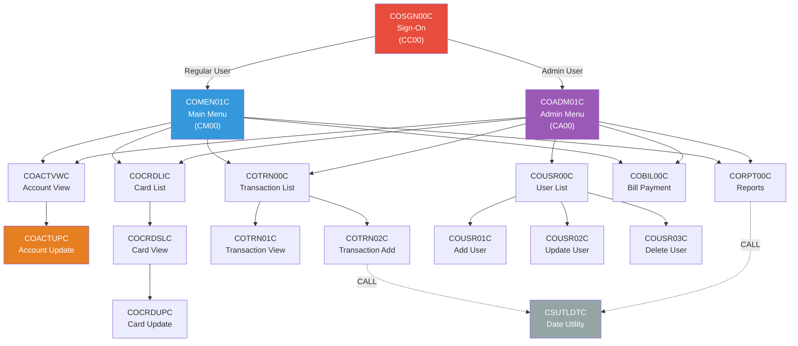
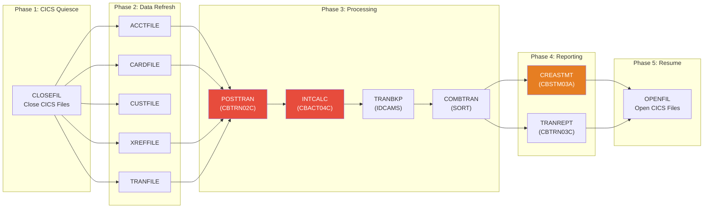
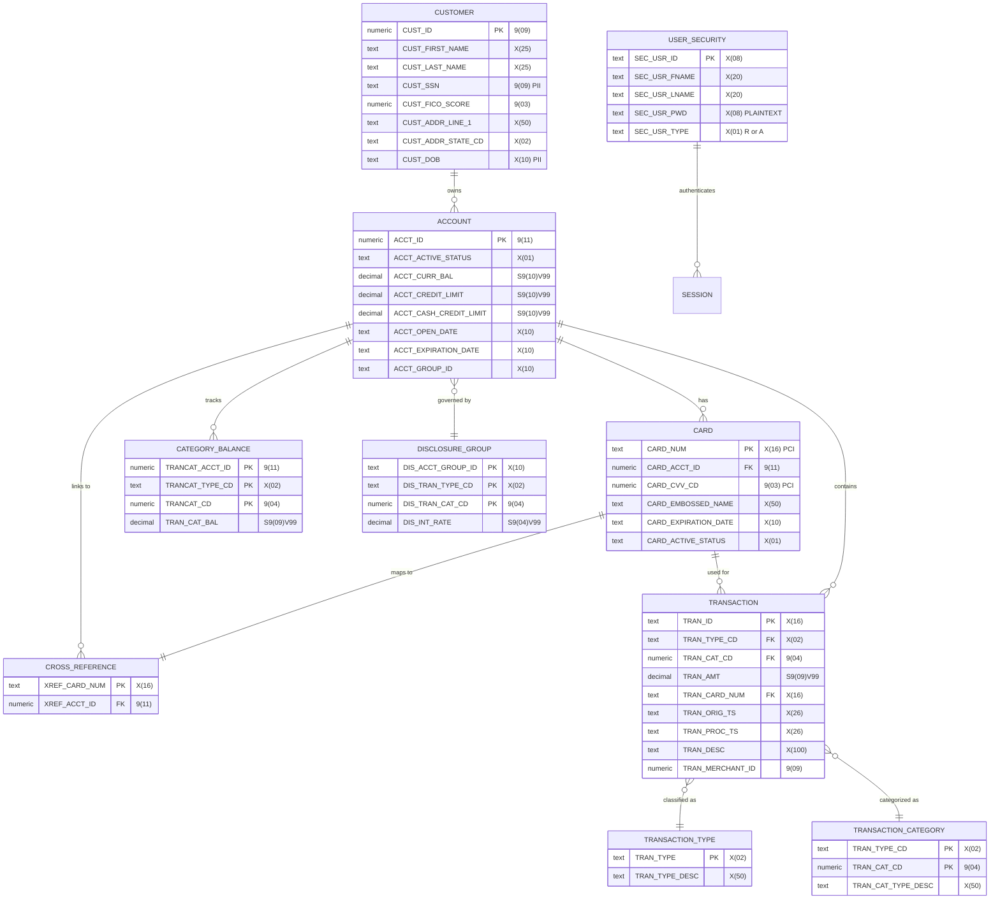
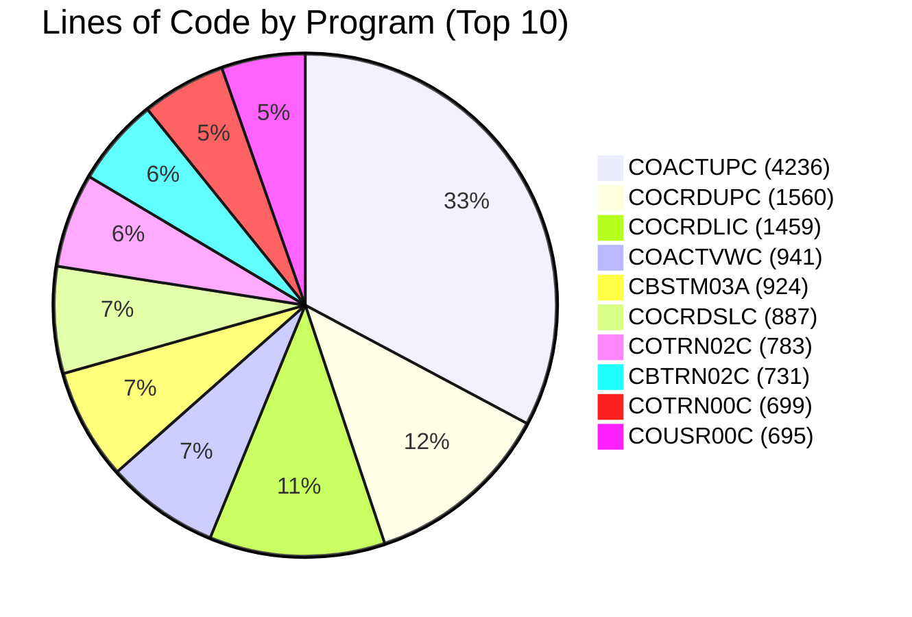
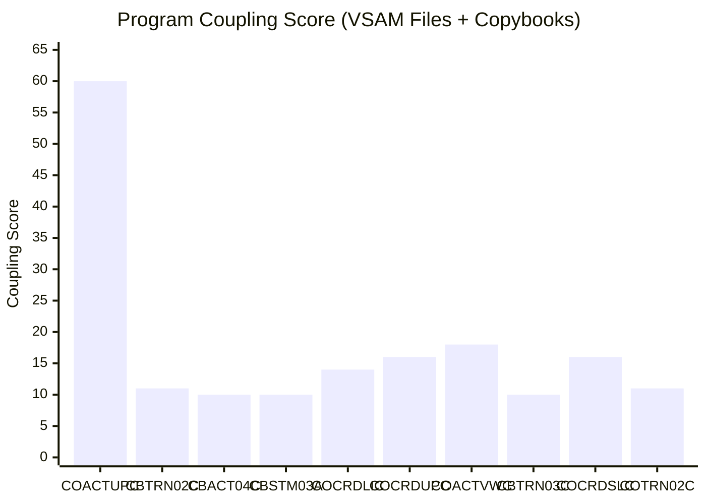

# CardDemo Visual Analysis & Business Rules

> **Generated:** 2026-03-25 | **Application:** AWS CardDemo (Credit Card Management System)
> **Contents:** Mermaid dependency graphs, complexity charts, reverse-engineered business rules

---

## 1. Visual Dependency Graphs (Mermaid)

### 1.1 Online CICS Navigation Flow



### 1.2 Batch Processing Pipeline



### 1.3 VSAM Data Flow Diagram

```mermaid
graph TD
    subgraph "VSAM Data Stores"
        ACCT[("ACCTDATA<br/>Account Master")]
        CARD[("CARDDATA<br/>Card Data")]
        CUST[("CUSTDATA<br/>Customer Master")]
        XREF[("CARDXREF<br/>Cross-Reference")]
        TRAN[("TRANSACT<br/>Transaction Master")]
        USRS[("USRSEC<br/>User Security")]
        TCAT[("TCATBALF<br/>Category Balance")]
        DISC[("DISCGRP<br/>Disclosure Group")]
        TRTY[("TRANTYPE<br/>Transaction Type")]
    end

    subgraph "Online Programs"
        SIGNON["COSGN00C"]
        ACCTVIEW["COACTVWC"]
        ACCTUPD["COACTUPC"]
        CARDLIST["COCRDLIC"]
        CARDUPD["COCRDUPC"]
        TRNLIST["COTRN00C"]
        TRNADD["COTRN02C"]
        BILLPAY["COBIL00C"]
        USRMGMT["COUSR00C-03C"]
    end

    subgraph "Batch Programs"
        POST["CBTRN02C<br/>Post Trans"]
        INTEREST["CBACT04C<br/>Calc Interest"]
        STMT["CBSTM03A<br/>Statements"]
        REPORT["CBTRN03C<br/>Reports"]
        EXPORT["CBEXPORT"]
    end

    SIGNON -->|"READ"| USRS
    USRMGMT -->|"READ/WRITE"| USRS

    ACCTVIEW -->|"READ"| ACCT
    ACCTVIEW -->|"READ"| CUST
    ACCTVIEW -->|"READ"| XREF
    ACCTUPD -->|"READ/WRITE"| ACCT
    ACCTUPD -->|"READ"| CUST

    CARDLIST -->|"READ"| CARD
    CARDLIST -->|"READ"| XREF
    CARDUPD -->|"READ/WRITE"| CARD

    TRNLIST -->|"READ"| TRAN
    TRNADD -->|"WRITE"| TRAN
    BILLPAY -->|"READ/WRITE"| ACCT

    POST -->|"READ/WRITE"| TRAN
    POST -->|"READ"| XREF
    POST -->|"READ/WRITE"| ACCT
    POST -->|"READ/WRITE"| TCAT

    INTEREST -->|"READ"| TCAT
    INTEREST -->|"READ/WRITE"| ACCT
    INTEREST -->|"READ"| XREF
    INTEREST -->|"READ"| DISC
    INTEREST -->|"WRITE"| TRAN

    STMT -->|"READ"| TRAN
    STMT -->|"READ"| XREF
    STMT -->|"READ"| ACCT
    STMT -->|"READ"| CUST

    REPORT -->|"READ"| TRAN
    REPORT -->|"READ"| XREF
    REPORT -->|"READ"| TRTY

    EXPORT -->|"READ"| ACCT
    EXPORT -->|"READ"| CARD
    EXPORT -->|"READ"| CUST
    EXPORT -->|"READ"| XREF
    EXPORT -->|"READ"| TRAN

    style ACCT fill:#3498db,color:#fff
    style TRAN fill:#e74c3c,color:#fff
    style XREF fill:#2ecc71,color:#fff
    style POST fill:#e74c3c,color:#fff
    style INTEREST fill:#e74c3c,color:#fff
```



### 1.4 Entity Relationship Diagram



---

## 2. Complexity Analysis

### 2.1 Lines of Code Distribution



### 2.2 Complexity Heatmap (Branching Density)

Programs ranked by branching density (IF + EVALUATE per 100 lines):

```
Program      LOC    IF   EVAL  Total  Density   ██████████ Bar
─────────────────────────────────────────────────────────────────
CBTRN03C      649    75    4     79    12.2 ▏  ████████████▊
COCRDUPC     1560   148   16    164    10.5 ▏  ██████████▌
CBTRN02C      731    93    0     93    12.7 ▏  █████████████
CBACT04C      652    86    0     86    13.2 ▏  █████████████▎
COCRDLIC     1459   122   18    140     9.6 ▏  █████████▌
COCRDSLC      887    68    8     76     8.6 ▏  ████████▌
COTRN02C      783    14   13     27     3.4 ▏  ███▍
COACTUPC     4236   168   10    178     4.2 ▏  ████▏
COTRN00C      699    26    8     34     4.9 ▏  ████▉
COACTVWC      941    57   10     67     7.1 ▏  ███████▏
CORPT00C      649    20    5     25     3.9 ▏  ███▉
COBIL00C      572    10    9     19     3.3 ▏  ███▎
CBSTM03A      924    15    5     20     2.2 ▏  ██▏
```

### 2.3 CICS Command Density (Online Programs)

```
Program      LOC   CICS   Density   Risk Level
──────────────────────────────────────────────────
COCRDLIC     1459    18    1.23%    ██████████████ HIGH
COACTUPC     4236    17    0.40%    ████████ MEDIUM
COACTVWC      941    15    1.59%    ████████████████ HIGH
COCRDSLC      887    14    1.58%    ████████████████ HIGH
COBIL00C      572    13    2.27%    ████████████████████ VERY HIGH
COCRDUPC     1560    12    0.77%    ██████████ MEDIUM
COTRN00C      699    10    1.43%    ███████████████ HIGH
COTRN02C      783    11    1.40%    ██████████████ HIGH
COSGN00C      260    10    3.85%    ████████████████████████ VERY HIGH
```

### 2.4 Coupling Score (Files Accessed + Copybooks Included)



---

## 3. Reverse-Engineered Business Rules

### 3.1 COSGN00C -- Authentication Rules

**Source:** `app/cbl/COSGN00C.cbl` (260 lines)

```
RULE AUTH-001: Initial Screen Display
  WHEN EIBCALEN = 0 (first entry, no COMMAREA)
  THEN Display blank sign-on screen with cursor on User ID field

RULE AUTH-002: User ID Required
  WHEN User presses ENTER
  AND  User ID field is SPACES or LOW-VALUES
  THEN Display error "Please enter User ID ..."
  AND  Set cursor to User ID field

RULE AUTH-003: Password Required
  WHEN User presses ENTER
  AND  User ID is provided
  AND  Password field is SPACES or LOW-VALUES
  THEN Display error "Please enter Password ..."
  AND  Set cursor to Password field

RULE AUTH-004: Case Normalization
  WHEN User ID and Password are provided
  THEN Convert both to UPPER-CASE before validation

RULE AUTH-005: User Lookup
  WHEN User ID is provided
  THEN Read USRSEC VSAM file using User ID as key
  IF   Record not found (RESP = 13)
  THEN Display error "User not found. Try again ..."
  IF   Read error (RESP = OTHER)
  THEN Display error "Unable to verify the User ..."

RULE AUTH-006: Password Validation
  WHEN User record is found
  AND  SEC-USR-PWD = entered password (plaintext comparison)
  THEN Authentication succeeds
  ELSE Display error "Wrong Password. Try again ..."

RULE AUTH-007: Role-Based Routing
  WHEN Authentication succeeds
  AND  SEC-USR-TYPE = 'A' (Admin)
  THEN XCTL to COADM01C (Admin Menu)
  WHEN Authentication succeeds
  AND  SEC-USR-TYPE != 'A' (Regular)
  THEN XCTL to COMEN01C (Main Menu)

RULE AUTH-008: Session Exit
  WHEN User presses PF3
  THEN Display "Thank you" message and end CICS session

RULE AUTH-009: Invalid Key Handling
  WHEN User presses any key other than ENTER or PF3
  THEN Display error "Invalid key pressed" and redisplay screen
```

**Security Concerns:**
- Passwords compared in plaintext (no hashing)
- No account lockout after failed attempts
- No session timeout mechanism
- No password complexity requirements

---

### 3.2 CBTRN02C -- Transaction Posting Rules

**Source:** `app/cbl/CBTRN02C.cbl` (731 lines)

```
RULE POST-001: Main Processing Loop
  OPEN 6 files: DALYTRAN (input), TRANSACT (I-O), XREF (input),
                DALYREJS (output), ACCOUNT (I-O), TCATBALF (I-O)
  FOR EACH record in Daily Transaction file
    PERFORM validation
    IF validation passes THEN post transaction
    ELSE write to rejects file

RULE POST-002: Card Number Validation
  READ Cross-Reference file using DALYTRAN-CARD-NUM as key
  IF   Card number not found (INVALID KEY)
  THEN Fail reason = 100 ("INVALID CARD NUMBER FOUND")
  AND  Reject transaction

RULE POST-003: Account Lookup
  WHEN Card number is valid
  THEN Use XREF-ACCT-ID to read Account file
  IF   Account not found (INVALID KEY)
  THEN Fail reason = 101 ("ACCOUNT RECORD NOT FOUND")
  AND  Reject transaction

RULE POST-004: Credit Limit Check
  COMPUTE WS-TEMP-BAL = ACCT-CURR-CYC-CREDIT
                       - ACCT-CURR-CYC-DEBIT
                       + DALYTRAN-AMT
  IF   ACCT-CREDIT-LIMIT >= WS-TEMP-BAL
  THEN Transaction within limit (pass)
  ELSE Fail reason = 102 ("OVERLIMIT TRANSACTION")
  AND  Reject transaction

RULE POST-005: Account Expiration Check
  IF   ACCT-EXPIRAION-DATE >= DALYTRAN-ORIG-TS (first 10 chars)
  THEN Account not expired (pass)
  ELSE Fail reason = 103 ("TRANSACTION RECEIVED AFTER ACCT EXPIRATION")
  AND  Reject transaction

RULE POST-006: Transaction Posting
  WHEN all validations pass:
  a) Copy all daily transaction fields to master transaction record
  b) Set TRAN-PROC-TS = current timestamp (DB2 format)
  c) Update category balance (TCATBALF)
  d) Update account balances
  e) Write transaction to master file

RULE POST-007: Category Balance Update
  READ TCATBALF using (Account ID + Type + Category) as key
  IF   Record exists:  ADD transaction amount to existing balance, REWRITE
  IF   Record not found: CREATE new record with transaction amount

RULE POST-008: Account Balance Update
  ADD DALYTRAN-AMT to ACCT-CURR-BAL (running balance)
  IF   DALYTRAN-AMT >= 0 (credit):  ADD to ACCT-CURR-CYC-CREDIT
  ELSE (debit):                      ADD to ACCT-CURR-CYC-DEBIT
  REWRITE account record

RULE POST-009: Reject Processing
  Copy entire daily transaction record to reject file
  Append validation trailer (fail reason code + description)
  Increment reject counter

RULE POST-010: Completion Reporting
  IF   WS-REJECT-COUNT > 0
  THEN Display count of rejected transactions
  Close all 6 files
```

**Business Logic Summary:**
The posting engine validates each daily transaction in sequence: (1) card exists, (2) account exists, (3) under credit limit, (4) account not expired. Valid transactions update three files atomically: transaction master, category balance, and account record. Invalid transactions are written to a rejects file with a reason code.

---

### 3.3 CBACT04C -- Interest Calculation Rules

**Source:** `app/cbl/CBACT04C.cbl` (652 lines)

```
RULE INT-001: Processing Strategy
  Read Category Balance file (TCATBALF) sequentially
  Group processing by Account ID (control break pattern)
  FOR EACH account:
    a) Look up account data
    b) Look up card via cross-reference (AIX on Account ID)
    c) For each category balance record for this account:
       - Look up interest rate from Disclosure Group
       - Compute monthly interest
       - Write interest transaction
    d) Update account with total interest

RULE INT-002: Interest Rate Lookup
  Construct key: ACCT-GROUP-ID + TRAN-TYPE-CD + TRAN-CAT-CD
  READ Disclosure Group file
  IF   Specific rate found: Use DIS-INT-RATE
  IF   Specific rate NOT found (status '23'):
    THEN Try DEFAULT group: Set group to 'DEFAULT', re-read
    IF   Default also not found: ABEND program

RULE INT-003: Monthly Interest Formula
  WS-MONTHLY-INT = (TRAN-CAT-BAL * DIS-INT-RATE) / 1200

  Where:
    TRAN-CAT-BAL  = accumulated balance for this category
    DIS-INT-RATE  = annual interest rate (percentage, e.g., 18.50)
    1200          = 12 months * 100 (to convert percentage to decimal)

  Example: Balance $5,000 at 18.50% APR
    Monthly interest = (5000 * 18.50) / 1200 = $77.08

RULE INT-004: Interest Transaction Generation
  FOR EACH category with non-zero interest:
    Create system transaction:
      TRAN-ID       = PARM-DATE + sequential suffix
      TRAN-TYPE-CD  = '01' (system type)
      TRAN-CAT-CD   = '05' (interest category)
      TRAN-SOURCE   = 'System'
      TRAN-DESC     = 'Int. for a/c ' + ACCT-ID
      TRAN-AMT      = WS-MONTHLY-INT
      TRAN-CARD-NUM = first card from cross-reference
      TRAN-ORIG-TS  = current timestamp
      TRAN-PROC-TS  = current timestamp
    Write to SYSTRAN output file

RULE INT-005: Account Update (Control Break)
  WHEN Account ID changes (new account encountered):
    ADD WS-TOTAL-INT to ACCT-CURR-BAL
    MOVE 0 to ACCT-CURR-CYC-CREDIT (reset cycle credits)
    MOVE 0 to ACCT-CURR-CYC-DEBIT  (reset cycle debits)
    REWRITE account record

RULE INT-006: Fee Computation (STUB)
  PERFORM 1400-COMPUTE-FEES
  Currently contains only EXIT (not implemented)
  Comment: "To be implemented"

RULE INT-007: Error Handling
  Any file I/O error triggers:
    Display error message with file name
    Display file status code
    CALL 'CEE3ABD' with ABCODE=999 (abnormal end)
```

**Business Logic Summary:**
Interest is calculated monthly per account per transaction category. The rate comes from a disclosure group lookup keyed by account group + transaction type + category, with a fallback to a DEFAULT group. The formula is simple: `(balance * annual_rate) / 1200`. Each interest charge generates a system transaction written to the SYSTRAN file. After processing all categories for an account, the total interest is added to the account balance and the cycle accumulators (credits/debits) are reset. Fee computation is stubbed out but not yet implemented.

---

### 3.4 Business Rule Inventory Summary

| Domain | Rule Count | Source Programs | Critical Rules |
|--------|-----------|----------------|----------------|
| Authentication | 9 | COSGN00C | Role-based routing, plaintext password comparison |
| Transaction Posting | 10 | CBTRN02C | Credit limit check, expiration validation, balance updates |
| Interest Calculation | 7 | CBACT04C | Rate lookup with DEFAULT fallback, monthly interest formula |
| **Total** | **26** | **3 programs** | **Credit limit, interest formula, auth routing** |

### 3.5 Key Financial Formulas

| Formula | COBOL Source | Business Meaning |
|---------|-------------|-----------------|
| `WS-TEMP-BAL = CYC-CREDIT - CYC-DEBIT + TRAN-AMT` | CBTRN02C:403-405 | Projected balance after posting |
| `MONTHLY-INT = (CAT-BAL * INT-RATE) / 1200` | CBACT04C:464-465 | Monthly interest charge |
| `CURR-BAL = CURR-BAL + TRAN-AMT` | CBTRN02C:547 | Running account balance |
| `CYC-CREDIT += AMT (if AMT >= 0)` | CBTRN02C:549 | Cycle credit accumulator |
| `CYC-DEBIT += AMT (if AMT < 0)` | CBTRN02C:551 | Cycle debit accumulator |
| `CURR-BAL += TOTAL-INT; CYC-CREDIT = 0; CYC-DEBIT = 0` | CBACT04C:352-354 | End-of-cycle interest posting + reset |

---

## 4. Security Vulnerability Summary

Identified from reverse-engineering:

| # | Vulnerability | Program | Severity | Modernization Fix |
|---|-------------|---------|----------|-------------------|
| 1 | Plaintext password storage | CSUSR01Y, COSGN00C | **CRITICAL** | bcrypt/scrypt hashing |
| 2 | Plaintext password comparison | COSGN00C:223 | **CRITICAL** | Hash comparison |
| 3 | No account lockout | COSGN00C | **HIGH** | Add failed attempt counter |
| 4 | No session timeout | COMMAREA-based | **HIGH** | JWT with expiry |
| 5 | Full card number in storage | CVACT02Y, CARDDATA | **HIGH** (PCI) | Tokenization |
| 6 | CVV stored at rest | CVACT02Y | **HIGH** (PCI) | Do not store post-auth |
| 7 | SSN stored unencrypted | CVCUS01Y | **HIGH** (PII) | Encrypt at rest |
| 8 | No input sanitization | All online programs | **MEDIUM** | Input validation layer |
| 9 | ABEND on all errors | All batch programs | **MEDIUM** | Graceful error handling |
| 10 | No audit trail | CBTRN02C, CBACT04C | **MEDIUM** | Add audit logging |
