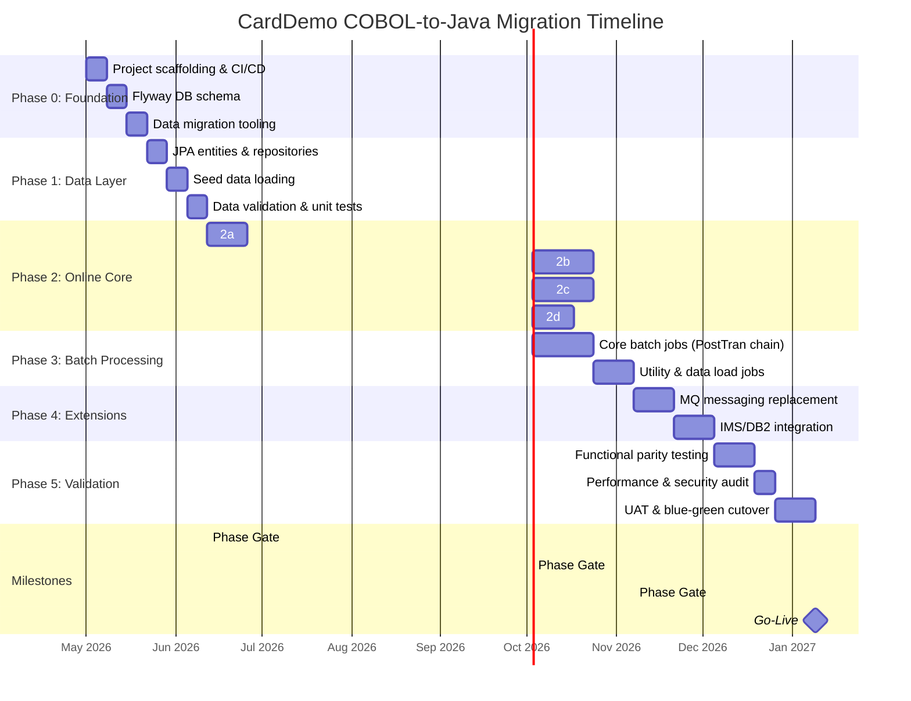

# CardDemo COBOL-to-Java Migration Plan

> **Version:** 1.0  
> **Date:** April 2026  
> **Status:** Draft  
> **Target Platform:** Java 17 / Spring Boot 3.x / PostgreSQL

---

## Table of Contents

1. [Executive Summary](#1-executive-summary)
2. [Current System Inventory](#2-current-system-inventory)
3. [Target Architecture](#3-target-architecture)
4. [Technology Mapping](#4-technology-mapping)
5. [Copybook-to-Table Mappings](#5-copybook-to-table-mappings)
6. [Phased Migration Plan](#6-phased-migration-plan)
7. [Risk Register](#7-risk-register)
8. [Migration Timeline](#8-migration-timeline)

---

## 1. Executive Summary

**CardDemo** is a mainframe credit card management application built on COBOL/CICS. It simulates a full-featured credit card lifecycle including account management, card issuance, transaction processing, billing, reporting, and user administration. The system currently comprises:

| Category | Count |
|---|---|
| Online CICS Programs | 20+ (core) + extension modules |
| Batch COBOL Programs | 11 |
| BMS Screen Maps (3270) | 17 |
| Copybooks (data structures) | 30+ (14 core in `app/cpy/`, additional in extensions) |
| JCL Batch Jobs | 34+ |
| VSAM Data Files | 7 primary + auxiliary |
| Extension Modules | 3 (IMS/DB2/MQ) |
| Assembler Utilities | 2 (`COBDATFT`, `MVSWAIT`) |

### Migration Goal

Rewrite CardDemo as a **Java Spring Boot** application preserving full functional parity. The target is a multi-module Maven project (`carddemo-java/`) with clear separation of concerns:

- **Online CICS transactions** → Spring MVC controllers with Thymeleaf HTML templates
- **Batch JCL/COBOL** → Spring Batch jobs with scheduled execution
- **VSAM KSDS files** → PostgreSQL relational database with Spring Data JPA
- **BMS 3270 maps** → Responsive HTML/CSS via Thymeleaf
- **COMMAREA** → HTTP Session + DTO-based state transfer
- **MQ/IMS/DB2 extensions** → Spring JMS + standard JPA

### Key Principles

1. **Functional parity first** — every screen, report, and batch process must produce identical business outcomes
2. **BigDecimal everywhere** — no floating-point for financial calculations
3. **java.time for all dates** — no `java.util.Date` or string-based date manipulation
4. **Incremental delivery** — six phased releases, each independently testable
5. **Data-driven validation** — side-by-side comparison of COBOL output vs. Java output at every phase gate

---

## 2. Current System Inventory

### 2.1 Online CICS Programs (20 core + extensions)

| # | Transaction ID | BMS Map | Program | Function | Module |
|---|---|---|---|---|---|
| 1 | CC00 | COSGN00 | `COSGN00C.cbl` | Sign-on / Authentication | Core |
| 2 | CM00 | COMEN01 | `COMEN01C.cbl` | Main Menu Navigation | Core |
| 3 | CAVW | COACTVW | `COACTVWC.cbl` | Account View | Core |
| 4 | CAUP | COACTUP | `COACTUPC.cbl` | Account Update | Core |
| 5 | CCLI | COCRDLI | `COCRDLIC.cbl` | Credit Card List | Core |
| 6 | CCDL | COCRDSL | `COCRDSLC.cbl` | Credit Card Detail View | Core |
| 7 | CCUP | COCRDUP | `COCRDUPC.cbl` | Credit Card Update | Core |
| 8 | CT00 | COTRN00 | `COTRN00C.cbl` | Transaction List | Core |
| 9 | CT01 | COTRN01 | `COTRN01C.cbl` | Transaction View | Core |
| 10 | CT02 | COTRN02 | `COTRN02C.cbl` | Transaction Add | Core |
| 11 | CR00 | CORPT00 | `CORPT00C.cbl` | Transaction Report | Core |
| 12 | CB00 | COBIL00 | `COBIL00C.cbl` | Bill Payment | Core |
| 13 | CA00 | COADM01 | `COADM01C.cbl` | Admin Menu | Core |
| 14 | CU00 | COUSR00 | `COUSR00C.cbl` | User List | Core |
| 15 | CU01 | COUSR01 | `COUSR01C.cbl` | User Add | Core |
| 16 | CU02 | COUSR02 | `COUSR02C.cbl` | User Update | Core |
| 17 | CU03 | COUSR03 | `COUSR03C.cbl` | User Delete | Core |
| 18 | CPVS | COPAU00 | `COPAUS0C.cbl` | Pending Auth Summary | IMS/DB2/MQ |
| 19 | CPVD | COPAU01 | `COPAUS1C.cbl` | Pending Auth Details | IMS/DB2/MQ |
| 20 | CP00 | — | `COPAUA0C.cbl` | Process Auth Requests (MQ trigger) | IMS/DB2/MQ |
| 21 | CDRD | — | `CODATE01.cbl` | System Date Inquiry via MQ | MQ |
| 22 | CDRA | — | `COACCT01.cbl` | Account Details via MQ | MQ |
| 23 | CTTU | COTRTUP | `COTRTUPC.cbl` | Transaction Type Add/Edit | DB2 |
| 24 | CTLI | COTRTLI | `COTRTLIC.cbl` | Transaction Type List/Delete | DB2 |

### 2.2 Batch COBOL Programs (11)

| # | Program | Job(s) | Function |
|---|---|---|---|
| 1 | `CBTRN02C.cbl` | POSTTRAN | Core daily transaction posting — updates account balances |
| 2 | `CBACT04C.cbl` | INTCALC | Interest calculation on account balances |
| 3 | `CBSTM03A.CBL` | CREASTMT | Statement generation — produces print-ready statements |
| 4 | `CBSTM03B.CBL` | CREASTMT | Statement generation helper (subroutine) |
| 5 | `CBACT01C.cbl` | ACCTFILE | Account data loading / initialization |
| 6 | `CBACT02C.cbl` | — | Account data processing utility |
| 7 | `CBACT03C.cbl` | — | Account data processing utility |
| 8 | `CBCUS01C.cbl` | CUSTFILE | Customer data loading |
| 9 | `CBTRN01C.cbl` | TRANFILE | Transaction file initialization |
| 10 | `CBTRN03C.cbl` | TRANREPT | Transaction report generation (batch) |
| 11 | `CBEXPORT.cbl` | CBEXPORT | Data export for branch migration |
| 12 | `CBIMPORT.cbl` | CBIMPORT | Data import from branch migration |
| 13 | `COBSWAIT.cbl` | WAITSTEP | Timer/wait utility |
| 14 | `CSUTLDTC.cbl` | — | Date conversion utility |

### 2.3 BMS Screen Maps (17)

| # | Map File | Associated Program | Screen Purpose |
|---|---|---|---|
| 1 | `COSGN00.bms` | COSGN00C | Sign-on |
| 2 | `COMEN01.bms` | COMEN01C | Main Menu |
| 3 | `COACTVW.bms` | COACTVWC | Account View |
| 4 | `COACTUP.bms` | COACTUPC | Account Update |
| 5 | `COCRDLI.bms` | COCRDLIC | Credit Card List |
| 6 | `COCRDSL.bms` | COCRDSLC | Credit Card Detail |
| 7 | `COCRDUP.bms` | COCRDUPC | Credit Card Update |
| 8 | `COTRN00.bms` | COTRN00C | Transaction List |
| 9 | `COTRN01.bms` | COTRN01C | Transaction View |
| 10 | `COTRN02.bms` | COTRN02C | Transaction Add |
| 11 | `CORPT00.bms` | CORPT00C | Transaction Report |
| 12 | `COBIL00.bms` | COBIL00C | Bill Payment |
| 13 | `COADM01.bms` | COADM01C | Admin Menu |
| 14 | `COUSR00.bms` | COUSR00C | User List |
| 15 | `COUSR01.bms` | COUSR01C | User Add |
| 16 | `COUSR02.bms` | COUSR02C | User Update |
| 17 | `COUSR03.bms` | COUSR03C | User Delete |

### 2.4 Copybooks (Data Structures)

#### Core Copybooks (`app/cpy/`)

| Copybook | Record Length | Description | Key Fields |
|---|---|---|---|
| `CVACT01Y.cpy` | 300 | Account record | `ACCT-ID` (9(11)), `ACCT-ACTIVE-STATUS`, `ACCT-CURR-BAL` (S9(10)V99), `ACCT-CREDIT-LIMIT`, dates |
| `CVCUS01Y.cpy` | 500 | Customer record | `CUST-ID` (9(09)), name fields, address, SSN, DOB, FICO score |
| `CVACT02Y.cpy` | 150 | Credit card record | `CARD-NUM` (X(16)), `CARD-ACCT-ID`, CVV, expiration, status |
| `CVACT03Y.cpy` | 50 | Card cross-reference | `XREF-CARD-NUM`, `XREF-CUST-ID`, `XREF-ACCT-ID` |
| `CVTRA05Y.cpy` | 350 | Transaction record | `TRAN-ID`, type, category, amount (S9(09)V99), merchant info, timestamps |
| `CVTRA06Y.cpy` | 350 | Daily transaction record | Same layout as CVTRA05Y — used for daily batch input |
| `CVTRA07Y.cpy` | — | Transaction report layout | Report headers, detail lines, page/account totals |
| `CVTRA01Y.cpy` | 50 | Transaction category balance | `TRANCAT-ACCT-ID` + `TYPE-CD` + `CAT-CD` (composite key), balance |
| `CVTRA02Y.cpy` | 50 | Disclosure group | `DIS-ACCT-GROUP-ID` + type + category key, interest rate |
| `CVTRA03Y.cpy` | 60 | Transaction type | `TRAN-TYPE` (X(02)), description |
| `CVTRA04Y.cpy` | 60 | Transaction category | `TRAN-TYPE-CD` + `TRAN-CAT-CD` (composite key), description |
| `CSUSR01Y.cpy` | 80 | User security | `SEC-USR-ID` (X(08)), first/last name, password, user type |
| `COCOM01Y.cpy` | — | COMMAREA (inter-program communication) | User context, customer/account/card info, navigation state |
| `CVCRD01Y.cpy` | — | Screen work area (AID keys) | Keyboard AID detection, navigation fields, messages |
| `CVEXPORT.cpy` | 500 | Multi-record export layout | REDEFINES structure for customer, account, transaction, card xref records |

#### Additional Copybooks

| Copybook | Description |
|---|---|
| `COADM02Y.cpy` | Admin menu data areas |
| `COMEN02Y.cpy` | Main menu data areas |
| `COSTM01.CPY` | Statement generation work areas |
| `COTTL01Y.cpy` | Title/header line definitions |
| `CSDAT01Y.cpy` | Date handling data areas |
| `CSLKPCDY.cpy` | Lookup code definitions |
| `CSMSG01Y.cpy` | Message text area (screen messages) |
| `CSMSG02Y.cpy` | Additional message area |
| `CSSETATY.cpy` | Screen attribute settings |
| `CSSTRPFY.cpy` | String padding/formatting |
| `CSUTLDPY.cpy` | Date utility parameters |
| `CSUTLDWY.cpy` | Date utility work areas |
| `CODATECN.cpy` | Date conversion constants |
| `CUSTREC.cpy` | Customer record (alternative layout) |
| `UNUSED1Y.cpy` | Reserved for future use |

### 2.5 JCL Batch Jobs (34+)

| # | Job | Program/Utility | Purpose | Category |
|---|---|---|---|---|
| 1 | `CLOSEFIL.jcl` | IEFBR14 | Close VSAM files in CICS | Lifecycle |
| 2 | `OPENFIL.jcl` | IEFBR14 | Open files in CICS | Lifecycle |
| 3 | `ACCTFILE.jcl` | IDCAMS | Refresh Account Master VSAM | Data Load |
| 4 | `CARDFILE.jcl` | IDCAMS | Refresh Card Master VSAM | Data Load |
| 5 | `CUSTFILE.jcl` | IDCAMS | Refresh Customer Master VSAM | Data Load |
| 6 | `XREFFILE.jcl` | IDCAMS | Load Card Cross-Reference VSAM | Data Load |
| 7 | `TRANFILE.jcl` | IDCAMS | Load Transaction Master VSAM | Data Load |
| 8 | `TRANCATG.jcl` | IDCAMS | Load Transaction Category Types | Data Load |
| 9 | `TRANTYPE.jcl` | IDCAMS | Load Transaction Types | Data Load |
| 10 | `DISCGRP.jcl` | IDCAMS | Load Disclosure Groups | Data Load |
| 11 | `TCATBALF.jcl` | IDCAMS | Refresh Transaction Category Balance | Data Load |
| 12 | `DUSRSECJ.jcl` | IEBGENER | Initial load of User Security file | Data Load |
| 13 | `TRANBKP.jcl` | IDCAMS | Backup Transaction Master | Data Mgmt |
| 14 | `COMBTRAN.jcl` | SORT | Combine system + daily transactions | Data Mgmt |
| 15 | `TRANIDX.jcl` | IDCAMS | Define AIX on transaction file | Data Mgmt |
| 16 | `POSTTRAN.jcl` | CBTRN02C | Daily transaction posting | Batch Process |
| 17 | `INTCALC.jcl` | CBACT04C | Interest calculation | Batch Process |
| 18 | `CREASTMT.JCL` | CBSTM03A | Statement generation | Batch Process |
| 19 | `TRANREPT.jcl` | CBTRN03C | Transaction report (batch) | Batch Process |
| 20 | `REPTFILE.jcl` | — | Report file handling | Reporting |
| 21 | `PRTCATBL.jcl` | — | Print category balance | Reporting |
| 22 | `DALYREJS.jcl` | — | Daily rejection processing | Exception |
| 23 | `READACCT.jcl` | — | Read account data | Utility |
| 24 | `READCARD.jcl` | — | Read card data | Utility |
| 25 | `READCUST.jcl` | — | Read customer data | Utility |
| 26 | `READXREF.jcl` | — | Read cross-reference data | Utility |
| 27 | `WAITSTEP.jcl` | COBSWAIT | Wait/timer step | Utility |
| 28 | `DEFGDGB.jcl` | IDCAMS | Define GDG base | Infrastructure |
| 29 | `DEFGDGD.jcl` | IDCAMS | Define GDG base (DB2) | Infrastructure |
| 30 | `ESDSRRDS.jcl` | IDCAMS | Create ESDS/RRDS VSAM files | Infrastructure |
| 31 | `DEFCUST.jcl` | IDCAMS | Define customer VSAM cluster | Infrastructure |
| 32 | `CBEXPORT.jcl` | CBEXPORT | Branch data export | Migration |
| 33 | `CBIMPORT.jcl` | CBIMPORT | Branch data import | Migration |
| 34 | `CBADMCDJ.jcl` | — | Admin card job | Admin |
| 35 | `FTPJCL.JCL` | — | FTP operations | Utility |
| 36 | `INTRDRJ1.JCL` | — | Internal reader job 1 | Utility |
| 37 | `INTRDRJ2.JCL` | — | Internal reader job 2 | Utility |
| 38 | `TXT2PDF1.JCL` | — | Text-to-PDF conversion | Utility |

### 2.6 Data Files (`app/data/ASCII/`)

| File | Copybook | Description | Approx Record Length |
|---|---|---|---|
| `acctdata.txt` | CVACT01Y | Account master data | 300 |
| `custdata.txt` | CVCUS01Y | Customer master data | 500 |
| `carddata.txt` | CVACT02Y | Credit card data | 150 |
| `cardxref.txt` | CVACT03Y | Card/Customer/Account cross-reference | 50 |
| `dailytran.txt` | CVTRA06Y | Daily transaction feed | 350 |
| `discgrp.txt` | CVTRA02Y | Disclosure groups (interest rates) | 50 |
| `tcatbal.txt` | CVTRA01Y | Transaction category balances | 50 |
| `trancatg.txt` | CVTRA04Y | Transaction category types | 60 |
| `trantype.txt` | CVTRA03Y | Transaction types | 60 |

### 2.7 Extension Modules

#### IMS/DB2/MQ — Pending Authorizations (`app/app-authorization-ims-db2-mq/`)

| Program | Function |
|---|---|
| `COPAUA0C.cbl` | MQ-triggered authorization request processor |
| `COPAUS0C.cbl` | Pending authorization summary screen |
| `COPAUS1C.cbl` | Pending authorization detail screen |
| `COPAUS2C.cbl` | Authorization detail helper |
| `CBPAUP0C.cbl` | Batch purge of expired authorizations |
| `PAUDBLOD.CBL` | IMS DB load utility |
| `PAUDBUNL.CBL` | IMS DB unload utility |
| `DBUNLDGS.CBL` | DB unload utility |

#### MQ Integration

| Program | Transaction | Function |
|---|---|---|
| `CODATE01.cbl` | CDRD | System date inquiry via MQ request/response |
| `COACCT01.cbl` | CDRA | Account details inquiry via MQ request/response |

#### Assembler Utilities (`app/asm/`)

| Utility | Function | Java Replacement |
|---|---|---|
| `COBDATFT.asm` | Date format conversion (mainframe date formats) | `java.time.LocalDate` + `DateTimeFormatter` |
| `MVSWAIT.asm` | Timer control for batch jobs | `Thread.sleep()` / `ScheduledExecutorService` |

---

## 3. Target Architecture

### 3.1 Multi-Module Maven Project

```
carddemo-java/
├── pom.xml                              # Parent POM (BOM, dependency management)
├── MIGRATION_PLAN.md                    # This document
│
├── carddemo-common/                     # Shared domain model
│   ├── pom.xml
│   └── src/main/java/com/cardemo/common/
│       ├── entity/                      # JPA @Entity classes
│       │   ├── Account.java            # ← CVACT01Y.cpy
│       │   ├── Customer.java           # ← CVCUS01Y.cpy
│       │   ├── CreditCard.java         # ← CVACT02Y.cpy
│       │   ├── CardXref.java           # ← CVACT03Y.cpy
│       │   ├── Transaction.java        # ← CVTRA05Y.cpy
│       │   ├── DailyTransaction.java   # ← CVTRA06Y.cpy
│       │   ├── TransactionType.java    # ← CVTRA03Y.cpy
│       │   ├── TransactionCategory.java# ← CVTRA04Y.cpy
│       │   ├── TransactionCatBalance.java # ← CVTRA01Y.cpy
│       │   ├── DisclosureGroup.java    # ← CVTRA02Y.cpy
│       │   └── UserSecurity.java       # ← CSUSR01Y.cpy
│       ├── dto/
│       │   └── CardDemoSession.java    # ← COCOM01Y.cpy (COMMAREA)
│       ├── enums/
│       │   ├── UserType.java           # A=Admin, U=User
│       │   └── AccountStatus.java      # Y=Active, N=Inactive
│       ├── repository/                  # Spring Data JPA repositories
│       │   ├── AccountRepository.java
│       │   ├── CustomerRepository.java
│       │   ├── CreditCardRepository.java
│       │   ├── CardXrefRepository.java
│       │   ├── TransactionRepository.java
│       │   ├── DailyTransactionRepository.java
│       │   ├── TransactionTypeRepository.java
│       │   ├── TransactionCategoryRepository.java
│       │   ├── TransactionCatBalanceRepository.java
│       │   ├── DisclosureGroupRepository.java
│       │   └── UserSecurityRepository.java
│       └── util/
│           ├── DateConverter.java       # ← COBDATFT.asm / CSUTLDTC.cbl
│           └── StringPadding.java       # ← CSSTRPFY.cpy
│
├── carddemo-web/                        # Online CICS replacement
│   ├── pom.xml
│   └── src/
│       ├── main/
│       │   ├── java/com/cardemo/web/
│       │   │   ├── CardDemoWebApplication.java
│       │   │   ├── config/
│       │   │   │   └── SecurityConfig.java
│       │   │   ├── controller/          # One per BMS map/CICS program
│       │   │   │   ├── SignonController.java       # ← COSGN00C
│       │   │   │   ├── MainMenuController.java     # ← COMEN01C
│       │   │   │   ├── AccountViewController.java  # ← COACTVWC
│       │   │   │   ├── AccountUpdateController.java# ← COACTUPC
│       │   │   │   ├── CardListController.java     # ← COCRDLIC
│       │   │   │   ├── CardDetailController.java   # ← COCRDSLC
│       │   │   │   ├── CardUpdateController.java   # ← COCRDUPC
│       │   │   │   ├── TransactionListController.java  # ← COTRN00C
│       │   │   │   ├── TransactionViewController.java  # ← COTRN01C
│       │   │   │   ├── TransactionAddController.java   # ← COTRN02C
│       │   │   │   ├── ReportController.java       # ← CORPT00C
│       │   │   │   ├── BillPaymentController.java  # ← COBIL00C
│       │   │   │   ├── AdminMenuController.java    # ← COADM01C
│       │   │   │   ├── UserListController.java     # ← COUSR00C
│       │   │   │   ├── UserAddController.java      # ← COUSR01C
│       │   │   │   ├── UserUpdateController.java   # ← COUSR02C
│       │   │   │   └── UserDeleteController.java   # ← COUSR03C
│       │   │   └── service/
│       │   │       ├── AuthenticationService.java
│       │   │       ├── AccountService.java
│       │   │       ├── CardService.java
│       │   │       ├── TransactionService.java
│       │   │       ├── ReportService.java
│       │   │       ├── BillPaymentService.java
│       │   │       └── UserManagementService.java
│       │   └── resources/
│       │       ├── application.yml
│       │       └── templates/           # Thymeleaf (← BMS maps)
│       │           ├── signon.html             # ← COSGN00.bms
│       │           ├── main-menu.html          # ← COMEN01.bms
│       │           ├── account-view.html       # ← COACTVW.bms
│       │           ├── account-update.html     # ← COACTUP.bms
│       │           ├── card-list.html          # ← COCRDLI.bms
│       │           ├── card-detail.html        # ← COCRDSL.bms
│       │           ├── card-update.html        # ← COCRDUP.bms
│       │           ├── transaction-list.html   # ← COTRN00.bms
│       │           ├── transaction-view.html   # ← COTRN01.bms
│       │           ├── transaction-add.html    # ← COTRN02.bms
│       │           ├── report.html             # ← CORPT00.bms
│       │           ├── bill-payment.html       # ← COBIL00.bms
│       │           ├── admin-menu.html         # ← COADM01.bms
│       │           ├── user-list.html          # ← COUSR00.bms
│       │           ├── user-add.html           # ← COUSR01.bms
│       │           ├── user-update.html        # ← COUSR02.bms
│       │           └── user-delete.html        # ← COUSR03.bms
│       └── test/
│           └── java/com/cardemo/web/
│
├── carddemo-batch/                      # Batch JCL replacement
│   ├── pom.xml
│   └── src/main/java/com/cardemo/batch/
│       ├── CardDemoBatchApplication.java
│       ├── config/
│       │   └── BatchConfig.java
│       └── job/
│           ├── PostTransactionJobConfig.java    # ← POSTTRAN / CBTRN02C
│           ├── InterestCalcJobConfig.java       # ← INTCALC / CBACT04C
│           ├── StatementJobConfig.java          # ← CREASTMT / CBSTM03A+B
│           ├── TransactionReportJobConfig.java  # ← TRANREPT / CBTRN03C
│           ├── DataExportJobConfig.java         # ← CBEXPORT
│           ├── DataImportJobConfig.java         # ← CBIMPORT
│           ├── DailyRejectJobConfig.java        # ← DALYREJS
│           ├── AccountRefreshJobConfig.java     # ← ACCTFILE
│           ├── DataLoadJobConfig.java           # ← CUSTFILE/CARDFILE/XREFFILE
│           └── AuthPurgeJobConfig.java          # ← CBPAUP0J
│
├── carddemo-messaging/                  # MQ replacement
│   ├── pom.xml
│   └── src/main/java/com/cardemo/messaging/
│       ├── config/
│       │   └── JmsConfig.java
│       ├── listener/
│       │   └── AuthorizationRequestListener.java  # ← COPAUA0C
│       └── sender/
│           ├── DateInquirySender.java             # ← CODATE01
│           └── AccountInquirySender.java          # ← COACCT01
│
├── carddemo-integration-tests/          # End-to-end validation
│   ├── pom.xml
│   └── src/test/java/com/cardemo/it/
│       ├── AuthenticationIT.java
│       ├── AccountManagementIT.java
│       ├── CardManagementIT.java
│       ├── TransactionIT.java
│       ├── BatchProcessingIT.java
│       └── DataMigrationIT.java
│
└── src/main/resources/
    └── db/migration/                    # Flyway SQL migrations
        ├── V001__create_accounts.sql
        ├── V002__create_customers.sql
        ├── V003__create_credit_cards.sql
        ├── V004__create_card_xref.sql
        ├── V005__create_transactions.sql
        ├── V006__create_daily_transactions.sql
        ├── V007__create_transaction_types.sql
        ├── V008__create_transaction_categories.sql
        ├── V009__create_tran_cat_balance.sql
        ├── V010__create_disclosure_groups.sql
        ├── V011__create_user_security.sql
        └── V012__seed_data.sql
```

### 3.2 Architecture Diagram

```
┌─────────────────────────────────────────────────────────────────┐
│                        Browser (HTML/CSS)                       │
│                    Thymeleaf-rendered pages                     │
└───────────────────────────┬─────────────────────────────────────┘
                            │ HTTP
┌───────────────────────────▼─────────────────────────────────────┐
│                    carddemo-web                                 │
│  ┌──────────────┐  ┌──────────────┐  ┌────────────────────┐   │
│  │  Controllers  │  │   Services   │  │  SecurityConfig    │   │
│  │  (17 screens) │──│  (business   │  │  (Spring Security) │   │
│  └──────────────┘  │   logic)     │  └────────────────────┘   │
│                     └──────┬───────┘                            │
└────────────────────────────┼────────────────────────────────────┘
                             │
┌────────────────────────────▼────────────────────────────────────┐
│                    carddemo-common                              │
│  ┌─────────────┐  ┌──────────────┐  ┌──────────────────────┐  │
│  │ JPA Entities │  │ Repositories │  │  DTOs / Enums /      │  │
│  │ (11 tables)  │  │ (Spring Data)│  │  Utilities           │  │
│  └──────┬──────┘  └──────┬───────┘  └──────────────────────┘  │
└─────────┼────────────────┼──────────────────────────────────────┘
          │                │
┌─────────▼────────────────▼──────────────────────────────────────┐
│                     PostgreSQL                                   │
│  accounts │ customers │ credit_cards │ transactions │ ...       │
│                  (Flyway-managed schema)                         │
└─────────────────────────────────────────────────────────────────┘

┌─────────────────────────────────────────────────────────────────┐
│                    carddemo-batch                                │
│  ┌─────────────────────┐  ┌───────────────────────────────┐    │
│  │ Spring Batch Jobs    │  │  @Scheduled / Quartz triggers │    │
│  │ (PostTran, IntCalc,  │  └───────────────────────────────┘    │
│  │  Statement, Report,  │                                       │
│  │  Export, Import)     │                                       │
│  └─────────────────────┘                                        │
└─────────────────────────────────────────────────────────────────┘

┌─────────────────────────────────────────────────────────────────┐
│                    carddemo-messaging                            │
│  ┌─────────────────────┐  ┌───────────────────────────────┐    │
│  │ JMS Listeners        │  │ Message Senders               │    │
│  │ (Auth Requests)      │  │ (Date/Account Inquiry)        │    │
│  └─────────────────────┘  └───────────────────────────────┘    │
│             ActiveMQ / RabbitMQ                                  │
└─────────────────────────────────────────────────────────────────┘
```

---

## 4. Technology Mapping

| COBOL / Mainframe Component | Java / Spring Equivalent | Notes |
|---|---|---|
| **CICS Transaction Processing** | Spring MVC + Spring Boot | Each CICS transaction → one `@Controller` |
| **BMS 3270 Screen Maps** | Thymeleaf HTML templates | Responsive HTML replaces fixed-width 3270 |
| **COMMAREA (`COCOM01Y`)** | `CardDemoSession` DTO + `HttpSession` | Session-scoped state; replaces pseudo-conversational model |
| **VSAM KSDS** | PostgreSQL + Spring Data JPA | Keyed access patterns map to JPA `@Id` / indexed queries |
| **VSAM AIX (Alternate Index)** | PostgreSQL secondary indexes | `CREATE INDEX` in Flyway migrations |
| **Copybooks (01-level records)** | JPA `@Entity` classes + DTOs | Field-by-field mapping with type promotion |
| **JCL Batch Jobs** | Spring Batch `Job` / `Step` / `Tasklet` | Each JCL → one `@Configuration` class |
| **IDCAMS (VSAM utilities)** | Flyway migrations + JPA bulk operations | Schema DDL in Flyway; data loads via Spring Batch |
| **IEBGENER / SORT** | Spring Batch `FlatFileItemReader` / Java `Comparator` | File copy → reader/writer; sort → in-memory or SQL `ORDER BY` |
| **COMP-3 / Packed Decimal** | `java.math.BigDecimal` | **Mandatory** for all financial fields — no `double`/`float` |
| **PIC S9(n)V99** | `BigDecimal` with `scale(2)` | Maps to `DECIMAL(n+2, 2)` in PostgreSQL |
| **PIC X(n)** | `String` (with max-length validation) | `@Column(length = n)` |
| **PIC 9(n)** | `Long` or `BigDecimal` depending on context | Numeric identifiers → `Long`; amounts → `BigDecimal` |
| **COBDATFT (Assembler)** | `java.time.LocalDate` + `DateTimeFormatter` | Custom format patterns for mainframe date strings |
| **MVSWAIT (Assembler)** | `Thread.sleep()` / `ScheduledExecutorService` | Simple timer replacement |
| **IBM MQ** | Spring JMS with ActiveMQ or RabbitMQ | JMS abstraction; message-driven POJOs |
| **IMS DB (Hierarchical)** | JPA with relational tables | Flatten DL/I segments to normalized relational schema |
| **DB2 SQL** | Spring Data JPA / JPQL | Direct SQL replacement; stored procedures → service methods |
| **DB2 Cursors** | JPA `@Query` with `Stream<T>` or pagination | Cursor-based iteration → Spring Data paging |
| **RACF Security** | Spring Security (form login + role-based) | `UserType.ADMIN` / `UserType.USER` roles |
| **Control-M / CA7 Scheduling** | Spring Batch `@Scheduled` + Quartz | Cron expressions replicate mainframe schedule |
| **GDG (Generation Data Groups)** | Timestamped file naming or DB versioning | `statement_YYYYMMDD_NNN.pdf` pattern |
| **EBCDIC Encoding** | UTF-8 + data migration converter | One-time conversion during Phase 0 |
| **Internal Reader** | Spring Batch job chaining (`JobExecutionDecider`) | Sub-job invocation replaces JES2 internal reader |
| **REDEFINES** | Java inheritance or union-type DTOs | `CVEXPORT.cpy` REDEFINES → polymorphic `ExportRecord` subclasses |
| **OCCURS / OCCURS DEPENDING ON** | Java `List<T>` or arrays | `EXPORT-CUST-ADDR-LINES OCCURS 3` → `List<String> addressLines` |

---

## 5. Copybook-to-Table Mappings

### 5.1 `CVACT01Y.cpy` → `accounts`

```sql
CREATE TABLE accounts (
    acct_id           BIGINT        PRIMARY KEY,     -- PIC 9(11)
    active_status     VARCHAR(1)    NOT NULL,         -- PIC X(01) : 'Y'/'N'
    curr_bal          DECIMAL(12,2) NOT NULL DEFAULT 0, -- PIC S9(10)V99
    credit_limit      DECIMAL(12,2) NOT NULL DEFAULT 0, -- PIC S9(10)V99
    cash_credit_limit DECIMAL(12,2) NOT NULL DEFAULT 0, -- PIC S9(10)V99
    open_date         DATE,                           -- PIC X(10) → LocalDate
    expiration_date   DATE,                           -- PIC X(10) → LocalDate
    reissue_date      DATE,                           -- PIC X(10) → LocalDate
    curr_cyc_credit   DECIMAL(12,2) NOT NULL DEFAULT 0, -- PIC S9(10)V99
    curr_cyc_debit    DECIMAL(12,2) NOT NULL DEFAULT 0, -- PIC S9(10)V99
    addr_zip          VARCHAR(10),                    -- PIC X(10)
    group_id          VARCHAR(10)                     -- PIC X(10)
);
```

### 5.2 `CVCUS01Y.cpy` → `customers`

```sql
CREATE TABLE customers (
    cust_id                BIGINT       PRIMARY KEY,   -- PIC 9(09)
    first_name             VARCHAR(25),                -- PIC X(25)
    middle_name            VARCHAR(25),                -- PIC X(25)
    last_name              VARCHAR(25),                -- PIC X(25)
    addr_line_1            VARCHAR(50),                -- PIC X(50)
    addr_line_2            VARCHAR(50),                -- PIC X(50)
    addr_line_3            VARCHAR(50),                -- PIC X(50)
    addr_state_cd          VARCHAR(2),                 -- PIC X(02)
    addr_country_cd        VARCHAR(3),                 -- PIC X(03)
    addr_zip               VARCHAR(10),                -- PIC X(10)
    phone_num_1            VARCHAR(15),                -- PIC X(15)
    phone_num_2            VARCHAR(15),                -- PIC X(15)
    ssn                    BIGINT,                     -- PIC 9(09)
    govt_issued_id         VARCHAR(20),                -- PIC X(20)
    dob                    DATE,                       -- PIC X(10) → LocalDate
    eft_account_id         VARCHAR(10),                -- PIC X(10)
    pri_card_holder_ind    VARCHAR(1),                 -- PIC X(01)
    fico_credit_score      INTEGER                     -- PIC 9(03)
);
```

### 5.3 `CVACT02Y.cpy` → `credit_cards`

```sql
CREATE TABLE credit_cards (
    card_num           VARCHAR(16)   PRIMARY KEY,     -- PIC X(16)
    acct_id            BIGINT        NOT NULL,        -- PIC 9(11) → FK accounts
    cvv_cd             INTEGER       NOT NULL,        -- PIC 9(03)
    embossed_name      VARCHAR(50),                   -- PIC X(50)
    expiration_date    DATE,                          -- PIC X(10) → LocalDate
    active_status      VARCHAR(1)    NOT NULL,        -- PIC X(01)
    FOREIGN KEY (acct_id) REFERENCES accounts(acct_id)
);
```

### 5.4 `CVACT03Y.cpy` → `card_xref`

```sql
CREATE TABLE card_xref (
    xref_card_num      VARCHAR(16)   PRIMARY KEY,     -- PIC X(16)
    xref_cust_id       BIGINT        NOT NULL,        -- PIC 9(09) → FK customers
    xref_acct_id       BIGINT        NOT NULL,        -- PIC 9(11) → FK accounts
    FOREIGN KEY (xref_cust_id) REFERENCES customers(cust_id),
    FOREIGN KEY (xref_acct_id) REFERENCES accounts(acct_id)
);
```

### 5.5 `CVTRA05Y.cpy` → `transactions`

```sql
CREATE TABLE transactions (
    tran_id            VARCHAR(16)   PRIMARY KEY,     -- PIC X(16)
    tran_type_cd       VARCHAR(2)    NOT NULL,        -- PIC X(02)
    tran_cat_cd        INTEGER       NOT NULL,        -- PIC 9(04)
    tran_source        VARCHAR(10),                   -- PIC X(10)
    tran_desc          VARCHAR(100),                  -- PIC X(100)
    tran_amt           DECIMAL(11,2) NOT NULL,        -- PIC S9(09)V99
    merchant_id        BIGINT,                        -- PIC 9(09)
    merchant_name      VARCHAR(50),                   -- PIC X(50)
    merchant_city      VARCHAR(50),                   -- PIC X(50)
    merchant_zip       VARCHAR(10),                   -- PIC X(10)
    card_num           VARCHAR(16)   NOT NULL,        -- PIC X(16)
    orig_ts            TIMESTAMP,                     -- PIC X(26) → LocalDateTime
    proc_ts            TIMESTAMP,                     -- PIC X(26) → LocalDateTime
    FOREIGN KEY (card_num) REFERENCES credit_cards(card_num)
);
```

### 5.6 `CVTRA06Y.cpy` → `daily_transactions`

```sql
CREATE TABLE daily_transactions (
    tran_id            VARCHAR(16)   PRIMARY KEY,     -- same layout as transactions
    tran_type_cd       VARCHAR(2)    NOT NULL,
    tran_cat_cd        INTEGER       NOT NULL,
    tran_source        VARCHAR(10),
    tran_desc          VARCHAR(100),
    tran_amt           DECIMAL(11,2) NOT NULL,
    merchant_id        BIGINT,
    merchant_name      VARCHAR(50),
    merchant_city      VARCHAR(50),
    merchant_zip       VARCHAR(10),
    card_num           VARCHAR(16)   NOT NULL,
    orig_ts            TIMESTAMP,
    proc_ts            TIMESTAMP
);
```

### 5.7 `CVTRA03Y.cpy` → `transaction_types`

```sql
CREATE TABLE transaction_types (
    tran_type          VARCHAR(2)    PRIMARY KEY,     -- PIC X(02)
    tran_type_desc     VARCHAR(50)                    -- PIC X(50)
);
```

### 5.8 `CVTRA04Y.cpy` → `transaction_categories`

```sql
CREATE TABLE transaction_categories (
    tran_type_cd       VARCHAR(2)    NOT NULL,        -- PIC X(02)
    tran_cat_cd        INTEGER       NOT NULL,        -- PIC 9(04)
    tran_cat_type_desc VARCHAR(50),                   -- PIC X(50)
    PRIMARY KEY (tran_type_cd, tran_cat_cd)
);
```

### 5.9 `CVTRA01Y.cpy` → `tran_cat_balance`

```sql
CREATE TABLE tran_cat_balance (
    acct_id            BIGINT        NOT NULL,        -- PIC 9(11)
    tran_type_cd       VARCHAR(2)    NOT NULL,        -- PIC X(02)
    tran_cat_cd        INTEGER       NOT NULL,        -- PIC 9(04)
    tran_cat_bal       DECIMAL(11,2) NOT NULL DEFAULT 0, -- PIC S9(09)V99
    PRIMARY KEY (acct_id, tran_type_cd, tran_cat_cd),
    FOREIGN KEY (acct_id) REFERENCES accounts(acct_id)
);
```

### 5.10 `CVTRA02Y.cpy` → `disclosure_groups`

```sql
CREATE TABLE disclosure_groups (
    acct_group_id      VARCHAR(10)   NOT NULL,        -- PIC X(10)
    tran_type_cd       VARCHAR(2)    NOT NULL,        -- PIC X(02)
    tran_cat_cd        INTEGER       NOT NULL,        -- PIC 9(04)
    interest_rate      DECIMAL(6,2)  NOT NULL,        -- PIC S9(04)V99
    PRIMARY KEY (acct_group_id, tran_type_cd, tran_cat_cd)
);
```

### 5.11 `CSUSR01Y.cpy` → `user_security`

```sql
CREATE TABLE user_security (
    usr_id             VARCHAR(8)    PRIMARY KEY,     -- PIC X(08)
    usr_fname          VARCHAR(20),                   -- PIC X(20)
    usr_lname          VARCHAR(20),                   -- PIC X(20)
    usr_pwd            VARCHAR(8)    NOT NULL,        -- PIC X(08) (hash in production)
    usr_type           VARCHAR(1)    NOT NULL         -- PIC X(01) : 'A'/'U'
);
```

---

## 6. Phased Migration Plan

### Phase 0: Foundation (Weeks 1–3)

**Objective:** Establish the project skeleton, CI/CD pipeline, database schema, and data migration tooling.

| Task | Details | Deliverable |
|---|---|---|
| 0.1 Maven multi-module scaffolding | Create parent POM + 5 child modules | Compiling empty project |
| 0.2 PostgreSQL schema via Flyway | 11 tables + indexes + constraints | `V001`–`V011` migration scripts |
| 0.3 Data migration tool | ASCII flat-file parser → `INSERT` statements | `V012__seed_data.sql` or batch loader |
| 0.4 EBCDIC converter (if needed) | COMP-3 packed decimal → BigDecimal parser | `EbcdicConverter.java` utility |
| 0.5 CI/CD pipeline | GitHub Actions: build, test, Flyway migrate, code quality | `.github/workflows/ci.yml` |
| 0.6 Docker Compose | PostgreSQL + ActiveMQ dev environment | `docker-compose.yml` |

**Exit Criteria:** `mvn clean verify` passes; Flyway migrations apply cleanly; seed data loads successfully.

### Phase 1: Data Layer (Weeks 4–6)

**Objective:** Implement all JPA entities, repositories, and validate data integrity against COBOL flat files.

| Task | Details |
|---|---|
| 1.1 JPA entity classes | 11 entities with all fields, types, and relationships |
| 1.2 Spring Data repositories | Standard CRUD + custom query methods |
| 1.3 Seed data loading | Spring Batch job to parse ASCII files and populate DB |
| 1.4 Data validation | Row counts, checksums, spot-check comparisons vs. COBOL files |
| 1.5 Unit tests | Entity mapping tests, repository integration tests |

**Exit Criteria:** All 7 data files loaded; row counts match; BigDecimal precision validated for all financial fields.

### Phase 2: Online Core (Weeks 7–16)

#### Phase 2a: Authentication + Navigation (Weeks 7–8)

| COBOL Program | Java Controller | Template | Function |
|---|---|---|---|
| `COSGN00C.cbl` | `SignonController` | `signon.html` | Login form, credential validation |
| `COMEN01C.cbl` | `MainMenuController` | `main-menu.html` | Menu routing based on user type |
| `COADM01C.cbl` | `AdminMenuController` | `admin-menu.html` | Admin-only menu |

**Key Mapping:** COMMAREA user context → `HttpSession` attribute `CardDemoSession`.

#### Phase 2b: Account & Card Management (Weeks 9–11)

| COBOL Program | Java Controller | Template | Function |
|---|---|---|---|
| `COACTVWC.cbl` | `AccountViewController` | `account-view.html` | Display account details |
| `COACTUPC.cbl` | `AccountUpdateController` | `account-update.html` | Edit account fields |
| `COCRDLIC.cbl` | `CardListController` | `card-list.html` | Paginated card listing |
| `COCRDSLC.cbl` | `CardDetailController` | `card-detail.html` | Card detail view |
| `COCRDUPC.cbl` | `CardUpdateController` | `card-update.html` | Edit card fields |

**Key Mapping:** VSAM READ/REWRITE → `repository.findById()` / `repository.save()`.

#### Phase 2c: Transactions & Billing (Weeks 12–14)

| COBOL Program | Java Controller | Template | Function |
|---|---|---|---|
| `COTRN00C.cbl` | `TransactionListController` | `transaction-list.html` | Transaction search/list |
| `COTRN01C.cbl` | `TransactionViewController` | `transaction-view.html` | Transaction detail |
| `COTRN02C.cbl` | `TransactionAddController` | `transaction-add.html` | Add new transaction |
| `CORPT00C.cbl` | `ReportController` | `report.html` | Transaction report generation |
| `COBIL00C.cbl` | `BillPaymentController` | `bill-payment.html` | Bill payment processing |

**Key Mapping:** Transaction amounts → `BigDecimal` throughout. Report layout from `CVTRA07Y.cpy` → HTML/PDF.

#### Phase 2d: User Management — Admin (Weeks 15–16)

| COBOL Program | Java Controller | Template | Function |
|---|---|---|---|
| `COUSR00C.cbl` | `UserListController` | `user-list.html` | List all users |
| `COUSR01C.cbl` | `UserAddController` | `user-add.html` | Add new user |
| `COUSR02C.cbl` | `UserUpdateController` | `user-update.html` | Edit user |
| `COUSR03C.cbl` | `UserDeleteController` | `user-delete.html` | Delete user (confirm) |

**Key Mapping:** `CSUSR01Y` fields → `UserSecurity` entity. User type 'A'/'U' → Spring Security `ROLE_ADMIN`/`ROLE_USER`.

**Phase 2 Exit Criteria:** All 17 screens render correctly; CRUD operations work end-to-end; session management preserves navigation state; admin-only screens enforced.

### Phase 3: Batch Processing (Weeks 17–21)

#### Batch Job Dependency Chain

The core nightly batch cycle must execute in this order:

```
CLOSEFIL → POSTTRAN → INTCALC → CREASTMT → OPENFIL
```

In the Java world, this becomes a Spring Batch meta-job that chains steps:

```
NightlyCycleJob:
  Step 1: PostTransactionStep     ← CBTRN02C (POSTTRAN)
  Step 2: InterestCalcStep        ← CBACT04C (INTCALC)
  Step 3: StatementGenStep        ← CBSTM03A/B (CREASTMT)
```

> **Note:** `CLOSEFIL` and `OPENFIL` have no equivalent in the Java world since PostgreSQL handles concurrent access natively. These are CICS-specific VSAM file open/close operations.

#### JCL → Spring Batch Mapping

| JCL Job | COBOL Program | Spring Batch Job | Description |
|---|---|---|---|
| `POSTTRAN.jcl` | `CBTRN02C.cbl` | `PostTransactionJobConfig` | Read daily transactions, validate, update account balances, write to transaction master |
| `INTCALC.jcl` | `CBACT04C.cbl` | `InterestCalcJobConfig` | Calculate interest per account using disclosure group rates |
| `CREASTMT.JCL` | `CBSTM03A.CBL` + `CBSTM03B.CBL` | `StatementJobConfig` | Generate account statements with transaction details and totals |
| `TRANREPT.jcl` | `CBTRN03C.cbl` | `TransactionReportJobConfig` | Produce daily transaction report (replaces `CVTRA07Y` layout) |
| `CBEXPORT.jcl` | `CBEXPORT.cbl` | `DataExportJobConfig` | Export consolidated data for branch migration |
| `CBIMPORT.jcl` | `CBIMPORT.cbl` | `DataImportJobConfig` | Import data from branch migration files |
| `DALYREJS.jcl` | — | `DailyRejectJobConfig` | Process and log rejected transactions |
| `ACCTFILE.jcl` | — (IDCAMS) | `AccountRefreshJobConfig` | Bulk refresh account data from flat file |
| `CUSTFILE.jcl` / `CARDFILE.jcl` / `XREFFILE.jcl` | — (IDCAMS) | `DataLoadJobConfig` | Bulk load customer, card, xref data |
| `CBPAUP0J.jcl` | `CBPAUP0C.cbl` | `AuthPurgeJobConfig` | Purge expired pending authorizations |

**Exit Criteria:** All batch jobs execute successfully; PostTran → IntCalc → Statement chain produces correct statements; account balances match COBOL output after batch run.

### Phase 4: Extensions (Weeks 22–25)

| Extension | COBOL Components | Java Replacement |
|---|---|---|
| **MQ Messaging** | `COPAUA0C` (trigger), `CODATE01` (date inquiry), `COACCT01` (account inquiry) | Spring JMS `@JmsListener` + `JmsTemplate` with ActiveMQ/RabbitMQ |
| **IMS DB** | `PAUDBLOD.CBL`, `PAUDBUNL.CBL` (IMS load/unload), `DBUNLDGS.CBL` | Flatten hierarchical segments to relational tables; JPA entities |
| **DB2 Transaction Types** | `COTRTUPC.cbl` (add/edit), `COTRTLIC.cbl` (list/delete) | Standard JPA CRUD on `transaction_types` table |
| **Pending Authorizations** | `COPAUS0C` (summary), `COPAUS1C` (detail), `COPAUS2C` (helper), `CBPAUP0C` (purge) | Controller + Service + Scheduled purge job |

### Phase 5: Testing, Validation & Cutover (Weeks 26–30)

| Activity | Description | Duration |
|---|---|---|
| 5.1 Functional Parity Tests | Screen-by-screen comparison: COBOL 3270 output vs. Java HTML output | 2 weeks |
| 5.2 Data Migration Validation | Full data export from VSAM → PostgreSQL; row-level comparison | 1 week |
| 5.3 Batch Output Comparison | Run COBOL and Java batch in parallel; diff statements and reports | 1 week |
| 5.4 Performance Testing | Load test online screens; benchmark batch job execution times | 1 week |
| 5.5 Security Audit | Verify role enforcement, session management, password handling | 0.5 weeks |
| 5.6 User Acceptance Testing (UAT) | Business users validate all workflows | 1 week |
| 5.7 Blue-Green Cutover | Deploy Java app alongside COBOL; route traffic gradually | 1 week |

**Cutover Strategy:**

```
┌──────────────┐     ┌──────────────┐
│  COBOL/CICS  │────>│  Load        │
│  (current)   │     │  Balancer    │──── Users
│              │     │              │
└──────────────┘     └──────┬───────┘
                            │ gradual shift
┌──────────────┐            │
│  Java/Spring │────────────┘
│  (new)       │
└──────────────┘
```

1. **Parallel run:** Both systems process same transactions; compare outputs nightly
2. **Shadow mode:** Java system receives all traffic but COBOL remains system of record
3. **Canary release:** Route 5% → 25% → 50% → 100% of traffic to Java
4. **Cutover:** Decommission COBOL system after 2 weeks at 100%

---

## 7. Risk Register

| # | Risk | Impact | Probability | Mitigation |
|---|---|---|---|---|
| R1 | **Decimal precision loss** | Financial calculations produce incorrect results | Medium | Use `BigDecimal` with explicit `RoundingMode.HALF_UP` everywhere; no `double`/`float` for money |
| R2 | **COMP-3 packed decimal in EBCDIC data** | Data migration produces corrupt values | High | Build dedicated `PackedDecimalConverter` utility; validate every record during migration |
| R3 | **CICS pseudo-conversational state** | Session state lost between requests | Medium | Map COMMAREA to `HttpSession`-backed `CardDemoSession` DTO; add session timeout handling |
| R4 | **Assembler utilities (COBDATFT, MVSWAIT)** | Date parsing incompatibilities | Low | Replace with `java.time.LocalDate` + custom `DateTimeFormatter`; comprehensive date format test suite |
| R5 | **IMS DB hierarchical data** | Complex parent-child relationships lost | Medium | Analyze DL/I segments; flatten to normalized relational tables with FK relationships |
| R6 | **Batch job ordering dependency** | Jobs run out of sequence, corrupting data | High | Replicate Control-M chain as Spring Batch meta-job with explicit step ordering and `JobExecutionDecider` |
| R7 | **BMS screen layout fidelity** | Users find new UI confusing | Low | Design Thymeleaf templates to mirror 3270 field order; conduct UX review with business users |
| R8 | **VSAM keyed access patterns** | Performance degradation with SQL queries | Medium | Add appropriate indexes; profile query plans; consider materialized views for hot paths |
| R9 | **MQ message format compatibility** | Message serialization mismatch during parallel run | Medium | Define explicit JSON schema for messages; use message version headers |
| R10 | **REDEFINES / OCCURS structures** | Data mapping errors in export/import | Medium | Use polymorphic Java classes; extensive unit tests for each REDEFINES variant |
| R11 | **Concurrent batch + online access** | VSAM CLOSEFIL/OPENFIL pattern has no equivalent | Low | PostgreSQL handles concurrent reads/writes natively; use `@Transactional` isolation levels |
| R12 | **GDG versioned datasets** | Statement/report history lost | Low | Replace with timestamped filenames or database-backed version table |

---

## 8. Migration Timeline



---

## Appendix A: COBOL Program Cross-Reference

| COBOL Program | Type | CICS Trans | Uses Copybooks | Reads/Writes |
|---|---|---|---|---|
| `COSGN00C` | Online | CC00 | COCOM01Y, CSUSR01Y, CVCRD01Y, CSMSG01Y | USRSEC (R) |
| `COMEN01C` | Online | CM00 | COCOM01Y, CVCRD01Y, COMEN02Y | — |
| `COACTVWC` | Online | CAVW | COCOM01Y, CVACT01Y, CVCRD01Y | ACCTDAT (R) |
| `COACTUPC` | Online | CAUP | COCOM01Y, CVACT01Y, CVCRD01Y | ACCTDAT (R/W) |
| `COCRDLIC` | Online | CCLI | COCOM01Y, CVACT02Y, CVACT03Y, CVCRD01Y | CARDDAT, CARDXREF (R) |
| `COCRDSLC` | Online | CCDL | COCOM01Y, CVACT02Y, CVCRD01Y | CARDDAT (R) |
| `COCRDUPC` | Online | CCUP | COCOM01Y, CVACT02Y, CVCRD01Y | CARDDAT (R/W) |
| `COTRN00C` | Online | CT00 | COCOM01Y, CVTRA05Y, CVCRD01Y | TRANSACT (R) |
| `COTRN01C` | Online | CT01 | COCOM01Y, CVTRA05Y, CVCRD01Y | TRANSACT (R) |
| `COTRN02C` | Online | CT02 | COCOM01Y, CVTRA05Y, CVCRD01Y | TRANSACT (W) |
| `CORPT00C` | Online | CR00 | COCOM01Y, CVCRD01Y | Submits TRANREPT batch |
| `COBIL00C` | Online | CB00 | COCOM01Y, CVACT01Y, CVTRA05Y, CVCRD01Y | ACCTDAT (R/W), TRANSACT (W) |
| `COADM01C` | Online | CA00 | COCOM01Y, COADM02Y, CVCRD01Y | — |
| `COUSR00C` | Online | CU00 | COCOM01Y, CSUSR01Y, CVCRD01Y | USRSEC (R) |
| `COUSR01C` | Online | CU01 | COCOM01Y, CSUSR01Y, CVCRD01Y | USRSEC (W) |
| `COUSR02C` | Online | CU02 | COCOM01Y, CSUSR01Y, CVCRD01Y | USRSEC (R/W) |
| `COUSR03C` | Online | CU03 | COCOM01Y, CSUSR01Y, CVCRD01Y | USRSEC (R/W) |
| `CBTRN02C` | Batch | — | CVTRA05Y, CVTRA06Y, CVACT01Y | DALYTRAN (R), TRANSACT (W), ACCTDAT (R/W) |
| `CBACT04C` | Batch | — | CVACT01Y, CVTRA01Y, CVTRA02Y | ACCTDAT (R/W), TCATBALF (R/W), DISCGRP (R) |
| `CBSTM03A` | Batch | — | CVACT01Y, CVTRA05Y, CVTRA07Y, COSTM01 | TRANSACT (R), ACCTDAT (R) |
| `CBTRN03C` | Batch | — | CVTRA05Y, CVTRA07Y | TRANSACT (R) |
| `CBEXPORT` | Batch | — | CVEXPORT, CVACT01Y, CVCUS01Y, CVACT02Y, CVACT03Y, CVTRA05Y | All masters (R), EXPORT (W) |
| `CBIMPORT` | Batch | — | CVEXPORT, CVACT01Y, CVCUS01Y, CVACT02Y, CVACT03Y, CVTRA05Y | EXPORT (R), All masters (W) |

## Appendix B: Data File Specifications

| File | Records (approx) | Key | Format |
|---|---|---|---|
| `acctdata.txt` | ~75 | `ACCT-ID` (pos 1–11) | Fixed 300 bytes |
| `custdata.txt` | ~75 | `CUST-ID` (pos 1–9) | Fixed 500 bytes |
| `carddata.txt` | ~100 | `CARD-NUM` (pos 1–16) | Fixed 150 bytes |
| `cardxref.txt` | ~100 | `XREF-CARD-NUM` (pos 1–16) | Fixed 50 bytes |
| `dailytran.txt` | ~1000 | `TRAN-ID` (pos 1–16) | Fixed 350 bytes |
| `discgrp.txt` | ~20 | Composite (GROUP-ID + TYPE + CAT) | Fixed 50 bytes |
| `tcatbal.txt` | ~50 | Composite (ACCT-ID + TYPE + CAT) | Fixed 50 bytes |
| `trancatg.txt` | ~30 | Composite (TYPE-CD + CAT-CD) | Fixed 60 bytes |
| `trantype.txt` | ~10 | `TRAN-TYPE` (pos 1–2) | Fixed 60 bytes |
