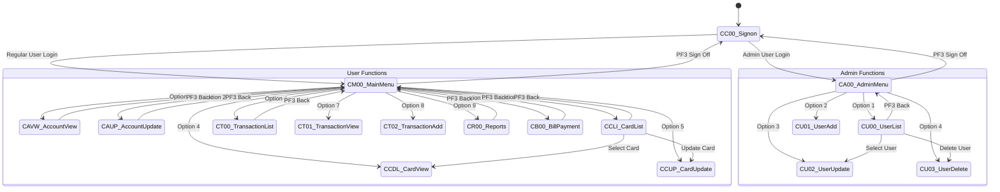
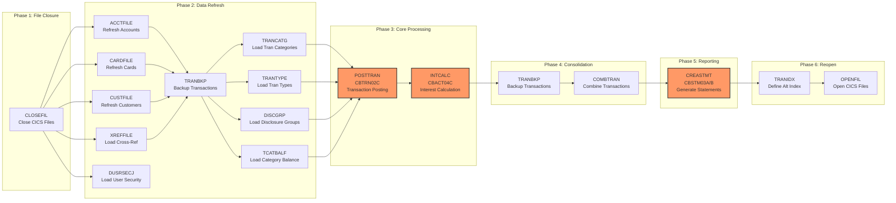
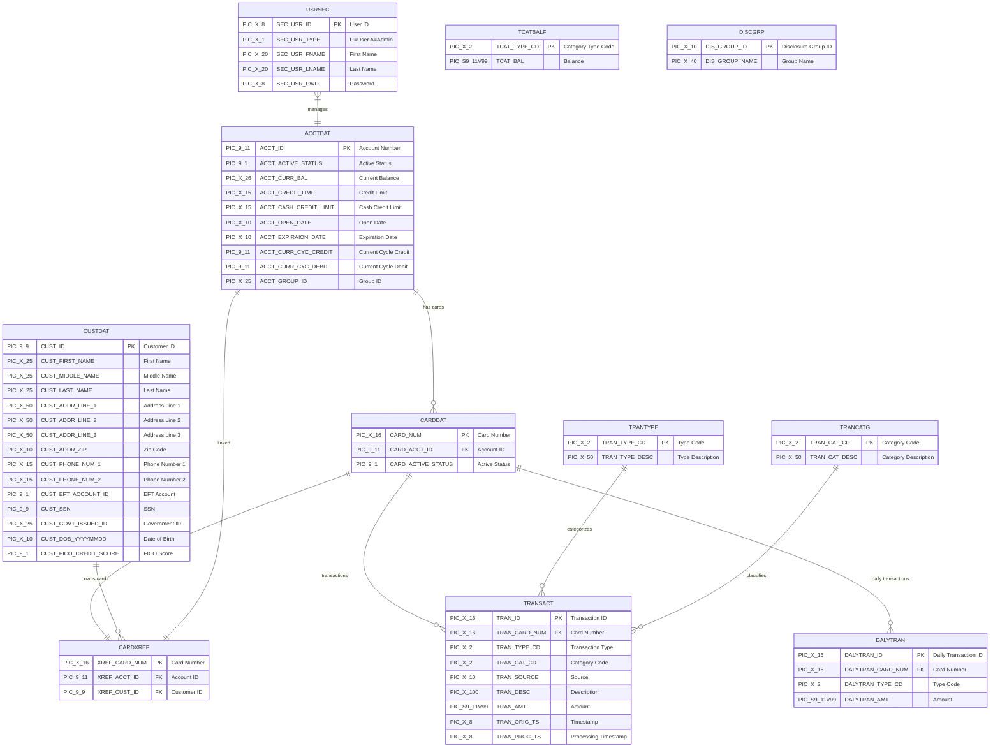
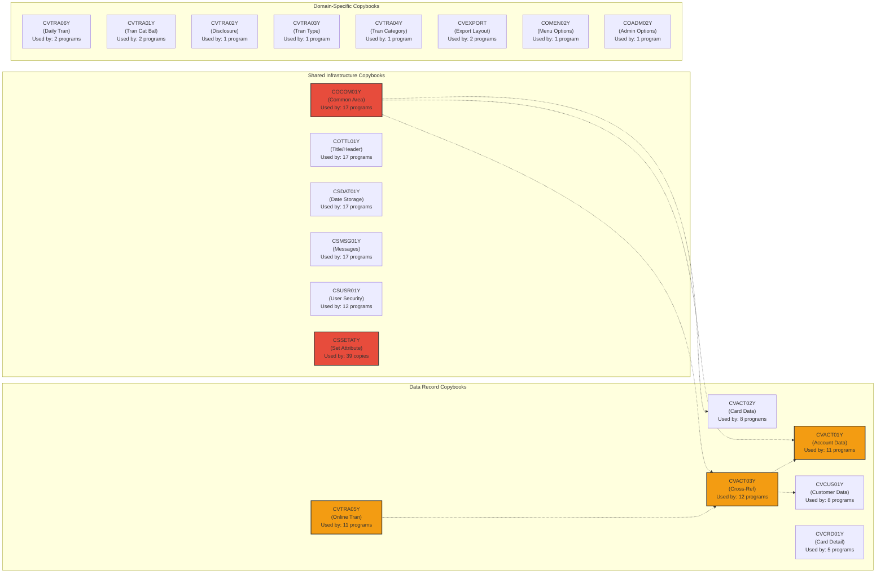
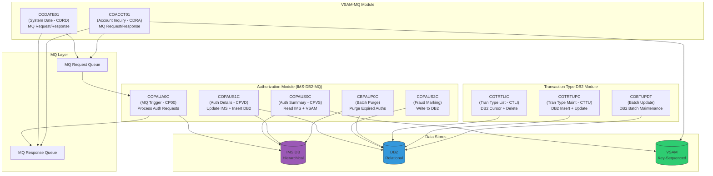
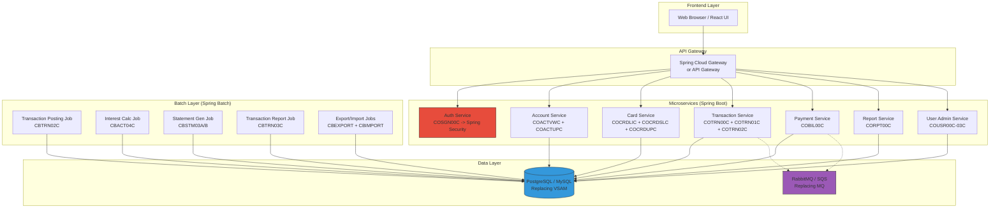

# CardDemo Application - Mermaid Architecture Diagrams

This document provides visual architecture diagrams for the CardDemo mainframe application using Mermaid syntax. These diagrams are intended to support modernization planning by making the system's structure, data flows, and dependencies explicit.

---

## 1. High-Level System Architecture

```mermaid
graph TB
    subgraph "3270 Terminal Layer"
        T[3270 Terminal Users]
    end

    subgraph "CICS Online Region"
        direction TB
        CC00[COSGN00C<br/>Signon - CC00]
        CM00[COMEN01C<br/>Main Menu - CM00]
        CA00[COADM01C<br/>Admin Menu - CA00]

        subgraph "User Functions"
            CAVW[COACTVWC<br/>Account View]
            CAUP[COACTUPC<br/>Account Update]
            CCLI[COCRDLIC<br/>Card List]
            CCDL[COCRDSLC<br/>Card View]
            CCUP[COCRDUPC<br/>Card Update]
            CT00[COTRN00C<br/>Transaction List]
            CT01[COTRN01C<br/>Transaction View]
            CT02[COTRN02C<br/>Transaction Add]
            CR00[CORPT00C<br/>Reports]
            CB00[COBIL00C<br/>Bill Payment]
        end

        subgraph "Admin Functions"
            CU00[COUSR00C<br/>User List]
            CU01[COUSR01C<br/>User Add]
            CU02[COUSR02C<br/>User Update]
            CU03[COUSR03C<br/>User Delete]
        end

        subgraph "Shared Utilities"
            CSUTL[CSUTLDTC<br/>Date Utility]
        end
    end

    subgraph "Batch Region (JCL)"
        CBTRN02[CBTRN02C<br/>Transaction Posting]
        CBACT04[CBACT04C<br/>Interest Calc]
        CBSTM03[CBSTM03A/B<br/>Statement Gen]
        CBTRN03[CBTRN03C<br/>Transaction Report]
        CBTRN01[CBTRN01C<br/>Daily Tran Process]
        CBEXP[CBEXPORT<br/>Data Export]
        CBIMP[CBIMPORT<br/>Data Import]
    end

    subgraph "VSAM Data Stores"
        USRSEC[(USRSEC<br/>User Security)]
        ACCTDAT[(ACCTDAT<br/>Account Master)]
        CARDDAT[(CARDDAT<br/>Card Master)]
        CUSTDAT[(CUSTDAT<br/>Customer Master)]
        CARDXREF[(CARDXREF<br/>Card Cross-Ref)]
        TRANSACT[(TRANSACT<br/>Transactions)]
        DALYTRAN[(DALYTRAN<br/>Daily Trans)]
        TCATBALF[(TCATBALF<br/>Category Balance)]
        DISCGRP[(DISCGRP<br/>Disclosure Groups)]
        TRANCATG[(TRANCATG<br/>Tran Categories)]
        TRANTYPE[(TRANTYPE<br/>Tran Types)]
    end

    T --> CC00
    CC00 --> CM00
    CC00 --> CA00
    CM00 --> CAVW & CAUP & CCLI & CT00 & CT01 & CT02 & CR00 & CB00
    CCLI --> CCDL & CCUP
    CA00 --> CU00 & CU01 & CU02 & CU03

    CC00 -.-> USRSEC
    CAVW -.-> ACCTDAT & CARDXREF & CUSTDAT
    CAUP -.-> ACCTDAT & CARDXREF & CUSTDAT
    CCLI -.-> CARDDAT
    CCDL -.-> CARDDAT & CUSTDAT
    CCUP -.-> CARDDAT & CUSTDAT
    CT00 -.-> TRANSACT
    CT01 -.-> TRANSACT
    CT02 -.-> TRANSACT & ACCTDAT & CARDXREF
    CB00 -.-> ACCTDAT & CARDXREF & TRANSACT
    CU00 -.-> USRSEC
    CU01 -.-> USRSEC
    CU02 -.-> USRSEC
    CU03 -.-> USRSEC

    CBTRN02 -.-> DALYTRAN & TRANSACT & CARDXREF & ACCTDAT & TCATBALF
    CBACT04 -.-> TRANSACT & CARDXREF & ACCTDAT
    CBSTM03 -.-> TRANSACT & CARDXREF & CUSTDAT & ACCTDAT
    CBTRN03 -.-> TRANSACT & CARDXREF & TRANTYPE & TRANCATG

    style CC00 fill:#f9f,stroke:#333
    style CM00 fill:#bbf,stroke:#333
    style CA00 fill:#fbb,stroke:#333
```

---

## 2. CICS Transaction Navigation Flow

---

## 3. Batch Processing Pipeline

---

## 4. Data Model (VSAM Files and Copybook Record Layouts)

---

## 5. Program Call Graph and Inter-Program Dependencies

```mermaid
flowchart TB
    subgraph "Entry Points"
        COSGN00C["COSGN00C<br/>(Signon)"]
    end

    subgraph "Menu Dispatchers"
        COMEN01C["COMEN01C<br/>(Main Menu)"]
        COADM01C["COADM01C<br/>(Admin Menu)"]
    end

    subgraph "Online Programs - Account Domain"
        COACTVWC["COACTVWC<br/>(Account View)"]
        COACTUPC["COACTUPC<br/>(Account Update)"]
    end

    subgraph "Online Programs - Card Domain"
        COCRDLIC["COCRDLIC<br/>(Card List)"]
        COCRDSLC["COCRDSLC<br/>(Card View)"]
        COCRDUPC["COCRDUPC<br/>(Card Update)"]
    end

    subgraph "Online Programs - Transaction Domain"
        COTRN00C["COTRN00C<br/>(Transaction List)"]
        COTRN01C["COTRN01C<br/>(Transaction View)"]
        COTRN02C["COTRN02C<br/>(Transaction Add)"]
        CORPT00C["CORPT00C<br/>(Reports)"]
        COBIL00C["COBIL00C<br/>(Bill Payment)"]
    end

    subgraph "Online Programs - User Admin"
        COUSR00C["COUSR00C<br/>(User List)"]
        COUSR01C["COUSR01C<br/>(User Add)"]
        COUSR02C["COUSR02C<br/>(User Update)"]
        COUSR03C["COUSR03C<br/>(User Delete)"]
    end

    subgraph "Shared Utilities"
        CSUTLDTC["CSUTLDTC<br/>(Date Utility)"]
        COBDATFT["COBDATFT<br/>(Date Format - ASM)"]
        CEEDAYS["CEEDAYS<br/>(LE Date Routine)"]
    end

    subgraph "Batch Programs"
        CBTRN02C["CBTRN02C<br/>(Transaction Posting)"]
        CBACT04C["CBACT04C<br/>(Interest Calc)"]
        CBSTM03A["CBSTM03A<br/>(Statement Gen)"]
        CBSTM03B["CBSTM03B<br/>(Statement Detail)"]
        CBTRN01C["CBTRN01C<br/>(Daily Tran Process)"]
        CBTRN03C["CBTRN03C<br/>(Transaction Report)"]
        CBACT01C["CBACT01C<br/>(Account Read)"]
        CBEXPORT["CBEXPORT<br/>(Data Export)"]
        CBIMPORT["CBIMPORT<br/>(Data Import)"]
    end

    COSGN00C -->|XCTL| COMEN01C
    COSGN00C -->|XCTL| COADM01C

    COMEN01C -->|XCTL| COACTVWC
    COMEN01C -->|XCTL| COACTUPC
    COMEN01C -->|XCTL| COCRDLIC
    COMEN01C -->|XCTL| COCRDSLC
    COMEN01C -->|XCTL| COCRDUPC
    COMEN01C -->|XCTL| COTRN00C
    COMEN01C -->|XCTL| COTRN01C
    COMEN01C -->|XCTL| COTRN02C
    COMEN01C -->|XCTL| CORPT00C
    COMEN01C -->|XCTL| COBIL00C

    COADM01C -->|XCTL| COUSR00C
    COADM01C -->|XCTL| COUSR01C
    COADM01C -->|XCTL| COUSR02C
    COADM01C -->|XCTL| COUSR03C

    COCRDLIC -->|XCTL| COCRDSLC
    COCRDLIC -->|XCTL| COCRDUPC

    COTRN02C -->|CALL| CSUTLDTC
    CORPT00C -->|CALL| CSUTLDTC
    CSUTLDTC -->|CALL| CEEDAYS

    CBACT01C -->|CALL| COBDATFT
    CBSTM03A -->|CALL| CBSTM03B

    style COACTUPC fill:#ff6b6b,stroke:#333,stroke-width:3px
    style COCRDLIC fill:#ff9f43,stroke:#333,stroke-width:2px
    style COCRDUPC fill:#ff9f43,stroke:#333,stroke-width:2px
    style CBTRN02C fill:#ff9f43,stroke:#333,stroke-width:2px
```

---

## 6. Copybook Dependency Matrix

---

## 7. Online vs Batch Data Access Heatmap

```mermaid
flowchart TB
    subgraph "VSAM Data Files"
        USRSEC[(USRSEC)]
        ACCTDAT[(ACCTDAT)]
        CARDDAT[(CARDDAT)]
        CUSTDAT[(CUSTDAT)]
        CARDXREF[(CARDXREF)]
        TRANSACT[(TRANSACT)]
        DALYTRAN[(DALYTRAN)]
        TCATBALF[(TCATBALF)]
    end

    subgraph "Online CICS Programs (Read/Write)"
        O1[COSGN00C] -->|R| USRSEC
        O2[COACTVWC] -->|R| ACCTDAT
        O2 -->|R| CARDXREF
        O2 -->|R| CUSTDAT
        O3[COACTUPC] -->|R/W| ACCTDAT
        O3 -->|R| CARDXREF
        O3 -->|R| CUSTDAT
        O4[COCRDLIC] -->|R| CARDDAT
        O5[COCRDSLC] -->|R| CARDDAT
        O5 -->|R| CUSTDAT
        O6[COCRDUPC] -->|R| CARDDAT
        O6 -->|R| CUSTDAT
        O7[COTRN00C] -->|R| TRANSACT
        O8[COTRN01C] -->|R| TRANSACT
        O9[COTRN02C] -->|R/W| TRANSACT
        O9 -->|R| ACCTDAT
        O9 -->|R| CARDXREF
        O10[COBIL00C] -->|R/W| TRANSACT
        O10 -->|R/W| ACCTDAT
        O10 -->|R| CARDXREF
        O11[COUSR00C] -->|R| USRSEC
        O12[COUSR01C] -->|W| USRSEC
        O13[COUSR02C] -->|R/W| USRSEC
        O14[COUSR03C] -->|R/D| USRSEC
    end

    subgraph "Batch Programs (Sequential I/O)"
        B1[CBTRN02C] -->|R/W| DALYTRAN
        B1 -->|R/W| TRANSACT
        B1 -->|R| CARDXREF
        B1 -->|R/W| ACCTDAT
        B1 -->|R/W| TCATBALF
        B2[CBACT04C] -->|R/W| TRANSACT
        B2 -->|R| CARDXREF
        B2 -->|R| ACCTDAT
        B3[CBSTM03A] -->|R| TRANSACT
        B3 -->|R| CARDXREF
        B3 -->|R| CUSTDAT
        B3 -->|R| ACCTDAT
        B4[CBTRN03C] -->|R| TRANSACT
        B4 -->|R| CARDXREF
    end

    style ACCTDAT fill:#e74c3c,stroke:#333,stroke-width:3px
    style CARDXREF fill:#e74c3c,stroke:#333,stroke-width:3px
    style TRANSACT fill:#e74c3c,stroke:#333,stroke-width:3px
    style CUSTDAT fill:#f39c12,stroke:#333,stroke-width:2px
    style CARDDAT fill:#f39c12,stroke:#333,stroke-width:2px
    style USRSEC fill:#3498db,stroke:#333,stroke-width:2px
```

---

## 8. Optional Modules - IMS/DB2/MQ Integration

---

## 9. Modernization Target Architecture (Java/Spring)

