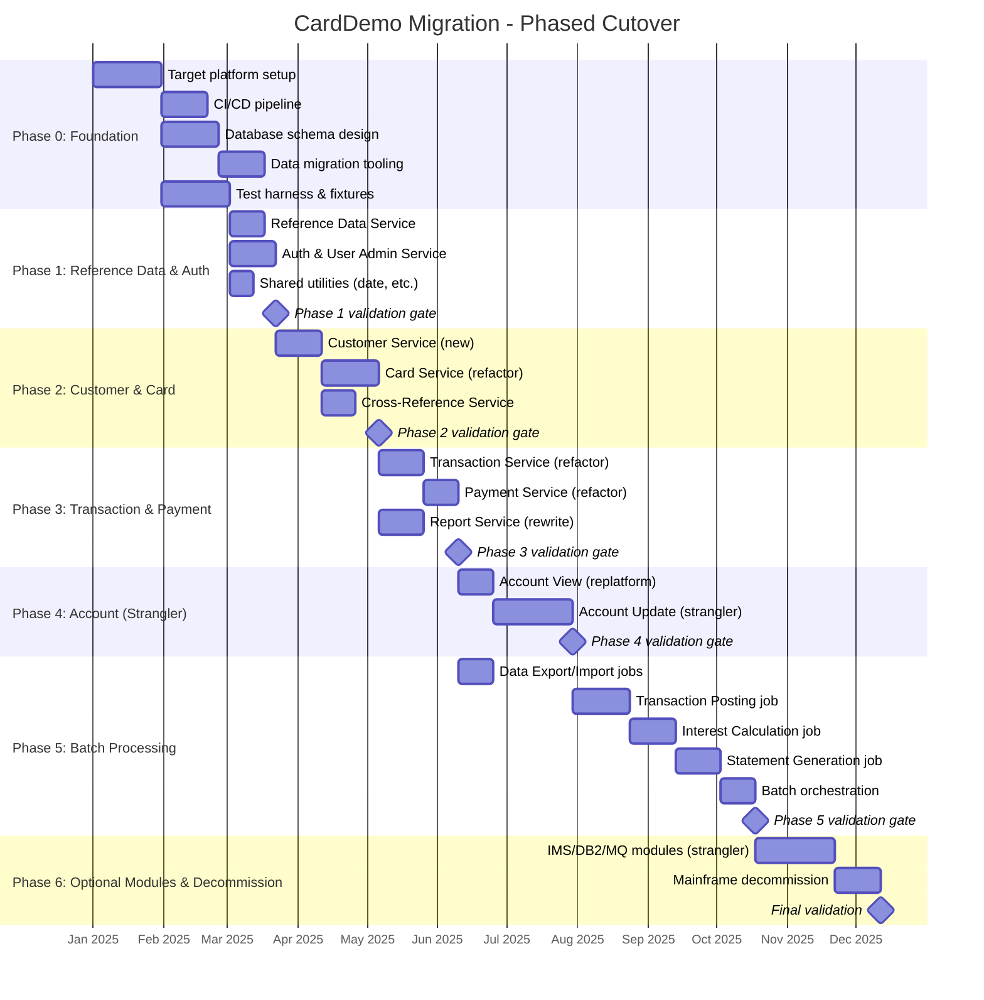
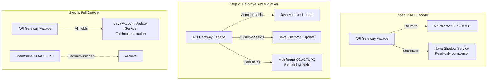
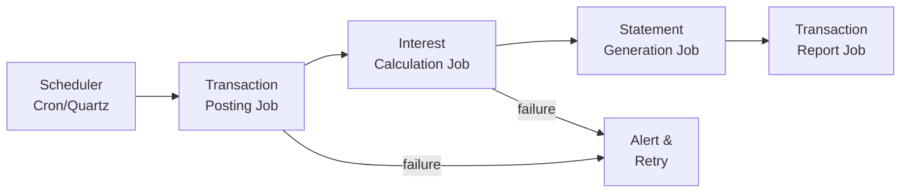
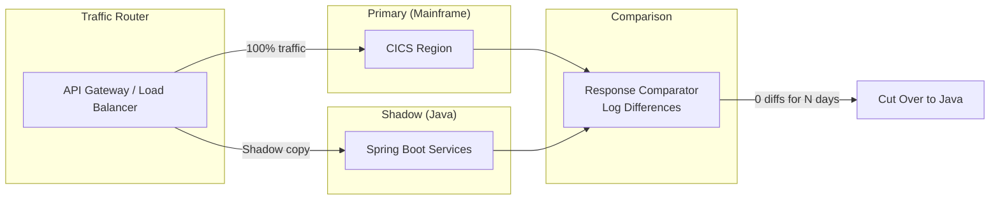

# CardDemo Phased Cutover Plan

This document defines the phased migration sequence for the CardDemo application, ordered from lowest-risk to highest-risk. Each phase includes entry criteria, deliverables, validation gates, and rollback procedures.

---

## Migration Timeline Overview

---

## Phase 0: Foundation (Weeks 1-8)

**Objective:** Establish the target platform, CI/CD pipelines, database schema, and test infrastructure before migrating any business logic.

### Deliverables

| # | Deliverable | Description |
|--:|:------------|:------------|
| 1 | **Target Platform** | Spring Boot 3.x project structure with Maven/Gradle. Microservice skeleton with shared libraries for logging, error handling, and health checks. |
| 2 | **Database Schema** | PostgreSQL (or MySQL) schema derived from VSAM copybook record layouts. Map CVACT01Y → `accounts`, CVACT02Y → `cards`, CVCUS01Y → `customers`, CVACT03Y → `card_xref`, CVTRA05Y → `transactions`, CSUSR01Y → `users`, reference data tables. |
| 3 | **Data Migration Tooling** | ETL pipeline to convert VSAM EBCDIC data (from `app/data/EBCDIC/`) to relational tables. Validate row counts and key field checksums against source. |
| 4 | **CI/CD Pipeline** | GitHub Actions or Jenkins pipeline with build, unit test, integration test, and deployment stages. Container images for each microservice. |
| 5 | **Test Harness** | Regression test suite derived from mainframe test scenarios. Load sample data from `app/data/ASCII/`. Automated comparison of COBOL output vs Java output for each functional area. |

### Entry Criteria
- Project charter approved
- Team staffed and trained on Spring Boot, JPA, and Spring Batch
- Access to mainframe for parallel testing

### Exit Criteria
- All 11 VSAM file structures mapped to relational tables
- Sample data loaded and queryable
- CI/CD pipeline deploying to staging environment
- Test harness executing against empty service stubs

---

## Phase 1: Reference Data, Auth & Utilities (Weeks 9-12)

**Risk Level: Lowest**

**Objective:** Migrate the least-coupled, most-foundational services first. These have no downstream dependencies and serve as the building blocks for all subsequent phases.

### 1A. Reference Data Service

| Attribute | Value |
|:----------|:------|
| Source programs | JCL loads (TRANTYPE, TRANCATG, DISCGRP, TCATBALF) |
| Strategy | Rewrite |
| VSAM files | TRANTYPE, TRANCATG, DISCGRP, TCATBALF |
| Target | Spring Boot REST service with JPA repositories |
| Endpoints | `GET /api/transaction-types`, `GET /api/transaction-categories`, `GET /api/disclosure-groups` |

**Validation Gate:**
- [ ] All reference data loaded from ASCII sample files matches VSAM content
- [ ] API responses match COBOL copybook field values exactly
- [ ] No other service depends on mainframe reference data files

### 1B. Auth & User Admin Service

| Attribute | Value |
|:----------|:------|
| Source programs | COSGN00C, COMEN01C, COADM01C, COUSR00C-03C |
| Strategy | Rewrite |
| VSAM files | USRSEC |
| Target | Spring Security with `UserDetailsService`, JWT tokens, role-based access |
| Endpoints | `POST /api/auth/login`, `GET /api/users` (paginated), `POST/PUT/DELETE /api/users/{id}` |

**Validation Gate:**
- [ ] ADMIN001/PASSWORD and USER0001/PASSWORD authenticate successfully
- [ ] Role-based access enforced (admin endpoints restricted)
- [ ] User CRUD operations match COBOL behavior (add, update, delete, list with pagination)

### 1C. Shared Utilities

| Attribute | Value |
|:----------|:------|
| Source programs | CSUTLDTC (157 LOC), COBSWAIT (41 LOC) |
| Strategy | Rewrite |
| Target | `java.time` for date operations, `ScheduledExecutorService` for waits |

**Validation Gate:**
- [ ] Date conversion utility produces identical results to CEEDAYS for all test dates
- [ ] Unit tests cover edge cases (leap years, century boundaries)

### Phase 1 Rollback Procedure
- Revert to mainframe COSGN00C for authentication
- No other services depend on Phase 1 outputs yet
- Database rollback: drop `users` and reference data tables

---

## Phase 2: Customer & Card Services (Weeks 13-18)

**Risk Level: Low-Medium**

**Objective:** Extract the Customer bounded context (currently hidden) and migrate the Card domain. Establish the Cross-Reference Service that decouples card-account-customer relationships.

### 2A. Customer Service (New)

| Attribute | Value |
|:----------|:------|
| Source | No dedicated COBOL program — embedded in Account/Card contexts |
| Strategy | Rewrite (new service for a hidden context) |
| VSAM files | CUSTDAT |
| Target | `CustomerService` with JPA `CustomerRepository` |
| Endpoints | `GET /api/customers/{id}`, `PUT /api/customers/{id}`, `GET /api/customers?search=...` |

**Validation Gate:**
- [ ] All 500-byte CUSTDAT records migrated to `customers` table
- [ ] Customer lookups by ID return identical data to VSAM reads
- [ ] Search by name/SSN produces correct results

### 2B. Card Service (Refactor)

| Attribute | Value |
|:----------|:------|
| Source programs | COCRDLIC (1,459 LOC), COCRDSLC (887 LOC), COCRDUPC (1,560 LOC) |
| Strategy | Refactor |
| VSAM files | CARDDAT, CARDXREF (via Cross-Ref Service), CUSTDAT (via Customer Service) |
| Target | `CardService` with paginated list, detail view, and update endpoints |
| Endpoints | `GET /api/cards` (paginated), `GET /api/cards/{num}`, `PUT /api/cards/{num}` |

**Key Migration Challenges:**
1. COCRDLIC browse pattern (STARTBR/READNEXT/READPREV) → Spring Data `Pageable` with keyset pagination
2. COCRDLIC 16 GO TOs → restructure to if-else and early returns
3. COCRDUPC 21 GO TOs → validation chain refactoring
4. Cross-reference lookups → call Cross-Ref Service API

**Validation Gate:**
- [ ] Card list pagination matches COBOL browse behavior (same ordering, same page boundaries)
- [ ] Card detail view shows identical data to COCRDSLC output
- [ ] Card update applies same validation rules as COCRDUPC
- [ ] GO TO-derived control flow produces identical outcomes for all test cases

### 2C. Cross-Reference Service

| Attribute | Value |
|:----------|:------|
| Source | CARDXREF VSAM file (CVACT03Y — 50 bytes) |
| Strategy | Rewrite (infrastructure service) |
| Target | Thin query service or embedded in each consuming service's database as foreign keys |
| Endpoints | `GET /api/xref/card/{num}`, `GET /api/xref/account/{id}`, `GET /api/xref/customer/{id}` |

**Validation Gate:**
- [ ] All cross-reference records migrated
- [ ] Lookup by card number returns correct account and customer IDs
- [ ] Lookup by account ID returns all associated cards

### Phase 2 Rollback Procedure
- Card operations fall back to mainframe COCRDLIC/COCRDSLC/COCRDUPC
- Customer data remains in both mainframe VSAM and new database (dual-write during transition)
- Cross-reference service is stateless — no rollback needed beyond traffic routing

---

## Phase 3: Transaction & Payment Services (Weeks 19-24)

**Risk Level: Medium**

**Objective:** Migrate the transaction domain including online list/view/add, bill payment, and reporting. This phase introduces cross-context writes (bill payment updates account balances).

### 3A. Transaction Service (Refactor)

| Attribute | Value |
|:----------|:------|
| Source programs | COTRN00C (699 LOC), COTRN01C (330 LOC), COTRN02C (783 LOC) |
| Strategy | Refactor |
| VSAM files | TRANSACT (primary), ACCTDAT (validation), CARDXREF (lookup) |
| Target | `TransactionService` with paginated list, detail, and create endpoints |
| Endpoints | `GET /api/transactions` (paginated), `GET /api/transactions/{id}`, `POST /api/transactions` |

**Key Migration Challenges:**
1. COTRN02C calls CSUTLDTC for date validation → use `java.time` (migrated in Phase 1)
2. COTRN02C reads ACCTDAT and CARDXREF for validation → API calls to Account and Cross-Ref services
3. Transaction ID generation (COBOL uses EIBTASKN + timestamp) → UUID or database sequence

**Validation Gate:**
- [ ] Transaction list pagination matches COBOL behavior
- [ ] Transaction add validates card number, account status, and date range identically to COTRN02C
- [ ] All sample transactions from `app/data/ASCII/` load and display correctly

### 3B. Payment Service (Refactor)

| Attribute | Value |
|:----------|:------|
| Source programs | COBIL00C (572 LOC) |
| Strategy | Refactor |
| VSAM files | TRANSACT (write), ACCTDAT (read + write), CARDXREF (read) |
| Target | `PaymentService.processBillPayment()` with event-driven account update |

**Critical Validation:**
- [ ] Payment creates transaction record identical to COBIL00C output
- [ ] Account balance updated correctly (debit amount, update cycle totals)
- [ ] Concurrent payment handling (COBOL had CICS task-level locking — need JPA optimistic locking)
- [ ] Financial calculations match to the cent (COMP-3 decimal → `BigDecimal`)

### 3C. Report Service (Rewrite)

| Attribute | Value |
|:----------|:------|
| Source programs | CORPT00C (649 LOC) |
| Strategy | Rewrite |
| Target | `ReportService` with PDF/CSV generation |
| Endpoints | `POST /api/reports/transactions` (returns PDF/CSV) |

**Validation Gate:**
- [ ] Report date range filtering produces same transaction set as CORPT00C
- [ ] Report totals match COBOL output

### Phase 3 Rollback Procedure
- Route transaction operations back to mainframe COTRN00C/COTRN01C/COTRN02C
- Bill payment is the highest-risk: if issues, revert COBIL00C with mainframe TRANSACT + ACCTDAT
- Dual-write to both mainframe and new database during transition for bill payments

---

## Phase 4: Account Service — Strangler Fig (Weeks 25-32)

**Risk Level: High to Critical**

**Objective:** Migrate the account domain. COACTVWC (view) is refactored directly. COACTUPC (update) — the most complex program in the system — is migrated incrementally using the strangler fig pattern.

### 4A. Account View (Replatform → Refactor)

| Attribute | Value |
|:----------|:------|
| Source programs | COACTVWC (941 LOC) |
| Strategy | Replatform then refactor |
| Target | `AccountService.getAccountDetails()` |
| Endpoints | `GET /api/accounts/{id}` (returns account + card + customer composite) |

**Validation Gate:**
- [ ] Account view returns identical composite data (account + cards + customer) to COACTVWC
- [ ] All 9 GO TO paths produce correct results

### 4B. Account Update (Strangler Fig)

| Attribute | Value |
|:----------|:------|
| Source programs | COACTUPC (4,236 LOC — **Critical**) |
| Strategy | Strangler Fig → incremental rewrite |
| Target | `AccountService.updateAccount()` decomposed into sub-operations |

**Strangler Fig Approach:**

**Incremental Steps:**
1. **Shadow mode (2 weeks):** Route all account updates to mainframe. Java service receives a copy, processes it, and logs differences. No writes.
2. **Account-only fields (2 weeks):** Java service handles account-level fields (balance, limits, status). Customer fields still routed to mainframe.
3. **Customer fields (2 weeks):** Java service handles customer updates via Customer Service events.
4. **Validation parity (1 week):** All 168 IF conditions and 20 EVALUATE blocks replicated in Java Bean Validation.
5. **Full cutover (1 week):** All updates handled by Java. Mainframe COACTUPC decommissioned.

**Validation Gate:**
- [ ] Shadow mode: 0 differences between mainframe and Java output for 1,000+ test transactions
- [ ] Each field migration step: no regressions in existing tests
- [ ] Full cutover: all 51 GO TO execution paths produce identical results
- [ ] Attribute setting (39 CSSETATY copies) → field-level UI validation in web frontend
- [ ] Financial field precision: COMP-3 → `BigDecimal` equivalence verified

### Phase 4 Rollback Procedure
- Strangler pattern enables instant rollback at any step — just re-route API facade to mainframe
- Shadow mode means zero risk during comparison phase
- Each field migration step is independently reversible

---

## Phase 5: Batch Processing Migration (Weeks 33-42)

**Risk Level: High**

**Objective:** Migrate the batch processing pipeline from JCL/COBOL to Spring Batch. This is the most cross-cutting migration phase.

### 5A. Data Export/Import Jobs

| Attribute | Value |
|:----------|:------|
| Source programs | CBEXPORT (582 LOC), CBIMPORT (487 LOC) |
| Strategy | Replatform → Refactor |
| Target | Spring Batch `FlatFileItemReader`/`FlatFileItemWriter` |

### 5B. Transaction Posting Job

| Attribute | Value |
|:----------|:------|
| Source programs | CBTRN02C (731 LOC) |
| Strategy | Refactor |
| Target | Spring Batch chunk-oriented job: read daily transactions, validate, post to master, update balances |

**Critical Validation:**
- [ ] Posted transaction totals match COBOL output exactly
- [ ] Account balance updates match (COMP-3 precision)
- [ ] Rejected transaction handling matches DALYREJS output
- [ ] Category balance (TCATBALF) updates correct

### 5C. Interest Calculation Job

| Attribute | Value |
|:----------|:------|
| Source programs | CBACT04C (652 LOC) |
| Strategy | Refactor |
| Target | Spring Batch step with `BigDecimal` financial calculations |

**Critical Validation:**
- [ ] Interest calculations match to the cent for all test accounts
- [ ] Rate application logic matches 86 IF conditions in CBACT04C
- [ ] Compound vs simple interest rules preserved

### 5D. Statement Generation Job

| Attribute | Value |
|:----------|:------|
| Source programs | CBSTM03A (924 LOC), CBSTM03B (230 LOC) |
| Strategy | Rewrite |
| Target | Spring Batch job with Thymeleaf/JasperReports |

### 5E. Batch Orchestration

| Attribute | Value |
|:----------|:------|
| Source | JCL job chain (CLOSEFIL → ... → OPENFIL) |
| Strategy | Rewrite |
| Target | Spring Batch job orchestrator or Spring Cloud Data Flow |

**Target Batch Pipeline:**

**Validation Gate:**
- [ ] Full batch cycle produces identical output to mainframe batch cycle
- [ ] Run parallel: mainframe and Java batch on same input data, diff all outputs
- [ ] Performance: Java batch completes within acceptable time window
- [ ] Error handling: failed jobs retry correctly, alerts fire

### Phase 5 Rollback Procedure
- Run mainframe batch cycle in parallel throughout Phase 5
- If Java batch produces incorrect results, fall back to mainframe batch
- Dual-run for minimum 3 batch cycles before decommissioning mainframe batch

---

## Phase 6: Optional Modules & Decommission (Weeks 43-50)

**Risk Level: High (middleware dependencies)**

**Objective:** Migrate optional IMS/DB2/MQ modules and decommission the mainframe.

### 6A. Optional Module Migration

| Module | Programs | Strategy | Target |
|:-------|:---------|:---------|:-------|
| Authorization (IMS/DB2/MQ) | COPAUA0C, COPAUS0C/1C/2C, CBPAUP0C | Strangler Fig | Spring Boot + RabbitMQ/SQS + JPA |
| Transaction Type (DB2) | COTRTLIC, COTRTUPC, COBTUPDT | Refactor | Spring Boot + JPA (DB2 SQL → JPA queries) |
| VSAM-MQ | CODATE01, COACCT01 | Rewrite | Spring Boot REST endpoints (no MQ needed) |

### 6B. Mainframe Decommission Checklist

- [ ] All online transactions routed to Java services (zero mainframe traffic for 30 days)
- [ ] All batch jobs running on Spring Batch (3 successful parallel runs)
- [ ] All MQ queues drained and redirected
- [ ] Data migration verified: row counts, checksums, spot checks
- [ ] CICS region shut down
- [ ] VSAM files archived
- [ ] JCL jobs disabled
- [ ] Mainframe LPAR released

---

## Cutover Decision Matrix

Each phase must pass its validation gate before proceeding. Use this matrix to decide cutover readiness:

| Criterion | Threshold | Measurement |
|:----------|:----------|:------------|
| Functional parity | 100% of test cases pass | Automated regression suite |
| Data accuracy | 0 discrepancies in financial fields | Parallel run comparison |
| Performance | < 2x mainframe response time | Load test results |
| Error rate | < 0.1% in production traffic | APM monitoring |
| Rollback tested | Rollback procedure verified | Disaster recovery drill |
| Team readiness | On-call rotation staffed | Operations runbook |

---

## Parallel Run Strategy

During each phase, the mainframe and Java systems run in parallel:

**Shadow Duration by Phase:**
| Phase | Minimum Shadow Period | Zero-Diff Threshold |
|------:|:---------------------|:--------------------|
| 1 | 1 week | 3 consecutive days |
| 2 | 2 weeks | 5 consecutive days |
| 3 | 2 weeks | 7 consecutive days (financial data) |
| 4 | 3 weeks | 14 consecutive days (COACTUPC complexity) |
| 5 | 3 batch cycles | 3 consecutive zero-diff batch runs |
| 6 | 2 weeks | 7 consecutive days |
