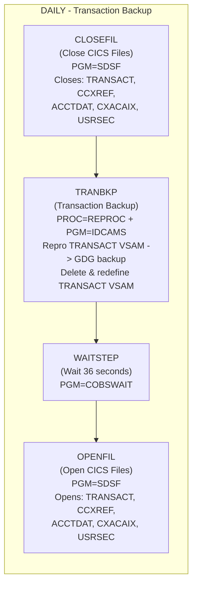
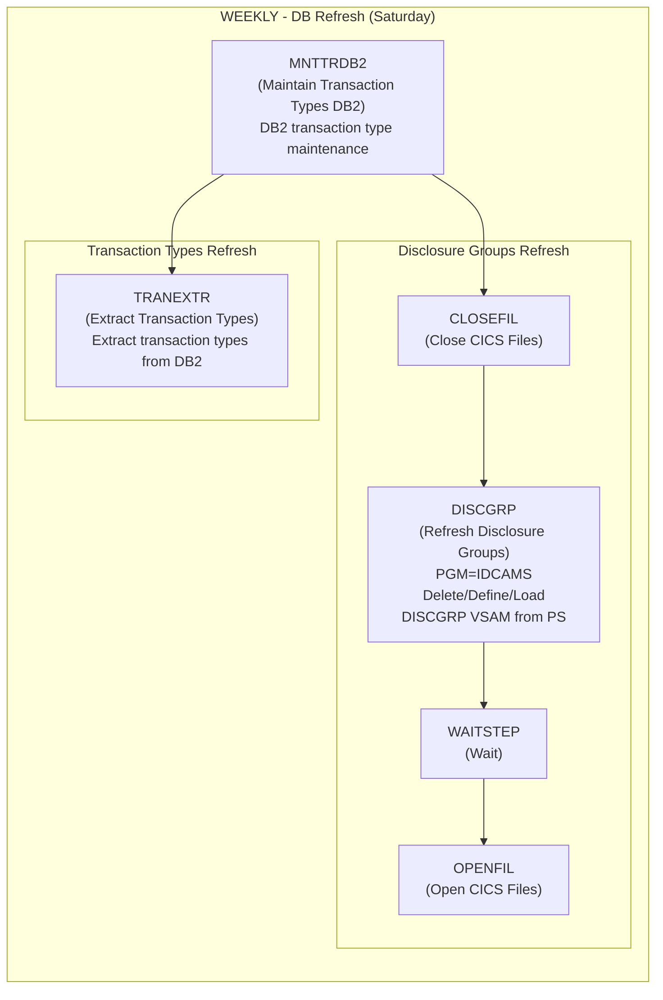
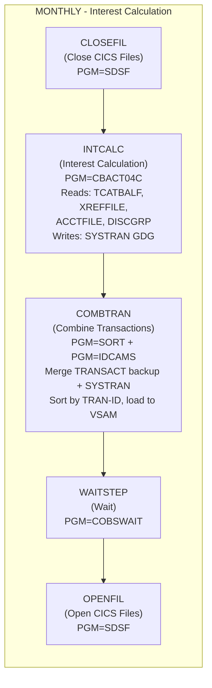
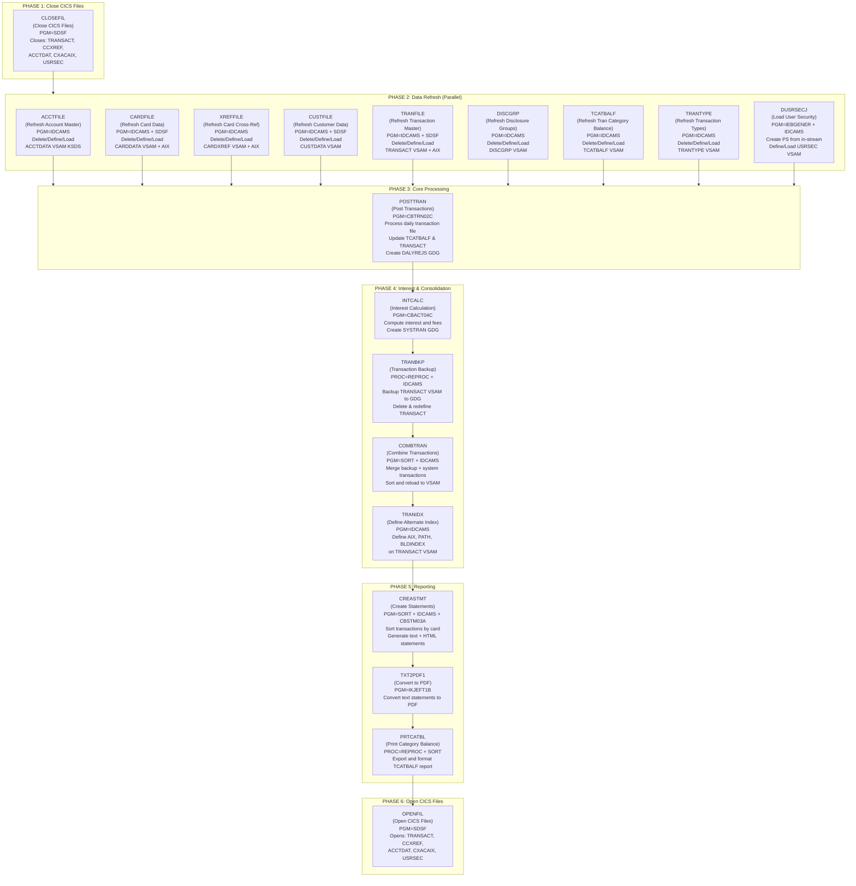

# CardDemo Batch Job Flow Diagram (Before Migration)

This document describes the complete batch job flow for the CardDemo mainframe credit card management application **before** migration to Java. The jobs are organized by scheduling frequency and execution dependencies.

---

## Scheduling Overview

| Schedule | Jobs | Description |
|----------|------|-------------|
| **Daily** | CLOSEFIL -> TRANBKP -> WAITSTEP -> OPENFIL | Transaction backup cycle |
| **Weekly (Sat)** | MNTTRDB2 -> (CLOSEFIL -> DISCGRP -> WAITSTEP -> OPENFIL) and (TRANEXTR) | Disclosure groups and transaction types DB refresh |
| **Monthly** | CLOSEFIL -> INTCALC -> COMBTRAN -> WAITSTEP -> OPENFIL | Interest calculation and transaction consolidation |
| **On-Demand** | Full batch cycle (see below) | Data refresh + full processing |

---

## Job Flow Diagrams

### 1. Daily Batch Cycle (Transaction Backup)

Runs every day. Backs up the transaction master VSAM file.

### 2. Weekly Batch Cycle (Transaction Types DB Refresh + Disclosure Groups Refresh)

Runs every Saturday. Two parallel flows triggered after MNTTRDB2 completes.

### 3. Monthly Batch Cycle (Interest Calculation)

Runs monthly. Calculates interest/fees and consolidates transactions.

### 4. On-Demand Full Batch Cycle

The complete batch run (from `run_full_batch.sh` and CA7 scheduler) covers data refresh, core processing, and reporting.

### 5. CA7 Scheduler Chains (Additional Flows)

From the CA7 scheduler definition, additional triggered chains include:

```mermaid
flowchart TD
    subgraph CA7_CHAIN1["CA7: Posting Chain"]
        C1_CLOSEFIL["CLOSEFIL"] --> C1_CBPAUP0J["CBPAUP0J\n(Purge Auth Pending)"]
        C1_CBPAUP0J --> C1_POSTTRAN["POSTTRAN\n(Post Transactions)"]
        C1_POSTTRAN --> C1_WAITSTEP["WAITSTEP"]
        C1_WAITSTEP --> C1_OPENFIL["OPENFIL"]
    end

    subgraph CA7_CHAIN2["CA7: Transaction Type Refresh Chain"]
        C2_CLOSEFIL["CLOSEFIL"] --> C2_TRANTYPE["TRANTYPE"]
        C2_TRANTYPE --> C2_WAITSTEP["WAITSTEP"]
    end

    subgraph CA7_CHAIN3["CA7: Data Validation Chain"]
        C3_CLOSEFIL["CLOSEFIL"] --> C3_READACCT["READACCT\nPGM=CBACT01C"]
        C3_READACCT --> C3_READCARD["READCARD\nPGM=CBACT02C"]
        C3_READCARD --> C3_READCUST["READCUST\nPGM=CBCUS01C"]
        C3_READCUST --> C3_READXREF["READXREF\nPGM=CBACT03C"]
        C3_READXREF --> C3_WAITSTEP["WAITSTEP"]
        C3_WAITSTEP --> C3_OPENFIL["OPENFIL"]
    end

    subgraph CA7_CHAIN4["CA7: Statement Generation Chain"]
        C4_CLOSEFIL["CLOSEFIL"] --> C4_CREASTMT["CREASTMT\nPGM=CBSTM03A"]
        C4_CREASTMT --> C4_TXT2PDF1["TXT2PDF1\nText-to-PDF Conversion"]
        C4_TXT2PDF1 --> C4_WAITSTEP["WAITSTEP"]
        C4_WAITSTEP --> C4_OPENFIL["OPENFIL"]
    end

    subgraph CA7_CHAIN5["CA7: Category Balance Reporting"]
        C5_CLOSEFIL["CLOSEFIL"] --> C5_TRANCATG["TRANCATG\nRefresh Transaction Category"]
        C5_TRANCATG --> C5_WAITSTEP1["WAITSTEP"]
        C5_CLOSEFIL2["CLOSEFIL (2nd)"] --> C5_TCATBALF["TCATBALF\nRefresh Category Balance"]
        C5_TCATBALF --> C5_WAITSTEP2["WAITSTEP"]
        C5_CLOSEFIL3["CLOSEFIL (3rd)"] --> C5_PRTCATBL["PRTCATBL\nPrint Category Balance"]
        C5_PRTCATBL --> C5_WAITSTEP3["WAITSTEP"]
        C5_WAITSTEP3 --> C5_OPENFIL["OPENFIL"]
    end
```

---

## VSAM Data Files (Pre-Migration)

| VSAM File | Record Size | Key | Description | Used By Jobs |
|-----------|-------------|-----|-------------|--------------|
| `ACCTDATA.VSAM.KSDS` | 300 bytes | 11 bytes @ 0 | Account Master | ACCTFILE, POSTTRAN, INTCALC, CREASTMT, CBEXPORT |
| `CARDDATA.VSAM.KSDS` | 150 bytes | 16 bytes @ 0 | Card Data + AIX on Acct ID | CARDFILE, CBEXPORT |
| `CARDXREF.VSAM.KSDS` | 50 bytes | 16 bytes @ 0 | Card Cross-Reference + AIX | XREFFILE, POSTTRAN, INTCALC, CREASTMT, CBEXPORT |
| `CUSTDATA.VSAM.KSDS` | 500 bytes | 9 bytes @ 0 | Customer Data | CUSTFILE, CREASTMT, CBEXPORT |
| `TRANSACT.VSAM.KSDS` | 350 bytes | 16 bytes @ 0 | Transaction Master + AIX | TRANFILE, POSTTRAN, TRANBKP, COMBTRAN, TRANIDX, CREASTMT, CBEXPORT |
| `TCATBALF.VSAM.KSDS` | 50 bytes | 17 bytes @ 0 | Transaction Category Balance | TCATBALF, POSTTRAN, INTCALC, PRTCATBL |
| `TRANTYPE.VSAM.KSDS` | 60 bytes | 2 bytes @ 0 | Transaction Type Codes | TRANTYPE, TRANREPT |
| `TRANCATG.VSAM.KSDS` | 60 bytes | 6 bytes @ 0 | Transaction Categories | TRANCATG, TRANREPT |
| `DISCGRP.VSAM.KSDS` | 50 bytes | 16 bytes @ 0 | Disclosure Groups | DISCGRP, INTCALC |
| `USRSEC.VSAM.KSDS` | 80 bytes | 8 bytes @ 0 | User Security | DUSRSECJ |

---

## COBOL Batch Programs

| Program | JCL Job | Description | Input Files | Output Files |
|---------|---------|-------------|-------------|--------------|
| `CBTRN02C` | POSTTRAN | Process daily transactions, update category balances | TRANFILE, DALYTRAN, XREFFILE, ACCTFILE, TCATBALF | DALYREJS (GDG) |
| `CBACT04C` | INTCALC | Calculate interest and fees on transaction balances | TCATBALF, XREFFILE, ACCTFILE, DISCGRP | SYSTRAN (GDG) |
| `CBSTM03A` | CREASTMT | Generate account statements (text + HTML) | TRNXFILE, XREFFILE, ACCTFILE, CUSTFILE | STATEMNT.PS, STATEMNT.HTML |
| `CBSTM03B` | (called by CBSTM03A) | Subroutine for HTML formatting | - | - |
| `CBTRN03C` | TRANREPT | Produce formatted transaction report | TRANFILE, CARDXREF, TRANTYPE, TRANCATG, DATEPARM | TRANREPT (GDG) |
| `CBACT01C` | READACCT | Read/validate account master file | ACCTFILE | PSCOMP, ARRYPS, VBPS |
| `CBACT02C` | READCARD | Read/validate card data file | CARDDATA | (output files) |
| `CBACT03C` | READXREF | Read/validate cross-reference file | XREFFILE | (output files) |
| `CBCUS01C` | READCUST | Read/validate customer data file | CUSTFILE | (output files) |
| `COBSWAIT` | WAITSTEP | Wait utility (centisecond delay) | SYSIN (delay value) | - |
| `CBEXPORT` | CBEXPORT | Export all VSAM data to a combined export file | All VSAM files | EXPORT.DATA |
| `CBIMPORT` | CBIMPORT | Import from export file into normalized flat files | EXPORT.DATA | CUSTDATA.IMPORT, ACCTDATA.IMPORT, etc. |

---

## GDG (Generation Data Group) Files

| GDG Base | Generations | Created By | Description |
|----------|-------------|------------|-------------|
| `DALYREJS` | 5 | POSTTRAN | Daily rejected transactions |
| `TRANSACT.BKUP` | (per TRANBKP) | TRANBKP, TRANREPT | Transaction master backups |
| `SYSTRAN` | (per INTCALC) | INTCALC | System-generated transactions (interest/fees) |
| `TRANSACT.COMBINED` | (per COMBTRAN) | COMBTRAN | Merged transaction file |
| `TRANSACT.DALY` | (per TRANREPT) | TRANREPT | Filtered daily transactions for reporting |
| `TRANREPT` | 10 | TRANREPT | Formatted transaction reports |
| `TCATBALF.BKUP` | (per PRTCATBL) | PRTCATBL | Category balance backup |

---

## Utility/Setup Jobs (Run Once or As-Needed)

| Job | Purpose |
|-----|---------|
| `DEFGDGB` / `DEFGDGD` | Define GDG bases for backup/report files |
| `DALYREJS` | Define GDG base for daily rejected transactions |
| `REPTFILE` | Define GDG base for transaction reports |
| `ESDSRRDS` | Define ESDS/RRDS VSAM clusters |
| `CBADMCDJ` | Define CICS resource definitions (CSD) for CardDemo |
| `CBEXPORT` | Export data for migration |
| `CBIMPORT` | Import data from export file |
| `FTPJCL` | FTP-based JCL submission |
| `INTRDRJ1` / `INTRDRJ2` | Internal reader jobs |
