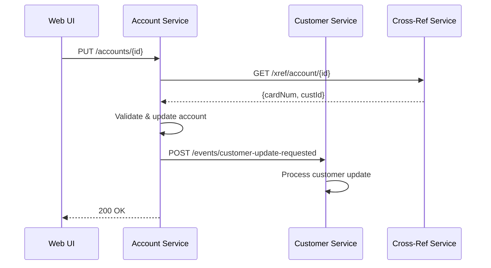
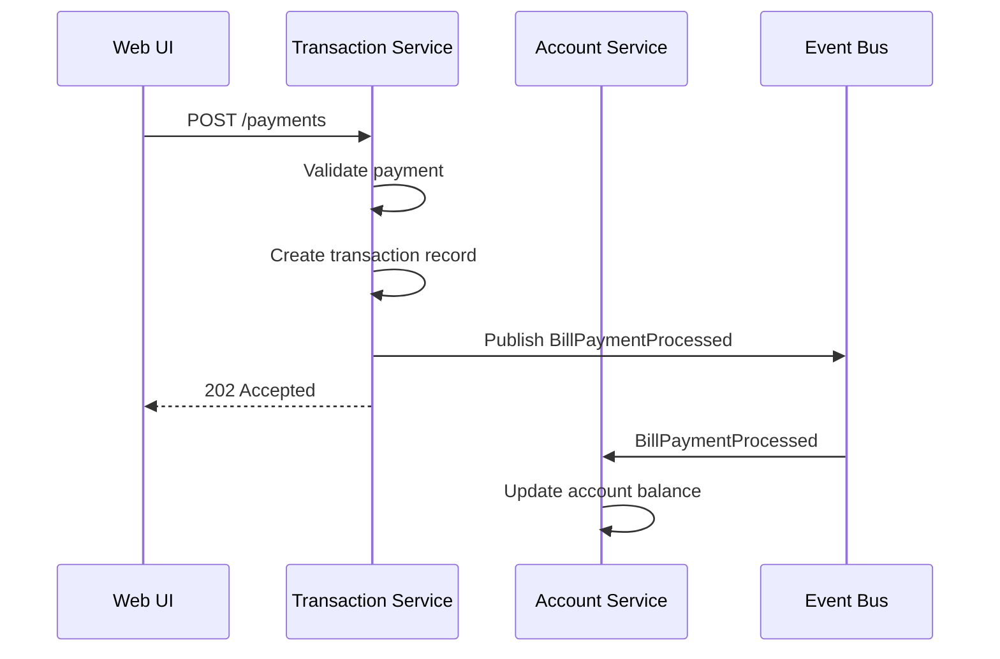
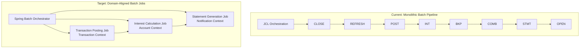
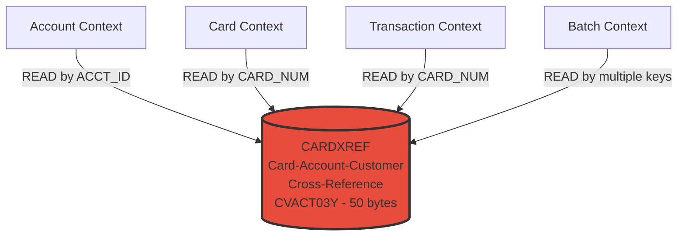

# CardDemo Domain Decomposition

This document identifies bounded contexts within the CardDemo COBOL application using Domain-Driven Design (DDD) principles. It maps COBOL programs, copybooks, and VSAM files to bounded contexts, analyzes extraction seams, and identifies shared kernel dependencies that must be carefully managed during migration.

---

## 1. Bounded Context Map

```mermaid
graph TB
    subgraph "Identity & Access Context"
        direction TB
        IAC_P["Programs: COSGN00C, COMEN01C, COADM01C"]
        IAC_D[(USRSEC)]
        IAC_C["Copybooks: CSUSR01Y, COCOM01Y"]
    end

    subgraph "Account Context"
        direction TB
        AC_P["Programs: COACTVWC, COACTUPC"]
        AC_D[(ACCTDAT)]
        AC_C["Copybooks: CVACT01Y, CVCRD01Y"]
    end

    subgraph "Card Context"
        direction TB
        CC_P["Programs: COCRDLIC, COCRDSLC, COCRDUPC"]
        CC_D[(CARDDAT)]
        CC_C["Copybooks: CVACT02Y, CVCRD01Y"]
    end

    subgraph "Customer Context"
        direction TB
        CUC_P["Programs: (embedded in Account/Card)"]
        CUC_D[(CUSTDAT)]
        CUC_C["Copybooks: CVCUS01Y"]
    end

    subgraph "Transaction Context"
        direction TB
        TC_P["Programs: COTRN00C, COTRN01C, COTRN02C,<br/>COBIL00C, CORPT00C"]
        TC_D[(TRANSACT)]
        TC_C["Copybooks: CVTRA05Y"]
    end

    subgraph "Batch Processing Context"
        direction TB
        BC_P["Programs: CBTRN02C, CBACT04C, CBTRN01C,<br/>CBTRN03C, CBSTM03A/B"]
        BC_D[(DALYTRAN<br/>TCATBALF)]
        BC_C["Copybooks: CVTRA06Y, CVTRA01Y"]
    end

    subgraph "Reference Data Context"
        direction TB
        RC_P["Programs: (JCL loads)"]
        RC_D[(TRANTYPE<br/>TRANCATG<br/>DISCGRP)]
        RC_C["Copybooks: CVTRA03Y, CVTRA04Y, CVTRA02Y"]
    end

    subgraph "User Admin Context"
        direction TB
        UA_P["Programs: COUSR00C-03C"]
        UA_D[(USRSEC)]
        UA_C["Copybooks: CSUSR01Y"]
    end

    subgraph "Data Exchange Context"
        direction TB
        DE_P["Programs: CBEXPORT, CBIMPORT"]
        DE_C["Copybooks: CVEXPORT"]
    end

    subgraph "Shared Kernel"
        direction TB
        SK_XREF[(CARDXREF)]
        SK_CPY["COCOM01Y, COTTL01Y, CSDAT01Y, CSMSG01Y"]
    end

    AC_P -.->|reads| SK_XREF
    CC_P -.->|reads| SK_XREF
    TC_P -.->|reads| SK_XREF
    BC_P -.->|reads| SK_XREF
    AC_P -.->|reads| CUC_D
    CC_P -.->|reads| CUC_D
    TC_P -.->|reads| AC_D
    BC_P -.->|reads/writes| AC_D
    BC_P -.->|reads/writes| TC_D

    style SK_XREF fill:#e74c3c,stroke:#333,stroke-width:3px
    style SK_CPY fill:#e74c3c,stroke:#333,stroke-width:2px
```

---

## 2. Bounded Context Definitions

### 2.1 Identity & Access Context

| Attribute | Value |
|:----------|:------|
| **Aggregate Root** | User (CSUSR01Y record) |
| **Programs** | COSGN00C (authentication), COMEN01C (user menu), COADM01C (admin menu) |
| **VSAM Files** | USRSEC (read for auth) |
| **Entities** | User credentials, user type (Regular/Admin), session state |
| **Domain Events** | UserAuthenticated, UserSessionStarted, UserSignedOff |
| **Boundaries** | Owns authentication and authorization decisions. Publishes user identity to other contexts via COCOM01Y common area. |

**Extraction Seam Analysis:**
- **Clean seam.** Authentication reads USRSEC and populates COCOM01Y with user identity. Other contexts consume this identity but never write back to USRSEC (except User Admin).
- **Seam type:** Anti-corruption layer at the COCOM01Y boundary. Replace COCOM01Y user fields with a JWT token or session-scoped `SecurityContext`.
- **Risk:** Low. The only coupling is the common area, which is a natural API boundary.

---

### 2.2 Account Context

| Attribute | Value |
|:----------|:------|
| **Aggregate Root** | Account (CVACT01Y record — 300 bytes) |
| **Programs** | COACTVWC (view), COACTUPC (update) |
| **VSAM Files** | ACCTDAT (primary), CARDXREF (lookup), CUSTDAT (display) |
| **Entities** | Account master, account balance, credit limits, cycle credits/debits |
| **Domain Events** | AccountViewed, AccountUpdated, BalanceChanged |
| **Boundaries** | Owns account lifecycle. Reads customer and card cross-reference for display. COACTUPC writes to ACCTDAT and CUSTDAT. |

**Extraction Seam Analysis:**
- **Impure seam.** COACTUPC reads CARDXREF to find the account, reads CUSTDAT for display, and can REWRITE both ACCTDAT and CUSTDAT. This cross-aggregate write violates bounded context principles.
- **Seam type:** The CARDXREF lookup is a natural query seam — replace with a cross-context API call or a read-model/projection. The CUSTDAT write must be refactored: account updates that change customer data should publish a `CustomerUpdateRequested` domain event instead of writing directly.
- **Risk:** High. COACTUPC's cross-domain writes are the most complex extraction challenge in the system.

**Recommended Extraction Pattern:**

---

### 2.3 Card Context

| Attribute | Value |
|:----------|:------|
| **Aggregate Root** | Card (CVACT02Y record — 150 bytes) |
| **Programs** | COCRDLIC (list), COCRDSLC (view), COCRDUPC (update) |
| **VSAM Files** | CARDDAT (primary), CARDXREF (lookup), CUSTDAT (display) |
| **Entities** | Card number, card status, associated account, cardholder |
| **Domain Events** | CardListed, CardViewed, CardUpdated, CardActivated, CardDeactivated |
| **Boundaries** | Owns card lifecycle and card data. Reads cross-reference and customer data for display. |

**Extraction Seam Analysis:**
- **Mostly clean seam.** Card programs read CARDXREF and CUSTDAT but do not write to them. The card list browse pattern (STARTBR/READNEXT/READPREV) is self-contained within CARDDAT.
- **Seam type:** Replace CARDXREF reads with a cross-context query API. Replace CUSTDAT reads with a Customer Service API call or a denormalized read model.
- **Risk:** Medium. The browse pattern requires careful pagination translation, but data ownership is clear.

---

### 2.4 Customer Context

| Attribute | Value |
|:----------|:------|
| **Aggregate Root** | Customer (CVCUS01Y record — 500 bytes) |
| **Programs** | None dedicated — customer data is accessed by Account, Card, and Batch contexts |
| **VSAM Files** | CUSTDAT |
| **Entities** | Customer name, address, phone, SSN, DOB, FICO score, government ID |
| **Domain Events** | CustomerCreated, CustomerUpdated |
| **Boundaries** | Implicit context — no dedicated CICS transaction exists for customer management. Customer data is read by 8 programs and written by COACTUPC and batch programs. |

**Extraction Seam Analysis:**
- **Hidden context requiring extraction.** The customer domain has no dedicated UI or program — it is embedded within Account and Card contexts. This is a classic "missing bounded context" in legacy systems.
- **Seam type:** Extract a `CustomerService` that owns CUSTDAT. All reads from Account/Card/Batch contexts become API calls or event-sourced projections. The COACTUPC write to CUSTDAT becomes a cross-context command.
- **Risk:** Medium-High. Extracting a hidden context requires introducing a new service boundary where none existed.

---

### 2.5 Transaction Context

| Attribute | Value |
|:----------|:------|
| **Aggregate Root** | Transaction (CVTRA05Y record — 350 bytes) |
| **Programs** | COTRN00C (list), COTRN01C (view), COTRN02C (add), COBIL00C (bill payment), CORPT00C (reports) |
| **VSAM Files** | TRANSACT (primary), ACCTDAT (for bill payment balance update), CARDXREF (lookup) |
| **Entities** | Transaction ID, card number, type, category, amount, timestamps, description |
| **Domain Events** | TransactionCreated, TransactionViewed, BillPaymentProcessed, ReportGenerated |
| **Boundaries** | Owns online transaction lifecycle. Bill payment crosses into Account context (balance update). Reports read transactions for display. |

**Extraction Seam Analysis:**
- **Mostly clean seam with one cross-context write.** Transaction list/view are pure reads. Transaction add (COTRN02C) reads ACCTDAT and CARDXREF for validation but writes only to TRANSACT. Bill payment (COBIL00C) is the exception — it writes to both TRANSACT and ACCTDAT (account balance update).
- **Seam type:** COBIL00C's account balance update should be modeled as a domain event (`BillPaymentProcessed`) that the Account context consumes to update its balance. This introduces eventual consistency but correctly separates concerns.
- **Risk:** Medium. Bill payment's cross-context write is the main challenge. Must ensure financial consistency.

**Recommended Extraction Pattern for Bill Payment:**

---

### 2.6 Batch Processing Context

| Attribute | Value |
|:----------|:------|
| **Aggregate Root** | Batch Job (no single COBOL record — orchestrated by JCL) |
| **Programs** | CBTRN02C (posting), CBACT04C (interest), CBTRN01C (daily process), CBTRN03C (report), CBSTM03A/B (statements) |
| **VSAM Files** | DALYTRAN, TRANSACT, ACCTDAT, CARDXREF, TCATBALF, CUSTDAT (reads all major files) |
| **Entities** | Daily transactions, interest calculations, statement records |
| **Domain Events** | BatchCycleStarted, TransactionsPosted, InterestCalculated, StatementsGenerated, BatchCycleCompleted |
| **Boundaries** | Owns the batch processing pipeline. Reads and writes across all other contexts' data stores. This is the most cross-cutting context. |

**Extraction Seam Analysis:**
- **Highly coupled — the hardest extraction.** Batch programs read and write across Account, Transaction, and Reference Data stores in a single sequential pipeline. CBTRN02C alone touches DALYTRAN, TRANSACT, CARDXREF, ACCTDAT, and TCATBALF.
- **Seam type:** The batch pipeline must be decomposed into domain-aligned steps: (1) Transaction posting → Transaction Context. (2) Interest calculation → Account Context. (3) Statement generation → a new Statements/Notifications Context.
- **Risk:** Critical. The sequential pipeline has implicit ordering dependencies (CLOSEFIL → data refresh → POSTTRAN → INTCALC → TRANBKP → COMBTRAN → CREASTMT → OPENFIL). Breaking this into microservice calls requires careful orchestration.

**Recommended Decomposition:**

---

### 2.7 Reference Data Context

| Attribute | Value |
|:----------|:------|
| **Aggregate Root** | Transaction Type (CVTRA03Y), Transaction Category (CVTRA04Y), Disclosure Group (CVTRA02Y) |
| **Programs** | JCL load jobs (TRANTYPE, TRANCATG, DISCGRP), optional DB2 programs (COTRTLIC, COTRTUPC) |
| **VSAM Files** | TRANTYPE, TRANCATG, DISCGRP, TCATBALF |
| **Domain Events** | TransactionTypeUpdated, CategoryUpdated |
| **Boundaries** | Owns reference/lookup data. Read by Transaction and Batch contexts. Written by JCL jobs or optional DB2 admin programs. |

**Extraction Seam Analysis:**
- **Very clean seam.** Reference data is loaded by JCL and read by other contexts. No online programs write to these files (only DB2 optional modules). This is a natural "Reference Data" or "Configuration" microservice.
- **Seam type:** Extract as a read-mostly microservice with a simple CRUD API. Other contexts query reference data via API or cache it locally.
- **Risk:** Low. Minimal coupling, read-heavy workload.

---

### 2.8 User Admin Context

| Attribute | Value |
|:----------|:------|
| **Aggregate Root** | User (CSUSR01Y record — same as Identity & Access) |
| **Programs** | COUSR00C (list), COUSR01C (add), COUSR02C (update), COUSR03C (delete) |
| **VSAM Files** | USRSEC |
| **Domain Events** | UserCreated, UserUpdated, UserDeleted |
| **Boundaries** | CRUD operations on user records. Shares USRSEC with Identity & Access context. |

**Extraction Seam Analysis:**
- **Merge with Identity & Access.** User Admin and Identity & Access both operate on USRSEC. In the target architecture, these should be a single bounded context with admin endpoints exposed via role-based access control.
- **Seam type:** No seam needed — merge into a unified Auth/User service.
- **Risk:** Low.

---

### 2.9 Data Exchange Context

| Attribute | Value |
|:----------|:------|
| **Aggregate Root** | Export Record (CVEXPORT copybook) |
| **Programs** | CBEXPORT, CBIMPORT |
| **Files** | Reads/writes all major VSAM files; produces/consumes a combined export file |
| **Domain Events** | DataExported, DataImported |
| **Boundaries** | Utility context for bulk data exchange. |

**Extraction Seam Analysis:**
- **Clean seam.** Export/import are utility programs that read across all data stores but have no transactional coupling. They can be replaced by database-level export/import (pg_dump, CSV export) or a dedicated ETL service.
- **Risk:** Low.

---

## 3. Shared Kernel Analysis

The "Shared Kernel" represents data structures and data stores that are accessed by multiple bounded contexts. These are the most critical dependencies to manage during decomposition.

### 3.1 CARDXREF — The Central Coupling Hub

**Impact:** 12 programs depend on CARDXREF. It links cards to accounts to customers and is the primary navigation path for almost all cross-domain queries.

**Migration Strategy:**
1. **Phase 1:** Create a `CrossReferenceService` that wraps CARDXREF reads behind an API
2. **Phase 2:** As contexts are extracted, each context maintains its own foreign key references in its database tables
3. **Phase 3:** Retire CARDXREF entirely; relationships are owned by the entities themselves (Account has cards, Card belongs to customer)

### 3.2 COCOM01Y — The Common Communication Area

**Impact:** Used by 17 of 18 online programs. Contains user identity, program routing data, and inter-program communication fields.

**Migration Strategy:**
1. Replace with HTTP session / JWT token for user identity
2. Replace program routing fields with REST endpoint routing
3. Replace inter-program communication with service-to-service API calls or events

### 3.3 Shared UI Copybooks (COTTL01Y, CSDAT01Y, CSMSG01Y)

**Impact:** Used by all 17 online programs for screen headers, date display, and message formatting.

**Migration Strategy:** Eliminate entirely. These are BMS/3270 UI concerns that have no equivalent in a web UI. Replace with React/Angular components for headers and a centralized i18n message catalog.

---

## 4. Context Interaction Matrix

| From \ To | Identity | Account | Card | Customer | Transaction | Batch | Ref Data | User Admin |
|:----------|:---------|:--------|:-----|:---------|:------------|:------|:---------|:-----------|
| **Identity** | — | — | — | — | — | — | — | — |
| **Account** | reads user | — | — | reads/writes cust | reads xref | — | — | — |
| **Card** | reads user | — | — | reads cust | — | — | — | — |
| **Customer** | — | — | — | — | — | — | — | — |
| **Transaction** | reads user | reads acct, writes acct (bill pay) | — | — | — | — | reads ref | — |
| **Batch** | — | reads/writes acct | — | reads cust | reads/writes tran | — | reads ref | — |
| **Ref Data** | — | — | — | — | — | — | — | — |
| **User Admin** | shares USRSEC | — | — | — | — | — | — | — |

**Legend:** "reads" = query dependency, "writes" = command dependency (stronger coupling), "reads xref" = via CARDXREF shared kernel

---

## 5. Extraction Order (by Seam Cleanliness)

| Priority | Context | Seam Quality | Dependencies | Recommended First |
|---------:|:--------|:-------------|:-------------|:------------------|
| 1 | Reference Data | Very clean | None (read-only by others) | Yes — extract first as a foundation service |
| 2 | User Admin + Identity | Clean (merge) | USRSEC only | Yes — enables auth for all other services |
| 3 | Data Exchange | Clean | Reads all data (no transactional coupling) | Can extract anytime |
| 4 | Customer | Hidden context | Embedded reads in Account/Card | Extract early to establish clean boundaries |
| 5 | Card | Mostly clean | Reads CARDXREF + CUSTDAT | After Customer context exists |
| 6 | Transaction (online) | Mostly clean | Bill payment writes to Account | After Account context exists |
| 7 | Account | Impure | Cross-domain writes (COACTUPC) | Requires Customer + CARDXREF services |
| 8 | Batch Processing | Highly coupled | Reads/writes across all contexts | Last — requires all other services to be stable |
