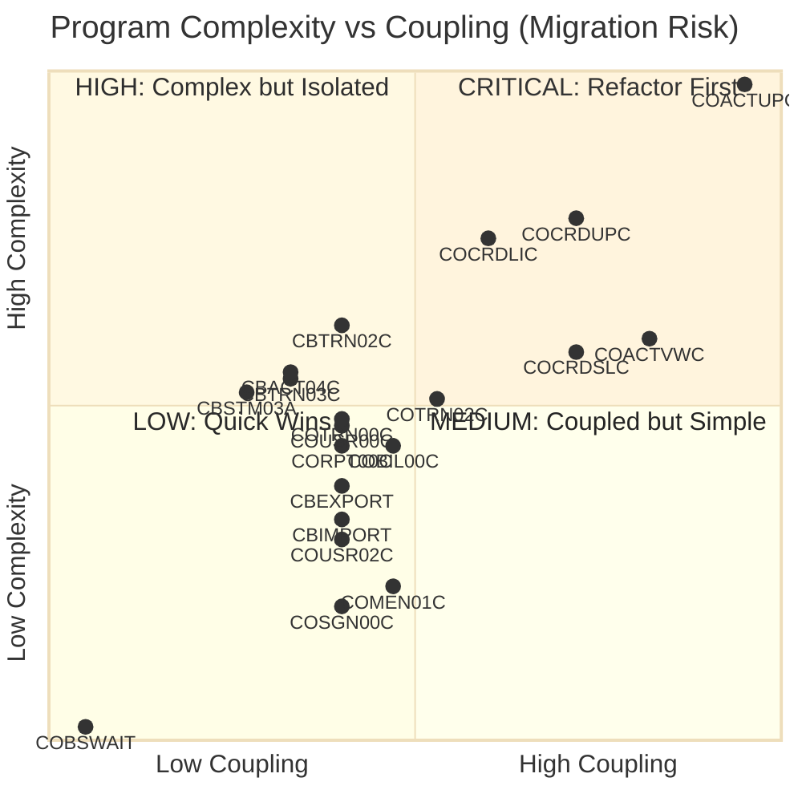
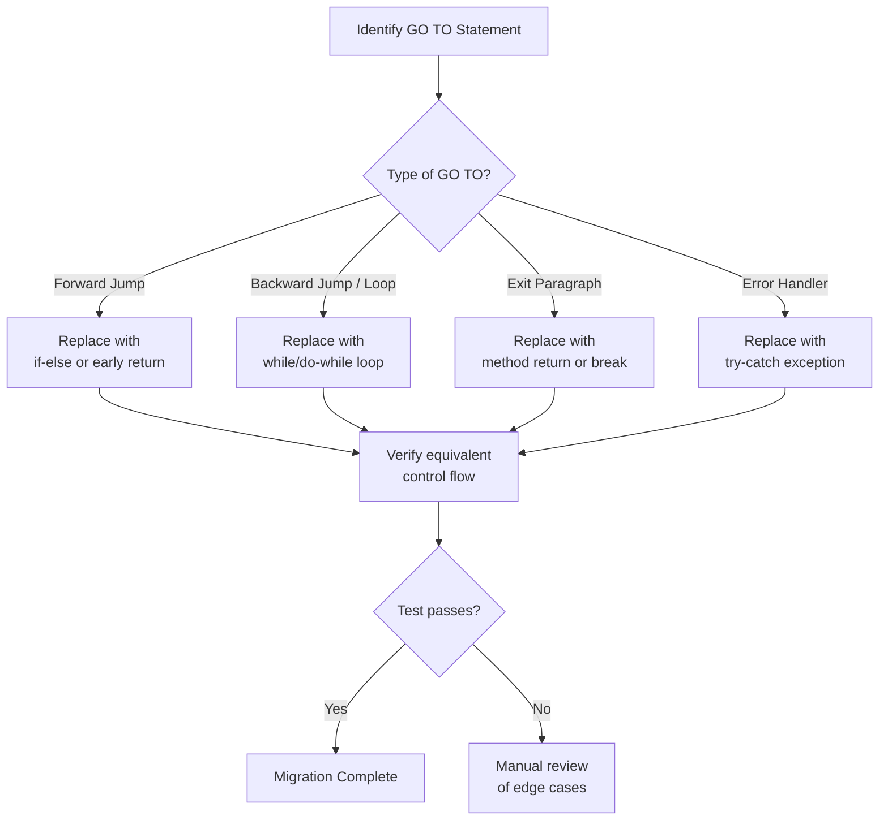
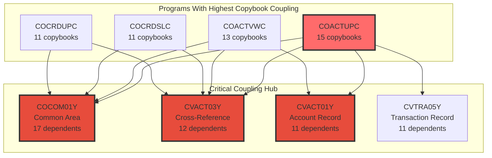
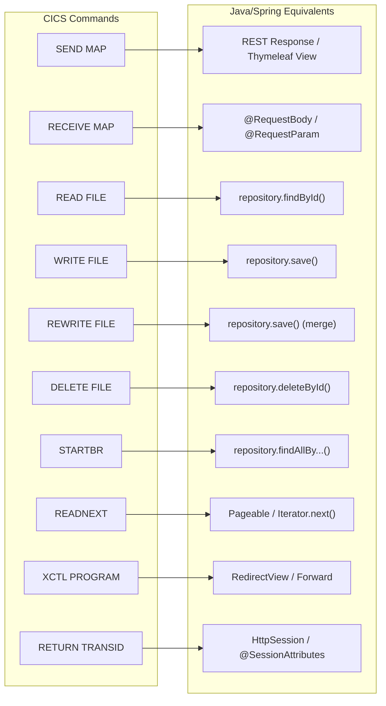
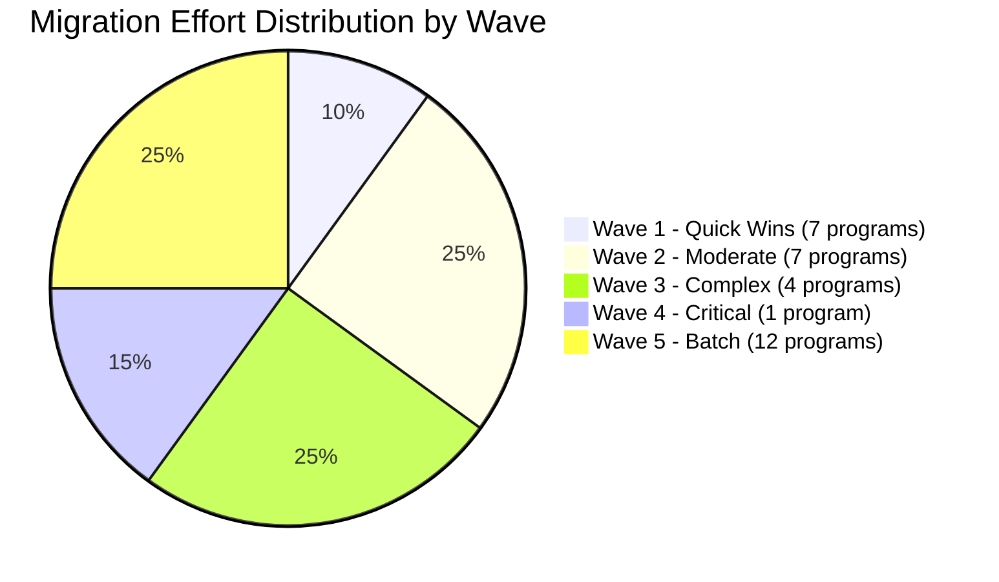

# CardDemo Application - Hotspot Analysis for Modernization

This document identifies complexity hotspots, coupling risks, and migration priorities across the CardDemo COBOL codebase. It is intended to guide modernization planning by ranking programs by migration difficulty and flagging areas that require special attention.

---

## 1. Program Complexity Ranking

The following table ranks all 31 COBOL programs by a composite complexity score derived from lines of code, control flow density (IF/EVALUATE/PERFORM), GO TO usage, CICS command count, copybook coupling, and data access breadth.

| Rank | Program   | LOC  | IF Stmts | EVALUATE | PERFORM | GO TO | CICS R/W | Copybooks | Complexity Score | Risk Level |
|-----:|:----------|-----:|---------:|---------:|--------:|------:|---------:|----------:|-----------------:|:-----------|
|    1 | COACTUPC  | 4236 |      168 |       20 |      64 |    51 |        5 |        15 | **98 - Critical** | :red_circle: |
|    2 | COCRDUPC  | 1560 |      148 |       16 |      26 |    21 |        2 |        11 | **78 - High**     | :red_circle: |
|    3 | COCRDLIC  | 1459 |      122 |       18 |      34 |    16 |        4 |         9 | **75 - High**     | :red_circle: |
|    4 | CBTRN02C  |  731 |       93 |        0 |      62 |     0 |        0 |         6 | **62 - High**     | :orange_circle: |
|    5 | COACTVWC  |  941 |       57 |       10 |      21 |     9 |        3 |        13 | **60 - High**     | :orange_circle: |
|    6 | COCRDSLC  |  887 |       68 |        8 |      19 |     9 |        2 |        11 | **58 - High**     | :orange_circle: |
|    7 | CBACT04C  |  652 |       86 |        0 |      57 |     0 |        0 |         5 | **55 - Medium**   | :yellow_circle: |
|    8 | CBTRN03C  |  649 |       75 |        4 |      73 |     0 |        0 |         5 | **54 - Medium**   | :yellow_circle: |
|    9 | CBSTM03A  |  924 |       15 |        9 |      33 |    15 |        0 |         4 | **52 - Medium**   | :yellow_circle: |
|   10 | COTRN02C  |  783 |       14 |       26 |      61 |     0 |        3 |         8 | **51 - Medium**   | :yellow_circle: |
|   11 | COTRN00C  |  699 |       26 |       16 |      47 |     0 |        2 |         6 | **48 - Medium**   | :yellow_circle: |
|   12 | COUSR00C  |  695 |       25 |       16 |      45 |     0 |        2 |         6 | **47 - Medium**   | :yellow_circle: |
|   13 | CORPT00C  |  649 |       20 |       10 |      35 |     1 |        1 |         6 | **44 - Medium**   | :yellow_circle: |
|   14 | COBIL00C  |  572 |       10 |       18 |      38 |     0 |        5 |         7 | **44 - Medium**   | :yellow_circle: |
|   15 | CBEXPORT  |  582 |       16 |        0 |      50 |     0 |        0 |         6 | **38 - Low**      | :green_circle: |
|   16 | CBTRN01C  |  494 |       33 |        0 |      43 |     0 |        0 |         6 | **36 - Low**      | :green_circle: |
|   17 | CBIMPORT  |  487 |       14 |        2 |      30 |     0 |        0 |         6 | **33 - Low**      | :green_circle: |
|   18 | CBACT01C  |  430 |       22 |        0 |      36 |     0 |        0 |         2 | **30 - Low**      | :green_circle: |
|   19 | COUSR02C  |  414 |       13 |       10 |      31 |     0 |        2 |         6 | **30 - Low**      | :green_circle: |
|   20 | COUSR03C  |  359 |        8 |       10 |      26 |     0 |        2 |         6 | **27 - Low**      | :green_circle: |
|   21 | COTRN01C  |  330 |        7 |        6 |      17 |     0 |        1 |         6 | **24 - Low**      | :green_circle: |
|   22 | COMEN01C  |  308 |        7 |        6 |      15 |     0 |        0 |         7 | **23 - Low**      | :green_circle: |
|   23 | COUSR01C  |  299 |        4 |        6 |      20 |     0 |        1 |         6 | **22 - Low**      | :green_circle: |
|   24 | COADM01C  |  288 |       11 |        4 |      15 |     0 |        0 |         7 | **22 - Low**      | :green_circle: |
|   25 | COSGN00C  |  260 |        4 |        6 |      11 |     0 |        1 |         6 | **20 - Low**      | :green_circle: |
|   26 | CBSTM03B  |  230 |       12 |        1 |       4 |    13 |        0 |         0 | **19 - Low**      | :green_circle: |
|   27 | CBACT02C  |  178 |       22 |        0 |      11 |     0 |        0 |         1 | **15 - Low**      | :green_circle: |
|   28 | CBACT03C  |  178 |       22 |        0 |      11 |     0 |        0 |         1 | **15 - Low**      | :green_circle: |
|   29 | CBCUS01C  |  178 |       11 |        0 |      11 |     0 |        0 |         1 | **13 - Low**      | :green_circle: |
|   30 | CSUTLDTC  |  157 |        0 |        2 |       1 |     0 |        0 |         0 | **8 - Minimal**   | :green_circle: |
|   31 | COBSWAIT  |   41 |        0 |        0 |       0 |     0 |        0 |         0 | **2 - Minimal**   | :green_circle: |

**Scoring formula**: `(LOC/50) + (IF*0.3) + (EVALUATE*0.5) + (PERFORM*0.2) + (GO_TO*1.5) + (CICS_RW*2) + (Copybooks*0.5)`

---

## 2. Hotspot Heatmap (Mermaid)

---

## 3. GO TO Statement Analysis (Anti-Pattern Hotspots)

GO TO statements are a significant migration risk factor. They create non-structured control flow that does not map cleanly to Java's structured programming model.

| Program   | GO TO Count | LOC  | GO TO Density | Risk Assessment |
|:----------|------------:|-----:|--------------:|:----------------|
| COACTUPC  |          51 | 4236 |         1.20% | **Critical** - Highest absolute count; complex spaghetti logic in account update validation |
| COCRDUPC  |          21 | 1560 |         1.35% | **High** - Dense GO TO usage in card update flow |
| COCRDLIC  |          16 | 1459 |         1.10% | **High** - Navigation-related GO TOs in list browsing |
| CBSTM03A  |          15 | 924  |         1.62% | **High** - Highest density; statement generation has complex branching |
| CBSTM03B  |          13 | 230  |         5.65% | **Critical** - Extremely high density; nearly every 18th line is a GO TO |
| COACTVWC  |           9 | 941  |         0.96% | **Medium** - Moderate usage in account view logic |
| COCRDSLC  |           9 | 887  |         1.01% | **Medium** - Card view display logic |
| CORPT00C  |           1 | 649  |         0.15% | **Low** - Isolated usage |

**Programs with zero GO TO statements (23 of 31):** These programs use structured PERFORM-based control flow and will map more cleanly to Java method calls.

### GO TO Remediation Strategy

---

## 4. Copybook Coupling Analysis

Copybooks that are shared across many programs represent tight coupling. Changes to these shared data structures during migration will have wide blast radius.

### High-Impact Shared Copybooks

| Copybook  | Used By (Programs) | Record Size | Domain        | Migration Impact |
|:----------|-------------------:|------------:|:--------------|:-----------------|
| COCOM01Y  |                 17 | Variable    | Common Area   | **Critical** - Shared communication area; maps to a shared DTO or context object |
| COTTL01Y  |                 17 | Variable    | UI Title      | **Medium** - Screen header; maps to UI component |
| CSDAT01Y  |                 17 | Variable    | Date Fields   | **Medium** - Date handling; maps to `java.time` types |
| CSMSG01Y  |                 17 | Variable    | Messages      | **Medium** - Error/info messages; maps to i18n resource bundle |
| CSUSR01Y  |                 12 | 80 bytes    | User Security | **High** - User record; maps to User entity/DTO |
| CVACT03Y  |                 12 | 50 bytes    | Cross-Ref     | **Critical** - Card-Account-Customer link; maps to join table or relationship entity |
| CVACT01Y  |                 11 | 300 bytes   | Account Data  | **Critical** - Account master record; maps to Account entity |
| CVTRA05Y  |                 11 | 350 bytes   | Transaction   | **Critical** - Transaction record; maps to Transaction entity |
| CVCUS01Y  |                  8 | 500 bytes   | Customer Data | **High** - Customer master; maps to Customer entity |
| CVACT02Y  |                  8 | 150 bytes   | Card Data     | **High** - Card master; maps to Card entity |
| CSSETATY  |                 39 | N/A         | Set Attribute | **Low** - BMS attribute helper; no Java equivalent needed |

### Coupling Diagram

---

## 5. CICS Command Complexity

Programs with high CICS command counts require careful translation to REST/Spring patterns.

| Program   | SEND MAP | RECEIVE MAP | READ | WRITE | REWRITE | DELETE | STARTBR | READNEXT | READPREV | ENDBR | XCTL | Total CICS |
|:----------|:--------:|:-----------:|:----:|:-----:|:-------:|:------:|:-------:|:--------:|:--------:|:-----:|:----:|:----------:|
| COACTUPC  |     2    |      2      |   5  |   0   |    0    |   0    |    0    |     0    |     0    |   0   |   1  |   **10**   |
| COBIL00C  |     1    |      1      |   2  |   1   |    1    |   0    |    1    |     0    |     1    |   1   |   1  |    **9**   |
| COCRDLIC  |     3    |      2      |   0  |   0   |    0    |   0    |    2    |     2    |     2    |   1   |   3  |   **15**   |
| COTRN02C  |     1    |      1      |   2  |   1   |    0    |   0    |    1    |     0    |     1    |   1   |   1  |    **8**   |
| COACTVWC  |     4    |      1      |   3  |   0   |    0    |   0    |    0    |     0    |     0    |   0   |   1  |    **9**   |
| COCRDSLC  |     4    |      1      |   2  |   0   |    0    |   0    |    0    |     0    |     0    |   0   |   1  |    **8**   |
| COCRDUPC  |     2    |      2      |   2  |   0   |    0    |   0    |    0    |     0    |     0    |   0   |   1  |    **7**   |
| COTRN00C  |     2    |      1      |   0  |   0   |    0    |   0    |    1    |     1    |     1    |   1   |   1  |    **7**   |
| COUSR00C  |     2    |      1      |   0  |   0   |    0    |   0    |    1    |     1    |     1    |   1   |   2  |    **9**   |

### CICS to Spring Mapping

---

## 6. Migration Priority Matrix

Based on the combined analysis, the following is a recommended migration order using a risk-based approach.

### Wave 1 - Quick Wins (Low Risk, High Value)

Programs with simple structure, no GO TOs, limited coupling.

| Program   | LOC | Risk  | Java Target | Notes |
|:----------|----:|:------|:------------|:------|
| COSGN00C  | 260 | Low   | Spring Security `AuthenticationProvider` | Simple VSAM read + credential check |
| COMEN01C  | 308 | Low   | Spring MVC Controller (Menu routing) | Menu dispatch via XCTL -> RequestMapping |
| COADM01C  | 288 | Low   | Spring MVC Controller (Admin routing) | Same pattern as COMEN01C |
| COUSR01C  | 299 | Low   | UserService.createUser() | Single WRITE operation |
| COTRN01C  | 330 | Low   | TransactionService.getTransaction() | Single READ operation |
| CSUTLDTC  | 157 | Min.  | `java.time.LocalDate` utility | Replace with standard Java date API |
| COBSWAIT  |  41 | Min.  | `Thread.sleep()` or `ScheduledExecutor` | Trivial utility |

### Wave 2 - Moderate Complexity (Medium Risk)

| Program   | LOC | Risk   | Java Target | Notes |
|:----------|----:|:-------|:------------|:------|
| COUSR00C  | 695 | Medium | UserService.listUsers() with pagination | STARTBR/READNEXT -> Spring Data Pageable |
| COUSR02C  | 414 | Low    | UserService.updateUser() | READ + REWRITE -> findById + save |
| COUSR03C  | 359 | Low    | UserService.deleteUser() | READ + DELETE -> findById + delete |
| COTRN00C  | 699 | Medium | TransactionService.listTransactions() | Browse pattern similar to COUSR00C |
| COTRN02C  | 783 | Medium | TransactionService.addTransaction() | Multiple READ + WRITE; calls CSUTLDTC |
| CORPT00C  | 649 | Medium | ReportService with JasperReports/PDF | WRITEQ TD -> file/report generation |
| COBIL00C  | 572 | Medium | PaymentService.processBillPayment() | Multiple VSAM operations; transactional |

### Wave 3 - Complex Programs (High Risk)

| Program   | LOC  | Risk | Java Target | Notes |
|:----------|-----:|:-----|:------------|:------|
| COACTVWC  |  941 | High | AccountService.viewAccount() | 13 copybooks; 9 GO TOs; multi-file reads |
| COCRDSLC  |  887 | High | CardService.viewCard() | Similar coupling to COACTVWC |
| COCRDLIC  | 1459 | High | CardService.listCards() | 16 GO TOs; complex browse logic |
| COCRDUPC  | 1560 | High | CardService.updateCard() | 21 GO TOs; heavy validation |

### Wave 4 - Critical Path (Highest Risk)

| Program   | LOC  | Risk     | Java Target | Notes |
|:----------|-----:|:---------|:------------|:------|
| COACTUPC  | 4236 | Critical | AccountService.updateAccount() | 51 GO TOs; 15 copybooks; 39 CSSETATY copies; most complex program in the system |

### Wave 5 - Batch Programs

| Program   | LOC | Risk   | Java Target | Notes |
|:----------|----:|:-------|:------------|:------|
| CBACT01C  | 430 | Low    | Spring Batch ItemReader for accounts | Calls assembler COBDATFT |
| CBACT02C  | 178 | Low    | Spring Batch ItemReader for cards | Simple sequential read |
| CBACT03C  | 178 | Low    | Spring Batch ItemReader for cross-ref | Simple sequential read |
| CBCUS01C  | 178 | Low    | Spring Batch ItemReader for customers | Simple sequential read |
| CBEXPORT  | 582 | Low    | Spring Batch export job | Multi-file sequential read |
| CBIMPORT  | 487 | Low    | Spring Batch import job | Reverse of CBEXPORT |
| CBTRN01C  | 494 | Medium | Spring Batch daily transaction processor | 6 copybooks; moderate logic |
| CBTRN03C  | 649 | Medium | Spring Batch report writer | Complex formatting; 4 EVALUATE |
| CBACT04C  | 652 | Medium | Spring Batch interest calculation step | 86 IF statements; financial logic |
| CBTRN02C  | 731 | High   | Spring Batch transaction posting job | 93 IF statements; core business logic |
| CBSTM03A  | 924 | High   | Spring Batch statement generation job | 15 GO TOs; calls CBSTM03B |
| CBSTM03B  | 230 | High   | Helper class for CBSTM03A | 13 GO TOs in 230 lines (5.65% density) |

---

## 7. Estimated Migration Effort

### Summary Statistics

| Metric | Value |
|:-------|------:|
| Total COBOL programs | 31 |
| Total lines of code | 20,650 |
| Programs with GO TO | 8 (26%) |
| Total GO TO statements | 106 |
| Unique copybooks | 30 |
| Shared copybooks (3+ users) | 12 |
| VSAM files | 11 |
| BMS screen maps | 17 |
| JCL batch jobs | 38 |
| CICS transactions | 17+ |

### Key Migration Risks

1. **COACTUPC (4,236 LOC)** - Single largest program; accounts for 20.5% of all code. Has highest GO TO count (51), most copybook dependencies (15), and heaviest CICS I/O. Should be decomposed into multiple Java classes.

2. **GO TO Spaghetti in CBSTM03B** - At 5.65% GO TO density, this 230-line program has the most tangled control flow per line. Requires careful manual restructuring.

3. **COCOM01Y Common Area** - Used by 17 of 18 online programs as a shared communication area. Must be carefully mapped to a session/context pattern in Java. Changes here affect nearly every online component.

4. **CVACT03Y Cross-Reference** - The Card-Account-Customer cross-reference file is accessed by 12 programs. This is the data hub of the system and must be modeled as a proper relational join in the target database.

5. **Assembler Dependencies** - COBDATFT (date formatting) and MVSWAIT (timer) are assembler programs that have no direct COBOL equivalent. Need custom Java implementations.

6. **CSSETATY Macro Pattern** - Used 39 times in COACTUPC alone via COPY REPLACING. This BMS attribute-setting pattern will not exist in a web UI and can be eliminated during migration.
