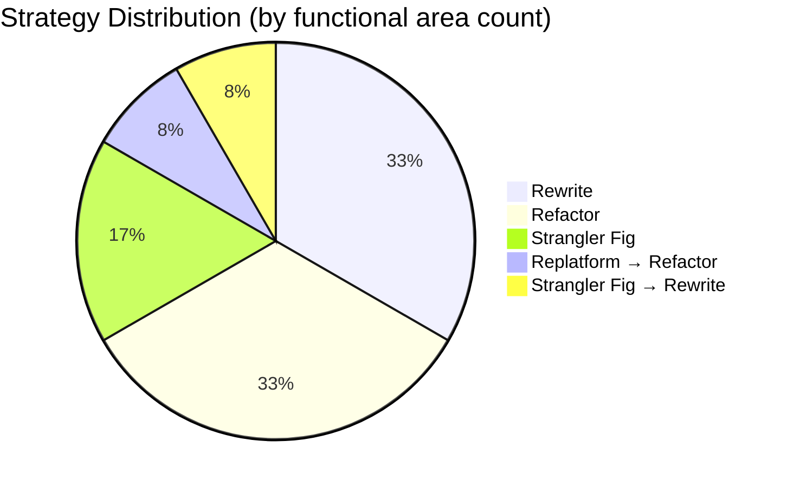

# CardDemo Modernization Blueprint

This blueprint evaluates four modernization strategies — **Strangler Fig**, **Replatform**, **Refactor**, and **Rewrite** — for each functional area of the CardDemo mainframe application. The goal is to recommend the optimal approach per domain based on complexity, coupling, business criticality, and risk.

---

## Strategy Definitions

| Strategy | Description | When to Use | Trade-offs |
|:---------|:------------|:------------|:-----------|
| **Strangler Fig** | Incrementally replace functionality by routing traffic through a facade; old and new systems coexist during migration | High-risk areas where a big-bang cutover is dangerous; when existing functionality must remain available | Longest calendar time; requires API facade/routing layer; dual maintenance during transition |
| **Replatform** | Lift the existing logic to a new runtime (e.g., COBOL-to-Java transpilation) with minimal structural changes | Stable, low-complexity programs where preserving logic 1:1 is acceptable | Fast; preserves bugs and tech debt; generated code is hard to maintain long-term |
| **Refactor** | Restructure the COBOL logic into idiomatic Java while preserving behavior; manual conversion with structural improvements | Medium-complexity programs where the business logic is sound but the code structure needs modernizing | Moderate effort; produces maintainable code; requires deep understanding of existing logic |
| **Rewrite** | Build new functionality from scratch using modern patterns, informed by but not derived from the COBOL source | Highly complex spaghetti code; areas where business requirements have changed significantly | Highest effort and risk; cleanest result; requires comprehensive test coverage of current behavior |

---

## Functional Area Analysis

### 1. Authentication & Session Management

**Programs:** COSGN00C (260 LOC), COMEN01C (308 LOC), COADM01C (288 LOC)

| Attribute | Assessment |
|:----------|:-----------|
| Complexity | Low (20-23 complexity score) |
| GO TO count | 0 |
| VSAM files | USRSEC (read-only for auth) |
| Copybook coupling | Moderate (6-7 copybooks each) |
| Business logic | Simple credential lookup + menu dispatch |

**Recommended Strategy: Rewrite**

| Rationale | Details |
|:----------|:--------|
| Why rewrite | Authentication patterns have fundamentally changed since mainframe era. RACF-style userid/password against a flat VSAM file should be replaced with modern identity management (OAuth 2.0 / OIDC / Spring Security). The existing logic is too simple to justify preserving. |
| Target | Spring Security with `UserDetailsService` backed by a relational user table. Menu dispatch replaced by role-based route guards in the frontend. |
| Effort | Low (1-2 sprints) |
| Risk | Low — well-bounded, no shared mutable state |

---

### 2. Account Management

**Programs:** COACTVWC (941 LOC), COACTUPC (4,236 LOC)

| Attribute | Assessment |
|:----------|:-----------|
| Complexity | COACTVWC: High (60). COACTUPC: **Critical (98)** — largest program in the system |
| GO TO count | COACTVWC: 9, COACTUPC: **51** |
| VSAM files | ACCTDAT, CARDXREF, CUSTDAT (cross-domain reads + writes) |
| Copybook coupling | COACTUPC: 15 copybooks (highest in the system), 39 CSSETATY COPY REPLACING |
| Business logic | Account view is read-only multi-file join. Account update has complex validation, field-level attribute setting, and multi-file transactional writes. |

**Recommended Strategy:**

| Program | Strategy | Rationale |
|:--------|:---------|:----------|
| COACTVWC | **Refactor** | Read-only program with moderate complexity. Business logic (multi-file join to display account + card + customer data) is straightforward and should be preserved as a service method with JPA entity relationships. 9 GO TOs can be systematically replaced with structured control flow. |
| COACTUPC | **Strangler Fig → Rewrite** | Too complex and tangled for direct refactoring. 51 GO TOs, 15 copybooks, 39 macro expansions, and cross-domain writes make this the highest-risk program. Recommended approach: (1) wrap existing mainframe function behind an API facade, (2) build new account update service incrementally, (3) migrate field-by-field validation to Java Bean Validation, (4) cut over once parity is proven. |

| Attribute | COACTVWC | COACTUPC |
|:----------|:---------|:---------|
| Effort | Medium (2-3 sprints) | High (4-6 sprints) |
| Risk | Medium | **Critical** |

---

### 3. Credit Card Management

**Programs:** COCRDLIC (1,459 LOC), COCRDSLC (887 LOC), COCRDUPC (1,560 LOC)

| Attribute | Assessment |
|:----------|:-----------|
| Complexity | High across all three (58-78 scores) |
| GO TO count | COCRDLIC: 16, COCRDSLC: 9, COCRDUPC: 21 |
| VSAM files | CARDDAT, CARDXREF, CUSTDAT |
| Copybook coupling | 9-11 copybooks each |
| Business logic | List with browse (STARTBR/READNEXT/READPREV), detail view with cross-file joins, update with validation |

**Recommended Strategy: Refactor**

| Rationale | Details |
|:----------|:--------|
| Why refactor | The card management domain has well-defined CRUD semantics that map naturally to a REST resource. The browse pattern (STARTBR/READNEXT/READPREV) maps to paginated queries. GO TOs are concentrated in navigation/browse logic and can be systematically restructured. The business logic is worth preserving. |
| Target | `CardService` with Spring Data JPA repositories. List → `Pageable` queries. View → `findById` with entity graph. Update → `@Transactional` save with Bean Validation. |
| Effort | High (3-4 sprints for all three programs) |
| Risk | High — GO TO restructuring and browse-pattern translation require careful testing |

---

### 4. Transaction Processing (Online)

**Programs:** COTRN00C (699 LOC), COTRN01C (330 LOC), COTRN02C (783 LOC)

| Attribute | Assessment |
|:----------|:-----------|
| Complexity | Medium (24-51 scores) |
| GO TO count | 0 across all three |
| VSAM files | TRANSACT (primary), ACCTDAT, CARDXREF (for add) |
| Copybook coupling | 6-8 copybooks |
| Business logic | List with browse, single record view, add new transaction with cross-file validation and date utility call |

**Recommended Strategy: Refactor**

| Rationale | Details |
|:----------|:--------|
| Why refactor | Zero GO TOs and moderate complexity make this ideal for systematic refactoring. The transaction list/view/add pattern maps directly to REST endpoints. COTRN02C calls CSUTLDTC for date validation — replace with `java.time` in the refactored version. |
| Target | `TransactionService` with `TransactionRepository`. COTRN00C → `GET /transactions` (paginated). COTRN01C → `GET /transactions/{id}`. COTRN02C → `POST /transactions` with validation. |
| Effort | Medium (2-3 sprints) |
| Risk | Medium — COTRN02C has multi-file validation that must be tested thoroughly |

---

### 5. Bill Payment

**Programs:** COBIL00C (572 LOC)

| Attribute | Assessment |
|:----------|:-----------|
| Complexity | Medium (44 score) |
| GO TO count | 0 |
| VSAM files | ACCTDAT, CARDXREF, TRANSACT (read + write) |
| Copybook coupling | 7 copybooks |
| Business logic | Reads account/card data, validates payment, writes transaction record, updates account balance. Transactional semantics. |

**Recommended Strategy: Refactor**

| Rationale | Details |
|:----------|:--------|
| Why refactor | Clean structure (no GO TOs), moderate size, and clear transactional semantics. The payment flow reads cross-reference data, validates, writes a transaction, and updates the account — this maps to a `@Transactional` service method with JPA. |
| Target | `PaymentService.processBillPayment()` with `@Transactional`. Account balance update and transaction creation in a single database transaction. |
| Effort | Medium (1-2 sprints) |
| Risk | Medium — financial calculation accuracy must be verified with test data |

---

### 6. Reporting

**Programs:** CORPT00C (649 LOC)

| Attribute | Assessment |
|:----------|:-----------|
| Complexity | Medium (44 score) |
| GO TO count | 1 |
| VSAM files | TRANSACT (read), WRITEQ TD (print queue) |
| Copybook coupling | 6 copybooks |
| Business logic | Accepts date range, reads transactions, formats report, writes to transient data queue for printing. Calls CSUTLDTC for date validation. Submits batch JCL for actual report generation. |

**Recommended Strategy: Rewrite**

| Rationale | Details |
|:----------|:--------|
| Why rewrite | The report generation pattern (WRITEQ TD → batch JCL submission → printed output) has no equivalent in modern systems. Reports should be regenerated as PDF/HTML using modern reporting frameworks. The date-range filtering logic is trivial to reimplement. |
| Target | `ReportService` using JasperReports, Apache POI, or a similar framework. REST endpoint returns PDF/CSV. Scheduled batch reports via Spring Batch `@Scheduled`. |
| Effort | Medium (2 sprints) |
| Risk | Low — output format changes are expected; focus on data accuracy |

---

### 7. User Administration

**Programs:** COUSR00C (695 LOC), COUSR01C (299 LOC), COUSR02C (414 LOC), COUSR03C (359 LOC)

| Attribute | Assessment |
|:----------|:-----------|
| Complexity | Low-Medium (22-47 scores) |
| GO TO count | 0 across all four |
| VSAM files | USRSEC only |
| Copybook coupling | 6 copybooks each |
| Business logic | Standard CRUD on user security records. List with browse, add, update, delete. Single-file operations. |

**Recommended Strategy: Rewrite**

| Rationale | Details |
|:----------|:--------|
| Why rewrite | User administration should be integrated with the new authentication system (see Functional Area 1). The existing VSAM-based CRUD is too simple to justify refactoring — it's faster to build new user management with Spring Security's `UserDetailsManager`, role-based access control, and a proper user entity. The browse pattern is trivially replaced by paginated queries. |
| Target | `UserAdminService` with Spring Data JPA `UserRepository`. Integrate with Spring Security roles. Admin UI with React/Angular component. |
| Effort | Low (1-2 sprints) |
| Risk | Low — isolated domain, no cross-domain data dependencies |

---

### 8. Batch Transaction Processing

**Programs:** CBTRN02C (731 LOC), CBACT04C (652 LOC), CBTRN01C (494 LOC), CBTRN03C (649 LOC)

| Attribute | Assessment |
|:----------|:-----------|
| Complexity | Medium-High (36-62 scores) |
| GO TO count | 0 across all four |
| VSAM files | DALYTRAN, TRANSACT, CARDXREF, ACCTDAT, TCATBALF (multi-file sequential) |
| Copybook coupling | 5-6 copybooks each |
| Business logic | CBTRN02C: Core posting (daily → master, balance updates). CBACT04C: Interest calculation (financial formulas). CBTRN01C: Daily transaction read/sort. CBTRN03C: Transaction report with cross-ref lookups. |

**Recommended Strategy: Refactor → Spring Batch**

| Rationale | Details |
|:----------|:--------|
| Why refactor | These programs have zero GO TOs and follow the classic batch pattern (open files → read → process → write → close). This maps directly to Spring Batch's `ItemReader` → `ItemProcessor` → `ItemWriter` model. The business logic (especially interest calculation in CBACT04C with 86 IF statements) is valuable and should be carefully preserved and tested. |
| Target | Spring Batch jobs with chunk-oriented processing. CBTRN02C → `TransactionPostingJob`. CBACT04C → `InterestCalculationJob`. Use `@StepScope` for file-based readers. |
| Effort | High (3-4 sprints — financial logic must be regression-tested) |
| Risk | High — interest calculation and transaction posting contain core financial logic; any discrepancy in results is unacceptable |

---

### 9. Statement Generation (Batch)

**Programs:** CBSTM03A (924 LOC), CBSTM03B (230 LOC)

| Attribute | Assessment |
|:----------|:-----------|
| Complexity | Medium-High (52 + 19 scores) |
| GO TO count | CBSTM03A: 15, CBSTM03B: **13 (5.65% density — highest in codebase)** |
| File I/O | Sequential files: STMTFILE, HTMLFILE + reads from TRNXFILE, XREFFILE, CUSTFILE, ACCTFILE |
| Copybook coupling | 4 copybooks (COSTM01, CUSTREC, CVACT03Y, CVACT01Y) |
| Business logic | Reads transactions, cross-references to customers/accounts, formats text and HTML statements. CBSTM03A orchestrates; CBSTM03B handles detail formatting. |

**Recommended Strategy: Rewrite**

| Rationale | Details |
|:----------|:--------|
| Why rewrite | CBSTM03B has the highest GO TO density in the codebase (5.65%), making it extremely difficult to refactor reliably. The statement generation pattern (writing fixed-width text files and basic HTML) should be replaced with modern templating (Thymeleaf, FreeMarker) or PDF generation (JasperReports). The formatting logic has no business value worth preserving. |
| Target | `StatementGenerationJob` (Spring Batch) with Thymeleaf HTML templates or JasperReports PDF. Data assembly from JPA queries replacing sequential file reads. |
| Effort | Medium (2-3 sprints) |
| Risk | Medium — statement format must match business requirements; validate against sample output |

---

### 10. Data Export/Import

**Programs:** CBEXPORT (582 LOC), CBIMPORT (487 LOC)

| Attribute | Assessment |
|:----------|:-----------|
| Complexity | Low (33-38 scores) |
| GO TO count | 0 |
| File I/O | Multi-file sequential read/write across all major data files |
| Copybook coupling | 6 copybooks each (CVEXPORT shared layout) |
| Business logic | CBEXPORT reads all VSAM files and writes a combined export file. CBIMPORT reverses the process. Uses CVEXPORT copybook as the interchange format. |

**Recommended Strategy: Replatform → Refactor**

| Rationale | Details |
|:----------|:--------|
| Why replatform first | Export/import utilities are low-risk and follow a simple sequential pattern. An initial replatform (automated COBOL-to-Java conversion) can produce a working version quickly. Then refactor to use standard formats (CSV, JSON, Parquet) and Spring Batch `FlatFileItemReader`/`FlatFileItemWriter`. |
| Target | Spring Batch export/import jobs. Replace EBCDIC fixed-width format with CSV/JSON. Database-backed reads instead of VSAM sequential. |
| Effort | Low (1-2 sprints) |
| Risk | Low — utility programs with clear input/output contracts |

---

### 11. Shared Utilities

**Programs:** CSUTLDTC (157 LOC), COBSWAIT (41 LOC)

| Attribute | Assessment |
|:----------|:-----------|
| Complexity | Minimal (2-8 scores) |
| Dependencies | CSUTLDTC calls LE runtime CEEDAYS. COBSWAIT calls assembler MVSWAIT. |
| Usage | CSUTLDTC called by COTRN02C and CORPT00C. COBSWAIT called by batch wait step. |

**Recommended Strategy: Rewrite**

| Rationale | Details |
|:----------|:--------|
| Why rewrite | CSUTLDTC wraps the LE CEEDAYS date conversion routine — replace entirely with `java.time.LocalDate` and `DateTimeFormatter`. COBSWAIT wraps an assembler timer — replace with `Thread.sleep()` or `ScheduledExecutorService`. These are trivial to rewrite and have no mainframe-specific business logic. |
| Target | Java utility classes or eliminate entirely (inline `java.time` calls). |
| Effort | Minimal (< 1 sprint) |
| Risk | Minimal |

---

### 12. Optional Modules (IMS/DB2/MQ)

**Programs:** COPAUA0C, COPAUS0C, COPAUS1C, COPAUS2C, CBPAUP0C (Authorization), COTRTLIC, COTRTUPC, COBTUPDT (Transaction Type DB2), CODATE01, COACCT01 (VSAM-MQ)

| Attribute | Assessment |
|:----------|:-----------|
| Complexity | Variable (not scored — separate subdirectories) |
| Dependencies | IMS DB, DB2, MQ — middleware-heavy |
| Business logic | Authorization processing, fraud marking, transaction type CRUD via DB2, MQ request/response patterns |

**Recommended Strategy: Strangler Fig**

| Rationale | Details |
|:----------|:--------|
| Why strangler fig | These modules depend on three middleware technologies (IMS, DB2, MQ) that each require their own migration strategy. The strangler pattern allows replacing one middleware integration at a time: (1) Replace MQ with RabbitMQ/SQS behind a message facade, (2) Replace IMS DB reads with JPA queries against migrated relational data, (3) Preserve DB2 SQL and migrate to PostgreSQL/MySQL. Each replacement can be tested independently. |
| Target | Spring Boot microservices with Spring AMQP (replacing MQ), Spring Data JPA (replacing IMS + DB2), and event-driven architecture for authorization processing. |
| Effort | High (4-6 sprints) |
| Risk | High — middleware migration carries integration risk; requires parallel testing |

---

## Strategy Summary

| Strategy | Functional Areas | Programs | Estimated Effort |
|:---------|:-----------------|:---------|:-----------------|
| **Rewrite** | Auth/Session, User Admin, Reports, Statements, Utilities | COSGN00C, COMEN01C, COADM01C, COUSR00C-03C, CORPT00C, CBSTM03A/B, CSUTLDTC, COBSWAIT | 8-11 sprints |
| **Refactor** | Cards, Transactions (Online), Bill Payment, Batch Processing | COCRDLIC, COCRDSLC, COCRDUPC, COTRN00C-02C, COBIL00C, CBTRN01C-03C, CBACT04C | 11-15 sprints |
| **Strangler Fig** | Account Update, Optional Modules | COACTUPC, COPAUA0C, COPAUS0C/1C/2C, COTRTLIC, COTRTUPC, CODATE01, COACCT01 | 8-12 sprints |
| **Replatform → Refactor** | Account View, Data Export/Import | COACTVWC, CBEXPORT, CBIMPORT | 3-5 sprints |
| **Total** | 12 functional areas | 31+ programs | **30-43 sprints** |
