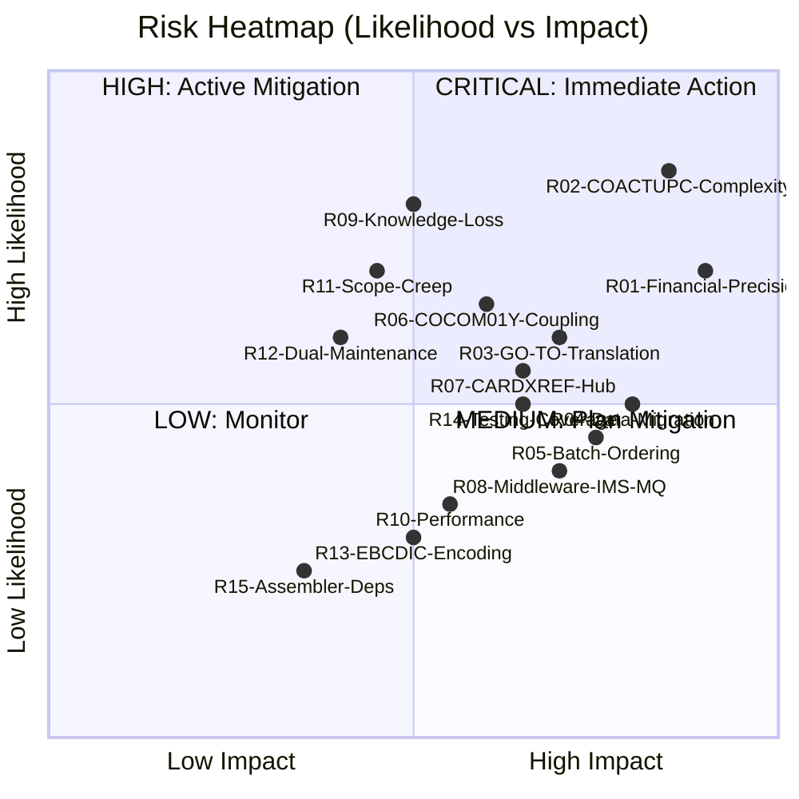
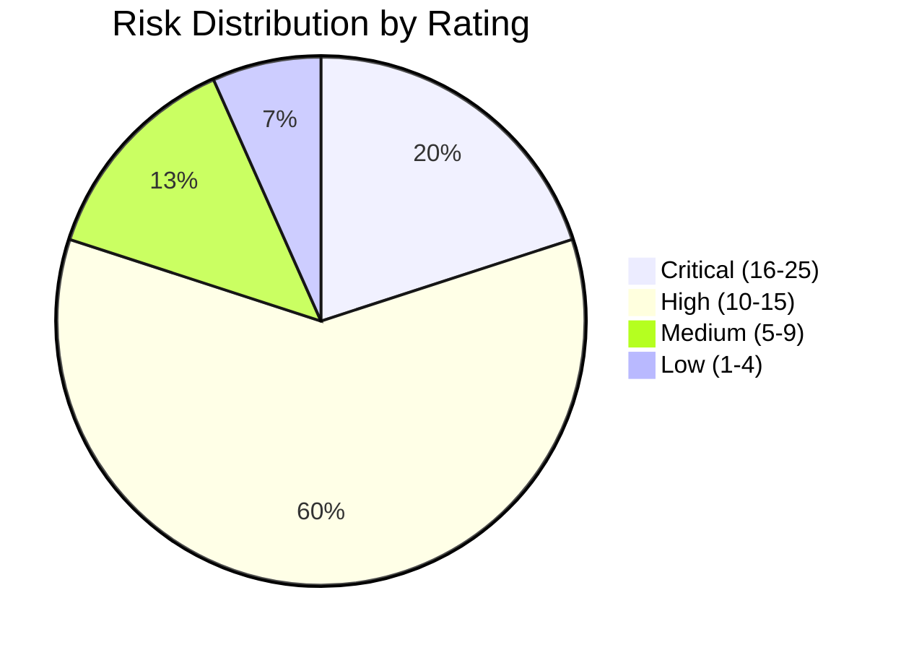

# CardDemo Modernization Risk Register

This document catalogs the top risks associated with modernizing the CardDemo COBOL/CICS/VSAM application to Java/Spring Boot, along with likelihood, impact, and mitigation strategies.

---

## Risk Scoring

| Score | Likelihood | Impact |
|------:|:-----------|:-------|
| 1 | Rare | Negligible |
| 2 | Unlikely | Minor |
| 3 | Possible | Moderate |
| 4 | Likely | Major |
| 5 | Almost certain | Critical |

**Risk Rating = Likelihood x Impact**

| Rating | Level | Action |
|-------:|:------|:-------|
| 1-4 | Low | Monitor |
| 5-9 | Medium | Mitigate |
| 10-15 | High | Active mitigation required |
| 16-25 | Critical | Immediate action, escalate to leadership |

---

## Risk Heatmap

---

## Detailed Risk Register

### R01: Financial Calculation Precision Loss

| Attribute | Value |
|:----------|:------|
| **ID** | R01 |
| **Category** | Technical |
| **Phase Affected** | Phase 3 (Payments), Phase 5 (Batch — Interest Calc, Transaction Posting) |
| **Likelihood** | 4 - Likely |
| **Impact** | 5 - Critical |
| **Risk Rating** | **20 - Critical** |
| **Description** | COBOL uses COMP-3 (packed decimal) and zoned decimal for financial calculations with fixed-point precision. Java floating-point types (`float`, `double`) will introduce rounding errors. Affected programs: COBIL00C (bill payment), CBTRN02C (transaction posting), CBACT04C (interest calculation with 86 IF conditions). |

**Mitigation Strategies:**

| # | Strategy | Owner | Status |
|--:|:---------|:------|:-------|
| 1 | Use `java.math.BigDecimal` exclusively for all financial fields. Never use `float` or `double`. | Development | Required |
| 2 | Map COBOL PIC S9(n)V9(m) COMP-3 to `BigDecimal` with explicit scale matching the COBOL decimal places. | Development | Required |
| 3 | Create a financial calculation test suite with 10,000+ test cases derived from mainframe production data. Compare results to the cent. | QA | Required |
| 4 | Run parallel batch cycles (Phase 5) and diff all balance outputs between COBOL and Java. Zero tolerance for differences. | QA | Required |
| 5 | Code review gate: no financial PR merges without `BigDecimal` verification. | Tech Lead | Required |

**Residual Risk After Mitigation:** Low (2) — `BigDecimal` with explicit rounding modes eliminates precision issues.

---

### R02: COACTUPC Complexity Explosion

| Attribute | Value |
|:----------|:------|
| **ID** | R02 |
| **Category** | Technical |
| **Phase Affected** | Phase 4 (Account Update — Strangler Fig) |
| **Likelihood** | 5 - Almost Certain |
| **Impact** | 4 - Major |
| **Risk Rating** | **20 - Critical** |
| **Description** | COACTUPC is 4,236 LOC with 51 GO TO statements, 168 IF conditions, 20 EVALUATE blocks, 15 copybook dependencies, and 39 CSSETATY COPY REPLACING expansions. It accounts for 20.5% of all COBOL code and performs cross-domain writes to ACCTDAT, CUSTDAT, and CARDXREF. Direct refactoring is likely to introduce defects. |

**Mitigation Strategies:**

| # | Strategy | Owner | Status |
|--:|:---------|:------|:-------|
| 1 | Use strangler fig pattern (not big-bang rewrite). Migrate field-by-field behind an API facade. | Architecture | Required |
| 2 | Shadow mode: run Java implementation in parallel with mainframe for 3+ weeks, logging all differences. | Operations | Required |
| 3 | Decompose into sub-services: account update, customer update, card-account linking, validation engine. | Development | Required |
| 4 | Extract all 168 IF conditions into a formal validation rule engine (Bean Validation or custom). Document each rule. | Development | Required |
| 5 | Allocate dedicated senior developer(s) for COACTUPC migration. Do not distribute across team. | Management | Required |
| 6 | Build comprehensive test matrix covering all 51 GO TO execution paths. | QA | Required |

**Residual Risk After Mitigation:** Medium (8) — strangler pattern limits blast radius, but the sheer complexity means defects are likely during transition.

---

### R03: GO TO Spaghetti Code Translation Errors

| Attribute | Value |
|:----------|:------|
| **ID** | R03 |
| **Category** | Technical |
| **Phase Affected** | Phase 2 (Card), Phase 4 (Account), Phase 5 (Statements) |
| **Likelihood** | 4 - Likely |
| **Impact** | 3 - Moderate |
| **Risk Rating** | **12 - High** |
| **Description** | 8 programs contain 106 GO TO statements. CBSTM03B has 5.65% GO TO density. GO TO creates non-structured control flow that does not map to Java's if/else/while/for constructs. Incorrect translation produces subtle logic errors. |

**Affected Programs:**

| Program | GO TOs | Density | Phase |
|:--------|-------:|--------:|:------|
| COACTUPC | 51 | 1.20% | 4 |
| COCRDUPC | 21 | 1.35% | 2 |
| COCRDLIC | 16 | 1.10% | 2 |
| CBSTM03A | 15 | 1.62% | 5 |
| CBSTM03B | 13 | 5.65% | 5 |
| COACTVWC | 9 | 0.96% | 4 |
| COCRDSLC | 9 | 1.01% | 2 |
| CORPT00C | 1 | 0.15% | 3 |

**Mitigation Strategies:**

| # | Strategy | Owner | Status |
|--:|:---------|:------|:-------|
| 1 | Map each GO TO to its structural equivalent before coding: forward jump → if/else, backward jump → while loop, paragraph exit → method return, error handler → try/catch. | Development | Required |
| 2 | Create control flow graphs (CFG) for each GO TO-heavy program before migration. Verify the Java CFG matches. | Architecture | Recommended |
| 3 | For CBSTM03B (5.65% density): rewrite rather than refactor. The formatting logic has no business value worth preserving. | Development | Required |
| 4 | Mandatory code review by a second developer for every GO TO translation. | Tech Lead | Required |

**Residual Risk After Mitigation:** Low-Medium (6) — systematic approach reduces errors, but edge cases in deeply nested GO TOs may persist.

---

### R04: Data Migration Corruption

| Attribute | Value |
|:----------|:------|
| **ID** | R04 |
| **Category** | Data |
| **Phase Affected** | Phase 0 (Foundation), all subsequent phases |
| **Likelihood** | 3 - Possible |
| **Impact** | 5 - Critical |
| **Risk Rating** | **15 - High** |
| **Description** | VSAM files use EBCDIC encoding, packed decimal (COMP-3), and fixed-length records. Conversion to ASCII/UTF-8 and relational tables risks data corruption, especially for signed numeric fields, REDEFINES structures, and binary data. 11 VSAM files totaling ~2,000+ bytes of record layouts must be migrated. |

**Mitigation Strategies:**

| # | Strategy | Owner | Status |
|--:|:---------|:------|:-------|
| 1 | Build automated ETL with field-level validation. Every COBOL PIC clause maps to a specific Java type with explicit conversion. | Development | Required |
| 2 | Checksum validation: compare record counts, field sums (numeric), and hash values between source and target. | QA | Required |
| 3 | Use ASCII sample data in `app/data/ASCII/` for initial development. EBCDIC data in `app/data/EBCDIC/` for production migration testing. | Development | Required |
| 4 | Handle REDEFINES carefully: CVACT03Y, COMEN02Y, and COADM02Y use REDEFINES. Map each variant to a concrete Java class. | Development | Required |
| 5 | Round-trip test: export from VSAM → import to PostgreSQL → export back → binary diff against original. | QA | Recommended |

**Residual Risk After Mitigation:** Medium (6) — automated validation catches most issues, but edge cases in complex copybook structures (OCCURS DEPENDING ON) may slip through.

---

### R05: Batch Pipeline Ordering Dependencies

| Attribute | Value |
|:----------|:------|
| **ID** | R05 |
| **Category** | Technical |
| **Phase Affected** | Phase 5 (Batch Processing) |
| **Likelihood** | 3 - Possible |
| **Impact** | 4 - Major |
| **Risk Rating** | **12 - High** |
| **Description** | The batch pipeline has strict ordering: CLOSEFIL → data refresh → POSTTRAN → INTCALC → TRANBKP → COMBTRAN → CREASTMT → TRANIDX → OPENFIL. Breaking this into independent Spring Batch jobs risks executing steps out of order, leading to incorrect calculations or data corruption. The CLOSEFIL/OPENFIL pattern (closing/opening CICS files) has no direct equivalent. |

**Mitigation Strategies:**

| # | Strategy | Owner | Status |
|--:|:---------|:------|:-------|
| 1 | Use Spring Batch job orchestration (`JobLauncher` with step dependencies) to enforce ordering. | Development | Required |
| 2 | Replace CLOSEFIL/OPENFIL with database-level locking or a "maintenance mode" flag that prevents online writes during batch. | Architecture | Required |
| 3 | Implement idempotent batch steps: if a step fails mid-way, it can be safely re-run without corrupting data. | Development | Required |
| 4 | Run parallel batch cycles (COBOL and Java on same input) for 3+ cycles before cutover. | QA | Required |
| 5 | Monitor batch step exit codes and implement automatic retry with exponential backoff. | Operations | Required |

**Residual Risk After Mitigation:** Medium (6) — Spring Batch orchestration handles ordering, but the CLOSEFIL/OPENFIL replacement requires careful design.

---

### R06: COCOM01Y Common Area Coupling

| Attribute | Value |
|:----------|:------|
| **ID** | R06 |
| **Category** | Architecture |
| **Phase Affected** | Phase 1-4 (all online programs) |
| **Likelihood** | 4 - Likely |
| **Impact** | 3 - Moderate |
| **Risk Rating** | **12 - High** |
| **Description** | COCOM01Y is the inter-program communication area used by 17 of 18 online programs. It contains user identity, program routing, error flags, and operational data. This shared mutable state must be carefully replaced with stateless patterns (JWT, session, API calls). Any field missed during decomposition breaks program-to-program communication. |

**Mitigation Strategies:**

| # | Strategy | Owner | Status |
|--:|:---------|:------|:-------|
| 1 | Catalog every field in COCOM01Y and map to its target: user identity → JWT claims, routing → REST endpoints, error flags → HTTP status codes, operational data → service-specific DTOs. | Architecture | Required |
| 2 | Replace inter-program XCTL communication with REST API calls between services. | Development | Required |
| 3 | Use Spring `@SessionAttributes` or Redis session store for any truly session-scoped data. | Development | Required |
| 4 | Test each online program's COCOM01Y usage independently before integration testing. | QA | Required |

**Residual Risk After Mitigation:** Low (4) — systematic field mapping eliminates coupling, but integration issues may surface when programs that shared COCOM01Y now communicate via APIs.

---

### R07: CARDXREF Cross-Reference Hub Dependency

| Attribute | Value |
|:----------|:------|
| **ID** | R07 |
| **Category** | Architecture |
| **Phase Affected** | Phase 2-5 (all phases using card-account-customer relationships) |
| **Likelihood** | 3 - Possible |
| **Impact** | 4 - Major |
| **Risk Rating** | **12 - High** |
| **Description** | CARDXREF (CVACT03Y — 50 bytes) is accessed by 12 programs and is the primary navigation path linking cards to accounts to customers. In the relational model, this becomes foreign key relationships. During migration, some programs will still read VSAM CARDXREF while others query the new database, creating consistency risk. |

**Mitigation Strategies:**

| # | Strategy | Owner | Status |
|--:|:---------|:------|:-------|
| 1 | Create a Cross-Reference Service early (Phase 2) that abstracts the data source. Initially reads VSAM, later reads PostgreSQL. | Architecture | Required |
| 2 | Dual-write during transition: any cross-reference changes written to both VSAM and PostgreSQL. | Development | Required |
| 3 | Eventually replace CARDXREF with proper entity relationships: `Card.accountId`, `Account.customerId`. | Architecture | Required |
| 4 | Monitor for stale cross-reference reads during dual-write period. Alert on any VSAM/PostgreSQL divergence. | Operations | Required |

**Residual Risk After Mitigation:** Low-Medium (6) — service abstraction isolates the risk, but dual-write consistency during transition requires monitoring.

---

### R08: IMS/DB2/MQ Middleware Migration Complexity

| Attribute | Value |
|:----------|:------|
| **ID** | R08 |
| **Category** | Technical |
| **Phase Affected** | Phase 6 (Optional Modules) |
| **Likelihood** | 3 - Possible |
| **Impact** | 4 - Major |
| **Risk Rating** | **12 - High** |
| **Description** | Optional modules use three different middleware technologies (IMS DB, DB2, MQ). Each requires its own migration strategy: IMS hierarchical → relational, DB2 SQL → JPA/PostgreSQL, MQ → RabbitMQ/SQS. Cross-middleware transactions (e.g., COPAUA0C reads MQ, writes IMS, inserts DB2) are particularly complex. |

**Mitigation Strategies:**

| # | Strategy | Owner | Status |
|--:|:---------|:------|:-------|
| 1 | Migrate one middleware at a time using strangler fig. Start with MQ (simplest), then DB2, then IMS. | Architecture | Required |
| 2 | Use Spring AMQP for MQ replacement. Message format compatibility layer for transition period. | Development | Required |
| 3 | DB2 SQL → JPA: audit all embedded SQL in COTRTLIC/COTRTUPC/COBTUPDT. Rewrite cursors as JPA queries. | Development | Required |
| 4 | IMS hierarchical data → relational: flatten segment hierarchy into joined tables. | Development | Required |
| 5 | Defer optional modules to Phase 6 (lowest priority). Core application can operate without them. | Management | Required |

**Residual Risk After Mitigation:** Medium (8) — middleware migration is inherently complex, but deferring to the end limits blast radius.

---

### R09: Mainframe Domain Knowledge Loss

| Attribute | Value |
|:----------|:------|
| **ID** | R09 |
| **Category** | People |
| **Phase Affected** | All phases |
| **Likelihood** | 5 - Almost Certain |
| **Impact** | 4 - Major |
| **Risk Rating** | **20 - Critical** |
| **Description** | COBOL/CICS/VSAM expertise is scarce and declining. Team members who understand the business rules embedded in 20,650 lines of COBOL (especially the 168 IF conditions in COACTUPC and 86 IF conditions in CBACT04C) may not be available throughout a 50-week migration. Undocumented business rules in the COBOL code may be lost. |

**Mitigation Strategies:**

| # | Strategy | Owner | Status |
|--:|:---------|:------|:-------|
| 1 | Document all business rules as they are discovered during migration. Create a living business rules catalog. | Development | Required |
| 2 | Record knowledge transfer sessions with mainframe SMEs before migration begins. | Management | Required |
| 3 | Pair mainframe developers with Java developers during migration. No solo COBOL analysis. | Management | Required |
| 4 | Use the HOTSPOT-ANALYSIS.md and ARCHITECTURE.md diagrams as onboarding material for new team members. | Tech Lead | Required |
| 5 | Retain at least one mainframe SME through Phase 5 completion (week 42). | Management | Required |

**Residual Risk After Mitigation:** Medium (8) — knowledge capture reduces risk, but implicit rules in complex code may still be missed.

---

### R10: Performance Degradation in Target Platform

| Attribute | Value |
|:----------|:------|
| **ID** | R10 |
| **Category** | Technical |
| **Phase Affected** | Phase 3-5 |
| **Likelihood** | 3 - Possible |
| **Impact** | 3 - Moderate |
| **Risk Rating** | **9 - Medium** |
| **Description** | CICS provides sub-millisecond transaction processing with in-memory VSAM access. Java/Spring Boot with JPA over a relational database may introduce latency, especially for browse patterns (STARTBR/READNEXT translated to paginated queries) and batch processing (sequential file I/O vs database queries). |

**Mitigation Strategies:**

| # | Strategy | Owner | Status |
|--:|:---------|:------|:-------|
| 1 | Establish performance baselines for all CICS transactions before migration. | QA | Required |
| 2 | Use connection pooling (HikariCP), query optimization, and database indexing to match VSAM KSDS performance. | Development | Required |
| 3 | Use Redis or Caffeine caching for frequently accessed reference data and cross-reference lookups. | Development | Recommended |
| 4 | Batch jobs: use chunk-oriented processing with appropriate commit intervals. Tune `fetchSize` for JDBC reads. | Development | Required |
| 5 | Load test each phase before cutover. Reject cutover if response times exceed 2x mainframe baseline. | QA | Required |

**Residual Risk After Mitigation:** Low (4) — modern hardware and proper optimization typically exceed mainframe performance for OLTP workloads.

---

### R11: Scope Creep During Migration

| Attribute | Value |
|:----------|:------|
| **ID** | R11 |
| **Category** | Project Management |
| **Phase Affected** | All phases |
| **Likelihood** | 4 - Likely |
| **Impact** | 3 - Moderate |
| **Risk Rating** | **12 - High** |
| **Description** | During migration, stakeholders may request enhancements ("while we're modernizing, let's also add X"). Adding new features during migration increases risk, delays timelines, and makes parity testing impossible. |

**Mitigation Strategies:**

| # | Strategy | Owner | Status |
|--:|:---------|:------|:-------|
| 1 | Strict parity-first policy: Phase 1-5 delivers functional equivalence only. No new features. | Management | Required |
| 2 | Maintain a "post-migration enhancement backlog" for requested changes. | Product Owner | Required |
| 3 | Phase 7 (post-decommission) is the designated window for enhancements. | Management | Required |
| 4 | Define clear acceptance criteria for each phase based on mainframe behavior, not desired behavior. | Product Owner | Required |

**Residual Risk After Mitigation:** Low-Medium (6) — requires organizational discipline.

---

### R12: Dual-System Maintenance Burden

| Attribute | Value |
|:----------|:------|
| **ID** | R12 |
| **Category** | Operations |
| **Phase Affected** | Phase 1-6 (entire transition period) |
| **Likelihood** | 4 - Likely |
| **Impact** | 3 - Moderate |
| **Risk Rating** | **12 - High** |
| **Description** | During the 50-week migration, both mainframe and Java systems must be maintained. Bug fixes may need to be applied to both systems. Operational overhead doubles. Team is split between maintaining old and building new. |

**Mitigation Strategies:**

| # | Strategy | Owner | Status |
|--:|:---------|:------|:-------|
| 1 | Freeze mainframe enhancements at migration start. Bug fixes only. | Management | Required |
| 2 | Designate separate teams for maintenance vs migration. | Management | Required |
| 3 | Minimize parallel-run duration per phase. Cut over each phase as soon as validation gate passes. | Tech Lead | Required |
| 4 | Automate monitoring and alerting for both systems. Unified dashboard. | Operations | Required |

**Residual Risk After Mitigation:** Medium (6) — dual maintenance is unavoidable during transition but can be minimized.

---

### R13: EBCDIC/ASCII Encoding Edge Cases

| Attribute | Value |
|:----------|:------|
| **ID** | R13 |
| **Category** | Data |
| **Phase Affected** | Phase 0, Phase 5 (Export/Import) |
| **Likelihood** | 3 - Possible |
| **Impact** | 2 - Minor |
| **Risk Rating** | **6 - Medium** |
| **Description** | EBCDIC characters that have no ASCII equivalent, signed overpunch digits in zoned decimal fields, and COMP/COMP-3 binary representations may be incorrectly converted. `app/data/EBCDIC/` files require careful byte-level conversion. |

**Mitigation Strategies:**

| # | Strategy | Owner | Status |
|--:|:---------|:------|:-------|
| 1 | Use established EBCDIC→ASCII libraries (e.g., JRecord, Legstar) rather than custom conversion. | Development | Required |
| 2 | Test with both `app/data/ASCII/` and `app/data/EBCDIC/` datasets. Results must match. | QA | Required |
| 3 | Special handling for signed overpunch: COBOL stores sign in the last nibble of a zoned decimal. Map explicitly. | Development | Required |

**Residual Risk After Mitigation:** Low (2) — mature libraries handle EBCDIC conversion reliably.

---

### R14: Insufficient Test Coverage for Business Rules

| Attribute | Value |
|:----------|:------|
| **ID** | R14 |
| **Category** | Quality |
| **Phase Affected** | All phases |
| **Likelihood** | 4 - Likely |
| **Impact** | 3 - Moderate |
| **Risk Rating** | **12 - High** |
| **Description** | COBOL programs embed business rules implicitly in control flow (168 IFs in COACTUPC, 86 IFs in CBACT04C). Without comprehensive test cases covering every branch, migrated code may silently behave differently. The codebase has no existing automated test suite. |

**Mitigation Strategies:**

| # | Strategy | Owner | Status |
|--:|:---------|:------|:-------|
| 1 | Build test suite BEFORE migration: capture mainframe input/output pairs for each CICS transaction and batch job. | QA | Required |
| 2 | Use mainframe production data (anonymized) to generate realistic test scenarios. | QA | Required |
| 3 | Target 100% branch coverage for financial programs (COBIL00C, CBTRN02C, CBACT04C). | QA | Required |
| 4 | Automate regression testing: every commit runs full test suite. No manual-only validation. | DevOps | Required |
| 5 | Parallel-run comparison (see CUTOVER_PLAN.md) serves as the ultimate validation. | QA | Required |

**Residual Risk After Mitigation:** Medium (6) — comprehensive test suite catches most issues, but edge cases in deeply nested logic may survive.

---

### R15: Assembler Program Dependencies

| Attribute | Value |
|:----------|:------|
| **ID** | R15 |
| **Category** | Technical |
| **Phase Affected** | Phase 1 (Utilities), Phase 5 (Batch) |
| **Likelihood** | 2 - Unlikely |
| **Impact** | 2 - Minor |
| **Risk Rating** | **4 - Low** |
| **Description** | Two assembler programs exist: MVSWAIT (timer control) and COBDATFT (date format conversion). These have no COBOL source and must be reimplemented in Java. COBDATFT is called by CBACT01C for date formatting. MVSWAIT is called by COBSWAIT for batch wait steps. |

**Mitigation Strategies:**

| # | Strategy | Owner | Status |
|--:|:---------|:------|:-------|
| 1 | COBDATFT → `java.time.format.DateTimeFormatter`. Analyze input/output format from CODATECN copybook. | Development | Required |
| 2 | MVSWAIT → `Thread.sleep()` or `ScheduledExecutorService`. Trivial replacement. | Development | Required |
| 3 | Unit test date formatting with edge cases (leap year, century boundary, invalid dates). | QA | Required |

**Residual Risk After Mitigation:** Minimal (1) — both replacements are straightforward.

---

## Risk Summary Dashboard

| Rating | Risks | Action Required |
|:-------|:------|:----------------|
| **Critical** | R01 (Financial Precision), R02 (COACTUPC Complexity), R09 (Knowledge Loss) | Immediate mitigation plans; escalate to steering committee; dedicated resources |
| **High** | R03 (GO TO Translation), R04 (Data Migration), R05 (Batch Ordering), R06 (COCOM01Y), R07 (CARDXREF), R08 (Middleware), R11 (Scope Creep), R12 (Dual Maintenance), R14 (Test Coverage) | Active mitigation required; track weekly; assign owners |
| **Medium** | R10 (Performance), R13 (EBCDIC Encoding) | Plan mitigation; track monthly |
| **Low** | R15 (Assembler Deps) | Monitor only |

---

## Risk Review Cadence

| Frequency | Activity |
|:----------|:---------|
| Weekly | Review Critical and High risks. Update status. Escalate blockers. |
| Bi-weekly | Review Medium risks. Assess if any have escalated. |
| Monthly | Full register review. Add newly discovered risks. Close mitigated risks. |
| Phase gate | Mandatory risk review before each phase cutover decision. |
