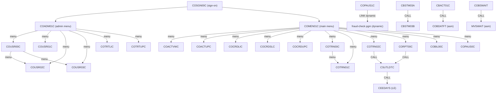

# 02 – Program-to-Program Dependencies (Call Chain)

Program transfers were extracted by parsing every COBOL program for:

- static subroutine calls — `CALL '<literal>'`;
- CICS program transfers — `EXEC CICS XCTL PROGRAM(...)` and `EXEC CICS LINK PROGRAM(...)`.

Where the `PROGRAM(...)` operand is a **data name** (variable) rather than a literal, the call is
**dynamic**: the actual target is only known at run time. These are flagged as
`dynamic/needs review`. Many of them are menu-driven and can be *partially* resolved from the option
tables (`COMEN02Y`, `COADM02Y`) and from `MOVE '<literal>' TO CDEMO-TO-PROGRAM` statements — the
candidate targets are listed for convenience but must still be confirmed manually.

## Static Calls (`CALL '<literal>'`)

These are compile-time-bound calls to subprograms or runtime services.

| Caller | Callee | Kind | Notes |
| :--- | :--- | :--- | :--- |
| `CBACT01C` | `COBDATFT` | app subroutine (assembler) | Date-format helper (`app/asm/COBDATFT.asm`). |
| `CBACT01C` | `CEE3ABD` | LE service | Language Environment abend. |
| `CBACT02C` | `CEE3ABD` | LE service | Abend on file error. |
| `CBACT03C` | `CEE3ABD` | LE service | Abend on file error. |
| `CBACT04C` | `CEE3ABD` | LE service | Abend on file error. |
| `CBCUS01C` | `CEE3ABD` | LE service | Abend on file error. |
| `CBEXPORT` | `CEE3ABD` | LE service | Abend on file error. |
| `CBIMPORT` | `CEE3ABD` | LE service | Abend on file error. |
| `CBSTM03A` | `CBSTM03B` | app subroutine | Statement I/O subroutine (`app/cbl/CBSTM03B.CBL`). |
| `CBSTM03A` | `CEE3ABD` | LE service | Abend on file error. |
| `CBTRN01C` | `CEE3ABD` | LE service | Abend on file error. |
| `CBTRN02C` | `CEE3ABD` | LE service | Abend on file error. |
| `CBTRN03C` | `CEE3ABD` | LE service | Abend on file error. |
| `CORPT00C` | `CSUTLDTC` | app subroutine | Date-validation utility. |
| `COTRN02C` | `CSUTLDTC` | app subroutine | Date-validation utility. |
| `CSUTLDTC` | `CEEDAYS` | LE service | LE date conversion callable service. |
| `COBSWAIT` | `MVSWAIT` | app subroutine (assembler) | Timed wait (`app/asm/MVSWAIT.asm`). |
| `COACCT01` | `MQOPEN`, `MQGET`, `MQPUT`, `MQCLOSE` | MQ stub | VSAM-MQ module. |
| `CODATE01` | `MQOPEN`, `MQGET`, `MQPUT`, `MQCLOSE` | MQ stub | VSAM-MQ module. |
| `COPAUA0C` | `MQOPEN`, `MQGET`, `MQPUT1`, `MQCLOSE` | MQ stub | IMS-DB2-MQ module. |
| `DBUNLDGS` | `CBLTDLI` | IMS DL/I | IMS-DB2-MQ module. |
| `PAUDBLOD` | `CBLTDLI` | IMS DL/I | IMS-DB2-MQ module. |
| `PAUDBUNL` | `CBLTDLI` | IMS DL/I | IMS-DB2-MQ module. |

`CEE3ABD`, `CEEDAYS`, `CBLTDLI` and the `MQ*` verbs are external runtime services (Language
Environment / IMS / MQ), **not** application source in this repository — see
`06-missing-source-obsolete.md`.

## CICS Program Transfers

### Static `XCTL`/`LINK` (literal target)

| Caller | Type | Callee | Notes |
| :--- | :--- | :--- | :--- |
| `COSGN00C` | XCTL | `COADM01C` | Sign-on routes admins to the admin menu. |
| `COSGN00C` | XCTL | `COMEN01C` | Sign-on routes regular users to the main menu. |

### Dynamic `XCTL`/`LINK` (variable target — `dynamic/needs review`)

The `PROGRAM(...)` operand is a variable. `CDEMO-TO-PROGRAM` is the standard "return/next program"
field in the shared COMMAREA (`COCOM01Y`); menu programs dispatch through option tables. Candidate
targets below are resolved from `MOVE` literals and the menu copybooks and require manual review.

| Caller | Type | Variable | Resolved candidate target(s) | Basis |
| :--- | :--- | :--- | :--- | :--- |
| `COMEN01C` | XCTL | `CDEMO-MENU-OPT-PGMNAME(WS-OPTION)` | `COACTVWC`, `COACTUPC`, `COCRDLIC`, `COCRDSLC`, `COCRDUPC`, `COTRN00C`, `COTRN01C`, `COTRN02C`, `CORPT00C`, `COBIL00C`, `COPAUS0C` | `COMEN02Y` option table (11 entries) |
| `COADM01C` | XCTL | `CDEMO-ADMIN-OPT-PGMNAME(WS-OPTION)` | `COUSR00C`, `COUSR01C`, `COUSR02C`, `COUSR03C`, `COTRTLIC`, `COTRTUPC` | `COADM02Y` option table (6 entries) |
| `COADM01C` | XCTL | `CDEMO-TO-PROGRAM` | `COSGN00C` | `MOVE` literal |
| `COBIL00C` | XCTL | `CDEMO-TO-PROGRAM` | `COMEN01C`, `COSGN00C` | `MOVE` literal |
| `COACTUPC` | XCTL | `CDEMO-TO-PROGRAM` | *(unresolved)* | COMMAREA-supplied |
| `COACTVWC` | XCTL | `CDEMO-TO-PROGRAM` | *(unresolved)* | COMMAREA-supplied |
| `COCRDLIC` | XCTL | `LIT-MENUPGM` / `CCARD-NEXT-PROG` | *(unresolved)* | COMMAREA/working literal |
| `COCRDSLC` | XCTL | `CDEMO-TO-PROGRAM` | *(unresolved)* | COMMAREA-supplied |
| `COCRDUPC` | XCTL | `CDEMO-TO-PROGRAM` | *(unresolved)* | COMMAREA-supplied |
| `CORPT00C` | XCTL | `CDEMO-TO-PROGRAM` | `COMEN01C`, `COSGN00C` | `MOVE` literal |
| `COTRN00C` | XCTL | `CDEMO-TO-PROGRAM` | `COMEN01C`, `COSGN00C`, `COTRN01C` | `MOVE` literal |
| `COTRN01C` | XCTL | `CDEMO-TO-PROGRAM` | `COMEN01C`, `COSGN00C`, `COTRN00C` | `MOVE` literal |
| `COTRN02C` | XCTL | `CDEMO-TO-PROGRAM` | `COMEN01C`, `COSGN00C` | `MOVE` literal |
| `COUSR00C` | XCTL | `CDEMO-TO-PROGRAM` | `COADM01C`, `COSGN00C`, `COUSR02C`, `COUSR03C` | `MOVE` literal |
| `COUSR01C` | XCTL | `CDEMO-TO-PROGRAM` | `COADM01C`, `COSGN00C` | `MOVE` literal |
| `COUSR02C` | XCTL | `CDEMO-TO-PROGRAM` | `COADM01C`, `COSGN00C` | `MOVE` literal |
| `COUSR03C` | XCTL | `CDEMO-TO-PROGRAM` | `COADM01C`, `COSGN00C` | `MOVE` literal |
| `COPAUS0C` | XCTL | `CDEMO-TO-PROGRAM` | `COSGN00C` | `MOVE` literal (IMS-DB2-MQ module) |
| `COPAUS1C` | LINK | `WS-PGM-AUTH-FRAUD` | *(unresolved)* | working-storage literal (IMS-DB2-MQ module) |
| `COPAUS1C` | XCTL | `CDEMO-TO-PROGRAM` | *(unresolved)* | COMMAREA-supplied (IMS-DB2-MQ module) |
| `COTRTLIC` | XCTL | `LIT-ADDTPGM` / `CDEMO-TO-PROGRAM` | *(unresolved)* | trantype-db2 module |
| `COTRTUPC` | XCTL | `CDEMO-TO-PROGRAM` | *(unresolved)* | trantype-db2 module |

## Call Graph (Mermaid)

The graph shows the CICS online navigation (solid arrows for static transfers and resolved
menu-driven transfers) and the batch static `CALL` relationships. Menu-driven edges are marked
`"menu"` and represent `dynamic/needs review` transfers.

> Batch programs generally do not transfer to one another; they are sequenced by JCL/scheduler
> (see `07-grouping-sequencing.md`). Every online program can also `XCTL` back to `COSGN00C`
> or its calling menu via `CDEMO-TO-PROGRAM`; those return edges are omitted from the diagram for
> readability but are listed in the dynamic-transfer table above.
