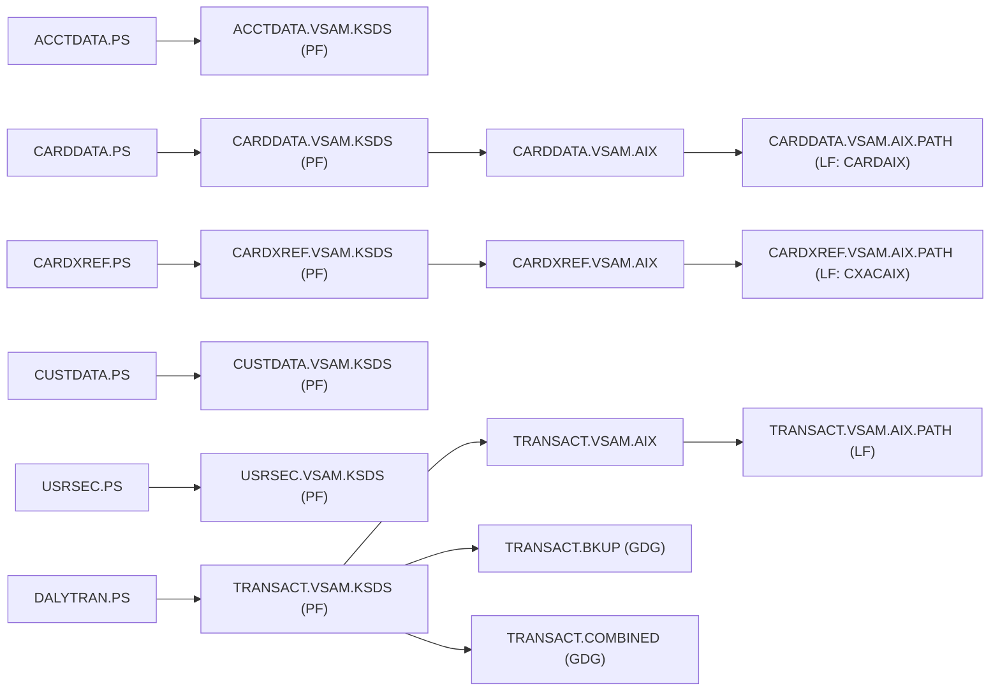

# 04 – File-to-File Mapping (Physical File → Logical File)

The authoritative source for the VSAM object relationships is `app/catlg/LISTCAT.txt`. Each VSAM
**base cluster** (the physical KSDS) owns a `DATA` component and an `INDEX` component; some clusters
also have one or more **Alternate Indexes (AIX)**, each surfaced to programs through a **PATH**
(the logical file / VSAM path). AIX and PATH definitions were cross-checked against the defining
JCL: `CARDFILE.jcl` (CARDDATA AIX), `XREFFILE.jcl` (CARDXREF AIX) and `TRANIDX.jcl` (TRANSACT AIX).

All datasets share the high-level qualifier `AWS.M2.CARDDEMO`.

## Base Cluster → Components → AIX / PATH → Related PS

| Base cluster (PF / KSDS) | DATA component | INDEX component | Alternate index (AIX) | PATH (LF) | CICS logical name | Related PS (seed) |
| :--- | :--- | :--- | :--- | :--- | :--- | :--- |
| `…ACCTDATA.VSAM.KSDS` | `…ACCTDATA.VSAM.KSDS.DATA` | `…ACCTDATA.VSAM.KSDS.INDEX` | — | — | `ACCTDAT` | `…ACCTDATA.PS` |
| `…CARDDATA.VSAM.KSDS` | `…CARDDATA.VSAM.KSDS.DATA` | `…CARDDATA.VSAM.KSDS.INDEX` | `…CARDDATA.VSAM.AIX` (`+DATA`/`+INDEX`) | `…CARDDATA.VSAM.AIX.PATH` | `CARDDAT` (base), `CARDAIX` (path) | `…CARDDATA.PS` |
| `…CARDXREF.VSAM.KSDS` | `…CARDXREF.VSAM.KSDS.DATA` | `…CARDXREF.VSAM.KSDS.INDEX` | `…CARDXREF.VSAM.AIX` (`+DATA`/`+INDEX`) | `…CARDXREF.VSAM.AIX.PATH` | `CCXREF` (base), `CXACAIX` (path) | `…CARDXREF.PS` |
| `…CUSTDATA.VSAM.KSDS` | `…CUSTDATA.VSAM.KSDS.DATA` | `…CUSTDATA.VSAM.KSDS.INDEX` | — | — | `CUSTDAT` | `…CUSTDATA.PS` |
| `…TRANSACT.VSAM.KSDS` | `…TRANSACT.VSAM.KSDS.DATA` | `…TRANSACT.VSAM.KSDS.INDEX` | `…TRANSACT.VSAM.AIX` (`+DATA`/`+INDEX`) | `…TRANSACT.VSAM.AIX.PATH` | `TRANSACT` (base) | `…TRANSACT` GDGs (see below) |
| `…TCATBALF.VSAM.KSDS` | `…TCATBALF.VSAM.KSDS.DATA` | `…TCATBALF.VSAM.KSDS.INDEX` | — | — | (batch only) | `…TCATBALF.PS` |
| `…TRANCATG.VSAM.KSDS` | `…TRANCATG.VSAM.KSDS.DATA` | `…TRANCATG.VSAM.KSDS.INDEX` | — | — | (batch only) | `…TRANCATG.PS` |
| `…TRANTYPE.VSAM.KSDS` | `…TRANTYPE.VSAM.KSDS.DATA` | `…TRANTYPE.VSAM.KSDS.INDEX` | — | — | (batch only) | `…TRANTYPE.PS` |
| `…DISCGRP.VSAM.KSDS` | `…DISCGRP.VSAM.KSDS.DATA` | `…DISCGRP.VSAM.KSDS.INDEX` | — | — | (batch only) | `…DISCGRP.PS` |
| `…USRSEC.VSAM.KSDS` | `…USRSEC.VSAM.KSDS.DAT` | `…USRSEC.VSAM.KSDS.IDX` | — | — | `USRSEC` | `…USRSEC.PS` |

> Note: the `USRSEC` cluster uses the shortened component suffixes `.DAT` / `.IDX` (not
> `.DATA` / `.INDEX`) in the catalog. `SECURITY.PS` is also present and is an alternate seed of the
> user-security file.

## Alternate Index Detail (from defining JCL)

| AIX | Base cluster (RELATE) | Alternate key | PATH | Defined by | Used as (CICS / batch) |
| :--- | :--- | :--- | :--- | :--- | :--- |
| `…CARDDATA.VSAM.AIX` | `…CARDDATA.VSAM.KSDS` | `CARD-ACCT-ID` | `…CARDDATA.VSAM.AIX.PATH` | `CARDFILE.jcl` | CICS `CARDAIX` — read card by account |
| `…CARDXREF.VSAM.AIX` | `…CARDXREF.VSAM.KSDS` | `XREF-ACCT-ID` | `…CARDXREF.VSAM.AIX.PATH` | `XREFFILE.jcl` | CICS `CXACAIX` — read xref by account; batch `XREFFIL1` in `INTCALC.jcl` |
| `…TRANSACT.VSAM.AIX` | `…TRANSACT.VSAM.KSDS` | `TRAN-CARD-NUM` | `…TRANSACT.VSAM.AIX.PATH` | `TRANIDX.jcl` | Alternate path over transactions by card number |

## Related Sequential / GDG Datasets (NONVSAM)

These PS/GDG datasets feed or are produced from the VSAM clusters (loads, backups, extracts,
reports). They are physical files in their own right but are not KSDS base clusters.

| Dataset (pattern) | Type | Role |
| :--- | :--- | :--- |
| `…ACCTDATA.PS`, `…CARDDATA.PS`, `…CARDXREF.PS`, `…CUSTDATA.PS`, `…TCATBALF.PS`, `…TRANCATG.PS`, `…TRANTYPE.PS`, `…DISCGRP.PS`, `…USRSEC.PS`, `…SECURITY.PS` | PS | Seed/load images for the like-named KSDS. |
| `…DALYTRAN.PS`, `…DALYTRAN.PS.INIT` | PS | Daily incoming transactions (input to `POSTTRAN`). |
| `…DALYREJS.G####V00` | GDG | Rejected daily transactions (output of `CBTRN02C`). |
| `…SYSTRAN.G####V00` | GDG | System-generated transactions (interest, from `CBACT04C`). |
| `…TRANSACT.BKUP.G####V00` | GDG | Transaction master backups (`TRANBKP`). |
| `…TRANSACT.COMBINED.G####V00` | GDG | Combined system + daily transactions (`COMBTRAN`). |
| `…TRANSACT.DALY.G####V00` | GDG | Daily transaction slices used by reporting (`CBTRN03C`). |
| `…TRANREPT.G####V00` | GDG | Transaction detail report output (`CBTRN03C`). |
| `…TCATBALF.BKUP.G####V00`, `…TCATBALF.REPT` | GDG / PS | Category-balance backup and report. |
| `…DATEPARM` | PS | Date parameter card (reporting run range). |

## PF → LF Relationship Diagram (Mermaid)

