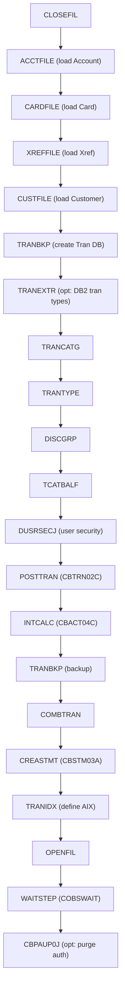

# 07 – Grouping & Sequencing

This report groups the programs and JCL into functional domains and documents the batch execution
order (from the README "Running Batch Jobs" table and the scheduler definitions under
`app/scheduler/`).

## Functional Domains

| Domain | Online programs (CICS) | Batch programs | Key JCL | Primary files |
| :--- | :--- | :--- | :--- | :--- |
| **Account** | `COACTVWC` (view), `COACTUPC` (update) | `CBACT01C` (print) | `ACCTFILE`, `READACCT` | `ACCTDATA` |
| **Card** | `COCRDLIC` (list), `COCRDSLC` (detail), `COCRDUPC` (update) | `CBACT02C` (print) | `CARDFILE`, `READCARD` | `CARDDATA` (+AIX) |
| **Customer** | — | `CBCUS01C` (print) | `CUSTFILE`, `READCUST` | `CUSTDATA` |
| **Cross-reference** | — | `CBACT03C` (print) | `XREFFILE`, `READXREF` | `CARDXREF` (+AIX) |
| **Transaction Posting** | `COTRN00C` (list), `COTRN01C` (view), `COTRN02C` (add) | `CBTRN01C` (validate, orphaned), `CBTRN02C` (post) | `POSTTRAN` | `TRANSACT`, `DALYTRAN`, `DALYREJS`, `TCATBALF` |
| **Interest** | — | `CBACT04C` (interest calc) | `INTCALC` | `TCATBALF`, `DISCGRP`, `ACCTDATA`, `SYSTRAN` |
| **Statement** | — | `CBSTM03A` + `CBSTM03B` (subroutine) | `CREASTMT` | `TRANSACT`, `ACCTDATA`, `CUSTDATA`, `XREF`, `STATEMNT` |
| **Reporting** | `CORPT00C` (report request) | `CBTRN03C` (transaction report) | `TRANREPT` (uses `TRANREPT.prc`) | `TRANSACT`, `TRANTYPE`, `TRANCATG`, `TRANREPT` |
| **Billing** | `COBIL00C` (bill pay) | — | — | `ACCTDATA`, `TRANSACT` |
| **User / Security** | `COSGN00C` (sign-on), `COUSR00C`/`01C`/`02C`/`03C` (user admin) | — | `DUSRSECJ` | `USRSEC` |
| **Admin / Navigation** | `COADM01C` (admin menu), `COMEN01C` (main menu) | — | — | (COMMAREA only) |
| **Import / Export** | — | `CBEXPORT`, `CBIMPORT` | `CBEXPORT`, `CBIMPORT` | `EXPORT.DATA` + all master files |
| **File control / utility** | — | `COBSWAIT` (wait) | `CLOSEFIL`, `OPENFIL`, `WAITSTEP`, `TRANBKP`, `COMBTRAN`, `TRANIDX` | CICS FCT, transaction GDGs |
| **Optional – Transaction Type (DB2)** | `COTRTLIC` (list), `COTRTUPC` (update) | `COBTUPDT` | `TRANEXTR`, `MNTTRDB2` | DB2 transaction-type tables |
| **Optional – Pending Auth (IMS-DB2-MQ)** | `COPAUS0C`, `COPAUS1C`, `COPAUS2C`, `COPAUA0C` | `CBPAUP0C`, `PAUDBLOD`, `PAUDBUNL`, `DBUNLDGS` | `CBPAUP0J`, `LOADPADB`, `UNLDPADB`, `UNLDGSAM` | IMS pending-auth DB |
| **Optional – Account/Date over MQ (VSAM-MQ)** | `COACCT01`, `CODATE01` | — | — | `ACCTDATA` via MQ |

## Batch Execution Sequence (README "Running Batch Jobs", lines 213–233)

Run the full batch process in this order:

1. **CLOSEFIL** — Closes files opened by CICS.
2. **ACCTFILE** — Loads Account database using sample data.
3. **CARDFILE** — Loads Card database with credit-card sample data.
4. **XREFFILE** — Loads customer/card/account cross-reference to VSAM.
5. **CUSTFILE** — Creates customer database.
6. **TRANBKP** — Creates Transaction database.
7. **TRANEXTR** — Extracts latest DB2 data for transaction types. *(Optional: DB2 Transaction Type Mgmt)*
8. **TRANCATG** — Copies latest transaction category file to VSAM.
9. **TRANTYPE** — Copies latest transaction type file to VSAM.
10. **DISCGRP** — Copies initial disclosure-group file to VSAM.
11. **TCATBALF** — Copies initial transaction-category-balance file to VSAM.
12. **DUSRSECJ** — Sets up the user-security VSAM file.
13. **POSTTRAN** — Core transaction processing job (`CBTRN02C`).
14. **INTCALC** — Runs interest calculations (`CBACT04C`).
15. **TRANBKP** — Backs up the Transaction database.
16. **COMBTRAN** — Combines system transactions with daily ones.
17. **CREASTMT** — Produces transaction statements (`CBSTM03A`).
18. **TRANIDX** — Defines the alternate index on the transaction file.
19. **OPENFIL** — Makes files available to CICS.
20. **WAITSTEP** — Waits for a given time (`COBSWAIT`).
21. **CBPAUP0J** — Purges expired authorizations. *(Optional: IMS-DB2-MQ Pending Authorizations)*

## Scheduler Definitions (`app/scheduler/`)

Two scheduler exports are provided; both describe the same CardDemo work broken into scheduled
flows rather than the single linear README list.

- **`CardDemo.controlm`** (Control-M XML) defines three folders, each a `CLOSEFIL → work →
  WAITSTEP → OPENFIL` bracket driven by `IN`/`OUT` conditions:
  - `DAILY-TransactionBackup`: `CLOSEFIL → TRANBKP → WAITSTEP → OPENFIL`.
  - `WEEKLY-TransactionTypesDBRefresh`: `MNTTRDB2 → TRANEXTR` and the disclosure refresh
    `CLOSEFIL → DISCGRP → WAITSTEP → OPENFIL` (folder `WEEKLY-DisclosureGroupsRefresh`).
  - `MONTHLY-InterestCalculation`: `CLOSEFIL → INTCALC → COMBTRAN → WAITSTEP → OPENFIL`.
- **`CardDemo.ca7`** (CA-7 `LJOB` listing) is a job-definition export beginning with `CLOSEFIL`
  (`JOB=CLOSEFIL,LIST=ALL`), listing the same CardDemo jobs with their schedule/trigger metadata.

## Batch Flow Diagram (Mermaid)

