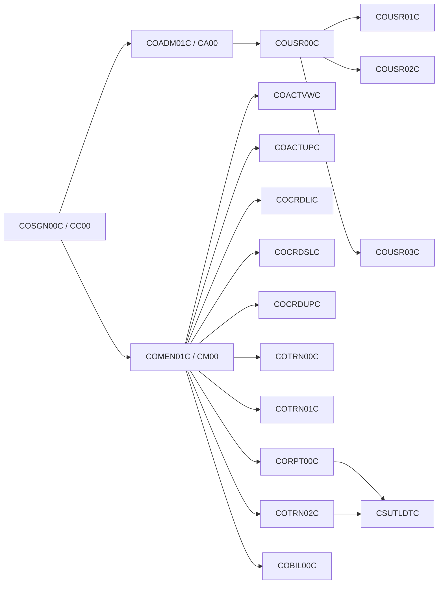

# CardDemo source inventory

This inventory was extracted from `app/cbl/`, `app/cpy/`, `app/csd/CARDDEMO.CSD`,
`app/bms/`, and `app/jcl/`.  Program rows were mechanically scanned for
`COPY`, CICS file commands, COBOL file declarations, and calls, then
spot-checked against `COSGN00C`, `COADM01C`, `COMEN01C`, `COCRDLIC`,
`COTRN00C`, `CBTRN02C`, and `CBSTM03A`.  A dynamic target is reported as the
source variable rather than guessed.

## Program inventory

`N/A` means the source category does not apply.  CICS file identifiers are
the names used by the program; batch DD names are the names declared in the
corresponding JCL.

| Program | Class | CICS transaction | BMS mapset | COPY books | Files read / written | CICS operations | Invoked programs |
|---|---|---|---|---|---|---|---|
| CBACT01C | batch | N/A | N/A | CVACT01Y, CODATECN | read `ACCTFILE` (`ACCTFILE`); write `OUTFILE`, `ARRYFILE`, `VBRCFILE` (`READACCT`) | N/A | `COBDATFT`, `CEE3ABD` |
| CBACT02C | batch | N/A | N/A | CVACT02Y | read `CARDFILE` (`READCARD`) | N/A | `CEE3ABD` |
| CBACT03C | batch | N/A | N/A | CVACT03Y | read `XREFFILE` (`READXREF`) | N/A | `CEE3ABD` |
| CBACT04C | batch | N/A | N/A | CVTRA01Y, CVACT03Y, CVTRA02Y, CVACT01Y, CVTRA05Y | read `TCATBALF`, `XREFFILE`, `DISCGRP`; I-O `ACCTFILE`; write `TRANSACT` (`INTCALC`) | N/A | `CEE3ABD` |
| CBCUS01C | batch | N/A | N/A | CVCUS01Y | read `CUSTFILE` (`READCUST`) | N/A | `CEE3ABD` |
| CBEXPORT | batch | N/A | N/A | CVCUS01Y, CVACT01Y, CVACT03Y, CVTRA05Y, CVACT02Y, CVEXPORT | read `CUSTFILE`, `ACCTFILE`, `XREFFILE`, `TRANSACT`, `CARDFILE`; write `EXPFILE` (`CBEXPORT`) | N/A | `CEE3ABD` |
| CBIMPORT | batch | N/A | N/A | CVCUS01Y, CVACT01Y, CVACT03Y, CVTRA05Y, CVACT02Y, CVEXPORT | read `EXPFILE`; write `CUSTOUT`, `ACCTOUT`, `XREFOUT`, `TRNXOUT`, `CARDOUT`, `ERROUT` (`CBIMPORT`) | N/A | `CEE3ABD` |
| CBSTM03A | batch | N/A | N/A | COSTM01, CVACT03Y, CUSTREC, CVACT01Y | read `TRNXFILE`, `XREFFILE`, `CUSTFILE`, `ACCTFILE`; write `HTMLFILE` and `STMTFILE` (`CREASTMT`) | N/A | `CBSTM03B` (static), `CEE3ABD` |
| CBSTM03B | batch | N/A | N/A | none | read `TRNXFILE`, `XREFFILE`, `CUSTFILE`, `ACCTFILE` | N/A | none |
| CBTRN01C | batch | N/A | N/A | CVTRA06Y, CVCUS01Y, CVACT03Y, CVACT02Y, CVACT01Y, CVTRA05Y | read `DALYTRAN`, `CUSTFILE`, `XREFFILE`, `CARDFILE`, `ACCTFILE`, `TRANFILE` | N/A | `CEE3ABD` |
| CBTRN02C | batch | N/A | N/A | CVTRA06Y, CVTRA05Y, CVACT03Y, CVACT01Y, CVTRA01Y | read `DALYTRAN`, `XREFFILE`, `ACCTFILE`, `TCATBALF`; I-O `TRANFILE`, `TCATBALF`; write `DALYREJS` (`POSTTRAN`) | N/A | `CEE3ABD` |
| CBTRN03C | batch | N/A | N/A | CVTRA05Y, CVACT03Y, CVTRA03Y, CVTRA04Y, CVTRA07Y | read `TRANFILE`, `CARDXREF`, `TRANTYPE`, `TRANCATG`, `DATEPARM`; write `TRANREPT` (`TRANREPT`) | N/A | `CEE3ABD` |
| COACTUPC | online | CAUP | COACTUP | CVCRD01Y, CSLKPCDY, DFHBMSCA, DFHAID, COTTL01Y, COACTUP, CSDAT01Y, CSMSG01Y, CSMSG02Y, CSUSR01Y, CVACT01Y, CVACT03Y, CVCUS01Y, COCOM01Y, CSSETATY, CSSTRPFY, CSUTLDWY, CSUTLDPY | read/rewrite `ACCTDAT`, `CUSTDAT`, `CXACAIX` (source literals `LIT-ACCTFILENAME`, `LIT-CUSTFILENAME`, `LIT-CARDXREFNAME-ACCT-PATH`) | READ, REWRITE, XCTL | dynamic `CDEMO-TO-PROGRAM` |
| COACTVWC | online | CAVW | COACTVW | CVCRD01Y, COCOM01Y, DFHBMSCA, DFHAID, COTTL01Y, COACTVW, CSDAT01Y, CSMSG01Y, CSMSG02Y, CSUSR01Y, CVACT01Y, CVACT02Y, CVACT03Y, CVCUS01Y, CSSTRPFY | read `ACCTDAT`, `CUSTDAT`, `CARDAIX` (source literals) | READ, XCTL | dynamic `CDEMO-TO-PROGRAM` |
| COADM01C | online | CA00 | COADM01 | COCOM01Y, COADM02Y, COADM01, COTTL01Y, CSDAT01Y, CSMSG01Y, CSUSR01Y, DFHAID, DFHBMSCA | no VSAM file command | XCTL | dynamic `CDEMO-ADMIN-OPT-PGMNAME(WS-OPTION)`, dynamic `CDEMO-TO-PROGRAM` |
| COBIL00C | online | CB00 | COBIL00 | COCOM01Y, COBIL00, COTTL01Y, CSDAT01Y, CSMSG01Y, CVACT01Y, CVACT03Y, CVTRA05Y, DFHAID, DFHBMSCA | read/rewrite `ACCTDAT`; browse/read `CXACAIX`; read/write `TRANSACT` | READ, WRITE, REWRITE, STARTBR, READPREV, XCTL | dynamic `CDEMO-TO-PROGRAM` |
| COCRDLIC | online | CCLI | COCRDLI | CVCRD01Y, COCOM01Y, DFHBMSCA, DFHAID, COTTL01Y, COCRDLI, CSDAT01Y, CSMSG01Y, CSUSR01Y, CVACT02Y, CSSTRPFY | browse/read `CARDDAT` | READ, STARTBR, READNEXT, READPREV, XCTL | dynamic `LIT-MENUPGM`, `CCARD-NEXT-PROG` |
| COCRDSLC | online | CCDL | COCRDSL | CVCRD01Y, COCOM01Y, DFHBMSCA, DFHAID, COTTL01Y, COCRDSL, CSDAT01Y, CSMSG01Y, CSMSG02Y, CSUSR01Y, CVACT02Y, CVCUS01Y, CSSTRPFY | read `CARDDAT`, `CARDAIX` | READ, XCTL | dynamic `CDEMO-TO-PROGRAM` |
| COCRDUPC | online | CCUP | COCRDUP | CVCRD01Y, COCOM01Y, DFHBMSCA, DFHAID, COTTL01Y, COCRDUP, CSDAT01Y, CSMSG01Y, CSMSG02Y, CSUSR01Y, CVACT02Y, CVCUS01Y, CSSTRPFY | read/rewrite `CARDDAT` | READ, REWRITE, XCTL | dynamic `CDEMO-TO-PROGRAM` |
| COMEN01C | online | CM00 | COMEN01 | COCOM01Y, COMEN02Y, COMEN01, COTTL01Y, CSDAT01Y, CSMSG01Y, CSUSR01Y, DFHAID, DFHBMSCA | no VSAM file command | XCTL | dynamic `CDEMO-MENU-OPT-PGMNAME(WS-OPTION)`, `CDEMO-TO-PROGRAM` |
| CORPT00C | online | CR00 | CORPT00 | COCOM01Y, CORPT00, COTTL01Y, CSDAT01Y, CSMSG01Y, CVTRA05Y, DFHAID, DFHBMSCA | no VSAM/sequential file command; submits a JCL record to CICS temporary data queue `JOBS` | WRITE (TD queue), XCTL | `CSUTLDTC` (static), dynamic `CDEMO-TO-PROGRAM` |
| COSGN00C | online | CC00 | COSGN00 | COCOM01Y, COSGN00, COTTL01Y, CSDAT01Y, CSMSG01Y, CSUSR01Y, DFHAID, DFHBMSCA | read `USRSEC` (`WS-USRSEC-FILE`) | READ, XCTL | `COADM01C`, `COMEN01C` (static literals in XCTL) |
| COTRN00C | online | CT00 | COTRN00 | COCOM01Y, COTRN00, COTTL01Y, CSDAT01Y, CSMSG01Y, CVTRA05Y, DFHAID, DFHBMSCA | browse/read `TRANSACT` | READ, STARTBR, READNEXT, READPREV, XCTL | dynamic `CDEMO-TO-PROGRAM` |
| COTRN01C | online | CT01 | COTRN01 | COCOM01Y, COTRN01, COTTL01Y, CSDAT01Y, CSMSG01Y, CVTRA05Y, DFHAID, DFHBMSCA | read `TRANSACT` | READ, XCTL | dynamic `CDEMO-TO-PROGRAM` |
| COTRN02C | online | CT02 | COTRN02 | COCOM01Y, COTRN02, COTTL01Y, CSDAT01Y, CSMSG01Y, CVTRA05Y, CVACT01Y, CVACT03Y, DFHAID, DFHBMSCA | read `CXACAIX`, `CCXREF`; browse/read/write `TRANSACT` | READ, WRITE, STARTBR, XCTL | `CSUTLDTC` (static), dynamic `CDEMO-TO-PROGRAM` |
| COUSR00C | online | CU00 | COUSR00 | COCOM01Y, COUSR00, COTTL01Y, CSDAT01Y, CSMSG01Y, CSUSR01Y, DFHAID, DFHBMSCA | browse/read `USRSEC` | READ, STARTBR, READNEXT, XCTL | dynamic `CDEMO-TO-PROGRAM` |
| COUSR01C | online | CU01 | COUSR01 | COCOM01Y, COUSR01, COTTL01Y, CSDAT01Y, CSMSG01Y, CSUSR01Y, DFHAID, DFHBMSCA | write `USRSEC` | WRITE, XCTL | dynamic `CDEMO-TO-PROGRAM` |
| COUSR02C | online | CU02 | COUSR02 | COCOM01Y, COUSR02, COTTL01Y, CSDAT01Y, CSMSG01Y, CSUSR01Y, DFHAID, DFHBMSCA | read/rewrite `USRSEC` | READ, REWRITE, XCTL | dynamic `CDEMO-TO-PROGRAM` |
| COUSR03C | online | CU03 | COUSR03 | COCOM01Y, COUSR03, COTTL01Y, CSDAT01Y, CSMSG01Y, CSUSR01Y, DFHAID, DFHBMSCA | read/delete `USRSEC` | READ, DELETE, XCTL | dynamic `CDEMO-TO-PROGRAM` |
| COBSWAIT | utility batch step | N/A | N/A | none | no file declarations | N/A | `MVSWAIT` |
| CSUTLDTC | called utility | N/A | N/A | none | no file declarations | N/A | `CEEDAYS` |

`COCRDSEC` has a CSD program definition but no matching source file in
`app/cbl/`; it is therefore not an inventory row.  The CSD also defines
transaction `CDV1` for `COCRDSEC`, but no source-side BMS/copybook/file
facts were available for it.

## Online call graph



Nested form (the menu options are dynamic `XCTL` targets populated by the
menu copybooks):

```text
COSGN00C (CC00)
├── COADM01C (CA00)
│   └── COUSR00C (CU00)
│       ├── COUSR01C (CU01)
│       ├── COUSR02C (CU02)
│       └── COUSR03C (CU03)
└── COMEN01C (CM00)
    ├── COACTVWC (CAVW)
    ├── COACTUPC (CAUP)
    ├── COCRDLIC (CCLI)
    ├── COCRDSLC (CCDL)
    ├── COCRDUPC (CCUP)
    ├── COTRN00C (CT00)
    ├── COTRN01C (CT01)
    ├── COTRN02C (CT02)
    ├── CORPT00C (CR00) ──> CSUTLDTC
    └── COBIL00C (CB00)
```

## Batch job flows

The following are the principal program-bearing flows in `app/jcl/`.
Steps such as SORT and IDCAMS are retained because they transform the
input/output files around the COBOL step.

| Job | Ordered steps from JCL | Program-facing files |
|---|---|---|
| POSTTRAN | `STEP15 CBTRN02C` | `TRANFILE` read/I-O, `DALYTRAN` read, `XREFFILE` read, `DALYREJS` write, `ACCTFILE` read, `TCATBALF` I-O |
| INTCALC | `STEP15 CBACT04C PARM='2022071800'` | `TCATBALF`, `XREFFILE`, `XREFFIL1`, `ACCTFILE`, `DISCGRP` read; `TRANSACT` new output |
| CREASTMT | `DELDEF01 IDCAMS` → `STEP010 SORT` → `STEP020 IDCAMS` → `STEP030 IEFBR14` → `STEP040 CBSTM03A` | transaction sort/VSAM conversion, then `TRNXFILE`, `XREFFILE`, `ACCTFILE`, `CUSTFILE` read and `STMTFILE`, `HTMLFILE` written |
| TRANREPT | `STEP05R SORT` → `STEP10R CBTRN03C` | `TRANFILE`, `CARDXREF`, `TRANTYPE`, `TRANCATG`, `DATEPARM` read; `TRANREPT` write |
| CBEXPORT | `STEP01 IDCAMS` → `STEP02 CBEXPORT` | master files read; `EXPFILE` write |
| CBIMPORT | `STEP01 CBIMPORT` | `EXPFILE` read; master/error outputs write |
| READACCT | `PREDEL IEFBR14` → `STEP05 CBACT01C` | `ACCTFILE` read; `OUTFILE`, `ARRYFILE`, `VBRCFILE` write |
| READCARD | `STEP05 CBACT02C` | `CARDFILE` read |
| READCUST | `STEP05 CBCUS01C` | `CUSTFILE` read |
| READXREF | `STEP05 CBACT03C` | `XREFFILE` read |
| WAITSTEP | `WAIT COBSWAIT` | no application file |

## Data lineage

Record lengths and layouts are taken from the copybook comments/fields.
Seed-file names are the files actually present under
`app/data/EBCDIC/`; “not present” is not an assertion that production has no
such file.

| Logical file | Copybook/layout | Length | Key | Seed in `app/data/EBCDIC/` | Readers | Writers | Java target |
|---|---|---:|---|---|---|---|---|
| ACCTDAT | CVACT01Y account record | 300 | ACCT-ID | `AWS.M2.CARDDEMO.ACCTDATA.PS` (also `ACCDATA.PS` exists) | COACTVWC, COACTUPC, COBIL00C, CBACT01C, CBACT04C, CBTRN01C, CBTRN02C, CBSTM03A | COACTUPC, COBIL00C, CBACT04C | `account` |
| CARDDAT | CVACT02Y card record | 150 | CARD-NUM | `AWS.M2.CARDDEMO.CARDDATA.PS` | COCRDLIC, COCRDSLC, COCRDUPC, CBACT02C, CBTRN01C | COCRDUPC | `card` |
| CARDAIX | CVACT02Y via card account alternate path | 150 underlying record | account alternate key | no separate seed; represented by `CARDDATA.PS` | COACTVWC, COCRDSLC | not directly written; maintained by VSAM | index on `card(acct_id)` / `card_xref(acct_id)` is not yet fully migrated |
| CCXREF | CVACT03Y card/account/customer xref | 50 | XREF-CARD-NUM | `AWS.M2.CARDDEMO.CARDXREF.PS` | COACTUPC, COACTVWC, COTRN02C, COBIL00C, CBACT03C, CBTRN01C, CBTRN02C, CBTRN03C, CBSTM03A | JCL/IDCAMS load; no direct writer was found in the scanned `app/cbl/` programs | `card_xref` |
| CXACAIX | CVACT03Y via account alternate key | 50 underlying record | XREF-ACCT-ID | no separate seed; represented by `CARDXREF.PS` | COACTUPC, COBIL00C, COTRN02C | maintained by VSAM | index on `card_xref(acct_id)` |
| CUSTDAT | CVCUS01Y customer record | 500 | CUST-ID | `AWS.M2.CARDDEMO.CUSTDATA.PS` | COACTVWC, COACTUPC, COCRDSLC, CBCUS01C, CBTRN01C, CBSTM03A | COACTUPC | `customer` |
| TRANSACT | CVTRA05Y transaction record | 350 | TRAN-ID | no exact `TRANSACT.PS`; `AWS.M2.CARDDEMO.DALYTRAN.PS` is separate | COTRN00C, COTRN01C, COTRN02C, CORPT00C, CBACT04C, CBTRN01C, CBTRN02C, CBTRN03C, CBEXPORT, CBSTM03A | COTRN02C, CBACT04C, CBTRN02C, CBIMPORT | `transaction` |
| USRSEC | CSUSR01Y security record | 80 | SEC-USR-ID | `AWS.M2.CARDDEMO.USRSEC.PS` | COSGN00C, COUSR00C, COUSR01C, COUSR02C, COUSR03C | COUSR01C, COUSR02C, COUSR03C, DUSRSECJ | `usrsec` |
| DISCGRP | CVTRA02Y disclosure group | 50 | DIS-GROUP-KEY | `AWS.M2.CARDDEMO.DISCGRP.PS` | CBACT04C | JCL/IDCAMS load | not yet migrated |
| TCATBALF | CVTRA01Y category balance | 50 | TRAN-CAT-KEY | `AWS.M2.CARDDEMO.TCATBALF.PS` | COBIL00C, CBACT04C, CBTRN02C | COBIL00C, CBACT04C, CBTRN02C, JCL/IDCAMS load | `tran_cat_bal` |
| TRANCATG | CVTRA04Y category type | 60 | TRAN-CAT-KEY | `AWS.M2.CARDDEMO.TRANCATG.PS` | CBTRN03C | JCL/IDCAMS load | not yet migrated |
| TRANTYPE | CVTRA03Y transaction type | 60 | TRAN-TYPE | `AWS.M2.CARDDEMO.TRANTYPE.PS` | CBTRN03C | JCL/IDCAMS load | not yet migrated |
| DALYTRAN | CVTRA06Y daily transaction | 350 | DALYTRAN-ID | `AWS.M2.CARDDEMO.DALYTRAN.PS`, `DALYTRAN.PS.INIT` | CBTRN01C, CBTRN02C | upstream extract/JCL; exact COBOL writer not present in `app/cbl/` | not yet migrated |
| report output | CVTRA07Y formatted report records | layout varies; detail is not a fixed VSAM master | report/date range | not present as an EBCDIC seed | CBTRN03C, CORPT00C | CBTRN03C (`TRANREPT`), CBSTM03A (`STMTFILE`/`HTMLFILE`) | not yet migrated |
| export output | CVEXPORT multi-record export layout | 500 | record type + sequence | `AWS.M2.CARDDEMO.EXPORT.DATA.PS` | CBIMPORT | CBEXPORT | not yet migrated |

The `CARDAIX` and `CXACAIX` rows are alternate indexes, not independent
records.  Their source records are respectively CARDDAT and CCXREF.

## Migration waves

1. **Data layer:** Flyway schema, JPA entities/repositories, and EBCDIC
   `USRSEC` load; preserve character dates and decimal precision.
2. **Batch:** loaders and reconciliation for ACCTDAT, CARDDAT, CCXREF,
   CUSTDAT, TRANSACT, and the remaining batch/reference/report files.
3. **Online services:** signon first, then account, card, transaction,
   billing, reporting, and user-management REST flows.
4. **UI:** replace BMS screens incrementally after REST behavior is proven.
5. **Extensions:** export/import, optional integrations, and date/password
   modernization after parity and cutover controls are established.
