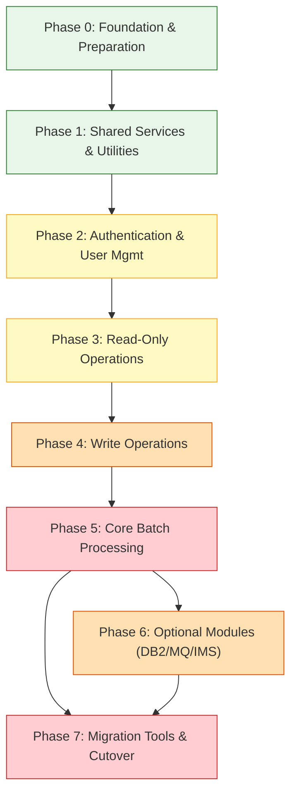

# CardDemo COBOL-to-Java Migration Journey Plan

## Executive Summary

**CardDemo** is an AWS-provided mainframe credit card management demonstration application built on IBM COBOL, CICS, VSAM, BMS, JCL, and Control-M. It simulates a production-grade credit card system with online transaction processing (OLTP), batch processing, user authentication, and reporting capabilities.

This document outlines the comprehensive migration plan to convert CardDemo from its legacy COBOL/mainframe stack to a modern **Java 17+ / Spring Boot** application with a relational database backend. The migration is structured into **8 phases (Phase 0 through Phase 7)**, each containing multiple waves, progressing from low-risk foundational work to high-risk batch and financial processing.

---

## Complete System Inventory Summary

| Category | Count | Source Directory |
|---|---|---|
| COBOL Programs (core online) | 31 | `app/cbl/` |
| COBOL Programs (DB2 transaction type) | 3 | `app/app-transaction-type-db2/cbl/` |
| COBOL Programs (VSAM-MQ) | 2 | `app/app-vsam-mq/cbl/` |
| COBOL Programs (IMS-DB2-MQ authorization) | 8 | `app/app-authorization-ims-db2-mq/cbl/` |
| **Total COBOL Programs** | **44** | |
| BMS Screen Maps | 17 | `app/bms/` |
| BMS Screen Copybooks | 17 | `app/cpy-bms/` |
| CICS Transaction Definitions | 17 | `app/csd/CARDDEMO.CSD` |
| JCL Jobs | 34+ | `app/jcl/` |
| VSAM File Definitions | 7 | `app/csd/CARDDEMO.CSD` |
| Core Copybooks | 29 | `app/cpy/` |
| Assembler Programs | 2 | `app/asm/` |
| Scheduler Definitions | 2 | `app/scheduler/` |
| ASCII Data Files | 9 | `app/data/ASCII/` |
| EBCDIC Data Files | 13 | `app/data/EBCDIC/` |

### COBOL Programs Breakdown

**Core Online Programs** (`app/cbl/`):

| Program | Description |
|---|---|
| `COSGN00C.cbl` | Sign-on / Authentication |
| `COADM01C.cbl` | Admin Menu |
| `COMEN01C.cbl` | Main Menu |
| `COACTVWC.cbl` | Account View |
| `COACTUPC.cbl` | Account Update |
| `COCRDLIC.cbl` | Card List |
| `COCRDSLC.cbl` | Card Search/Detail |
| `COCRDUPC.cbl` | Card Update |
| `COTRN00C.cbl` | Transaction List |
| `COTRN01C.cbl` | Transaction View |
| `COTRN02C.cbl` | Transaction Add |
| `COBIL00C.cbl` | Bill Payment |
| `CORPT00C.cbl` | Report Generation |
| `COUSR00C.cbl` | User List |
| `COUSR01C.cbl` | User Add |
| `COUSR02C.cbl` | User Update |
| `COUSR03C.cbl` | User Delete |
| `CSUTLDTC.cbl` | Date Conversion Utility |
| `COBSWAIT.cbl` | Wait/Sleep Utility |

**Batch Programs** (`app/cbl/`):

| Program | Description |
|---|---|
| `CBTRN01C.cbl` | Transaction Validation |
| `CBTRN02C.cbl` | Transaction Posting |
| `CBTRN03C.cbl` | Transaction Reporting |
| `CBACT01C.cbl` | Account Processing 1 |
| `CBACT02C.cbl` | Account Processing 2 |
| `CBACT03C.cbl` | Account Processing 3 |
| `CBACT04C.cbl` | Interest Calculation |
| `CBCUS01C.cbl` | Customer Processing |
| `CBSTM03A.CBL` | Statement Generation A |
| `CBSTM03B.CBL` | Statement Generation B |
| `CBEXPORT.cbl` | Data Export |
| `CBIMPORT.cbl` | Data Import |

**DB2 Transaction Type Programs** (`app/app-transaction-type-db2/cbl/`):

| Program | Description |
|---|---|
| `COTRTUPC.cbl` | Transaction Type Update |
| `COTRTLIC.cbl` | Transaction Type List |
| `COBTUPDT.cbl` | Batch Transaction Type Update |

**VSAM-MQ Programs** (`app/app-vsam-mq/cbl/`):

| Program | Description |
|---|---|
| `CODATE01.cbl` | Date Service (MQ) |
| `COACCT01.cbl` | Account Service (MQ) |

**IMS-DB2-MQ Authorization Programs** (`app/app-authorization-ims-db2-mq/cbl/`):

| Program | Description |
|---|---|
| `COPAUS0C.cbl` | Authorization Screen 0 |
| `COPAUS1C.cbl` | Authorization Screen 1 |
| `COPAUA0C.cbl` | Authorization Admin |
| `COPAUS2C.cbl` | Authorization Screen 2 |
| `CBPAUP0C.cbl` | Batch Authorization Processing |
| `DBUNLDGS.CBL` | DB Unload (General) |
| `PAUDBLOD.CBL` | Authorization DB Load |
| `PAUDBUNL.CBL` | Authorization DB Unload |

---

## Technology Dependency Matrix

| Technology | Role in CardDemo | Java Target |
|---|---|---|
| **COBOL** | Core application language (all 44 programs) | Java 17+ |
| **CICS** | Online transaction processing, screen navigation, file I/O | Spring Boot REST / Spring MVC |
| **VSAM** | Primary data storage (KSDS files) | PostgreSQL / MySQL via JPA/Hibernate |
| **BMS** | 3270 terminal screen maps (17 maps) | REST API + Web UI (Thymeleaf / React) |
| **JCL** | Batch job execution (34+ jobs) | Spring Batch / Shell scripts |
| **DB2** | Relational data for transaction types & authorization | Spring Data JPA (same target DB) |
| **MQ (IBM MQ)** | Asynchronous messaging (date/account services) | Spring JMS / Spring Cloud Stream |
| **IMS** | Hierarchical DB for authorization module | Spring Data JPA |
| **Assembler** | Low-level utilities (date formatting, wait) | `java.time` / `Thread.sleep` |
| **Control-M / CA7** | Batch job scheduling (3 chains) | Spring Scheduler / Quartz |

---

## VSAM File Inventory

Defined in `app/csd/CARDDEMO.CSD`:

| CICS File Name | VSAM Dataset | Type | Description |
|---|---|---|---|
| `ACCTDAT` | `AWS.M2.CARDDEMO.ACCTDATA.VSAM.KSDS` | KSDS | Account master data |
| `CARDDAT` | `AWS.M2.CARDDEMO.CARDDATA.VSAM.KSDS` | KSDS | Card master data |
| `CARDAIX` | `AWS.M2.CARDDEMO.CARDDATA.VSAM.AIX.PATH` | AIX | Card alternate index |
| `CCXREF` | `AWS.M2.CARDDEMO.CARDXREF.VSAM.KSDS` | KSDS | Card-to-account cross-reference |
| `CXACAIX` | `AWS.M2.CARDDEMO.CARDXREF.VSAM.AIX.PATH` | AIX | Cross-ref alternate index (by account) |
| `CUSTDAT` | `AWS.M2.CARDDEMO.CUSTDATA.VSAM.KSDS` | KSDS | Customer master data |
| `TRANSACT` | `AWS.M2.CARDDEMO.TRANSACT.VSAM.KSDS` | KSDS | Transaction data |
| `USRSEC` | `AWS.M2.CARDDEMO.USRSEC.VSAM.KSDS` | KSDS | User security data |

---

## High-Level Phase Overview

| Phase | Name | Risk Level | Key Focus |
|---|---|---|---|
| **Phase 0** | Foundation & Preparation | None | Project scaffolding, DB schema, ETL, test framework |
| **Phase 1** | Shared Services & Utilities | Low | Copybooks to POJOs, date utilities, assembler removal |
| **Phase 2** | Authentication & User Management | Low-Medium | Sign-on, user CRUD, Spring Security |
| **Phase 3** | Read-Only Operations | Medium | Account view, card list/search, transaction views, reports |
| **Phase 4** | Write Operations | Medium-High | Account update, card update, transaction add, bill payment |
| **Phase 5** | Core Batch Processing | High | Transaction posting, interest calc, statements, scheduling |
| **Phase 6** | Optional Modules | Medium (Deferrable) | DB2, MQ, IMS integrations |
| **Phase 7** | Migration Tools & Cutover | High | Export/import conversion, parallel run, final cutover |

> **Note:** Each phase may contain multiple waves. Refer to the individual per-phase documents for detailed wave breakdowns, program mappings, and acceptance criteria.

---

## Summary Metrics

| Metric | Value |
|---|---|
| Total COBOL Programs | 44 |
| Total BMS Screens | 17 |
| Total CICS Transactions | 17 |
| Total JCL Jobs | 34+ |
| Total VSAM Files (incl. AIX) | 7 (+ 2 AIX paths) |
| Total Copybooks (core) | 29 |
| Total Copybooks (BMS-generated) | 17 |
| Assembler Programs | 2 |
| Scheduler Chains | 3 (Daily, Weekly, Monthly) |
| Data Files (ASCII) | 9 |
| Data Files (EBCDIC) | 13 |
| Estimated Migration Phases | 8 (Phase 0-7) |
| Estimated Total Waves | ~28 |

---

## Recommended Migration Order

---

## Per-Phase Documents

| Document | Phase |
|---|---|
| [Phase 0: Foundation & Preparation](phase-0-foundation.md) | Scaffolding, DB schema, ETL, test framework |
| [Phase 1: Shared Services & Utilities](phase-1-shared-services-utilities.md) | Copybooks, date utilities, assembler removal |
| [Phase 2: Authentication & User Management](phase-2-authentication-user-management.md) | Sign-on, user CRUD, Spring Security |
| [Phase 3: Read-Only Operations](phase-3-read-only-operations.md) | Account view, card/transaction lists, reports |
| [Phase 4: Write Operations](phase-4-write-operations.md) | Account/card update, transaction add, bill pay |
| [Phase 5: Core Batch Processing](phase-5-batch-processing.md) | Batch jobs, interest calc, statements, scheduling |
| [Phase 6: Optional Modules](phase-6-optional-modules.md) | DB2, MQ, IMS integrations |
| [Phase 7: Migration Tools & Cutover](phase-7-migration-tools-cutover.md) | Export/import, parallel run, cutover |

---

## Key Source File Locations

| Artifact | Path |
|---|---|
| COBOL Programs (core) | `app/cbl/` |
| COBOL Programs (DB2) | `app/app-transaction-type-db2/cbl/` |
| COBOL Programs (VSAM-MQ) | `app/app-vsam-mq/cbl/` |
| COBOL Programs (IMS-DB2-MQ) | `app/app-authorization-ims-db2-mq/cbl/` |
| Copybooks (core) | `app/cpy/` |
| Copybooks (BMS-generated) | `app/cpy-bms/` |
| BMS Screen Maps | `app/bms/` |
| JCL Jobs | `app/jcl/` |
| CICS System Definition | `app/csd/CARDDEMO.CSD` |
| Assembler Programs | `app/asm/` |
| Scheduler Definitions | `app/scheduler/CardDemo.controlm`, `app/scheduler/CardDemo.ca7` |
| ASCII Data Files | `app/data/ASCII/` |
| EBCDIC Data Files | `app/data/EBCDIC/` |
