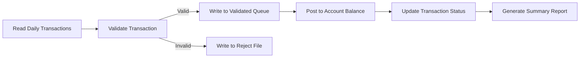
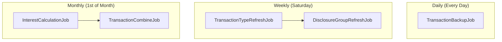

# Phase 5: Core Batch Processing (High Risk)

**Risk Level:** High  
**Objective:** Convert the critical batch processing chains — the financial heart of the CardDemo system. These batch programs handle transaction validation, posting, interest calculation, statement generation, and reporting. Errors here directly impact financial accuracy.

---

## Wave 5.1: Transaction Validation & Posting

### Objective
Convert the transaction validation and posting batch programs — the most critical batch operations.

### Source Programs

#### CBTRN01C — Transaction Validation

| Attribute | Value |
|---|---|
| **Source** | `app/cbl/CBTRN01C.cbl` |
| **JCL** | `app/jcl/POSTTRAN.jcl` (validation step) |
| **Criticality** | **Critical** — validates all transactions before posting |
| **Input Files** | Daily transaction file (`TRANSACT`), account master (`ACCTDAT`), card cross-ref (`CCXREF`) |
| **Output** | Validated transaction file, reject file with error codes |
| **Java Target** | `TransactionValidationJob` (Spring Batch `Job`) |

**Key logic:**
- Read each transaction record from the daily input
- Validate account exists and is active
- Validate card number via cross-reference
- Check transaction amount limits
- Validate transaction type codes
- Write valid transactions to output; write rejects to error file

#### CBTRN02C — Transaction Posting

| Attribute | Value |
|---|---|
| **Source** | `app/cbl/CBTRN02C.cbl` |
| **JCL** | `app/jcl/POSTTRAN.jcl` (posting step) |
| **Criticality** | **Critical** — posts validated transactions to account balances |
| **Input Files** | Validated transaction file, account master (`ACCTDAT`) |
| **Output** | Updated account balances, posted transaction records |
| **Java Target** | `TransactionPostingJob` (Spring Batch `Job`) |

**Key logic:**
- Read validated transactions
- Update account balances (debit/credit)
- Mark transactions as posted
- Generate posting summary report
- **Must be idempotent** — rerunning should not double-post

### Spring Batch Job Design

### REST / Admin Endpoints

| Method | Path | Description |
|---|---|---|
| `POST` | `/api/admin/jobs/transaction-validation/run` | Trigger validation job |
| `POST` | `/api/admin/jobs/transaction-posting/run` | Trigger posting job |
| `GET` | `/api/admin/jobs/{executionId}/status` | Check job status |

### Acceptance Criteria
- [ ] Transaction validation catches all error conditions matching COBOL logic
- [ ] Transaction posting updates balances with cent-level precision (`BigDecimal`)
- [ ] Posting is idempotent — rerun produces same result
- [ ] Reject file format and error codes match COBOL output
- [ ] Job restart capability (Spring Batch restartability)

---

## Wave 5.2: Interest Calculation

### Objective
Convert the monthly interest calculation batch program.

### Source Program

| Attribute | Value |
|---|---|
| **Source** | `app/cbl/CBACT04C.cbl` |
| **JCL** | `app/jcl/INTCALC.jcl` |
| **Scheduler** | MONTHLY-InterestCalculation chain in `app/scheduler/CardDemo.controlm` |
| **Criticality** | **Critical** — calculates monthly interest on all accounts |
| **Input Files** | Account master (`ACCTDAT`), transaction history (`TRANSACT`) |
| **Output** | Updated account balances with accrued interest |
| **Java Target** | `InterestCalculationJob` (Spring Batch `Job`) |

**Key logic:**
- Read each active account
- Calculate interest based on balance, rate, and billing cycle
- Apply interest as a transaction record
- Update account balance
- **Precision is paramount** — use `BigDecimal` with `RoundingMode.HALF_EVEN` (banker's rounding) to match COBOL `ROUNDED` behavior

### Acceptance Criteria
- [ ] Interest calculation matches COBOL output to the cent for all account types
- [ ] Banker's rounding matches COBOL `ROUNDED` clause behavior
- [ ] Monthly schedule triggerable via API and scheduler
- [ ] Job handles partial failure gracefully (can restart from last checkpoint)

---

## Wave 5.3: Statement Generation

### Objective
Convert the statement generation batch programs.

### Source Programs

#### CBSTM03A — Statement Generation (Part A)

| Attribute | Value |
|---|---|
| **Source** | `app/cbl/CBSTM03A.CBL` |
| **JCL** | `app/jcl/CREASTMT.JCL` |
| **Criticality** | **Critical** — generates customer statements |
| **Related Copybook** | `COSTM01.CPY` |
| **Java Target** | `StatementGenerationJob` (Step 1) |

#### CBSTM03B — Statement Generation (Part B)

| Attribute | Value |
|---|---|
| **Source** | `app/cbl/CBSTM03B.CBL` |
| **JCL** | `app/jcl/CREASTMT.JCL` |
| **Java Target** | `StatementGenerationJob` (Step 2) |

**Key logic:**
- Part A: Extract account/transaction data for the billing period
- Part B: Format and generate statement output
- Statement record layout defined in `app/cpy/COSTM01.CPY`

### Spring Batch Job Design

### Acceptance Criteria
- [ ] Statements generated match COBOL output format
- [ ] All account transactions for the billing period included
- [ ] Statement record layout matches `COSTM01.CPY` structure
- [ ] Large account volumes handled efficiently (Spring Batch chunk processing)

---

## Wave 5.4: Account & Customer Processing

### Objective
Convert the account and customer batch processing programs.

### Source Programs

#### CBACT01C — Account Processing 1

| Attribute | Value |
|---|---|
| **Source** | `app/cbl/CBACT01C.cbl` |
| **JCL** | `app/jcl/ACCTFILE.jcl` |
| **Java Target** | `AccountProcessingJob` (Step 1) |

#### CBACT02C — Account Processing 2

| Attribute | Value |
|---|---|
| **Source** | `app/cbl/CBACT02C.cbl` |
| **JCL** | `app/jcl/READACCT.jcl` |
| **Java Target** | `AccountProcessingJob` (Step 2) |

#### CBACT03C — Account Processing 3

| Attribute | Value |
|---|---|
| **Source** | `app/cbl/CBACT03C.cbl` |
| **JCL** | `app/jcl/TCATBALF.jcl` |
| **Java Target** | `AccountProcessingJob` (Step 3) |

#### CBCUS01C — Customer Processing

| Attribute | Value |
|---|---|
| **Source** | `app/cbl/CBCUS01C.cbl` |
| **JCL** | `app/jcl/CUSTFILE.jcl` |
| **Java Target** | `CustomerProcessingJob` |

### Acceptance Criteria
- [ ] Account processing steps complete in sequence
- [ ] Customer processing handles all customer record operations
- [ ] Output matches COBOL batch run results

---

## Wave 5.5: Transaction Reporting

### Objective
Convert the batch transaction reporting program.

### Source Program

| Attribute | Value |
|---|---|
| **Source** | `app/cbl/CBTRN03C.cbl` |
| **JCL** | `app/jcl/TRANREPT.jcl` |
| **Java Target** | `TransactionReportJob` (Spring Batch `Job`) |

**Key logic:**
- Read transaction history
- Generate summary and detail reports
- Output to file (replacing JCL SYSOUT)

### Acceptance Criteria
- [ ] Report format matches COBOL output
- [ ] Summary totals match to the cent
- [ ] Report output configurable (file, email, etc.)

---

## Wave 5.6: Scheduler Migration

### Objective
Migrate batch job scheduling from Control-M/CA7 to Spring Scheduler or Quartz.

### Source Definitions
- **Control-M:** `app/scheduler/CardDemo.controlm`
- **CA7:** `app/scheduler/CardDemo.ca7`

### Batch Chains

#### Chain 1: DAILY-TransactionBackup

| Step | JCL Job | Purpose | Java Equivalent |
|---|---|---|---|
| 1 | `CLOSEFIL` | Close CICS files for batch window | **Not needed** — no CICS file locking in Java |
| 2 | `TRANBKP` | Backup transaction file | `TransactionBackupJob` or DB backup script |
| 3 | `WAITSTEP` | Wait for file close propagation | **Not needed** — no CICS file locking |
| 4 | `OPENFIL` | Reopen CICS files | **Not needed** — no CICS file locking |

**Java equivalent:** Single `TransactionBackupJob` scheduled daily. The `CLOSEFIL`, `WAITSTEP`, and `OPENFIL` steps are artifacts of CICS file-level locking that do not apply in a RDBMS environment.

#### Chain 2: WEEKLY-DisclosureGroupsRefresh

| Step | JCL Job | Purpose | Java Equivalent |
|---|---|---|---|
| 1 | `MNTTRDB2` | Maintain transaction type DB2 table | `TransactionTypeRefreshJob` |
| 2 | `CLOSEFIL` | Close CICS files | **Not needed** |
| 3 | `DISCGRP` | Refresh disclosure groups | `DisclosureGroupRefreshJob` |
| 4 | `WAITSTEP` | Wait step | **Not needed** |
| 5 | `OPENFIL` | Reopen CICS files | **Not needed** |
| 6 | `TRANEXTR` | Extract transaction types | `TransactionTypeExtractJob` |

**Java equivalent:** Two jobs — `TransactionTypeRefreshJob` then `DisclosureGroupRefreshJob`, scheduled weekly (Saturdays per Control-M config).

#### Chain 3: MONTHLY-InterestCalculation

| Step | JCL Job | Purpose | Java Equivalent |
|---|---|---|---|
| 1 | `CLOSEFIL` | Close CICS files | **Not needed** |
| 2 | `INTCALC` | Calculate interest | `InterestCalculationJob` (Wave 5.2) |
| 3 | `COMBTRAN` | Combine transactions | `TransactionCombineJob` |
| 4 | `WAITSTEP` | Wait step | **Not needed** |
| 5 | `OPENFIL` | Reopen CICS files | **Not needed** |

**Java equivalent:** `InterestCalculationJob` then `TransactionCombineJob`, scheduled monthly.

### Scheduling Configuration

### Important Note on CLOSEFIL/OPENFIL/WAITSTEP

> **These jobs are NOT needed in the Java implementation.** They exist in the COBOL/CICS world because:
> - CICS maintains file-level locks on VSAM files
> - Batch jobs need exclusive access, so CICS files must be closed first
> - After batch completes, CICS files must be reopened
>
> In the Java/RDBMS world, the database handles concurrent access via row-level locking and MVCC. There is no need to "close" and "reopen" database tables for batch processing.

### JCL Jobs Reference

The following JCL jobs in `app/jcl/` relate to batch scheduling:

| JCL Job | Purpose | Needed in Java? |
|---|---|---|
| `CLOSEFIL.jcl` | Close CICS files | No |
| `OPENFIL.jcl` | Open CICS files | No |
| `WAITSTEP.jcl` | Wait for file operations | No |
| `TRANBKP.jcl` | Transaction backup | Yes — `TransactionBackupJob` |
| `INTCALC.jcl` | Interest calculation | Yes — `InterestCalculationJob` |
| `COMBTRAN.jcl` | Combine transactions | Yes — `TransactionCombineJob` |
| `POSTTRAN.jcl` | Post transactions | Yes — Wave 5.1 |
| `CREASTMT.JCL` | Create statements | Yes — Wave 5.3 |
| `TRANREPT.jcl` | Transaction report | Yes — Wave 5.5 |
| `DISCGRP.jcl` | Disclosure group refresh | Yes — `DisclosureGroupRefreshJob` |
| `DALYREJS.jcl` | Daily rejects | Yes — Part of validation |

### Acceptance Criteria
- [ ] All three scheduler chains mapped to Spring Scheduler / Quartz
- [ ] Daily, weekly, monthly schedules configured correctly
- [ ] CLOSEFIL/OPENFIL/WAITSTEP documented as removed
- [ ] Job dependency chains preserved (job B only runs after job A succeeds)
- [ ] Failure alerting configured (email/webhook on job failure)

---

## Programs in Scope (Phase 5)

| Program | Source Path | Java Target | Wave |
|---|---|---|---|
| `CBTRN01C.cbl` | `app/cbl/CBTRN01C.cbl` | `TransactionValidationJob` | 5.1 |
| `CBTRN02C.cbl` | `app/cbl/CBTRN02C.cbl` | `TransactionPostingJob` | 5.1 |
| `CBACT04C.cbl` | `app/cbl/CBACT04C.cbl` | `InterestCalculationJob` | 5.2 |
| `CBSTM03A.CBL` | `app/cbl/CBSTM03A.CBL` | `StatementGenerationJob` (Step 1) | 5.3 |
| `CBSTM03B.CBL` | `app/cbl/CBSTM03B.CBL` | `StatementGenerationJob` (Step 2) | 5.3 |
| `CBACT01C.cbl` | `app/cbl/CBACT01C.cbl` | `AccountProcessingJob` (Step 1) | 5.4 |
| `CBACT02C.cbl` | `app/cbl/CBACT02C.cbl` | `AccountProcessingJob` (Step 2) | 5.4 |
| `CBACT03C.cbl` | `app/cbl/CBACT03C.cbl` | `AccountProcessingJob` (Step 3) | 5.4 |
| `CBCUS01C.cbl` | `app/cbl/CBCUS01C.cbl` | `CustomerProcessingJob` | 5.4 |
| `CBTRN03C.cbl` | `app/cbl/CBTRN03C.cbl` | `TransactionReportJob` | 5.5 |

---

## Dependencies
- **Phase 0:** Database schema, Spring Batch infrastructure, test framework
- **Phase 1:** JPA entities, `DateConversionService`
- **Phase 4:** Write operations (batch jobs process data similar to online writes)

## Next Phase
Proceed to [Phase 6: Optional Modules](phase-6-optional-modules.md) or [Phase 7: Migration Tools & Cutover](phase-7-migration-tools-cutover.md). Phase 6 can be deferred if DB2/MQ/IMS integrations are not in scope for initial migration.
