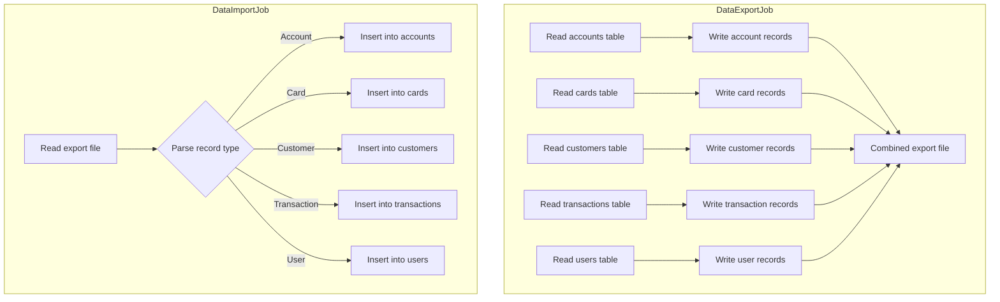
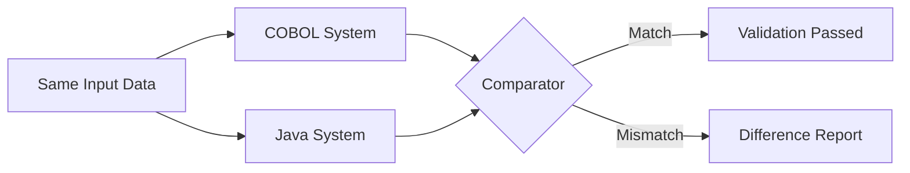

# Phase 7: Migration Tools & Cutover

**Risk Level:** High  
**Objective:** Convert data export/import utilities, execute parallel-run validation between COBOL and Java systems, and perform the final cutover to decommission the COBOL system.

---

## Wave 7.1: Convert Migration Tools

### Objective
Convert the data export and import utilities that allow data to be extracted from and loaded into the CardDemo system.

### Source Programs

#### CBEXPORT — Data Export

| Attribute | Value |
|---|---|
| **Source** | `app/cbl/CBEXPORT.cbl` |
| **JCL** | `app/jcl/CBEXPORT.jcl` |
| **Key Copybook** | `app/cpy/CVEXPORT.cpy` — defines the multi-record export layout |
| **Input** | VSAM files (`ACCTDAT`, `CARDDAT`, `CCXREF`, `CUSTDAT`, `TRANSACT`, `USRSEC`) |
| **Output** | Sequential export file (multi-record format) |
| **Java Target** | `DataExportService` (Spring Batch `Job`) |

**Key behavior:**
- Reads all VSAM files sequentially
- Writes records in the multi-record format defined by `CVEXPORT.cpy`
- Each record has a record-type indicator identifying which file it came from
- The export file in `app/data/EBCDIC/AWS.M2.CARDDEMO.EXPORT.DATA.PS` is a sample output

#### CBIMPORT — Data Import

| Attribute | Value |
|---|---|
| **Source** | `app/cbl/CBIMPORT.cbl` |
| **JCL** | `app/jcl/CBIMPORT.jcl` |
| **Key Copybook** | `app/cpy/CVEXPORT.cpy` — same layout used for import parsing |
| **Input** | Sequential export file (multi-record format) |
| **Output** | VSAM files (writes to all data stores) |
| **Java Target** | `DataImportService` (Spring Batch `Job`) |

**Key behavior:**
- Reads the multi-record export file
- Parses record-type indicator to determine target table
- Writes records to the appropriate database tables
- Handles insert/update/delete operations based on record flags

### CVEXPORT Multi-Record Export Layout

The `app/cpy/CVEXPORT.cpy` copybook defines a union-style record layout where a single record can represent data from any of the VSAM files. The record-type field determines which set of fields to use:

| Record Type | Source VSAM File | Target Table |
|---|---|---|
| Account record | `ACCTDAT` | `accounts` |
| Card record | `CARDDAT` | `cards` |
| Cross-reference | `CCXREF` | `card_xref` |
| Customer record | `CUSTDAT` | `customers` |
| Transaction record | `TRANSACT` | `transactions` |
| User security record | `USRSEC` | `users` |
| Disclosure group | `DISCGRP` | `disclosure_groups` |

### Spring Batch Job Design

### REST / Admin Endpoints

| Method | Path | Description |
|---|---|---|
| `POST` | `/api/admin/export` | Trigger data export job |
| `POST` | `/api/admin/import` | Trigger data import job (upload file) |
| `GET` | `/api/admin/export/{jobId}/status` | Check export job status |
| `GET` | `/api/admin/import/{jobId}/status` | Check import job status |
| `GET` | `/api/admin/export/{jobId}/download` | Download export file |

### Acceptance Criteria
- [ ] Export job produces file compatible with the `CVEXPORT.cpy` layout
- [ ] Import job parses multi-record file and loads all tables correctly
- [ ] Round-trip test: export -> import -> export produces identical files
- [ ] Large dataset performance tested (all records in all tables)

---

## Wave 7.2: Parallel-Run Validation

### Objective
Run both the COBOL and Java systems simultaneously with identical inputs and compare outputs to verify functional equivalence.

### Validation Strategy

### Online Transaction Validation

| Test Area | Input | COBOL Output | Java Output | Compare |
|---|---|---|---|---|
| Authentication | Login credentials | Session token + menu | JWT + menu response | User data, roles |
| Account View | Account ID | BMS screen fields | JSON response fields | All field values |
| Card List | Search criteria | BMS list screen | JSON array | Record count, values |
| Account Update | Update payload | Updated VSAM record | Updated DB row | All changed fields |
| Transaction Add | Transaction data | VSAM record + balance | DB row + balance | Amounts, statuses |
| Bill Payment | Payment data | Posted transaction | Posted record | Amount, balance |

### Batch Processing Validation

| Test Area | Input | COBOL Output | Java Output | Compare |
|---|---|---|---|---|
| Transaction Validation | Daily transaction file | Valid/reject files | Valid/reject tables | Counts, error codes |
| Transaction Posting | Validated transactions | Updated balances | Updated balances | Balance to the cent |
| Interest Calculation | Account balances | Interest amounts | Interest amounts | Amount precision |
| Statement Generation | Billing period | Statement files | Statement files | Content, totals |
| Data Export | Full database | Export file | Export file | Byte-level comparison |

### Parallel-Run Phases

1. **Shadow mode (2-4 weeks):** Java system processes same inputs in shadow, outputs compared offline. COBOL system is authoritative.
2. **Canary mode (1-2 weeks):** Small percentage of traffic routed to Java system. COBOL remains primary for all users.
3. **Balanced mode (1-2 weeks):** 50/50 split. Both systems process, COBOL still authoritative for discrepancies.
4. **Java-primary mode (1 week):** Java system is primary, COBOL runs in shadow for safety net.

### Acceptance Criteria
- [ ] All online transactions produce identical outputs (field-by-field)
- [ ] All batch jobs produce identical outputs (row-by-row, cent-level precision)
- [ ] No data corruption or loss during parallel run
- [ ] Performance metrics meet or exceed COBOL system benchmarks
- [ ] Zero critical discrepancies for 2+ consecutive weeks before cutover approval

---

## Wave 7.3: Final Cutover

### Objective
Execute the final migration cutover — switch all traffic to the Java system and decommission the COBOL system.

### Cutover Checklist

#### Pre-Cutover (T-7 days)
- [ ] All phases (0-6) completed and validated
- [ ] Parallel-run validation passed for 2+ weeks with zero critical discrepancies
- [ ] Performance benchmarks met (response time, throughput, batch completion time)
- [ ] Rollback plan documented and tested
- [ ] All stakeholders notified of cutover window
- [ ] Database backup taken and verified

#### Cutover Day (T-0)
- [ ] Final COBOL batch cycle completed
- [ ] Final data synchronization from COBOL to Java database
- [ ] Verify data consistency between systems
- [ ] Switch DNS / load balancer / routing to Java system
- [ ] Smoke test all critical paths:
  - [ ] User login
  - [ ] Account view
  - [ ] Transaction add
  - [ ] Bill payment
  - [ ] Batch job execution
- [ ] Monitor error rates and response times

#### Post-Cutover (T+1 to T+30)
- [ ] Monitor Java system for 30 days
- [ ] Keep COBOL system available (read-only) for 30 days as safety net
- [ ] Address any production issues found in Java system
- [ ] Verify all batch jobs complete successfully for a full monthly cycle
- [ ] Interest calculation verified for first monthly run
- [ ] Statement generation verified

#### Decommission (T+30)
- [ ] COBOL system powered down
- [ ] Mainframe resources deallocated
- [ ] Final data archive from COBOL system
- [ ] Project closure documentation

### Rollback Plan

If critical issues are discovered during cutover:

1. **Immediate rollback (within 1 hour):** Switch routing back to COBOL system. No data loss — COBOL system has full data.
2. **Delayed rollback (1-24 hours):** Sync any transactions processed by Java back to COBOL via the export/import tools (Wave 7.1). Then switch routing.
3. **Extended rollback (>24 hours):** Full data reconciliation required. Use parallel-run comparator to identify and resolve discrepancies before switching back.

### Acceptance Criteria
- [ ] Zero-downtime cutover (or within agreed maintenance window)
- [ ] All smoke tests pass post-cutover
- [ ] Error rate below threshold for 30 days
- [ ] Rollback plan tested and documented
- [ ] COBOL system decommissioned after 30-day monitoring period

---

## Programs in Scope (Phase 7)

| Program | Source Path | Java Target | Wave |
|---|---|---|---|
| `CBEXPORT.cbl` | `app/cbl/CBEXPORT.cbl` | `DataExportService` (Spring Batch) | 7.1 |
| `CBIMPORT.cbl` | `app/cbl/CBIMPORT.cbl` | `DataImportService` (Spring Batch) | 7.1 |

---

## Key Reference Files

| File | Path | Relevance |
|---|---|---|
| Export/Import layout | `app/cpy/CVEXPORT.cpy` | Multi-record format definition |
| Export JCL | `app/jcl/CBEXPORT.jcl` | Export job parameters |
| Import JCL | `app/jcl/CBIMPORT.jcl` | Import job parameters |
| Sample export data | `app/data/EBCDIC/AWS.M2.CARDDEMO.EXPORT.DATA.PS` | EBCDIC export output |
| CICS file definitions | `app/csd/CARDDEMO.CSD` | All VSAM file definitions |
| Scheduler config | `app/scheduler/CardDemo.controlm` | Batch chain definitions |

---

## Dependencies
- **All prior phases (0-6)** must be complete before parallel-run validation
- **Phase 5** must be complete before batch parallel-run (interest calculation, statements)
- **Phase 6** (optional) — if deferred, exclude those modules from parallel-run scope

## Completion
This is the final phase. Upon successful cutover and decommission, the CardDemo COBOL-to-Java migration is complete.
