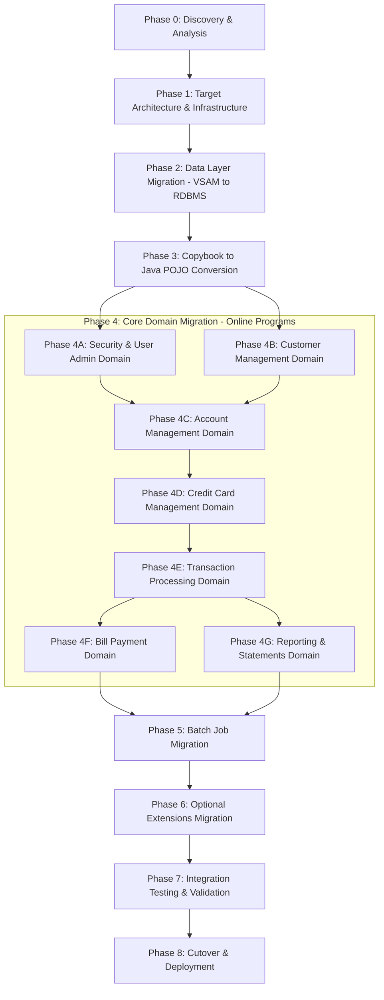

# CardDemo COBOL-to-Java Migration Roadmap

This roadmap outlines the phased approach to modernize the CardDemo mainframe COBOL/CICS/VSAM application into a Java/Spring Boot application with a relational database.

## Migration Flowchart



---

## Phase 0: Discovery & Analysis

Catalog all COBOL programs, copybooks, BMS maps, JCL jobs, and data files. Map inter-program dependencies (XCTL/LINK/CALL), copybook usage, and data flow.

### Key Deliverables
- Program inventory with LOC, copybook count, and complexity score
- Dependency graph (which programs call which, which copybooks are shared)
- Data dictionary derived from copybooks and VSAM file definitions
- Risk assessment (see vulnerability analysis below)

### Programs by Complexity (LOC)

| Program | LOC | Type | Domain | Copybook Dependencies |
|---------|-----|------|--------|----------------------|
| COACTUPC.cbl | 4,236 | Online | Account Update | ~16 unique copybooks, 113 COPY statements |
| COCRDUPC.cbl | 1,560 | Online | Credit Card Update | ~12 unique copybooks |
| COCRDLIC.cbl | 1,459 | Online | Credit Card List | ~10 unique copybooks |
| COACTVWC.cbl | 941 | Online | Account View | ~14 unique copybooks |
| COCRDSLC.cbl | 887 | Online | Credit Card Detail | ~12 unique copybooks |
| COTRN02C.cbl | ~800 | Online | Transaction Add | ~10 unique copybooks |
| COTRN00C.cbl | ~700 | Online | Transaction List | ~10 unique copybooks |
| COBIL00C.cbl | ~550 | Online | Bill Payment | ~10 unique copybooks |

### High-Risk Modules (Prioritize for Extra Testing)

| Program | Risk | Issue |
|---------|------|-------|
| COBIL00C.cbl | Critical | Non-atomic financial operation, no rollback, 6 CICS commands without RESP, race condition on tran ID |
| CBACT04C.cbl | High | Arithmetic overflow unprotected, ABEND on any error, stub fee calculation |
| COTRN01C.cbl | Medium | Unnecessary UPDATE lock on view-only READ |
| COACTUPC.cbl | Low-Medium | DOB offset mismatch in optimistic lock check |

---

## Phase 1: Target Architecture & Infrastructure

Define the Java target architecture and set up the project skeleton.

### Target Stack
- **Language**: Java 17+
- **Framework**: Spring Boot 3.x
- **Web Layer**: Spring MVC with REST APIs (replacing CICS screens/BMS maps)
- **Data Access**: Spring Data JPA / Hibernate (replacing VSAM I/O)
- **Batch**: Spring Batch (replacing JCL + batch COBOL programs)
- **Security**: Spring Security (replacing RACF + COSGN00C sign-on)
- **Database**: PostgreSQL or similar RDBMS (replacing VSAM KSDS/AIX)
- **Build**: Maven or Gradle
- **Testing**: JUnit 5, Mockito, Testcontainers

### Project Structure
```
carddemo-java/
├── src/main/java/com/carddemo/
│   ├── config/          # Spring configuration
│   ├── security/        # Authentication & authorization
│   ├── model/           # JPA entities (from copybooks)
│   ├── repository/      # Spring Data repositories
│   ├── service/         # Business logic (from COBOL programs)
│   │   ├── account/
│   │   ├── card/
│   │   ├── customer/
│   │   ├── transaction/
│   │   ├── billing/
│   │   └── reporting/
│   ├── controller/      # REST controllers (replacing BMS screens)
│   ├── batch/           # Spring Batch jobs (replacing JCL/batch COBOL)
│   └── dto/             # Data transfer objects
├── src/main/resources/
│   ├── db/migration/    # Flyway/Liquibase scripts
│   └── application.yml
└── src/test/
```

---

## Phase 2: Data Layer Migration — VSAM to RDBMS

Convert VSAM KSDS files to relational database tables. Derive the schema from copybook record layouts.

### VSAM-to-Table Mapping

| VSAM File | Copybook | Target Table | Primary Key |
|-----------|----------|-------------|-------------|
| ACCTDAT | CVACT01Y | accounts | acct_id |
| CARDDAT | CVACT02Y | cards | card_num |
| CUSTDAT | CVCUS01Y | customers | cust_id |
| CARDXREF | CVACT03Y | card_xref | card_num |
| TRANSACT | CVTRA05Y | transactions | tran_id |
| DALYTRAN | CVTRA06Y | daily_transactions | tran_id |
| USRSEC | CSUSR01Y | users | user_id |
| DISCGRP | CVTRA02Y | disclosure_groups | group_id |
| TRANCATG | CVTRA04Y | transaction_categories | cat_id |
| TRANTYPE | CVTRA03Y | transaction_types | type_id |
| TCATBALF | CVTRA01Y | tran_cat_balances | cat_id + acct_id |

### Key Considerations
- Replace VSAM alternate indexes (AIX) with database secondary indexes
- Convert COMP/COMP-3/Zoned Decimal fields to appropriate Java/SQL types
- Handle EBCDIC-to-ASCII character encoding
- Migrate sample data from `app/data/` using Flyway seed scripts

---

## Phase 3: Copybook to Java POJO/Entity Conversion

Convert the 14+ copybooks in `app/cpy/` to Java classes (JPA entities and DTOs).

### Copybook-to-Class Mapping

| Copybook | Java Entity/DTO | Purpose |
|----------|----------------|---------|
| CVACT01Y | Account.java | Account record layout |
| CVACT02Y | Card.java | Card record layout |
| CVACT03Y | CardXref.java | Card-Account cross-reference |
| CVCUS01Y | Customer.java | Customer record layout |
| CVTRA05Y | Transaction.java | Online transaction record |
| CVTRA06Y | DailyTransaction.java | Daily transaction record |
| CSUSR01Y (in cpy-bms) | User.java | User security record |
| COCOM01Y | SessionContext.java (DTO) | Application commarea → session state |
| CSDAT01Y | (use java.time.LocalDate) | Current date |
| CSMSG01Y | MessageConstants.java | Common messages |
| CSMSG02Y | AbendInfo.java (DTO) | Abend variables → error info |
| CVCRD01Y | CardValidation.java | Card validation fields |
| CSLKPCDY | AreaCodeLookup.java | Phone area code lookup table |
| CVEXPORT | ExportRecord.java (DTO) | Export file layout |

### Key Considerations
- Handle REDEFINES as Java inheritance or union-type patterns
- Handle OCCURS / OCCURS DEPENDING ON as Java List/Array
- Convert PIC clauses to appropriate Java types (PIC 9 → int/long/BigDecimal, PIC X → String)
- Shared copybooks (COCOM01Y, CSDAT01Y, CSMSG01Y, DFHAID, DFHBMSCA) become shared utility classes or constants

---

## Phase 4: Core Domain Migration — Online Programs

Migrate the CICS online programs to Spring Boot REST services. Each COBOL program becomes one or more Java service classes + a REST controller.

### Phase 4A: Security & User Administration

| COBOL Program | Java Target | Notes |
|---------------|-------------|-------|
| COSGN00C.cbl | SecurityConfig.java + AuthController.java | Replace RACF/CICS sign-on with Spring Security |
| COADM01C.cbl | AdminController.java | Admin menu → admin API endpoints |
| COUSR00C.cbl | UserService.listUsers() | |
| COUSR01C.cbl | UserService.addUser() | |
| COUSR02C.cbl | UserService.updateUser() | |
| COUSR03C.cbl | UserService.deleteUser() | |

**Prerequisite**: Phase 3 (User entity from CSUSR01Y)

### Phase 4B: Customer Management

| COBOL Program | Java Target | Notes |
|---------------|-------------|-------|
| CBCUS01C.cbl | CustomerService.java | Read/print customer data → CustomerService.getCustomer() |

**Prerequisite**: Phase 3 (Customer entity from CVCUS01Y)

### Phase 4C: Account Management

| COBOL Program | Java Target | Notes |
|---------------|-------------|-------|
| COACTVWC.cbl | AccountService.viewAccount() + AccountController | 941 LOC, 14 copybooks |
| COACTUPC.cbl | AccountService.updateAccount() + AccountController | **4,236 LOC — most complex program**. Break into sub-services: AccountValidationService, AccountUpdateService. Ensure @Transactional for atomicity. |

**Prerequisite**: Phase 4A (security context), Phase 4B (customer data access)

**Special attention for COACTUPC.cbl**:
- Extract field-level validation (SSN, phone, date, credit limit) into AccountValidationService
- Implement optimistic locking with JPA @Version (replacing manual 9700-CHECK-CHANGE-IN-REC)
- Fix the DOB offset comparison bug during migration
- Replace CSUTLDWY/CSUTLDPY date routines with java.time

### Phase 4D: Credit Card Management

| COBOL Program | Java Target | Notes |
|---------------|-------------|-------|
| COCRDLIC.cbl | CardService.listCards() + CardController | Role-based filtering (admin sees all, user sees own) |
| COCRDSLC.cbl | CardService.viewCard() | |
| COCRDUPC.cbl | CardService.updateCard() | 1,560 LOC, second most complex |

**Prerequisite**: Phase 4C (account data access)

### Phase 4E: Transaction Processing

| COBOL Program | Java Target | Notes |
|---------------|-------------|-------|
| COTRN00C.cbl | TransactionService.listTransactions() + TransactionController | Pagination support |
| COTRN01C.cbl | TransactionService.viewTransaction() | **Fix**: Remove unnecessary UPDATE lock — use read-only query |
| COTRN02C.cbl | TransactionService.addTransaction() | Use DB-generated IDs instead of manual ID generation |

**Prerequisite**: Phase 4D (card cross-reference data)

### Phase 4F: Bill Payment

| COBOL Program | Java Target | Notes |
|---------------|-------------|-------|
| COBIL00C.cbl | BillPaymentService.payBill() | **Critical fix**: Wrap in @Transactional to ensure atomicity (transaction write + balance update). Use DB-generated tran IDs to eliminate race condition. Add proper error handling for all steps. |

**Prerequisite**: Phase 4E (transaction service)

### Phase 4G: Reporting & Statements

| COBOL Program | Java Target | Notes |
|---------------|-------------|-------|
| CORPT00C.cbl | ReportController + async job trigger | Replace TDQ-based batch submission with Spring async/messaging |
| CBSTM03A.CBL | StatementService.generateStatement() | Plain text + HTML output |
| CBSTM03B.CBL | (merged into StatementService) | Subroutine → private method |

**Prerequisite**: Phase 4E (transaction data)

---

## Phase 5: Batch Job Migration

Convert JCL batch jobs + batch COBOL programs to Spring Batch jobs.

### Batch Program Mapping

| COBOL Program | JCL Job | Spring Batch Job | Notes |
|---------------|---------|-----------------|-------|
| CBTRN01C.cbl | POSTTRAN | PostTransactionsJob | Post daily transactions. Uses 6 VSAM files → 6 DB tables |
| CBTRN02C.cbl | POSTTRAN | (alternate step in PostTransactionsJob) | |
| CBACT04C.cbl | INTCALC | InterestCalculationJob | **Fix**: Add ON SIZE ERROR equivalent (BigDecimal with proper scale). Implement 1400-COMPUTE-FEES (currently a stub). Add skip-on-error logic instead of ABEND. |
| CBTRN03C.cbl | TRANREPT | TransactionReportJob | |
| CBSTM03A.CBL | CREASTMT | StatementGenerationJob | |
| CBACT01C.cbl | — | AccountFileJob | Read/write account file |
| CBACT02C.cbl | — | CardFileJob | Read/print card data |
| CBACT03C.cbl | — | CardXrefFileJob | Read/print xref data |
| CBCUS01C.cbl | — | CustomerFileJob | Read/print customer data |
| CBEXPORT.cbl | — | DataExportJob | Export for branch migration |
| CBIMPORT.cbl | — | DataImportJob | Import with validation |

### Key Considerations
- Replace IDCAMS file operations with Flyway migrations or Spring Batch tasklets
- Replace SORT steps with SQL ORDER BY or in-memory sorting
- Replace GDG (Generation Data Groups) with timestamped backup tables or file versioning
- COBSWAIT.cbl (timer utility) → Thread.sleep() or scheduled task delay

---

## Phase 6: Optional Extensions Migration

Migrate the optional modules after the core application is stable.

### 6A: Transaction Type Management (DB2 → same RDBMS)

| COBOL Program | Java Target |
|---------------|-------------|
| COTRTLIC.cbl | TransactionTypeService.list/update/delete() |
| COTRTUPC.cbl | TransactionTypeService.add/edit() |
| COBTUPDT.cbl | TransactionTypeMaintenanceJob (Spring Batch) |

Source: `app/app-transaction-type-db2/`

### 6B: Credit Card Authorization (IMS + DB2 + MQ → RDBMS + messaging)

| COBOL Program | Java Target |
|---------------|-------------|
| COPAUA0C.cbl | AuthorizationService.processRequest() |
| COPAUS0C.cbl | AuthorizationService.getPendingSummary() |
| COPAUS1C.cbl | AuthorizationService.getPendingDetails() |
| CBPAUP0C.cbl | PurgeExpiredAuthorizationsJob (Spring Batch) |

Source: `app/app-authorization-ims-db2-mq/`
- Replace MQ with Spring JMS or Spring Cloud Stream (RabbitMQ/Kafka)
- Replace IMS DB with JPA entities in the same RDBMS

### 6C: MQ Integration (VSAM + MQ → REST or messaging)

| COBOL Program | Java Target |
|---------------|-------------|
| COACCT01.cbl | AccountInquiryService (REST or async) |
| CODATE01.cbl | SystemDateService (REST endpoint) |

Source: `app/app-vsam-mq/`

---

## Phase 7: Integration Testing & Validation

### Testing Strategy
1. **Unit tests**: JUnit 5 for every service method, targeting the same business rules as the COBOL programs
2. **Integration tests**: Testcontainers with PostgreSQL for repository layer
3. **Data validation**: Compare Java output against COBOL output using the sample data in `app/data/`
4. **Regression tests**: For each COBOL program, create a test suite that exercises the same inputs and verifies identical outputs
5. **Security tests**: Verify role-based access (admin vs regular user)
6. **Batch tests**: Verify Spring Batch jobs produce the same results as JCL batch runs

### Special Validation for High-Risk Modules
- **COBIL00C (Bill Payment)**: Verify atomicity — simulate failures mid-payment and confirm rollback
- **CBACT04C (Interest Calculator)**: Verify arithmetic precision with edge-case balances and rates
- **COACTUPC (Account Update)**: Verify optimistic locking with concurrent update scenarios

---

## Phase 8: Cutover & Deployment

1. **Parallel run**: Run COBOL and Java side-by-side, comparing outputs
2. **Data migration**: Final VSAM-to-RDBMS data load with validation checksums
3. **Switchover**: Route traffic to Java application
4. **Decommission**: Retire COBOL programs, JCL jobs, CICS resources, and VSAM files

---

## Migration Summary

| Metric | COBOL (Current) | Java (Target) |
|--------|-----------------|---------------|
| Online programs | 20 CICS COBOL programs | ~10 Spring REST controllers + ~15 service classes |
| Batch programs | 12 batch COBOL programs | ~10 Spring Batch jobs |
| Copybooks | 14+ shared copybooks | ~14 JPA entities / DTOs |
| Data storage | VSAM KSDS + AIX | PostgreSQL with indexes |
| Security | RACF + custom sign-on | Spring Security |
| Transaction mgmt | Manual SYNCPOINT | @Transactional (declarative) |
| Batch scheduling | JCL + mainframe scheduler | Spring Batch + cron/Quartz |
| UI | BMS maps (3270 screens) | REST API (+ optional frontend) |
