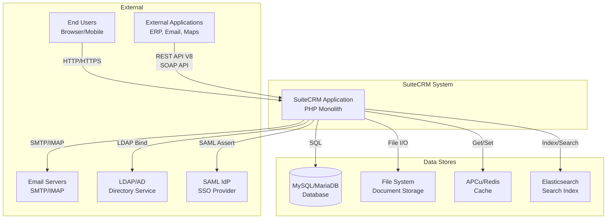
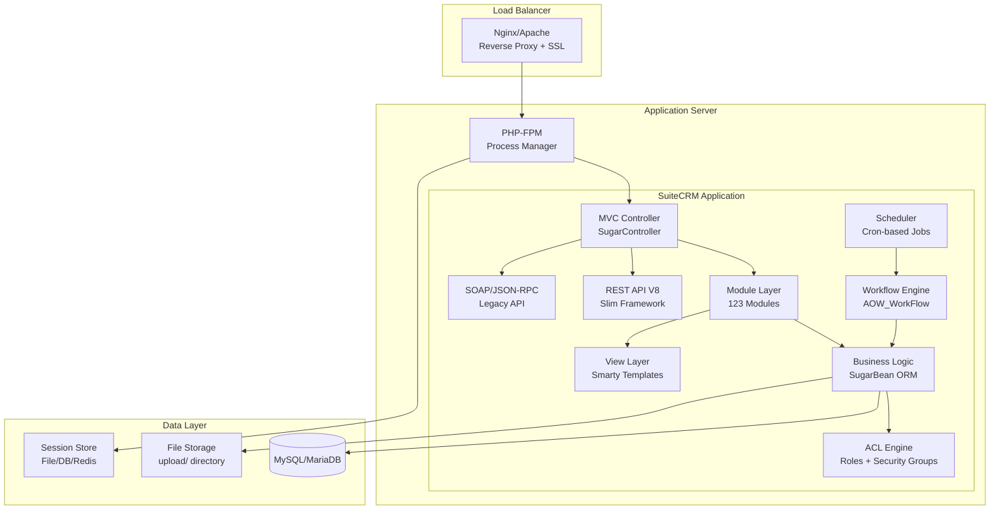
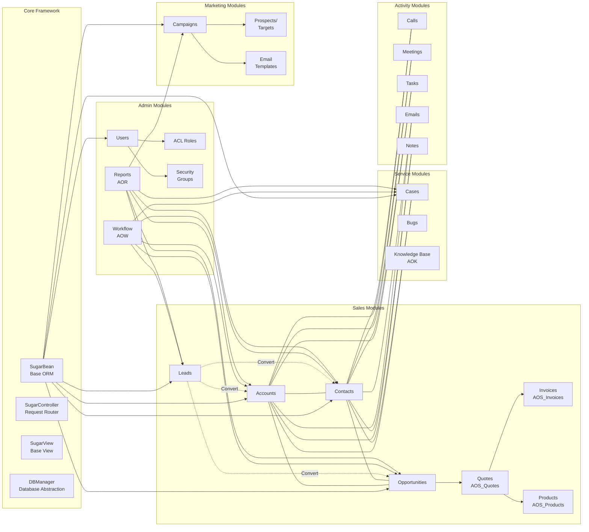
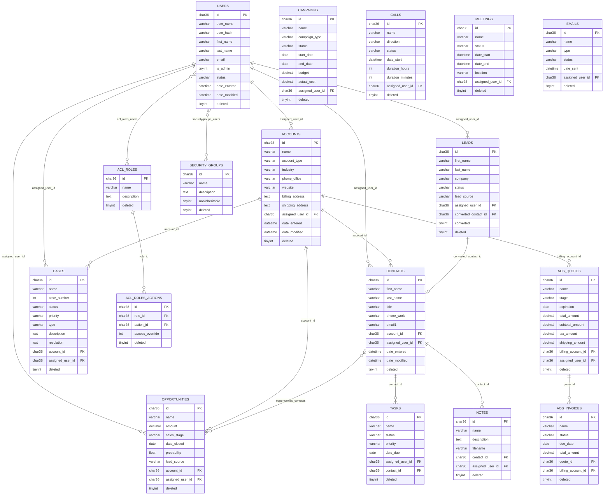
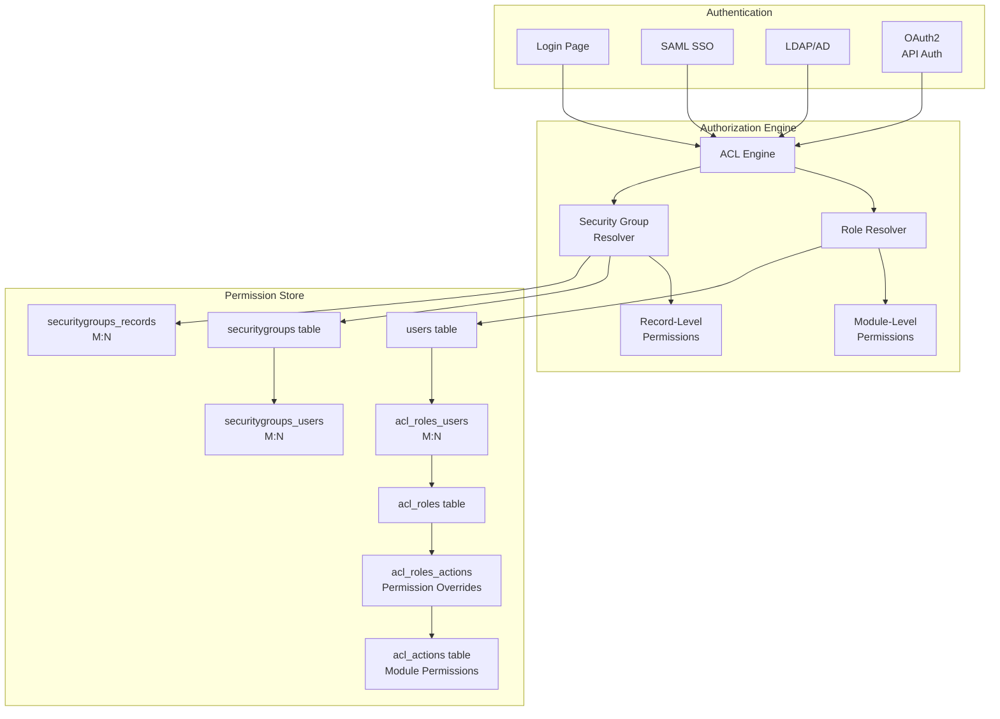
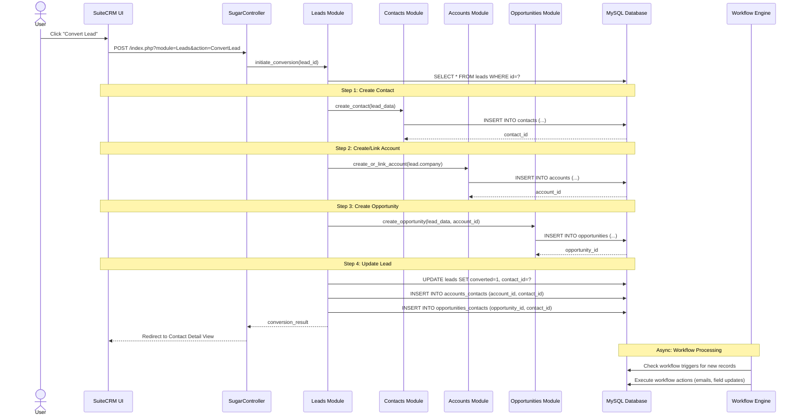
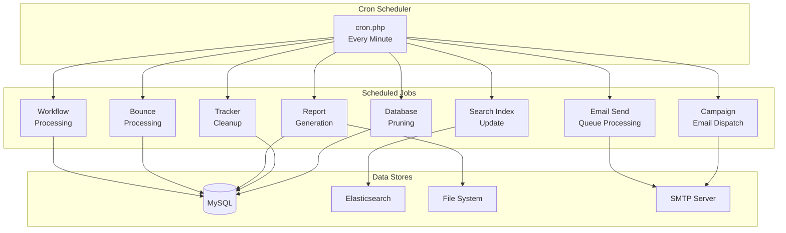
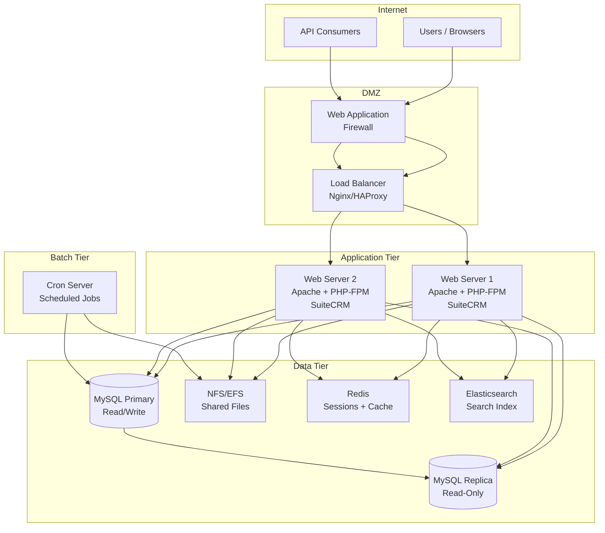

# SuiteCRM As-Is Architecture Diagrams

## 1. System Context Diagram (C4 Level 1)

## 2. Container Diagram (C4 Level 2)

## 3. Module Dependency Diagram

## 4. Database Entity-Relationship Diagram (Core)

## 5. Security Model Diagram

## 6. Data Flow Diagram - Lead to Opportunity Conversion

## 7. Batch Processing Flow

## 8. Deployment Architecture Diagram

