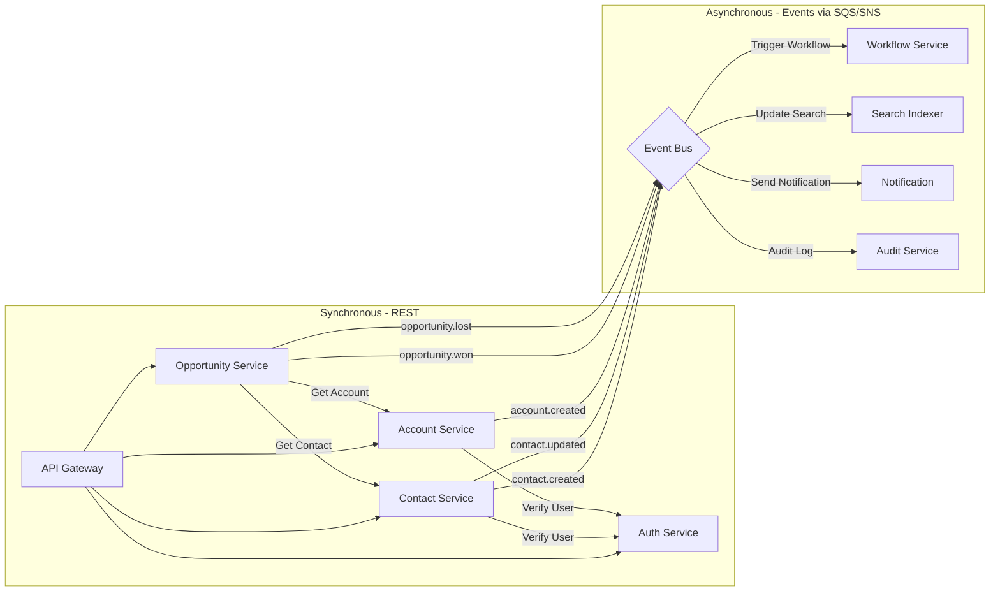
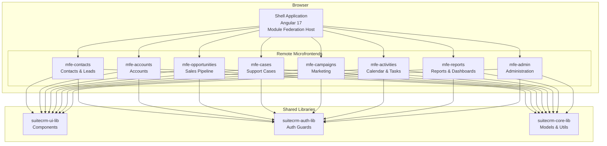
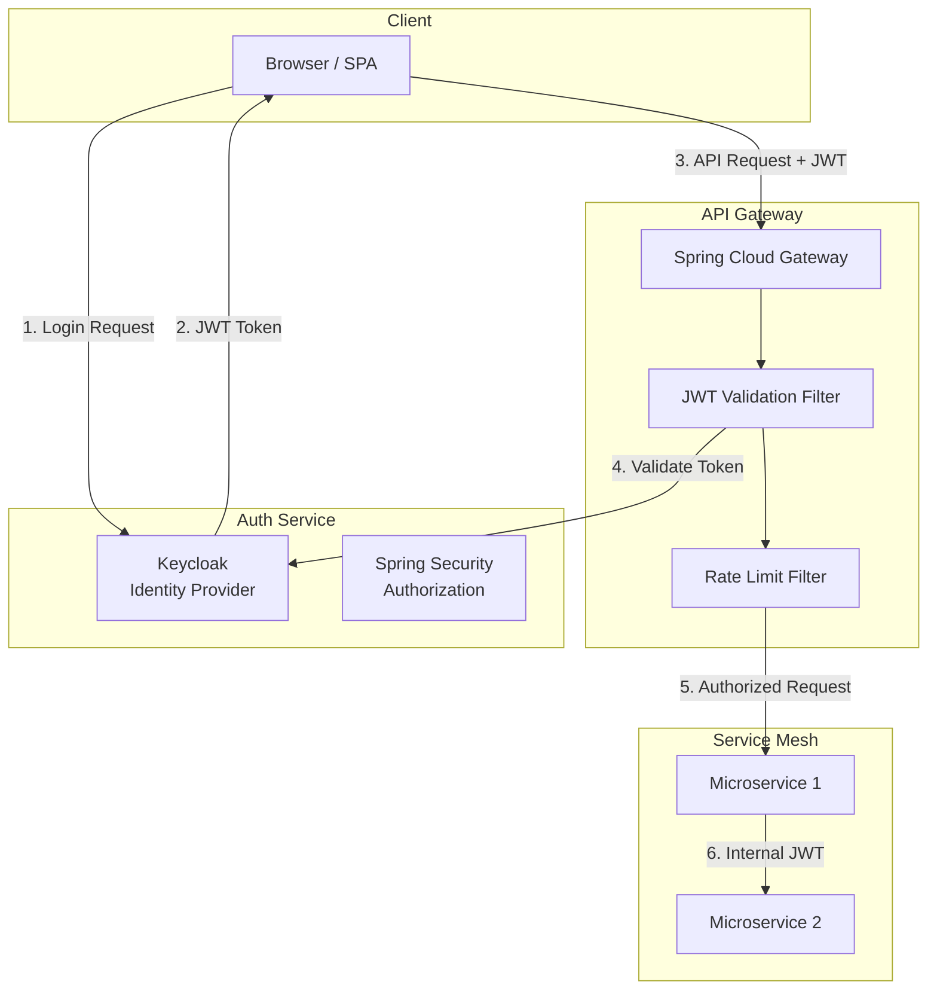
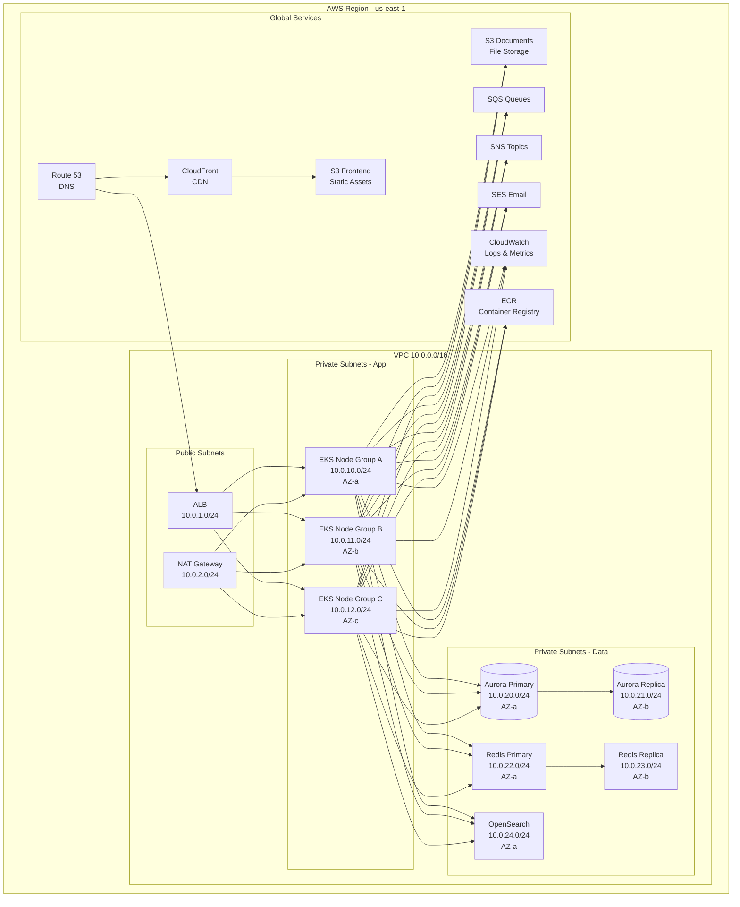

# Target Architecture Document - SuiteCRM Modernized

## 1. Architecture Overview

The target architecture follows a cloud-native microservices pattern deployed on AWS, with Angular microfrontends for the UI layer.

## 2. High-Level Architecture Diagram

```mermaid
graph TB
    subgraph Internet
        USERS[Users<br/>Browser]
        MOBILE[Mobile<br/>Apps]
        EXT[External<br/>Systems]
    end

    subgraph AWS Cloud
        subgraph Public Subnet
            ALB[Application Load Balancer<br/>AWS ALB]
            CF[CloudFront CDN]
        end

        subgraph EKS Cluster - Private Subnet
            subgraph API Layer
                GW[API Gateway<br/>Spring Cloud Gateway]
                DS[Discovery Server<br/>Eureka]
                CS[Config Server<br/>Spring Cloud Config]
            end

            subgraph Core Services
                AUTH[Auth Service<br/>Spring Boot + Keycloak]
                CONTACT[Contact Service<br/>Spring Boot]
                ACCOUNT[Account Service<br/>Spring Boot]
                OPP[Opportunity Service<br/>Spring Boot]
                CASE[Case Service<br/>Spring Boot]
                CAMP[Campaign Service<br/>Spring Boot]
                ACT[Activity Service<br/>Spring Boot]
                RPT[Report Service<br/>Spring Boot]
                DOC[Document Service<br/>Spring Boot]
                WF[Workflow Service<br/>Spring Boot]
            end
        end

        subgraph Data Layer
            AURORA[(Aurora PostgreSQL<br/>Primary + Read Replica)]
            REDIS[ElastiCache Redis<br/>Session + Cache]
            OS[OpenSearch<br/>Full-Text Search]
            S3[S3<br/>Document Storage]
            SQS[SQS/SNS<br/>Event Bus]
            SES[SES<br/>Email Service]
        end

        subgraph Frontend Hosting
            S3F[S3 + CloudFront<br/>Static Hosting]
        end

        subgraph Monitoring
            CW[CloudWatch<br/>Logs + Metrics]
            PROM[Prometheus<br/>Metrics]
            GRAF[Grafana<br/>Dashboards]
        end
    end

    USERS --> CF --> S3F
    USERS --> ALB
    MOBILE --> ALB
    EXT --> ALB
    ALB --> GW
    GW --> AUTH & CONTACT & ACCOUNT & OPP & CASE & CAMP & ACT & RPT & DOC & WF
    AUTH & CONTACT & ACCOUNT & OPP & CASE & CAMP & ACT & RPT & DOC & WF --> DS
    AUTH & CONTACT & ACCOUNT & OPP & CASE & CAMP & ACT & RPT & DOC & WF --> CS
    AUTH & CONTACT & ACCOUNT & OPP & CASE & CAMP & ACT & RPT --> AURORA
    AUTH --> REDIS
    CONTACT & ACCOUNT & OPP --> REDIS
    CONTACT & ACCOUNT --> OS
    DOC --> S3
    WF & CAMP --> SQS
    CAMP --> SES
    AUTH & CONTACT & ACCOUNT & OPP & CASE & CAMP & ACT & RPT & DOC & WF --> CW
```



## 3. Microservice Architecture Detail

### 3.1 API Gateway (Spring Cloud Gateway)

```
Responsibilities:
- Request routing to microservices
- JWT token validation
- Rate limiting (Redis-based)
- Request/response transformation
- CORS handling
- Circuit breaker (Resilience4j)
- API versioning
- Request logging and tracing

Routes:
  /api/v1/auth/**     → auth-service
  /api/v1/contacts/** → contact-service
  /api/v1/accounts/** → account-service
  /api/v1/opportunities/** → opportunity-service
  /api/v1/cases/**    → case-service
  /api/v1/campaigns/**→ campaign-service
  /api/v1/activities/**→ activity-service
  /api/v1/reports/**  → report-service
  /api/v1/documents/**→ document-service
  /api/v1/workflows/**→ workflow-service
```

### 3.2 Service Database Schema (Database-per-Service)

Each microservice owns its database schema in Aurora PostgreSQL:

| Service | Schema | Key Tables |
|---------|--------|-----------|
| auth-service | `auth_schema` | users, roles, permissions, security_groups, user_roles, role_permissions |
| contact-service | `contact_schema` | contacts, leads, prospects, prospect_lists, contact_addresses |
| account-service | `account_schema` | accounts, employees, account_addresses |
| opportunity-service | `opportunity_schema` | opportunities, quotes, invoices, products, product_categories, line_items, contracts |
| case-service | `case_schema` | cases, bugs, knowledge_articles, kb_categories, case_updates |
| campaign-service | `campaign_schema` | campaigns, campaign_logs, email_templates, email_marketing, target_lists |
| activity-service | `activity_schema` | calls, meetings, tasks, calendar_events, notes, emails, email_addresses |
| report-service | `report_schema` | reports, report_conditions, report_fields, dashboards, dashboard_widgets |
| document-service | `document_schema` | documents, document_revisions, document_metadata |
| workflow-service | `workflow_schema` | workflows, workflow_actions, workflow_conditions, scheduled_jobs, job_logs |

### 3.3 Inter-Service Communication



## 4. Microfrontend Architecture



### 4.1 Shell Application Responsibilities
- Application chrome (header, sidebar navigation, footer)
- Authentication flow (login, logout, token refresh)
- Route registration and lazy loading of microfrontends
- Global state management (user context, theme, notifications)
- Error boundary and fallback UI

### 4.2 Microfrontend Communication
- **Custom Events**: Cross-MFE communication via CustomEvent API
- **Shared State**: RxJS BehaviorSubject in shared library for user context
- **URL State**: Route parameters for navigation between MFEs

## 5. Security Architecture



### 5.1 Role-Based Access Control Matrix

| Resource | ADMIN | MANAGER | SALES | SUPPORT | MARKETING | VIEWER | PORTAL |
|----------|-------|---------|-------|---------|-----------|--------|--------|
| Users | CRUD | Read | Read(own) | Read(own) | Read(own) | - | - |
| Roles | CRUD | Read | - | - | - | - | - |
| Accounts | CRUD | CRUD(team) | CRUD(own) | Read | Read | Read | - |
| Contacts | CRUD | CRUD(team) | CRUD(own) | CRUD(own) | Read | Read | - |
| Leads | CRUD | CRUD(team) | CRUD(own) | - | CRUD(own) | Read | - |
| Opportunities | CRUD | CRUD(team) | CRUD(own) | Read | Read | Read | - |
| Quotes | CRUD | CRUD(team) | CRUD(own) | - | - | Read | - |
| Cases | CRUD | CRUD(team) | Read | CRUD(own) | - | Read | CR(own) |
| KB Articles | CRUD | CRUD(team) | Read | CRUD(own) | Read | Read | Read |
| Campaigns | CRUD | CRUD(team) | Read | - | CRUD(own) | Read | - |
| Reports | CRUD | CRUD(team) | CRUD(own) | CRUD(own) | CRUD(own) | Read | - |
| Workflows | CRUD | Read | - | - | - | - | - |
| Documents | CRUD | CRUD(team) | CRUD(own) | CRUD(own) | CRUD(own) | Read | - |

## 6. AWS Infrastructure Architecture



## 7. CI/CD Pipeline Architecture

```mermaid
graph LR
    subgraph Source
        GIT[GitHub<br/>Repository]
    end

    subgraph Jenkins Pipeline
        BUILD[Build Stage<br/>Maven/npm]
        TEST[Test Stage<br/>JUnit/Karma]
        SCAN[Security Scan<br/>SonarQube + OWASP]
        DOCKER[Docker Build<br/>Multi-stage]
        PUSH[Push to ECR]
        DEPLOY_DEV[Deploy Dev<br/>EKS dev namespace]
        INT_TEST[Integration Tests<br/>Postman/Newman]
        DEPLOY_STG[Deploy Staging<br/>EKS staging namespace]
        PERF_TEST[Performance Tests<br/>JMeter]
        APPROVE[Manual Approval]
        DEPLOY_PRD[Deploy Production<br/>EKS prod namespace]
    end

    GIT -->|Webhook| BUILD --> TEST --> SCAN --> DOCKER --> PUSH
    PUSH --> DEPLOY_DEV --> INT_TEST
    INT_TEST --> DEPLOY_STG --> PERF_TEST
    PERF_TEST --> APPROVE --> DEPLOY_PRD
```



## 8. Monitoring & Observability

| Component | Tool | Purpose |
|-----------|------|---------|
| **Metrics** | Prometheus + Micrometer | Service metrics, JVM stats |
| **Dashboards** | Grafana | Visualization, alerting |
| **Logging** | CloudWatch + OpenSearch | Centralized log aggregation |
| **Tracing** | AWS X-Ray / Zipkin | Distributed request tracing |
| **APM** | Spring Boot Actuator | Health checks, info endpoints |
| **Alerting** | CloudWatch Alarms + PagerDuty | Incident notification |
